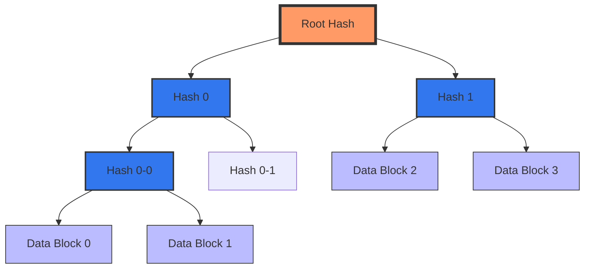

<<<<<<< HEAD

Merkle Tree 通过分层[[what`sHash|哈希]]结构和[[what`sHash|哈希]]路径验证**机制，能够快速检测并定位具体被修改的数据块。以下是其核心原理和步骤：

---

### **1. Merkle Tree 的基本结构**
- **叶子节点**：每个数据块（如文件块、交易等）通过[[what`sHash|哈希]]算法（如 SHA-256）生成一个唯一的[[what`sHash|哈希]]值，作为叶子节点。
- **非叶子节点**：每两个相邻的子节点[[what`sHash|哈希]]值再进行一次[[what`sHash|哈希]]运算，生成父节点的[[what`sHash|哈希]]值。最终形成一棵二叉树，最顶端为 **根[[what`sHash|哈希]]（Root Hash）**。

---

### **2. 检测数据块被修改的流程**
#### **步骤 1：根[[what`sHash|哈希]]比对**
- 当需要验证数据完整性时，首先比对当前计算的 **根[[what`sHash|哈希]]** 与预期的根[[what`sHash|哈希]]（例如由可信源提供的原始根[[what`sHash|哈希]]）。
  - 如果两者一致，说明所有数据块未被篡改。
  - 如果不一致，说明至少有一个数据块被修改。

#### **步骤 2：定位具体修改的数据块**
- **方法一：递归二分法**
  1. 将数据块分为两组，分别计算它们的子树根[[what`sHash|哈希]]。
  2. 比较这两组的子树根[[what`sHash|哈希]]：
     - 如果某组的子树根[[what`sHash|哈希]]与预期不一致，则问题出现在该组内。
     - 继续递归细分该组，直到定位到具体的叶子节点（即数据块）。
  3. 最终找到被修改的数据块。

- **方法二：Merkle 路径验证**
  1. 对于某个目标数据块，获取其 **Merkle 路径**（即从该叶子节点到根节点的路径上所有兄弟节点的[[what`sHash|哈希]]值）。
  2. 利用这些兄弟[[what`sHash|哈希]]值和目标数据块的[[what`sHash|哈希]]值，重新计算根[[what`sHash|哈希]]。
  3. 如果计算出的根[[what`sHash|哈希]]与预期不一致，则说明该数据块被修改。

---

### **3. 关键特性支持精准定位**
- **[[what`sHash|哈希]]唯一性**：现代[[what`sHash|哈希]]算法（如 SHA-256）具有抗碰撞特性，即使数据发生微小变化，[[what`sHash|哈希]]值也会显著不同。
- **层级结构**：Merkle Tree 的层级设计使得任何底层数据块的修改都会向上传播到根[[what`sHash|哈希]]，从而触发整体不一致。
- **高效验证**：通过 Merkle 路径验证单个数据块时，时间复杂度为 $O(\log n)$（其中 $n$ 为数据块总数），无需遍历所有数据。

---

### **4. 实际应用场景示例**
- **区块链交易验证**  
  在比特币中，每个区块包含一个 Merkle 根[[what`sHash|哈希]]。用户只需提供某笔交易的 Merkle 路径，即可验证该交易是否存在于区块中。若发现[[what`sHash|哈希]]路径不匹配，则说明该交易被篡改。
  
- **分布式文件存储（如 IPFS）**  
  文件被分割为多个数据块，每个块生成[[what`sHash|哈希]]并构建 Merkle Tree。当下载文件时，接收方通过验证每个块的 Merkle 路径，可确保文件未被篡改。

- **P2P 网络文件同步**  
  在 BitTorrent 中，文件被拆分为小块，每个块的[[what`sHash|哈希]]值构成 Merkle Tree。通过比对本地与远程节点的根[[what`sHash|哈希]]，可快速识别需要重新下载的块。

---

### **5. 局限性及改进方向**
- **[[what`sHash|哈希]]碰撞风险**：尽管概率极低，但理论上可能存在不同的数据生成相同[[what`sHash|哈希]]值的情况（需结合更安全的[[what`sHash|哈希]]算法缓解）。
- **动态数据更新**：传统 Merkle Tree 在频繁插入/删除数据时效率较低，可通过 **Merkle Patricia Tree**（如以太坊使用的结构）优化。

---

### **总结**
Merkle Tree 通过[[what`sHash|哈希]]分层聚合和路径验证机制，能够在大规模数据中高效检测并定位具体被修改的数据块。其核心思想是：**利用[[what`sHash|哈希]]的唯一性和树状结构，将局部变化的影响放大到全局（根[[what`sHash|哈希]]），并通过递归或路径验证缩小问题范围**。这一特性使其成为区块链、分布式存储和网络安全领域的核心技术之一。
=======

Merkle Tree 通过分层哈希结构和**哈希路径验证**机制，能够快速检测并定位具体被修改的数据块。以下是其核心原理和步骤：

---

### **1. Merkle Tree 的基本结构**
- **叶子节点**：每个数据块（如文件块、交易等）通过哈希算法（如 SHA-256）生成一个唯一的哈希值，作为叶子节点。
- **非叶子节点**：每两个相邻的子节点哈希值再进行一次哈希运算，生成父节点的哈希值。最终形成一棵二叉树，最顶端为 **根哈希（Root Hash）**。

---

### **2. 检测数据块被修改的流程**
#### **步骤 1：根哈希比对**
- 当需要验证数据完整性时，首先比对当前计算的 **根哈希** 与预期的根哈希（例如由可信源提供的原始根哈希）。
  - 如果两者一致，说明所有数据块未被篡改。
  - 如果不一致，说明至少有一个数据块被修改。

#### **步骤 2：定位具体修改的数据块**
- **方法一：递归二分法**
  1. 将数据块分为两组，分别计算它们的子树根哈希。
  2. 比较这两组的子树根哈希：
     - 如果某组的子树根哈希与预期不一致，则问题出现在该组内。
     - 继续递归细分该组，直到定位到具体的叶子节点（即数据块）。
  3. 最终找到被修改的数据块。

- **方法二：Merkle 路径验证**
  1. 对于某个目标数据块，获取其 **Merkle 路径**（即从该叶子节点到根节点的路径上所有兄弟节点的哈希值）。
  2. 利用这些兄弟哈希值和目标数据块的哈希值，重新计算根哈希。
  3. 如果计算出的根哈希与预期不一致，则说明该数据块被修改。

---

### **3. 关键特性支持精准定位**
- **哈希唯一性**：现代哈希算法（如 SHA-256）具有抗碰撞特性，即使数据发生微小变化，哈希值也会显著不同。
- **层级结构**：Merkle Tree 的层级设计使得任何底层数据块的修改都会向上传播到根哈希，从而触发整体不一致。
- **高效验证**：通过 Merkle 路径验证单个数据块时，时间复杂度为 $O(\log n)$（其中 $n$ 为数据块总数），无需遍历所有数据。

---

### **4. 实际应用场景示例**
- **区块链交易验证**  
  在比特币中，每个区块包含一个 Merkle 根哈希。用户只需提供某笔交易的 Merkle 路径，即可验证该交易是否存在于区块中。若发现哈希路径不匹配，则说明该交易被篡改。
  
- **分布式文件存储（如 IPFS）**  
  文件被分割为多个数据块，每个块生成哈希并构建 Merkle Tree。当下载文件时，接收方通过验证每个块的 Merkle 路径，可确保文件未被篡改。

- **P2P 网络文件同步**  
  在 BitTorrent 中，文件被拆分为小块，每个块的哈希值构成 Merkle Tree。通过比对本地与远程节点的根哈希，可快速识别需要重新下载的块。

---

### **5. 局限性及改进方向**
- **哈希碰撞风险**：尽管概率极低，但理论上可能存在不同的数据生成相同哈希值的情况（需结合更安全的哈希算法缓解）。
- **动态数据更新**：传统 Merkle Tree 在频繁插入/删除数据时效率较低，可通过 **Merkle Patricia Tree**（如以太坊使用的结构）优化。

---

### **总结**
Merkle Tree 通过哈希分层聚合和路径验证机制，能够在大规模数据中高效检测并定位具体被修改的数据块。其核心思想是：**利用哈希的唯一性和树状结构，将局部变化的影响放大到全局（根哈希），并通过递归或路径验证缩小问题范围**。这一特性使其成为区块链、分布式存储和网络安全领域的核心技术之一。
>>>>>>> origin/latest
