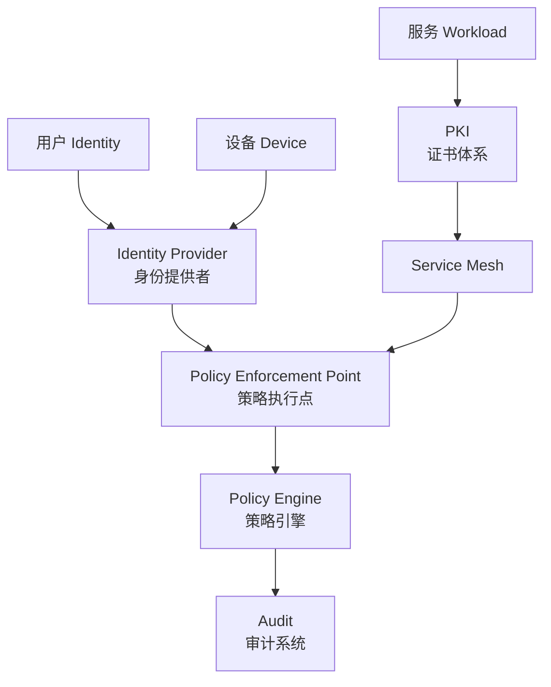
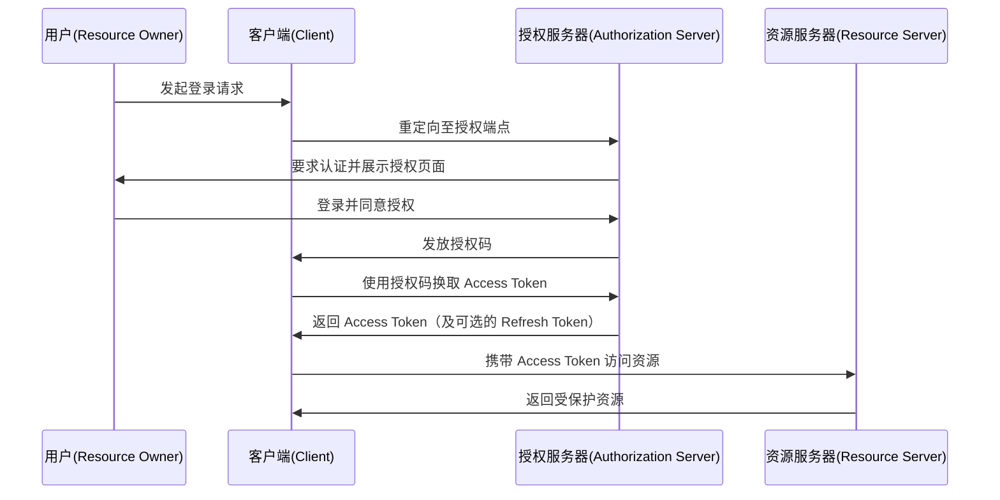
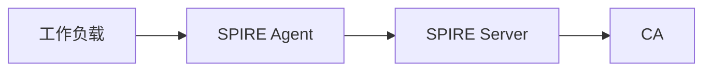
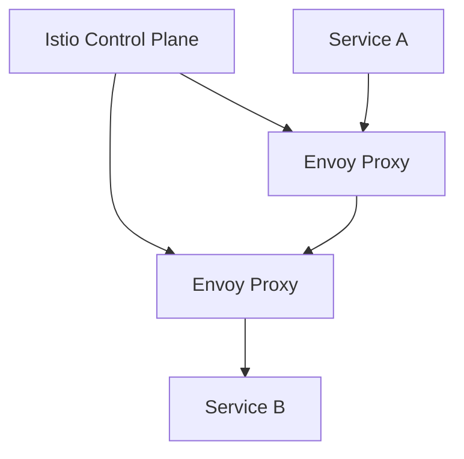
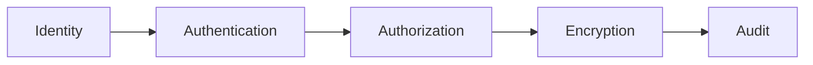

> **本章目标**
>
> 阅读完本章后，应能够理解：
>
> * 零信任架构由哪些核心组件组成。
> * 为什么统一身份体系是零信任的基础。
> * 为什么微服务需要独立于网络的服务身份。
> * 策略引擎如何实现动态授权。
> * Service Mesh 为什么成为云原生零信任的重要基础设施。
> * PKI、证书和 mTLS 如何保障服务间可信通信。

---

## 3.1 零信任架构整体模型

上一章介绍了零信任的核心思想：

> 不再相信网络位置，而是基于身份和策略动态判断访问是否允许。

那么问题来了：

**如何在实际系统中实现这一思想？**

一个完整的零信任体系通常包含以下几个核心组件：



其中：

| 组件 | 作用 |
| --- | --- |
| Identity Provider | 管理用户身份和认证 |
| Service Identity | 管理服务身份 |
| Policy Engine | 判断是否允许访问 |
| Policy Enforcement Point | 执行访问控制 |
| Service Mesh | 提供服务间安全通信 |
| PKI | 提供密码学信任基础 |
| Audit | 记录所有访问行为 |

这些组件共同组成零信任架构。用户与设备首先向 IdP 证明身份，IdP 将身份凭证传递给策略执行点；服务则从 PKI 体系获取证书并借助 Service Mesh 建立安全通道；最后策略执行点根据策略引擎的决策放行或拒绝请求，所有过程交由审计系统记录。

---

## 3.2 Identity Provider

### 3.2.1 为什么需要统一身份

传统企业环境中，每个系统可能拥有自己的账号体系：

```text
OA          → username/password
Git         → username/password
Database    → username/password
VPN         → username/password
```

结果：一个员工离职时，管理员需要依次删除 OA、Git、VPN、数据库等账号，极易出现账号残留、权限过期或无法审计的情况。这就是所谓的 **Identity Fragmentation（身份碎片化）**。

零信任要求所有访问都必须基于明确身份，因此需要一个统一身份提供者——Identity Provider (IdP)。

### 3.2.2 Identity Provider 的职责

IdP 集中管理企业内所有用户、用户组、角色、属性及其生命周期。常见的 IdP 有 Keycloak、Okta、Azure AD 等。它承担三大职责：

**身份管理**  
统一目录，将用户与属性、角色关联，并支持自动化的入职与离职流程。

**身份认证（Authentication）**  
确认“你是谁”，支持多种认证方式：用户名/密码、TOTP、FIDO2 硬件密钥、生物识别等。IdP 还可以根据风险级别动态提升认证强度（自适应认证）。

**Token 签发**  
认证成功后，IdP 不直接让业务系统存储用户密码，而是签发标准 Token（如 JWT 格式的 ID Token、Access Token），业务系统通过验证 Token 来获知用户身份与权限。例如：

```json
{
  "sub": "alice",
  "role": "developer",
  "exp": 1720000000
}
```

统一 IdP 消除了密码蔓延，实现了单点登录（SSO），并为审计提供了唯一身份源。

---

## 3.3 OAuth2

OAuth2 是现代身份体系中最重要的授权协议之一。注意：OAuth2 本身不是认证协议，它解决的核心问题是“如何安全授权第三方应用访问资源”，避免用户将密码直接交给第三方。

**核心角色**

| 角色 | 含义 |
| --- | --- |
| Resource Owner | 资源拥有者（通常为用户） |
| Client | 请求资源的应用 |
| Authorization Server | 授权服务器（可兼做 IdP） |
| Resource Server | 保存资源的服务 |

**典型授权码流程**



OAuth2 通过 Scope 限定访问范围，通过 Refresh Token 实现长会话，已成为 API 授权的基石。

---

## 3.4 OIDC

OAuth2 解决了“授权”，但零信任还需要明确“认证”。于是 OpenID Connect (OIDC) 诞生了。可以将其理解为：

> OIDC = OAuth2 + Identity Layer

OIDC 在 OAuth2 基础上增加了 **ID Token**（JWT 格式），其中包含用户身份声明（claims），例如：

```json
{
  "sub": "123456",
  "name": "Alice",
  "email": "alice@example.com",
  "iss": "https://idp.example.com",
  "aud": "my-app"
}
```

业务系统验证 ID Token 后即可确定用户身份，无需自行管理密码。现代云原生生态中，大量工具（Kubernetes Dashboard、Grafana、ArgoCD、GitLab 等）都通过 OIDC 实现统一登录。OIDC 同时支持动态客户端注册、登出等扩展规范，已成为零信任用户身份层的首选协议。

---

## 3.5 SAML

SAML（Security Assertion Markup Language）是企业传统身份领域的重要协议，主要用于基于 XML 的联合身份与单点登录。例如，员工在公司 IdP 登录后即可无缝访问 Salesforce、Workday、Office 365 等外部应用。

SAML 中的断言（Assertion）由 IdP 签发，包含用户身份与属性。它支持 SP-initiated 和 IdP-initiated 两种登录方式，并可采用 HTTP Redirect/POST 绑定传输。

优点：企业支持广泛，历史悠久，大量商业软件内建支持。  
缺点：XML 格式复杂，移动端与单页应用集成困难，云原生环境趋向轻量化。  
目前新系统更倾向 OIDC，但传统企业仍大量保留 SAML，成熟的零信任架构通常需要同时兼容二者。

---

## 3.6 LDAP

LDAP（Lightweight Directory Access Protocol）是访问目录服务（如 Active Directory、OpenLDAP）的标准协议。目录中通常以树状结构存储组织架构、用户、用户组等信息：

```text
Company
├── IT
│   ├── Alice
│   └── Bob
└── Finance
    └── Tom
```

虽然 LDAP 本身也可以做绑定认证，但在现代零信任架构中，通常不直接将应用暴露给 LDAP，而是将 LDAP 作为上游身份源，由 IdP 通过 LDAP Connector 同步用户与组，再对外提供 OIDC/OAuth2 认证。这样既保护了目录服务，又统一了认证协议。

---

## 3.7 MFA

单因素认证（仅有密码）一旦泄露身份即刻失效。零信任要求增强身份可信度，即 **多因素认证（Multi-Factor Authentication, MFA）**。MFA 组合以下三类独立因素中的至少两种：

- **Something You Know**：密码、PIN。
- **Something You Have**：手机（TOTP 应用）、硬件 Token（YubiKey）、智能卡。
- **Something You Are**：指纹、人脸、虹膜等生物特征。

现代部署常采用“密码 + FIDO2 安全密钥 + 设备证书”的多层组合。自适应 MFA 还可以根据用户设备、地理位置、行为特征动态决定是否需要第二因素，在安全与体验间取得平衡。

---

## 3.8 Service Identity

### 3.8.1 为什么微服务不能使用 IP

传统运维中，服务器 IP 可能固定，如 `192.168.1.10`，可临时充当“身份”。但在 Kubernetes 等容器环境下，Pod 随时被销毁重建，IP 地址会从 `10.244.1.5` 变为 `10.244.8.20`。更重要的是，IP 无法表达业务语义——“这个 IP 是支付服务还是订单服务？”完全无从知晓。

因此现代零信任要求为每个工作负载赋予 **与网络位置无关的稳定身份**，即 Workload Identity。

---

## 3.9 SPIFFE

SPIFFE（Secure Production Identity Framework For Everyone）定义了一套服务身份标准。每个工作负载都拥有一个全局唯一的 SPIFFE ID，格式为：

```text
spiffe://信任域/路径
```

例如：

- 支付服务：`spiffe://prod.example.com/payment/service`
- 订单服务：`spiffe://prod.example.com/order/service`

该身份不依赖于 IP、主机名或 Kubernetes Pod 名称，真正实现了“身份跟着负载走”。SPIFFE 还定义了如何通过 SPIFFE Verifiable Identity Document (SVID) 证明该身份（通常是 X.509 证书或 JWT）。

---

## 3.10 SPIRE

SPIRE 是 SPIFFE 的开源实现，负责自动化的身份注册、证书签发、身份验证与轮换。其架构如下：



- **SPIRE Agent**：运行在每个节点上，通过 Kubernetes Service Account、Unix Domain Socket 等方式认证本地工作负载。
- **SPIRE Server**：维护注册条目，作为信任根签发 SVID，并定期将更新下发给 Agent。
- **CA**：通常内置在 SPIRE Server 中，也可外接 PKI。

流程：服务启动 → Agent 识别工作负载并请求身份 → Server 根据注册条目签发证书 → 服务获得短期证书用于 mTLS。整个过程自动、透明。

---

## 3.11 Certificate Rotation

证书不能永久有效，否则一旦泄露攻击者可长期冒充身份。零信任体系要求 **证书自动轮换**。以 SPIRE 为例，签发的 SVID 通常 TTL 极短（如 1 小时或 24 小时），Agent 会在到期前自动与 Server 协商续签，下发给工作负载新证书。业务进程无需重启，通信不中断，大幅缩小凭据泄露的风险窗口。

---

## 3.12 Policy Engine

身份回答了“你是谁”，策略引擎则回答“你能做什么”。它由两部分组成：

- **Policy Decision Point (PDP)**：接收访问请求的上下文（用户、资源、动作等），根据策略返回允许/拒绝的决策。
- **Policy Enforcement Point (PEP)**：在请求路径上执行决策，例如网关、Envoy 代理或应用内拦截器。

典型输入：

```json
{
  "user": "alice",
  "resource": "payment",
  "action": "refund"
}
```

输出：

```json
{
  "allow": true
}
```

这种分离使策略逻辑集中管理，执行点保持轻量。

---

## 3.13 OPA

Open Policy Agent (OPA) 是云原生领域最流行的通用策略引擎，遵循 “Policy as Code” 理念。策略使用 Rego 语言编写，独立于应用代码：

```rego
package auth

default allow = false

allow {
    input.source == "payment"
    input.destination == "order"
}
```

该策略表示：仅当来源为 payment 且目标为 order 时才允许。OPA 可部署为守护进程、Sidecar 或 Kubernetes 准入控制器，支持 REST API 查询决策。策略可版本管理、单元测试、审计，极大提升了安全合规的自动化水平。

---

## 3.14 Service Mesh

微服务数量爆发式增长后，每个服务都需要 TLS、身份认证、重试、超时、熔断等能力。若全部侵入业务代码，复杂度和维护成本不可接受。Service Mesh 将这些通用能力下沉到独立代理层，实现对应用透明的基础设施。

Mesh 分为 **数据平面**（轻量代理，如 Envoy）和 **控制平面**（管理和配置代理）。典型功能包括：加密通信、服务发现、负载均衡、灰度发布、可观测性等。

---

## 3.15 Envoy

Envoy 是现代 Service Mesh 的数据平面核心。它以 Sidecar 模式与应用容器共享 Pod，拦截所有进出流量：

```text
Application → Envoy Proxy → Network → Envoy Proxy → Application
```

Envoy 提供 L3/L4/L7 代理，通过可插拔过滤器链实现 mTLS、路由、重试、限流、遥测。其动态配置 API（xDS）允许控制平面实时下发规则，无需重启。Envoy 的高性能与可扩展性使其成为 Istio、Ambient 等 Mesh 产品的默认数据平面。

---

## 3.16 Istio

Istio 是目前应用最广泛的 Service Mesh 平台，其架构如下：



控制平面负责证书发放、服务注册、配置分发；数据平面 Envoy 负责执行 mTLS、流量策略和遥测上报。Istio 可轻松实现服务间自动 mTLS、基于权重的流量路由、故障注入和访问控制，是云原生零信任的重要支撑。

---

## 3.17 Ambient Mesh

传统 Istio Sidecar 模式要求每个 Pod 旁路一个 Envoy 容器，这会带来额外的 CPU/内存开销和运维负担。Ambient Mesh 改变了代理模型：在节点上部署共享的 **ztunnel**（Zero Trust Tunnel）处理 L4 安全和转发，必要时通过 **waypoint 代理** 执行 L7 策略。

```text
Pod → ztunnel (node level) → waypoint (optional) → Service
```

这种方式将代理从 Pod 级提升到节点级，实现了更低的资源消耗、更简单的部署，特别适合大规模 Kubernetes 集群。

---

## 3.18 Linkerd

Linkerd 是另一种注重简洁轻量的 Service Mesh。其数据平面使用 Rust 编写的微代理 `linkerd2-proxy`，资源占用极低；控制平面组件少，安装和升级非常简单。Linkerd 自动为服务间通信注入 mTLS，并提供流量拆分、请求级指标等功能，适合对复杂度敏感的中小规模集群。

---

## 3.19 PKI

零信任要求服务间互相证明“我是谁”，密码学上依赖数字证书，而证书的管理离不开 **PKI（公钥基础设施）**。PKI 的核心作用是为实体签发、分发、验证和吊销数字证书，建立信任链。在零信任中，每个工作负载都有对应的私钥和证书，用于建立 mTLS 会话。

---

## 3.20 CA

**证书颁发机构（Certificate Authority，CA）** 是 PKI 的信任锚点，负责签发证书。CA 用自身的私钥对证书签名，验证方通过 CA 的公钥验证签名，从而信任证书中的身份。SPIRE、Istio、cert-manager 等均可担任 CA。

---

## 3.21 Intermediate CA

生产环境不会直接使用 Root CA 签发终端证书，而是建立层次化结构：

```text
Root CA (离线保管)
└── Intermediate CA (在线签发)
    └── Service Certificate
```

Intermediate CA 由 Root CA 签名，为日常签发服务。若 Intermediate CA 私钥泄露，只需吊销该中间证书并重新签发，不会影响 Root CA 的安全，极大降低风险。

---

## 3.22 mTLS

普通 TLS 仅客户端验证服务器；**mTLS（双向 TLS）** 则要求双方都出示证书并验证对方身份。握手过程中，客户端和服务端各自发送证书并证明对应私钥的持有性。这样，服务双方都能确切知道通信对象的 SPIFFE ID 或身份，实现端到端的可信通道。mTLS 是零信任服务间通信的基本安全原语。

---

## 3.23 TLS 1.3

TLS 1.3 相比 TLS 1.2 做了重大改进，更契合零信任的性能与安全需求：

- **更少的握手 RTT**：典型场景仅需 1-RTT，甚至支持 0-RTT 恢复，减少延迟。
- **更强的密码套件**：移除了 SHA-1、RSA 密钥交换等弱点，强制使用 AEAD（如 AES-GCM、ChaCha20-Poly1305）。
- **完美前向保密（PFS）**：每次会话密钥独立，私钥未来泄露也无法解密历史通信。
- **简化握手与加密更早开始**，减少了暴露面。

零信任环境下的 mTLS 通信强烈建议启用 TLS 1.3，以获得最佳安全和性能。

---

## 本章总结

零信任并不是单一技术，而是一套由多个基础设施共同组成的安全体系。核心组件可以总结如下：

| 层级 | 组件 | 解决问题 |
| --- | --- | --- |
| 身份层 | IdP / OIDC / OAuth2 | 证明用户是谁 |
| 服务身份层 | SPIFFE / SPIRE | 证明服务是谁 |
| 授权层 | OPA / Policy Engine | 判断是否允许 |
| 通信层 | mTLS / PKI | 保证通信可信 |
| 网络治理层 | Service Mesh | 自动执行安全策略 |
| 审计层 | Logging / Tracing | 记录所有行为 |

最终形成可追溯的信任链：

