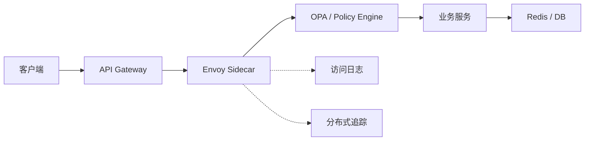
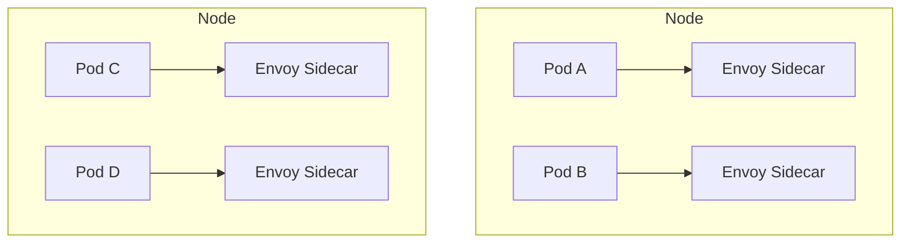
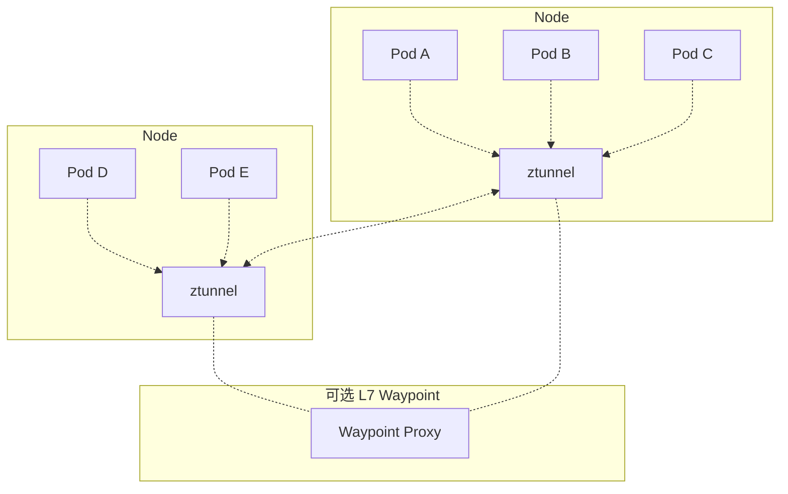
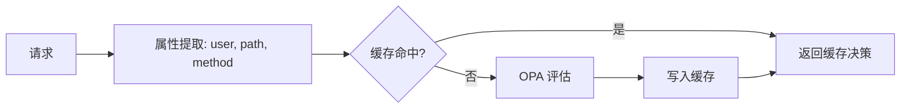
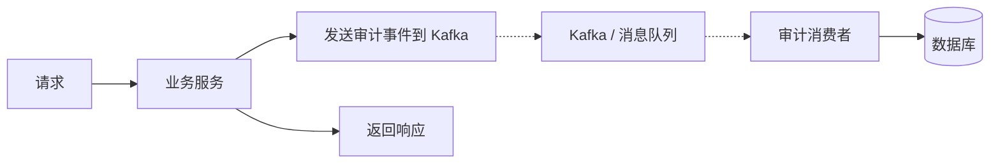
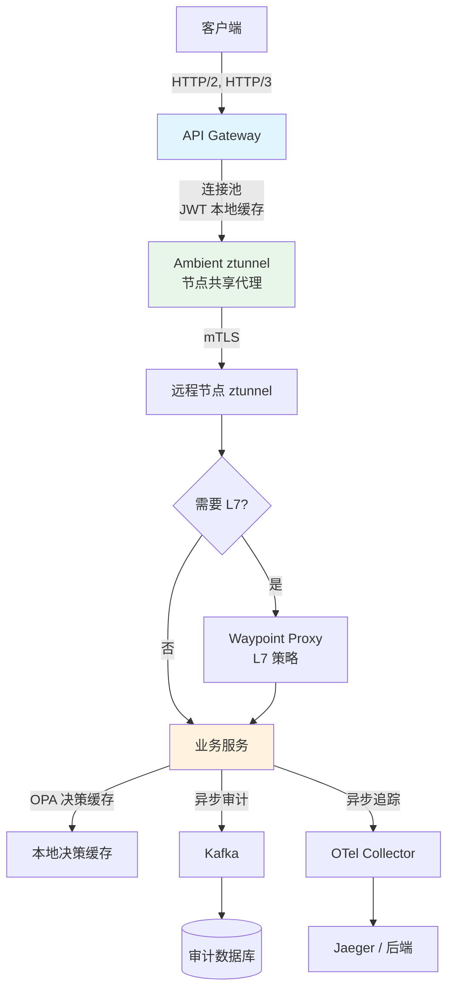
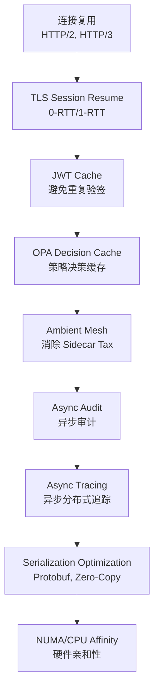

> **本章目标**
>
> 阅读完本章后，应能够理解：
>
> * 为什么现代零信任架构中，TLS 已不再是主要性能瓶颈
> * 一次请求真正消耗 CPU 的位置在哪里
> * Sidecar、Policy Engine、Serialization、Logging、Tracing 分别带来哪些性能开销
> * 如何利用连接复用、缓存、异步化等技术降低零信任带来的额外成本
> * Ambient Mesh 为什么能够降低 Sidecar 带来的资源占用
> * 如何构建既满足零信任安全要求，又具备高吞吐、低延迟的生产级架构

---

## 11.1 为什么 TLS 已经不是瓶颈

许多团队在第一次接触零信任时，脑海中浮现的往往是如下一条简单的代价链：

```
HTTPS  →  TLS  →  CPU 爆炸
```

在 2010 年前后，这个印象并不算错。当时的主流 CPU 缺乏硬件加速，TLS 握手涉及的 RSA 私钥操作与 AES 加密会消耗可观的 CPU 周期。然而，硬件与协议在最近十几年已经发生了质变，TLS 性能早已不是主要矛盾。

### 11.1.1 硬件加速的普及

现代处理器普遍集成了面向密码学运算的专用指令集，彻底改变了加密成本结构：

* **AES-NI (Intel/AMD)**  
  新增 7 条指令，直接完成 AES 的轮函数、密钥扩展、加密/解密。AES-128-GCM 加密 1 字节数据的 CPU 成本从数百个周期下降到约 0.5～1 个周期。支持 128、192、256 位密钥。

* **CLMUL (Carry-Less Multiplication)**  
  用于 GCM 模式中的 GHASH 运算，将有限域乘法从软件模拟变为单条指令，大幅降低认证标签计算开销。

* **SHA 扩展 (Intel SHA Extensions)**  
  加速 SHA-1、SHA-256 的哈希计算，主要用于证书链验证、HMAC 等。

* **ARM Crypto Extensions**  
  在 ARMv8‑A 架构中引入了 AES、SHA‑1、SHA‑256 等加速指令，使得移动端与 ARM 服务器同样享受硬件红利。

* **Intel QuickAssist Technology (QAT)**  
  并非所有场景都会用到，但在一些网卡或芯片组上，QAT 可以将部分加密、压缩操作卸载到专用硬件，进一步解放主 CPU。云厂商（如 AWS Nitro）也通过类似专用卸载卡减少虚拟化环境下的加密开销。

**性能量级参考**（单核心，AES‑128‑GCM，消息大小 1 KB）：  
- 软件实现：约 60～100 MB/s  
- AES‑NI：约 2～5 GB/s  
- 差距高达 20～50 倍，而且此数值随处理器代数更新还在持续提升。

对于大多数微服务而言，传输层加密不会成为吞吐量上限，除非系统在极高速（如 40 Gbps 以上）收发纯加密流量且不做任何应用层处理。

### 11.1.2 TLS 1.3 的握手优化

除了对称加密加速，TLS 1.3 在握手阶段大幅精简：

* **握手往返次数（RTT）减少**  
  TLS 1.2 全握手通常需要 2‑RTT（若采用 False Start 等技术可优化）；  
  TLS 1.3 默认 1‑RTT，且通过 `pre_shared_key` 扩展可实现 0‑RTT 恢复。

* **删除了不安全/冗余的密码套件**  
  去掉 RSA 密钥交换、静态 DH、CBC 模式等，强制使用前向安全的 ECDHE 系列，并仅保留 AEAD 加密算法（AES‑GCM、ChaCha20‑Poly1305）。握手过程更短、计算更少。

* **会话恢复与 0‑RTT**  
  服务端可以在首次握手后下发会话票据（Session Ticket），客户端在后续连接中携带该票据即可跳过密钥交换，直接发送加密的早期数据（Early Data）。  
  0‑RTT 适用于幂等请求，如 GET 查询；对于 POST 等非幂等操作，需谨慎应对重放攻击，可在应用层加入一次性令牌或时间窗口校验。

### 11.1.3 长连接与多路复用进一步摊薄成本

如果每次请求都进行完整的 TLS 握手，累积成本依然可观。但在现代微服务架构中，连接通常会长期复用：

* HTTP/2 的多路复用允许在单个 TCP+TLS 连接上同时承载数百个 Stream。
* gRPC 默认基于 HTTP/2，并内置连接池与 KeepAlive 策略。
* 服务网格 Sidecar（如 Envoy）通常会与上游维持长连接池，避免频繁握手。

假设一条 TLS 连接的全握手耗时 5 ms，会话恢复耗时 0.2 ms。若在 HTTP/2 连接上发送 10 000 个请求，首次握手成本被平均分配到每个请求仅约 0.5 µs，几乎可以忽略不计。真正持续的加密传输（对称加密）在硬件加速下更接近透明。

### 11.1.4 真实基准数据

Istio 官方在不同负载条件下对数据面进行的基准测试表明 [1]：
* 在 1000 并发连接、1 KB 响应的场景下，Istio 带来的延迟中位数增加约 5～10 ms，其中 Envoy 代理的转发逻辑和遥测过滤器贡献了绝大部分延迟，TLS 部分不到总增量的 10%。
* 关闭 mTLS 与开启 mTLS（包含认证和加密）的吞吐差异通常小于 5%，有时甚至在测量误差范围内。

Cloudflare 在其大规模边缘网络的公开分享中也指出：  
“在具备 AES‑NI 的现代 CPU 上，TLS 加密对 Web 服务器 CPU 的影响约为 1%～2%。” 这种量级已经完全不是架构设计中的首要瓶颈。

### 11.1.5 从“加密昂贵”到“编排昂贵”的认知转变

因此，我们需要转变思维模型：

```
HTTPS Request
     │
     ├─ TLS Handshake (一次性成本，可摊销)
     └─ TLS Record Encryption (硬件加速，近乎透明)

真正耗时的是：

Request
  ↓
Sidecar Proxy (协议解析、路由、负载均衡)
  ↓
Policy Engine (JWT 验证、OPA 决策)
  ↓
Serialization/Deserialization (JSON 编解码)
  ↓
Observability (日志、追踪、指标导出)
  ↓
Business Logic
```

结论：**今天的 TLS 更多是“一次性的连接成本”，而不是“持续性的请求成本”。**  
如果您仍将性能问题的矛头指向 mTLS，很可能错过了真正占用 CPU 的模块。

---

## 11.2 真正的性能瓶颈在哪里

要精准定位瓶颈，不能依赖直觉，必须从数据路径逐层剖析。下图展示了一条典型的零信任请求在微服务堆栈中经过的各个处理阶段：



每一个模块都会消耗 CPU，但其开销程度存在巨大差异。我们将主要模块分为以下几个层次，并附上实际生产环境中的典型 CPU 占比（基于火焰图分析，使用 1 KB HTTP 请求，1000 QPS 单实例）：

| 模块                 | 典型 CPU 占比 | 延迟贡献       | 主要原因                                       |
| ------------------ | ---------: | ---------- | ------------------------------------------ |
| TCP 协议栈           |       < 1% | < 0.01 ms  | 内核优化，TSO/LRO/GRO 卸载                       |
| TLS 加密/解密         |      1%～3% | 0.01～0.1 ms | AES‑NI 加速，连接复用                             |
| JWT 验签             |      2%～5% | 0.1～0.5 ms | 取决于签名算法和 Token 长度，ECDSA 优于 RSA             |
| Envoy 代理           |    10%～20% | 1～5 ms     | HTTP 解析、路由匹配、负载均衡、连接管理                    |
| OPA 策略评估           |    10%～25% | 1～10 ms    | Rego 规则复杂度、数据文档大小、每请求全量评估               |
| JSON 序列化/反序列化      |    20%～40% | 2～20 ms    | 频繁 Marshal/Unmarshal，多次嵌套转换               |
| 日志（同步写盘）           |    20%～40% | 5～50 ms    | 磁盘 I/O、字符串格式化、锁竞争                        |
| 分布式追踪（同步上报）        |     5%～10% | 1～3 ms     | Span 创建、上下文注入、HTTP 导出                   |
| 业务逻辑               |       不确定 | 不确定        | 取决于业务复杂度，正常应在 10%～30%                    |

> **注**：表中的占比并非严格的加和关系（CPU 可能超分），而是反映各个模块在实际采样中的相对权重。

### 11.2.1 为什么 Sidecar 代理消耗不少

Envoy 作为一个七层代理，需要完成：
* HTTP/1.1、HTTP/2、gRPC 协议解析
* 请求路由（基于路径、Header、前缀匹配等）
* 服务发现与负载均衡（轮询、最小请求、区域感知等）
* 连接池管理、TLS 终止/发起、重试、超时、熔断
* 生成动态配置（通过 xDS 协议与 Istiod 同步）

这些功能本质上是 CPU 密集的，而且每经过一个 Sidecar，请求都需要被完整解码、处理、重新编码。如果请求链路跨越多个服务，多个 Envoy 的处理成本会叠加。

### 11.2.2 策略引擎：一次请求，多次评估

OPA (Open Policy Agent) 是典型的通用策略引擎。常见模式是每个请求都要向 OPA 发起一次授权查询（或在进程内集成的嵌入式 OPA）。Rego 策略虽然表达力强，但其评估是基于 AST 的解释执行，会消耗明显的 CPU。

更糟的是，很多团队将 OPA 用作“万能胶”，在一次请求中可能进行：
* API 鉴权
* 数据库行级安全过滤
* 审计规则评估
* 动态配置判定

每一次评估都需要加载数据文档（Data Document，可能来自 Kubernetes、数据库等），计算复杂度可能达到 O(n) 甚至更高。

### 11.2.3 序列化：看不见的 CPU 吞噬者

现代微服务以 JSON 为事实标准进行数据交换。一个请求的旅程可能涉及：
* 客户端 → API Gateway：JSON 请求体
* Gateway → Sidecar：可能重新编码为 JSON
* Sidecar → 业务服务：JSON
* 业务服务 → Redis：RESP 协议，但应用层仍然可能编解码 JSON 值
* 业务服务内多个中间件的日志、审计、追踪也大量使用 JSON

每一次 Marshal/Unmarshal 都需要反射、字符串转义、内存分配。尤其是在 Go、Java 等语言中，反射带来的开销非常高。一个简单的“取出 user_id 并打印”可能背后已经发生了两次完整的 JSON 解析与生成。在生产火焰图中，`encoding/json.Marshal` 及其调用的垃圾回收（GC）相关函数常常占据 30% 以上的 CPU。

### 11.2.4 可观测性：日志、追踪、指标的隐性税

* **日志**：最容易被忽略的性能杀手。同步写盘时，每条日志都需要格式化字符串、获取锁、系统调用 write()。在高 QPS 下，即使是 `printf` 到终端也会严重拖慢吞吐。
* **追踪**：为每个请求创建 Span、注入 Trace Context、采样决策、将 Span 导出到 Collector（HTTP/gRPC 调用）都会增加 CPU 使用。如果在请求响应路径中同步上报，延迟会显著增加。
* **指标**：虽然通常使用异步的方式聚合（如 Prometheus Counter），但高基数标签（High Cardinality）会导致大量的内存和 CPU 用于哈希计算、时间序列排序。

Istio 官方文档也明确指出：遥测数据的收集（特别是访问日志和分布式追踪）是数据面性能开销的主要来源之一 [1]。在生产调优中，**关闭不必要的访问日志或启用采样往往是立竿见影的优化手段**。

### 11.2.5 总结：绘制您自己的火焰图

本节列出的模块并非在所有场景下占比都相同。建议在实际系统中利用 `perf`、`async-profiler` 或云厂商的 Profiling 服务，生成 CPU 火焰图，再对症下药。  

一个典型的优化顺序应当是：

1. **优化日志**（启用异步、采样、结构化）  
2. **减少序列化**（合并编解码、采用 Protobuf 等高效格式）  
3. **缓存策略决策**（JWT 验签缓存、OPA 决策缓存）  
4. **代理层优化**（连接复用、Ambient Mesh、配置精简）  

这正是本章后续各节将要详细展开的内容。

---

## 11.3 Sidecar 为什么贵

很多工程师第一次看到 Envoy 的性能基准时会认为：“Envoy 本身用 C++ 编写，单核 QPS 可达数万，怎么会慢？” 问题不在单个代理的效率，而在 **Sidecar 的规模化代价**。

### 11.3.1 数量爆炸与资源线性增长

假设一个 Kubernetes 集群中运行着 1000 个业务 Pod，在传统的 Sidecar 模式下，每个 Pod 都会注入一个 Envoy 容器。这意味着：

```
1000 个 Pod
 → 1000 个 Envoy Sidecar
   → 1000 份独立的内存占用
   → 1000 份配置（通过 xDS 下发）
   → 1000 份指标与日志流
```

每个 Envoy 都需要维护：

* **Listener / Route / Cluster 配置**  
  完整的服务发现数据（集群中所有服务端点）、路由规则、TLS 证书上下文。在大型集群中，一份全量配置可能包含数万个端点，单个 Envoy 的配置内存占用可达 100～200 MB。
* **连接池**  
  对每个上游服务维持连接，开启 mTLS 时还需维护每个连接的 TLS 状态。
* **Metrics**  
  Envoy 输出大量内置指标（请求数、延迟分布、重试次数等），每个指标标签组合都会消耗内存和 CPU（Prometheus 抓取时还需要序列化）。
* **访问日志与追踪**  
  每个 Sidecar 都需要生成日志和 Span，即使您的业务不需要。

Istio 的官方基准测试数据指出 [1]：
* 在 1000 个服务的测试场景下，每个 Sidecar 平均消耗约 **50～100 毫核 (mCPU)** 和 **100～200 MB 内存**。
* 当集群 Pod 数量达到 5000 时，仅 Sidecar 的额外总 CPU 消耗就可能超过数百核，内存开销可达数 TB。

这种被称为 **“Sidecar Tax”** 的资源浪费，本质上不是 Envoy 的代码不够高效，而是 **数据面代理没有按需共享**。

### 11.3.2 配置同步的边际成本

Envoy 通过 xDS 协议与 Istiod 动态同步配置。每次集群中的服务发生变化（Pod 扩缩容、滚动更新），Istiod 都要生成新的配置快照并推送到所有相关的 Sidecar。在 1000 个 Sidecar 的场景下，控制面 (Istiod) 需要同时维持 1000 个双向流，网络带宽和 CPU 压力都非常大。这种“配置风暴”可能会导致代理短暂失去同步，引发 5xx 错误或延迟抖动。

### 11.3.3 延迟叠加

一个请求穿越网格的典型路径：

```
Client → Sidecar_A → App_A → Sidecar_A → Sidecar_B → App_B
```

每一跳都经过 L4/L7 协议栈处理，增加 1～3 ms 的延迟。对于频繁调用多个服务的请求链，累积延迟会非常可观。而这些 Sidecar 并不总是必要的——如果仅需 mTLS 加密和身份认证，一个轻量级的 L4 代理足够，无需完整的 HTTP 解析和路由。

### 11.3.4 资源隔离的代价

Sidecar 模式的初衷之一是为每个工作负载提供独立的安全边界和资源配额。但这种“每 Pod 一代理”的方式，使得 CPU 和内存资源无法有效共享和复用。例如，1000 个 Envoy 可能各自有 50 MB 的空闲配置缓存，但彼此无法共享，造成了巨大的内存浪费。

正是这些痛点催生了下一节将要介绍的 **Ambient Mesh**。

---

## 11.4 Ambient Mesh —— 共享数据面，消除 Sidecar Tax

Istio 社区在 2022 年推出了 Ambient Mesh 架构，目标就是从根本上解决 Sidecar 模式带来的资源浪费和运维复杂性。

### 11.4.1 架构对比

传统 Sidecar 模式（每个工作负载一个代理）：



Ambient Mesh 模式（节点级共享代理）：



在 Ambient 模式下：
* 每个节点上运行一个 **ztunnel**（零信任隧道），负责该节点所有 Pod 的 L4 流量（mTLS、身份认证、简单鉴权、遥测）。
* ztunnel 无需理解 HTTP/gRPC 协议，仅工作在传输层，因此非常轻量。它不处理路由、流量拆分等七层功能。
* 当需要 L7 策略（如基于 Header 的路由、速率限制、故障注入）时，才部署一个 **Waypoint Proxy**（本质上是 Envoy）按需为特定服务或命名空间提供七层代理。这种方式避免了对所有流量强制执行七层处理。

### 11.4.2 资源效率提升

官方性能测试显示：
* **内存占用**：一个 ztunnel 实例的内存开销约 20～40 MB，远低于 Sidecar 模式下一个 Envoy 的 100～200 MB。在 100 个 Pod 的节点上，内存节省可达 90%。
* **CPU**：ztunnel 仅进行 L4 处理，CPU 消耗约为 Sidecar Envoy 的 1/5～1/10。在 1000 个 Pod 的集群中，Ambient 模式可节省数百核 CPU。
* **配置传播**：控制面只需要向 ztunnel 推送节点级别的策略，而不是每 Pod 一份，大大降低配置风暴风险。

### 11.4.3 延迟优化

流量路径被缩短为：

```
Pod A → ztunnel (本地节点) → ztunnel (远程节点) → Pod B
```

省略了 Sidecar 的进/出两跳 HTTP 解析，延迟中位数降低约 30%～50%。当不需要 L7 Waypoint 时，整个数据路径几乎等同于节点间的 mTLS 隧道，性能极为接近纯网络传输。

### 11.4.4 Waypoint 的按需启用

Waypoint 仅在需要时部署，例如：
* 需要对特定服务执行流量分流（金丝雀发布）
* 需要基于 HTTP Header 的访问控制
* 需要七层遥测（如 HTTP 状态码分布）

一个 Waypoint 可以服务于一个服务账户（Service Account）下的所有实例，而不是每个 Pod 一个。这种“共享 L7 代理”的模式进一步减少代理实例数量。

### 11.4.5 生产建议

对于追求高性能的零信任系统，强烈建议评估 Ambient Mesh 作为默认数据面。如果仍在使用 Sidecar 模式，至少应：
* 精简 Envoy 配置，关闭不需要的过滤器（如 Lua、访问日志）
* 启用访问日志采样（默认 100% 是性能杀手）
* 控制指标标签基数，避免高基数标签导致内存膨胀

将代理从“每 Pod”提升到“每节点”，是零信任架构演进的重要一步。

---

## 11.5 Policy Cache —— 策略决策缓存

策略引擎（如 OPA）的安全性与灵活性往往是以 CPU 为代价换来的。在典型的零信任系统中，每一次 API 调用都可能触发授权决策：

```
请求 → 提取 JWT → 调用 OPA → 评估 Rego 规则 → 返回允许/拒绝
```

如果每个请求都要完整执行 Rego 评估，不仅要消耗 CPU，还可能需要查询外部数据源（如 LDAP、Kubernetes API），增加延迟。但真实情况是：**策略和用户属性在短时间内极少变化**。

### 11.5.1 缓存模型

我们可以引入决策缓存层，将“授权结果”缓存起来：



缓存的键（Key）通常由输入数据中影响决策的部分组成，如：
* 主体标识（用户 ID、服务账户名）
* 资源路径（API 路径、Kubernetes namespace）
* 操作（GET、POST、delete）
* 某些关键上下文（如请求来源 IP，如果策略使用）

键的设计必须确保：**当且仅当影响决策的所有因素相同时，才能重用缓存结果**。

### 11.5.2 缓存什么？

根据使用模式，可以缓存不同粒度的数据：

1. **完整决策结果**（允许/拒绝）  
   最简单，但要注意如果策略依赖实时数据（如剩余配额），则不能长时间缓存完整决策。

2. **部分评估结果**  
   OPA 支持“部分评估 (Partial Evaluation)”机制：可以将 Rego 策略中与输入无关的部分预先计算，生成一个简化的查询，运行时只需带入变化部分。这可以显著减少评估时间，并允许缓存这些预计算结果。

3. **外部数据缓存**  
   很多策略会查询外部数据，如“该用户是否属于 VIP 组？”。这些数据可以独立缓存，降低外部调用频率。

### 11.5.3 缓存失效策略

安全决策的缓存不能随意设计有效期，必须结合安全需求：
* **基于事件失效**：当用户权限变更、策略更新、组成员关系变化时，发送事件主动废止缓存条目。
* **短 TTL**：对于无法感知事件的环境，可以设置较短的 TTL（如 10～60 秒）。虽然增加了少量评估，但能保证最终一致性。
* **分层 TTL**：完整决策缓存 TTL 较短（如 30 s），外部数据缓存 TTL 较长（如 5 min）。

### 11.5.4 实现示例（伪代码）

```go
type DecisionCache struct {
    cache *lru.Cache
    mu    sync.RWMutex
}

func (d *DecisionCache) GetOrEvaluate(ctx context.Context, 
    input Input, opa OPA) (bool, error) {
    
    key := hash(input.User, input.Path, input.Method)
    
    d.mu.RLock()
    if val, ok := d.cache.Get(key); ok {
        d.mu.RUnlock()
        return val.(bool), nil
    }
    d.mu.RUnlock()
    
    allowed, err := opa.Evaluate(ctx, input)
    if err != nil {
        return false, err
    }
    
    d.mu.Lock()
    d.cache.Add(key, allowed)
    d.mu.Unlock()
    
    return allowed, nil
}
```

在实际系统中，还需结合 Token 的 `exp` 和 `nbf` 声明，确保缓存决策不超出令牌有效期。例如，可以设置缓存的 TTL 为 `min(策略 TTL, Token 剩余有效期)`。

### 11.5.5 效果

引入决策缓存后，通常可以将 90% 以上的授权请求转化为 O(1) 的内存查找，将 OPA 的 CPU 占用降低至原来的十分之一以下，同时平均授权延迟从毫秒级降至微秒级。

---

## 11.6 JWT Cache —— 避免重复验签

JSON Web Token (JWT) 是零信任中服务间身份认证的主要载体。标准的 JWT 验证包括：
1. 解析头部和负载
2. 验证签名（RSA、ECDSA 等非对称算法）
3. 检查声明（`exp`、`nbf`、`iss`、`aud` 等）

签名验证是其中最昂贵的步骤。RS256 的一次验证可能消耗 0.2～1 ms，ECDSA 略快但仍不可忽视。当同一个 Token 在短时间内被数千个请求携带时，重复验签无疑是巨大的浪费。

### 11.6.1 缓存原理

JWT 缓存的基本思路：
* 以 Token 的指纹（如 SHA‑256 哈希）为键，缓存已验证的 Claims 和过期信息。
* 当第二次见到相同的 Token 指纹时，直接从缓存中取出已验证的 Claims，**跳过签名验证**。
* 由于签名验证保证了 Token 的不可篡改性，只要缓存的是签名合法的 Token，信任传递是安全的。

关键在于要确保：
* 缓存的生命周期严格受限于 Token 的 `exp` 声明（必须早于过期时间）
* 缓存对于未通过验证的 Token 绝不能保存（防止 DoS）
* 发生密钥轮换时，必须使所有相关缓存失效，因为原先合法的签名可能不再被新密钥信任。

### 11.6.2 数据结构和有效期

典型实现：

```go
type JWTCache struct {
    store *lru.Cache // key: tokenHash, value: *CachedClaims
}

type CachedClaims struct {
    Subject  string
    ExpiresAt time.Time
    Claims   map[string]interface{}
}
```

缓存 TTL 计算：

```go
func calcTTL(claims CachedClaims, maxTTL time.Duration) time.Duration {
    if claims.ExpiresAt.IsZero() {
        return maxTTL
    }
    remaining := time.Until(claims.ExpiresAt)
    if remaining <= 0 {
        return 0
    }
    if maxTTL < remaining {
        return maxTTL
    }
    return remaining
}
```

### 11.6.3 密钥轮换处理

当 JWKS (JSON Web Key Set) 更新时（例如密钥轮换），需要清空所有相关的缓存条目。这可以通过以下方式实现：
* 在缓存键中加入 Key ID (kid)，这样新密钥签名的 Token 自然会有不同的 kid，旧缓存不会被错误使用。
* 同时，在 JWKS 刷新时，主动扫描并失效仍然引用旧 kid 的条目。

### 11.6.4 安全注意事项

* **绝不缓存未经签名验证的 Token**。先验证，再缓存，或者采用“负缓存”记录失效 Token，但要防止攻击者用大量随机 Token 填满缓存。
* **缓存存储必须是内存或高速的受保护存储**，不要泄露到日志、导出到不安全的共享存储。
* **若 Token 中包含一次性使用声明 (jti) 或要求每次验证都检查撤销状态，则不能直接缓存完整决策**，可能需要单独维护一个撤销列表并定期检查。

启用 JWT 缓存后，CPU 中的签名验证部分可降低 95% 以上，认证延迟从毫秒级压缩到微秒级，显著提升网关和 Sidecar 的性能。

---

## 11.7 TLS Session Resume —— 握手复用

虽然对称加密开销极低，但 TLS 握手依旧涉及非对称密码运算和网络往返。在高频短连接场景下，握手累积延迟可能成为问题。TLS 提供了会话恢复机制，允许客户端与服务器在后续连接中复用先前协商的会话参数，从而跳过密钥交换。

### 11.7.1 会话 ID 与会话票据

* **Session ID (TLS 1.2 及更早)**  
  服务器在握手完成后生成一个 Session ID 并发送给客户端。客户端下次连接时在 ClientHello 中带上该 ID。服务器在本地会话缓存中查找对应参数，若找到则直接恢复会话。这种方法要求服务器维护会话状态，在分布式负载均衡环境下需要共享缓存，增加了复杂度。

* **Session Ticket (推荐)**  
  服务器将会话参数加密成一个票据（Ticket），发送给客户端。客户端存储该票据，下次连接时在 ClientHello 的扩展中携带。服务器只要持有票据的解密密钥，即可恢复会话，无需本地存储。这种方式无状态，非常适合大规模水平扩展。

### 11.7.2 TLS 1.3 的 PSK 和 0‑RTT

TLS 1.3 将会话恢复规范化，使用预共享密钥（Pre‑Shared Key, PSK）。在首次握手后，服务器可以提供一个 PSK 标识，客户端后续连接时可以：
* **1‑RTT 恢复**：客户端在 ClientHello 中提供 PSK，服务器确认后直接进入加密通道，跳过证书和密钥交换，节省 1 个 RTT。
* **0‑RTT 恢复**：客户端在首次消息中就可以携带加密的早期数据（Early Data），实现“零往返”的请求发送。这对于快速恢复移动端连接或 Web 页面加载有显著效果。

0‑RTT 的代价是重放攻击风险。攻击者可以捕获 0‑RTT 请求并重新发送，服务器可能会执行重复操作。因此 0‑RTT 应仅用于幂等操作（如 GET），或配合应用层的一次性令牌（Nonce）来防重放。

### 11.7.3 生产配置建议

在 Envoy 中，可以通过配置上游集群的 `transport_socket` 来启用会话恢复：

```yaml
transport_socket:
  name: envoy.transport_sockets.tls
  typed_config:
    "@type": type.googleapis.com/envoy.extensions.transport_sockets.tls.v3.UpstreamTlsContext
    common_tls_context:
      tls_params:
        tls_minimum_protocol_version: TLSv1_3
      tls_session_ticket_keys:  # 用于加密票据的密钥
        - inline_string: "your-secure-key-1"
```

同时，客户端 Sidecar 会自动缓存票据并复用。实际测试中，启用会话恢复后，新建连接的延迟中位数可降低 50%～80%，尾部延迟改善更明显。

---

## 11.8 Connection Pool —— 连接复用

微服务间的短连接模式是性能的头号杀手。每个短连接都意味着：

* TCP 三次握手（1.5 RTT）
* TLS 握手（至少 1 RTT，即使恢复也有部分计算）
* 连接建立后的慢启动（TCP slow start）
* 断开时的 TIME_WAIT 状态占用端口资源

**1000 个请求，1000 个短连接**，带来的开销可能使吞吐量下降 10 倍甚至更多。解决方案是连接池和 HTTP/2 多路复用。

### 11.8.1 连接池的核心原理

连接池在客户端和服务器之间维护一个已建立的长连接集合，请求到来时直接从池中取出连接发送数据，完成后归还而非关闭。Envoy 作为代理，天然对上游维护连接池，参数包括：
* `max_connections`：最大连接数
* `connect_timeout`：建立连接超时
* `idle_timeout`：空闲连接保持时间
* `max_requests_per_connection`：连接最大请求数，达到后主动关闭，防止连接老化

合理的连接池配置可以让 99% 的请求复用现有连接，避免反复握手。

### 11.8.2 HTTP/2 的多路复用

传统 HTTP/1.1 虽然支持 Keep-Alive，但在同一时刻一个连接只能处理一个请求（队头阻塞）。HTTP/2 引入了二进制分帧和多路复用，允许在一个 TCP 连接上并发交错发送多个请求和响应（Stream）。这极大地提高了连接利用率。

在 Istio 或 Envoy 中，默认对上游启用 HTTP/2（尤其是对 gRPC 服务）。对于 HTTP/1.1 服务，也可以配置 `upgrade_configs` 尝试升级。多路复用的效果：

```
之前：1000 请求 → 1000 TCP + 1000 TLS → 大量握手
之后：1000 请求 → 1 TCP + 1 TLS → 1000 Streams → 最小开销
```

### 11.8.3 连接复用与负载均衡的平衡

连接复用可能导致“连接不均匀”问题：某些上游连接上承载的请求数远多于其他连接，导致负载不均。Envoy 通过 `least_request`（最少请求）负载均衡策略，结合主动健康检查，能够较好地平衡各连接上的负载。此外，配置 `max_requests_per_connection` 可以定期轮换连接，防止某个实例过载。

### 11.8.4 实践经验

* **默认启用 HTTP/2**：对于内部微服务，强烈建议使用 gRPC（基于 HTTP/2）或直接启用 HTTP/2。
* **合理设置连接池大小**：通常设置 `max_connections` 为每个上游实例 2～4 个，足以应对数千 QPS。
* **避免无限期复用**：定期设置最大请求数轮换，有助于避免内存泄漏和长尾问题。
* **注意服务端并发限制**：HTTP/2 的流并发数受服务端 `SETTINGS_MAX_CONCURRENT_STREAMS` 限制，需协调配置。

正确的连接复用，可以使系统的有效 QPS 提升数倍，同时大幅降低 P99 延迟。

---

## 11.9 Serialization —— 序列化优化

序列化/反序列化（Ser/Des）往往占据 CPU 的半壁江山。在生产系统的 CPU 采样中，你很容易看到类似下面的函数栈：

```
encoding/json.Unmarshal
reflect.Value.Set
runtime.mallocgc
```

### 11.9.1 为什么 JSON 这么贵？

JSON 虽然可读性好，但其编解码需要大量反射、字符串扫描、Unicode 转义以及动态内存分配。在 Go 语言中：
* 每次 `json.Unmarshal` 都会进行反射遍历结构体字段，解析 JSON 字符串，分配新对象。
* 即使只是取出其中一个字段，标准库也会将整个 JSON 解析成中间结构（`map[string]interface{}` 或完整结构体），然后再丢弃，造成大量浪费。
* 反复的序列化/反序列化还会产生大量短期对象，增加 GC 压力。

一个常见场景：API Gateway 收到 JSON 请求，传给 Sidecar 进行鉴权，需要再次解析 JSON 以提取 JWT 或属性；然后转发给业务服务，业务服务又解析一次。一个请求可能经历 3～4 次完整的 JSON 解析。

### 11.9.2 替代序列化格式

**Protocol Buffers (Protobuf)**
* 二进制格式，编解码速度通常是 JSON 的 3～10 倍。
* 强类型，无需反射，生成的代码固定布局，减少内存分配。
* 配合 gRPC 使用，端到端均为 Protobuf，避免序列化格式转换。
* 但需注意，与外部系统交互时可能需要转 JSON，若转型过多则收益有限。

**FlatBuffers**
* 零解析，无需反序列化步骤，直接从二进制 buffer 中读取数据。
* 适合对延迟极度敏感的场景，但 API 较复杂，生态不如 Protobuf。

**MessagePack**
* 类似 JSON 的二进制编码，有模式或无模式皆可。
* 比 JSON 小且快，但仍需解析。

**Cap'n Proto**
* 与 FlatBuffers 类似的零拷贝设计，但生态较小。

### 11.9.3 优化策略

1. **在内部统一使用 Protobuf + gRPC**  
   这是最彻底的优化，整个链路从 Sidecar 到业务服务全部采用 Protobuf，Gateway 负责将外部 JSON 转换为 Protobuf 一次即可。

2. **避免多次编解码**  
   使用网关层面的“透传”机制，如果下游也是 HTTP/JSON，可以考虑让 Sidecar 仅基于 Header (JWT) 和路径做路由与鉴权，不解包 Body，从而减少一次 JSON 解析。Envoy 支持基于 Header 的 JWT 验证，无需访问 Body。

3. **使用 Zero-Copy 技术**  
   Protobuf 的 C++ 实现支持 Arena 分配，可以将消息分配在连续内存块中，降低内存分配和拷贝。在 Go 语言中，可以考虑使用 `github.com/gogo/protobuf` 等优化库。

4. **有选择地解码**  
   仅提取需要的字段，可使用流式解析器（如 `json.Decoder` 的 Token 模式）或类似 `gjson` 的库，在只访问少量字段时避免完整反序列化整个对象。

5. **序列化缓存**  
   对于频繁序列化的不变对象，可预先序列化并缓存其二进制表示，直接发送缓存字节。

通过上述优化，可以将序列化相关的 CPU 占比从 40% 降低到 10% 以下，同时减少 GC 暂停。

---

## 11.10 Async Audit —— 异步审计

审计日志是合规性要求中不可或缺的一环。零信任强调“永不信任，始终验证”，因此每次访问决策通常都要记录审计事件。但若将审计日志同步写入数据库或磁盘，其性能代价可能高得惊人。

### 11.10.1 同步写入的代价

同步写入模式：

```
请求 → 业务处理 → 审计写入(INSERT/写盘) → 响应
```

* 审计写入操作可能涉及：网络 I/O（如写入远程数据库）、磁盘 fsync、锁竞争。
* 在高并发下，数据库连接池成为瓶颈，请求线程被阻塞等待审计完成。
* 尾延迟 (P99) 可能被拖慢几百毫秒甚至秒级，严重降低用户体验。

### 11.10.2 异步解耦模式

正确做法是将审计日志的持久化从请求关键路径中剥离：



请求线程仅需将事件序列化为一条消息，追加到内存队列或发送给消息代理（Kafka、Pulsar 等），然后立即返回响应。消息的可靠性由消息队列保证。

### 11.10.3 可靠性与一致性保证

异步化虽然解耦，但不能丢失审计事件。设计时需要考虑：
* **生产端确认**：使用 `acks=all` (Kafka) 或类似机制，确保消息至少写入一定数量的副本后再返回成功。这会增加微小延迟，但仍在可接受范围（几毫秒）。
* **死信队列 (DLQ)**：当消费者处理失败时，将消息转入死信队列，后续人工或自动修复。
* **幂等性**：消费者可能重复消费，需要保证审计写入是幂等的（如基于唯一事件 ID 去重）。
* **本地缓存降级**：如果消息代理不可用，可以暂时将事件写入本地磁盘或内存队列，待恢复后重放。

### 11.10.4 批处理与压缩

消费者不应逐条写入数据库，而应实现微批处理：每 100 条或每 100 ms 批量插入。同时可以对消息进行压缩（Snappy、LZ4），减少网络开销和磁盘占用。

### 11.10.5 性能提升

实施异步审计后，原本占用 20%～30% 的 CPU 和显著延迟的审计逻辑，对请求线程的影响降至几乎为零。响应延迟回归业务本身水平。目前主流零信任平台（如 Istio、Open Policy Agent 的决策日志）均建议将审计日志异步导出。

---

## 11.11 Async Tracing —— 异步分布式追踪

分布式追踪（Tracing）帮助理解请求在全链路中的行为，是零信任可观测性的重要支柱。但如果在请求线程中同步创建和上报 Span，同样会成为性能拖累。

### 11.11.1 Span 的生成与上报

每当请求进入服务或代理，需要：
* 生成 Span ID，记录起止时间戳
* 注入/提取 Trace Context（Header 传播）
* 添加标签、日志事件
* 最终通过 HTTP/gRPC 将 Span 发送到 Collector（如 Jaeger、Zipkin、OTel Collector）

如果同步上报，每个 Span 的导出都可能包含网络 I/O，导致请求线程阻塞。虽然 Istio 等代理通常在响应返回后才收集 Span，但这依旧会占用代理工作线程，影响后续请求的处理。

### 11.11.2 异步与批量导出

OpenTelemetry SDK 默认使用 `BatchSpanProcessor`，它将 Span 先放入内存队列，由后台协程定期批量发送。关键配置：
* `maxQueueSize`：队列最大长度，防止 OOM
* `batchTimeout`：发送间隔（如 5 s）
* `maxExportBatchSize`：每批最大 Span 数
* `exportTimeout`：导出超时

```go
import "go.opentelemetry.io/otel/sdk/trace"

bsp := trace.NewBatchSpanProcessor(
    trace.BatchTimeout(5 * time.Second),
    trace.WithMaxExportBatchSize(512),
)
```

Envoy 的追踪扩展（如 OpenTelemetry Tracer）也支持类似机制，通过配置 `collector_cluster` 和 `collector_endpoint`，将 Span 异步发送。

### 11.11.3 采样策略

永远不应该对 100% 的请求进行追踪，特别是在高 QPS 系统中。常见的采样策略：
* **概率采样**：例如 1% 或 0.1%，在请求入口处决定。
* **自适应采样**：根据系统负载动态调整采样率。
* **基于错误的强制采样**：对于错误请求或高延迟请求 100% 采样，正常请求低采样。

Istio 可以通过 `MeshConfig` 设置追踪采样率，例如：

```yaml
apiVersion: install.istio.io/v1alpha1
kind: IstioOperator
spec:
  meshConfig:
    enableTracing: true
    tracing:
      sampling: 1.0   # 百分比，1.0 即 1%
```

### 11.11.4 对延迟的影响

异步批量导出后，请求线程只需将 Span 写入内存队列（微秒级操作）。Span 的序列化与网络传输在后台发生，不会增加请求的响应时间。同时，批量发送降低了网络包数量和序列化开销，整体 CPU 消耗更低。

---

## 11.12 Logging 优化 —— 日志不是免费午餐

日志是所有系统中最大的“隐性税”之一。开发者习惯在代码中添加大量的 `log.Info`，但在生产环境中，这些日志可能成为灾难。

### 11.12.1 同步日志的性能陷阱

典型的同步日志流程：

```go
func handle(w http.ResponseWriter, r *http.Request) {
    log.Printf("received request: %s %s", r.Method, r.URL.Path)
    // ...业务...
    log.Printf("request processed in %v", elapsed)
}
```

每行日志在标准库实现中可能涉及：
* `fmt.Sprintf` 格式化字符串
* 写入 `io.Writer`，通常是文件
* 系统调用 `write()`，可能触发 fsync（取决于缓冲策略）
* 获取文件锁（如果多个协程写入同一文件）

在高并发下，日志写入造成严重的锁竞争和系统调用开销，成为吞吐量的瓶颈。实测中，一个每秒 10000 请求的服务，如果开启每条请求的详细日志（含请求体），吞吐可能会下降到 2000 QPS，CPU 几乎全耗在日志上。

### 11.12.2 异步日志架构

现代高性能日志库（如 Go 的 `zap`、`zerolog`，C++ 的 `spdlog`）都采用异步设计：
* 调用方将日志消息和字段压入无锁环形缓冲区（Ring Buffer）。
* 后台专用协程负责从缓冲区读取、格式化、批量写入磁盘或发送到远端。
* 主线程仅做轻量的字段编码，没有系统调用和锁。

```
业务线程 → Ring Buffer → 日志线程 → 批量写入/发送
```

### 11.12.3 结构化日志与编码

避免在热路径上进行复杂的字符串格式化。采用结构化日志，字段以二进制形式编码（例如 JSON），可以推迟实际的字符串处理。例如 `zap` 的 `Field` 类型，直到真正写入时才序列化。

### 11.12.4 日志采样与级别控制

**必须启用日志采样**。设计原则：
* 错误日志：100% 记录
* 警告日志：根据类型采样
* 信息日志：按请求比例采样，如 1%
* 调试日志：默认关闭，需要时可动态开启（通过功能开关）

Envoy 的访问日志支持运行时采样配置：

```yaml
access_log:
- name: envoy.access_loggers.file
  typed_config:
    "@type": type.googleapis.com/envoy.extensions.access_loggers.file.v3.FileAccessLog
    path: /dev/stdout
    filter:
      runtime_filter:
        runtime_key: access_log_sampling
        percent_sampled:
          numerator: 1          # 1%
          denominator: HUNDRED
```

### 11.12.5 压缩与轮转

日志文件应启用压缩（如 gzip），并定期轮转。这不仅节省磁盘，也减少 I/O 量。

通过异步化、采样、结构化，通常可以将日志带来的 CPU 开销降低 80%～90%，让您的服务回归本职。

---

## 11.13 NUMA 优化 —— 发挥硬件的全部能力

在物理服务器或大型虚拟机上，NUMA（Non-Uniform Memory Access）架构决定了内存访问延迟的不对称性。典型的双路服务器有两个 NUMA 节点，每个节点拥有自己的 CPU 和本地内存。跨节点内存访问延迟可能比本地高 50%～100%。

### 11.13.1 为什么关心 NUMA

Envoy 等网络代理的性能对内存延迟非常敏感。如果一个 Envoy 工作线程在 NUMA Node0 上运行，而它正在处理的连接缓冲区却位于 Node1 的内存中，那么每次数据读写都需要跨节点传输，导致 CPU 缓存频繁失效，延迟增加，吞吐下降。

### 11.13.2 CPU 亲和性 (Affinity) 与 NUMA 绑定

优化手段包括：
* **绑定工作线程到特定 CPU 核心** (`taskset`, `cpuset`)
* **将线程限制在单个 NUMA 节点内**，并从该节点的本地内存分配缓冲区
* **利用网卡多队列与 IRQ 亲和性**：将网卡收发队列的中断绑定到与 Envoy 工作线程相同的 NUMA 节点，使得数据从网卡直接进入本地内存

在 Kubernetes 中，可以通过 `TopologyManager` 和 `CPUManager` 策略，将 Guaranteed Pod 的 CPU 和内存对齐到同一 NUMA 节点。对于 Envoy，可以在其配置中设置 `concurrency` 参数以匹配分配的 CPU 数量，并配合适当的 cgroup 设置。

### 11.13.3 实施效果

适当的 NUMA 绑定可以减少内存延迟，提升代理吞吐 10%～20%，同时降低 P99 延迟抖动。对于极端性能场景（如 10 Gbps 以上流量），这一步是必不可少的。

---

## 11.14 最终优化架构

综合以上所有优化策略，一个生产级的高性能零信任架构如下所示：



**核心设计原则**：

* **长连接代替短连接**：利用 HTTP/2、连接池，最小化握手成本。
* **缓存代替重复计算**：JWT 缓存、OPA 决策缓存、序列化缓存。
* **异步代替同步阻塞**：审计日志、分布式追踪、日志写入全路径异步化。
* **批处理代替频繁 I/O**：日志批量写盘、Span 批量导出。
* **共享代理代替 Pod 级代理**：Ambient Mesh 的 ztunnel，消除 Sidecar Tax。
* **本地验证代替远程调用**：将 JWT 验签、策略决策尽可能本地化并缓存。
* **数据平面保持最短路径**：避免不必要的 L7 处理，仅在必需时启用 Waypoint。

遵循此架构，零信任的安全能力（强身份、细粒度授权、全链路观测）带来的额外成本被压缩到最低，从而使系统能够在保持高安全性的同时，达到接近非安全基础设施的吞吐量和延迟。

---

## 11.15 本章总结

高性能零信任的目标从来不是**减少安全能力**，而是**减少安全能力的重复成本**。

优化应按照以下优先级顺序实施：



最终凝结为一套完整的优化方法论：

> **连接尽可能复用 (Connection Reuse)。**  
> **计算尽可能缓存 (Cache)。**  
> **I/O 尽可能异步 (Async)。**  
> **代理尽可能共享 (Shared Data Plane)。**  
> **协议尽可能高效 (HTTP/2, HTTP/3, Protobuf)。**  
> **让 CPU 始终用于处理业务，而不是重复完成相同的安全与基础设施工作。**

这也是现代云原生零信任系统能够在保持强身份认证、细粒度授权和全链路可观测性的同时，仍然维持高吞吐和低延迟的核心原因。