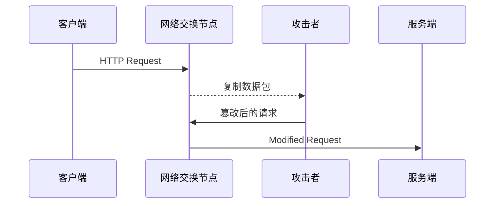
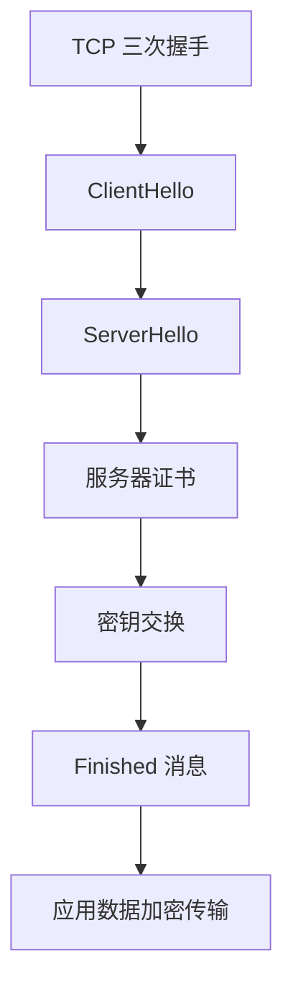
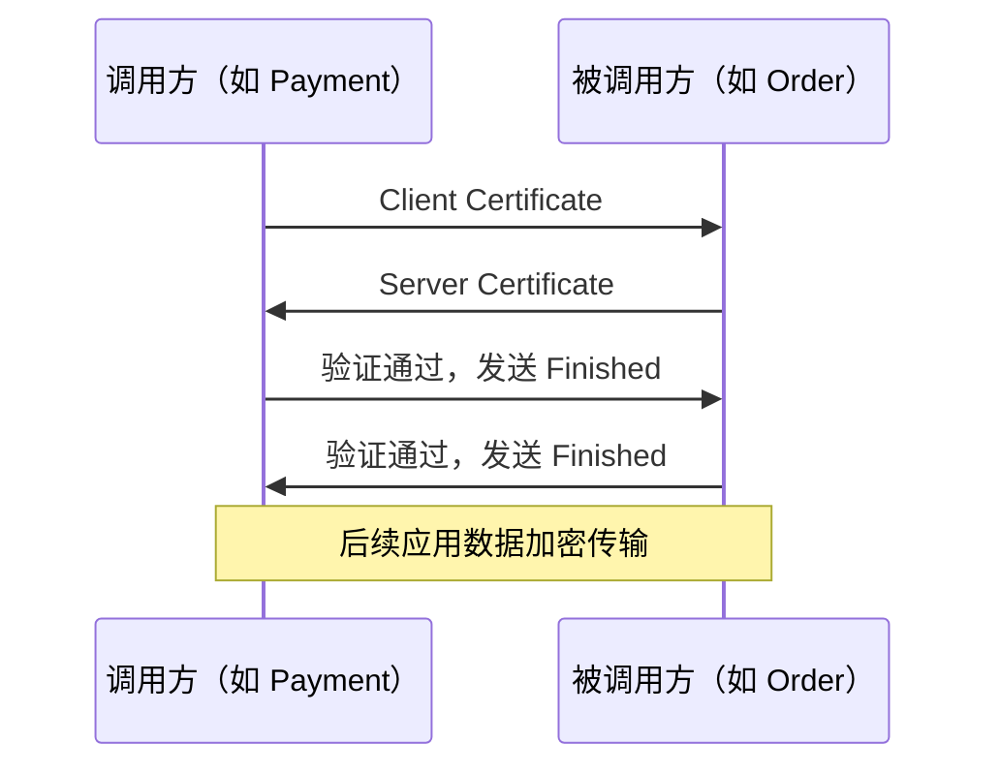
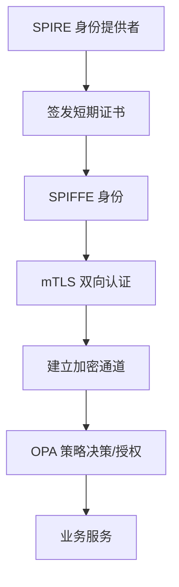

> **本章目标**
>
> 阅读完本章后，应能够理解：
>
> * TLS 到底解决了什么问题。
> * TLS 1.3 为什么比 TLS 1.2 更快、更安全。
> * 一次 TLS 握手到底发生了什么。
> * 为什么 ECDHE 能实现 Forward Secrecy。
> * Session Resume 为什么能够极大降低 TLS 开销。
> * 为什么现代 CPU 上 AES-GCM 几乎不是性能瓶颈。
> * mTLS 如何建立双向身份认证。
> * 为什么零信任体系几乎全部建立在 mTLS 之上。
> * TLS 1.2 与 TLS 1.3 的性能差异根源。
> * 如何用 Wireshark 分析 TLS 1.3 握手。

---

## 7.1 为什么需要 TLS

很多人认为 TLS 的作用就是**加密数据**，这句话只说对了三分之一。TLS 实际上同时解决三个安全问题：

| 问题                 | 如果没有 TLS 会发生什么                 |
| -------------------- | -------------------------------------- |
| 机密性（Confidentiality） | 数据被窃听，敏感信息泄露               |
| 完整性（Integrity）       | 数据被篡改，交易金额、账号被修改       |
| 身份认证（Authentication）| 无法确认通信对象，可能遭遇中间人攻击   |

对于零信任架构而言，**身份认证**才是 TLS 最重要的能力。例如客户端访问 `https://bank.example.com`，真正需要关心的不仅是“通信有没有被别人看到”，更是“我连接的是不是真正的银行服务器”。如果攻击者能够伪造服务器证书，即使通道加密，所有数据仍会直接流入攻击者之手，毫无安全可言。

因此，TLS 的核心使命是：**先验证对方身份，再协商加密密钥，最后保护数据传输**。这和零信任“先验证，再授权，持续监测”的思想一脉相承。

---

## 7.2 没有 TLS 会发生什么

假设一个内部服务间调用基于明文 HTTP：



攻击者可以实施：

- **窃听**：获取敏感业务数据、认证令牌、cookie 等。
- **篡改**：修改转账金额、更改订单状态、注入恶意命令。
- **会话劫持**：复用合法客户端的 session，冒充用户操作。
- **拒绝服务**：伪造 RST 包中断连接。

由于 HTTP 本身没有任何内建的加密与身份验证机制，所有流量都可以被沿途任何网络设备或恶意节点轻易读取和修改。这正是零信任必须杜绝的“隐式信任”。

---

## 7.3 TLS 到底提供了什么

TLS 可以看作在 TCP 之上插入的一个安全层：

```
TCP → TLS → 应用协议（HTTP/2、gRPC、MySQL 等）
```

这一层负责四项任务：

1. **身份认证**：通过证书链验证对端身份。
2. **密钥协商**：在不安全的信道上安全地生成共享加密密钥。
3. **数据加密**：使用对称加密算法（如 AES-GCM）保护数据机密性。
4. **完整性校验**：使用消息认证码（MAC）或 AEAD 模式防止数据篡改。

因此，不仅 HTTP，几乎所有需要安全通信的协议——gRPC、MySQL、Redis、Kafka——都可以运行在 TLS 之上，获得相同的安全保障。

---

## 7.4 TLS 的生命周期

一次 TLS 连接并非瞬间完成，而是经历一个严格的阶段化握手过程：



下面我们详细拆解每一个步骤。

---

## 7.5 ClientHello

客户端首先发送 ClientHello 消息，内容包含：

- **支持的 TLS 版本**：如 TLS 1.3、TLS 1.2。
- **随机数**：客户端生成的 32 字节随机数，用于后续密钥派生。
- **密码套件列表**：客户端支持的对称加密、密钥交换和哈希算法组合，例如 `TLS_AES_128_GCM_SHA256`。
- **扩展字段**：包括服务器名称指示（SNI）、支持的椭圆曲线组（如 `x25519`）、ALPN（应用层协议协商，如 `h2`、`http/1.1`）等。

示例：
```
TLS 1.3
Cipher Suite: TLS_AES_128_GCM_SHA256
Key Share: x25519
SNI: bank.example.com
ALPN: h2
```

服务端根据这些信息选择双方都支持的最优算法组合。

---

## 7.6 ServerHello

服务器回复 ServerHello，确定本次连接采用的参数：

- **服务器随机数**：另一个 32 字节随机数，参与后续密钥派生。
- **选择的密码套件**：必须与客户端列表兼容。
- **选择的密钥交换算法**：如 `x25519`。
- **扩展**：包含服务端密钥共享参数等。

至此，双方还未生成共享密钥，但已就算法达成一致。接下来的步骤将完成身份证明和密钥协商。

---

## 7.7 Certificate

服务器立即发送自己的证书链。证书中包含：

- **主题（CN/SAN）**：如 `bank.example.com`。
- **签发者（Issuer）**：中间 CA 的信息。
- **有效期**：`Not Before` 和 `Not After`。
- **公钥**：用于验证签名和密钥交换。
- **数字签名**：由上层 CA 使用其私钥生成。

客户端需要对证书进行严格校验：

1. **有效期检查**：当前时间是否在证书有效期内。
2. **域名匹配**：访问的域名必须与证书的 CN 或 SAN 中的一项一致。
3. **签名验证**：使用签发 CA 的公钥验证证书签名，确保证书未被篡改。
4. **证书链验证**：逐级向上验证，直到到达客户端信任的 Root CA。形成：

   ```
   Leaf Certificate（服务器）
       ↓ 签名
   Intermediate CA
       ↓ 签名
   Root CA（信任锚）
   ```

只有全部验证通过，客户端才确认服务器的身份。

---

## 7.8 Key Exchange

这是 TLS 握手最核心的环节，也是 TLS 1.3 比 1.2 安全提升的关键。旧版 TLS 常使用 RSA 密钥交换：客户端生成预主密钥，用服务器公钥加密后发送，服务器用私钥解密。这种方式有一个致命缺陷：**服务器私钥一旦未来泄露，所有历史会话均可解密**，即没有前向保密（Forward Secrecy）。

TLS 1.3 彻底废弃了 RSA 密钥交换，强制使用基于椭圆曲线的 **ECDHE**（Elliptic Curve Diffie-Hellman Ephemeral）。其工作过程如下：

- 客户端和服务器各自生成临时（ephemeral）的椭圆曲线密钥对：`private_a / public_a` 和 `private_b / public_b`。
- 双方交换公钥（在 ClientHello 和 ServerHello 的扩展中提前完成）。
- 各自利用自己的私钥和对方的公钥，通过 ECDH 算法计算出相同的 **共享密钥**（Shared Secret）。

这个过程的安全性依赖于椭圆曲线离散对数难题，即使攻击者截获了所有公钥，也无法计算出共享密钥。而且每次连接生成的密钥对都是随机的、临时的，用完即丢弃，**真正的私钥从未在网络上传输或离开本机**。

这种“每次连接独立密钥”的特性称为 **Ephemeral**，是前向保密的基础。

---

## 7.9 Forward Secrecy

前向保密意味着：即使将来某一天服务器的长期私钥（用于证书签名）泄露，攻击者也无法解密过去录制的 TLS 会话。因为在密钥交换时使用的是临时 ECDHE 密钥，该临时私钥在会话结束后就被销毁，服务器自身也无法恢复。所以历史通信数据天然安全。

金融、医疗等监管严格的行业，无一例外都要求开启前向保密，这也是 TLS 1.3 成为强制性标准的根本原因。

---

## 7.10 AES-GCM 为什么这么快

很多人以为 TLS 加密会很慢，其实真正的性能瓶颈在于**握手阶段**，而非数据加密阶段。现代处理器（Intel、AMD、ARM）几乎都内置了 **AES-NI** 指令集，能在硬件级别直接完成 AES 加密操作，吞吐量可达每秒数十 GB。

AES-GCM 作为认证加密（AEAD）算法，不仅提供加密，还同时提供完整性校验，而且得益于硬件加速，其 CPU 开销极低。在生产环境中，对于持续的长连接，加密本身往往只占整体延迟和 CPU 消耗的极小部分，远低于序列化、业务逻辑、网络转发等环节。

因此，只要合理使用长连接和会话复用，TLS 不会成为系统性能的短板。

---

## 7.11 Session Resume

为了降低重复握手的开销，TLS 提供了会话恢复机制。TLS 1.2 中可以使用 Session ID 或 Session Ticket，TLS 1.3 则进一步改进，支持 **PSK（Pre-Shared Key）模式** 和 **0-RTT 数据**。

- 第一次握手时，服务器可发送一个加密的 Session Ticket，内含主密钥和会话参数。
- 后续连接时，客户端在 ClientHello 中携带该 Ticket，服务器解密后直接恢复共享密钥，跳过完整的证书验证和密钥交换，大幅减少握手开销（通常只需 1-RTT 甚至 0-RTT）。

但是，0-RTT 数据**不具有前向保密**，而且容易受到重放攻击（Replay Attack）：攻击者截获 0-RTT 数据包后，可以重新发送给服务器，导致副作用重复执行（例如重复下单）。因此，对于金融交易等幂等性敏感的接口，一般**不启用 0-RTT**，需在安全与性能间谨慎权衡。

---

## 7.12 为什么需要 mTLS

普通 TLS 仅验证服务器身份（单向认证），客户端不提供证书。在互联网场景下，这已经足够，因为用户通常不需要向网站证明自己是谁，而是通过后续的登录认证。

但在微服务环境下，**服务间的调用者身份至关重要**。Payment 服务调用 Order 服务时，Order 必须确认“请求者确实是 Payment 服务，而不是某个被入侵的测试 Pod 或恶意进程”。这就需要 **mTLS（双向 TLS）**。

mTLS 要求双方都出示证书：



双方都通过证书链验证对端身份，然后才建立加密通道。因此，mTLS 的核心价值不是“双向加密”（那只是对称加密的特性），而是**双向身份认证**。在零信任架构中，服务间每一次通信都必须经过这种强身份绑定，才谈得上基于身份的细粒度授权。

---

## 7.13 mTLS 在零信任中的位置

完整的零信任服务间通信流程可概括为：



许多人误以为零信任就是“先授权，再加密”，但实际上现代 Service Mesh 中的顺序是：**先通过 SPIFFE 身份获取证书，执行 mTLS 建立身份可信的加密通道，然后才执行授权策略**。因为授权策略经常依赖于请求的身份（如 SPIFFE ID），没有 mTLS 传输身份信息，细粒度的 AuthorizationPolicy 根本无法生效。

---

## 7.14 TLS 1.2 与 TLS 1.3 为什么性能差距这么大

TLS 1.3 相比 1.2 在性能上实现了质的飞跃，根源在于以下几项设计变革：

- **简化握手往返（RTT）**  
  TLS 1.2 完整握手需要 2-RTT（4 个消息来回），而 TLS 1.3 将 ClientHello 与密钥共享合并，服务器可立即计算共享密钥，握手仅需 1-RTT，延迟直接减半。

- **废弃不安全的密钥交换和加密算法**  
  去除了 RSA 密钥交换、静态 DH、CBC 模式加密、SHA-1 等，强制使用具备前向保密的 ECDHE，以及 AEAD（如 AES-GCM、ChaCha20-Poly1305）作为唯一加密模式，减少了协商复杂度，且 AEAD 硬件效率更高。

- **精简密码套件**  
  TLS 1.2 的密码套件组合繁多，协商容易出错。TLS 1.3 仅保留少数高强度套件，协商过程几乎瞬时完成。

- **更快的密钥派生函数（HKDF）**  
  基于 HMAC 的密钥派生函数取代了旧的 PRF，性能更优，且设计更简洁。

- **0-RTT 模式**  
  对于先前连接过的服务器，客户端可以在第一个包中就携带应用数据，进一步减少延迟（虽然需要防重放攻击）。

综合这些优化，TLS 1.3 不仅在安全上更可靠，而且在绝大多数场景下比 TLS 1.2 更快。

---

## 7.15 TLS 为什么不是零信任的性能瓶颈

许多团队担心全量启用 mTLS 会拖垮系统，实际测试和生产数据表明，性能瓶颈通常并不在 TLS 本身：

- **TLS 握手开销可通过会话复用降低**：大规模微服务间普遍使用长连接和 gRPC 多路复用，握手频率极低，绝大部分请求直接复用现有安全通道，握手开销可忽略。
- **AES-GCM 硬件加速**：如前述，现代 CPU 的 AES-NI 使得对称加密速率可达线速，加解密延迟在微秒级。
- **HTTP/2 和 gRPC 的复用能力**：单一 TLS 连接可承载大量并发请求，降低了连接数，进一步摊薄握手成本。
- **真正的瓶颈**：往往在 Sidecar 代理的请求处理、序列化/反序列化、策略评估（OPA/Rego）、遥测数据上报、日志写入等环节，而非 TLS 加密。Service Mesh 控制平面的策略下发延迟和代理自身的路由计算才是更需要优化的地方。

因此，正确的结论是：**在合理配置长连接和会话复用的前提下，mTLS 引入的性能增量非常有限，不应成为拒绝零信任的理由**。

---

## 7.16 Wireshark 抓包分析一次 TLS 1.3 握手

对于架构师和运维工程师来说，掌握 Wireshark 分析 TLS 握手的能力，可以快速定位证书错误、协议不匹配、性能卡顿等问题。以下是一次典型的 TLS 1.3 握手抓包展示：

1. **ClientHello**  
   - 包含 SNI、支持的密码套件（如 `TLS_AES_128_GCM_SHA256`）、`key_share` 扩展（携带客户端 ECDHE 公钥）、ALPN 等。
   - Wireshark 可展开 `Handshake Protocol: ClientHello`，查看所有扩展字段。

2. **ServerHello**  
   - 服务器选定的密码套件、`key_share` 扩展（携带服务端 ECDHE 公钥）。
   - 此时 Wireshark 会显示 `Handshake Protocol: ServerHello`，并提示“TLS 1.3”。

3. **Encrypted Extensions**  
   - 此后所有握手消息均被加密（在客户端已知共享密钥后）。Wireshark 会标注为 `Application Data`，但实际内层为 `Encrypted Extensions`、`Certificate` 等。

4. **Certificate**  
   - 服务器证书链（加密负载内部），Wireshark 需要解密才能查看详细内容（可导入服务端私钥或使用 SSLKEYLOGFILE）。

5. **CertificateVerify**  
   - 服务器用证书对应的私钥对握手数据进行签名，证明证书持有权。

6. **Finished**  
   - 双方各自发送 Finished 消息，包含握手信息的 MAC，验证整个握手未被篡改。

7. **Application Data**  
   - 握手完成，后续负载均为加密的应用数据。

通过 Wireshark 的流跟踪和 SSL 解密功能，能够逐包理解 SNI、密钥共享、加密扩展、证书链验证的完整过程。这一技能在生产环境排查 mTLS 证书过期、信任链不匹配、协议协商失败等问题时尤其宝贵，是云原生架构师必备的底层分析能力。

---

## 本章总结

TLS 和 mTLS 是零信任通信安全的基石。从密码学角度看，现代 TLS 1.3 通过 ECDHE 密钥交换实现了前向保密，结合 AES-GCM 硬件加速提供了高性能加密通道；从身份角度看，双向证书认证使得服务间调用具备了强身份语义，这是所有动态授权的前提。

在云原生零信任体系中，mTLS 不是孤立的安全特性，而是与 SPIFFE 身份、SPIRE 自动证书管理、Service Mesh 数据平面深度集成的底层机制。只有深入理解 TLS 握手、证书链验证、密钥交换和性能优化要点，架构师才能设计出既安全又高效的零信任通信基础设施。从下一章开始，我们将进入生产实践层面，探讨如何在实际 Kubernetes 环境中落地这些技术。