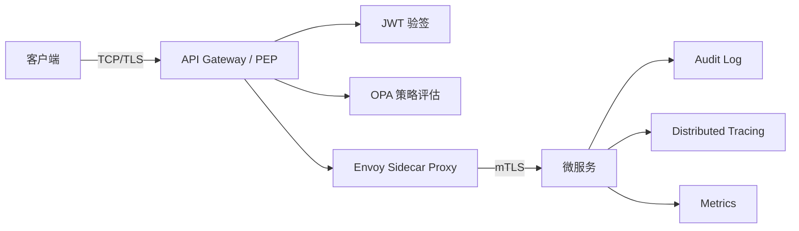
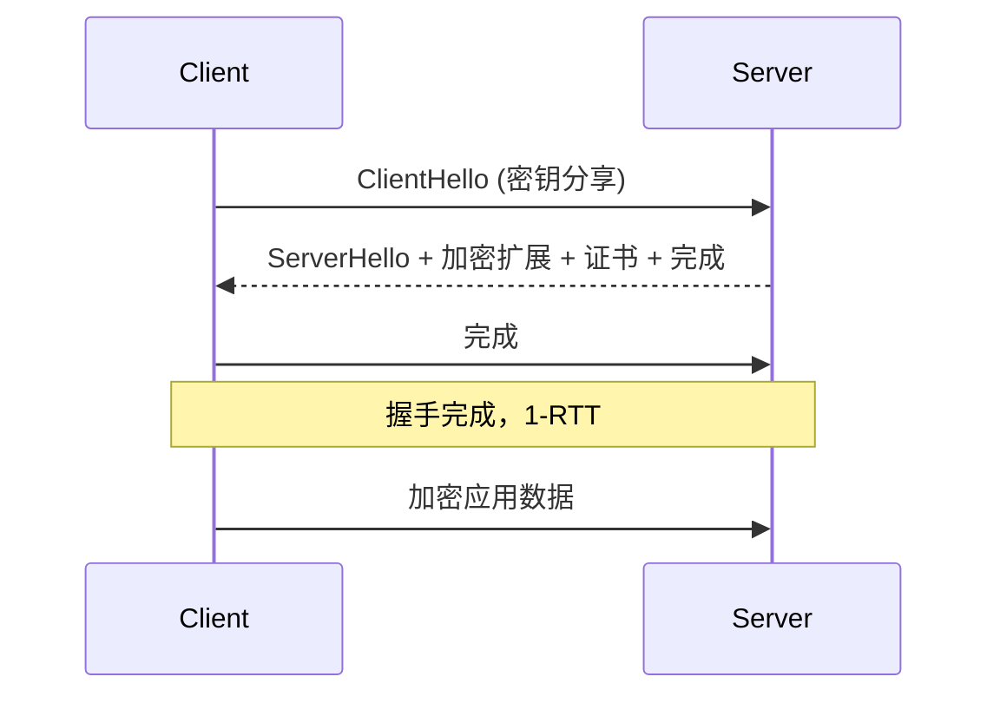
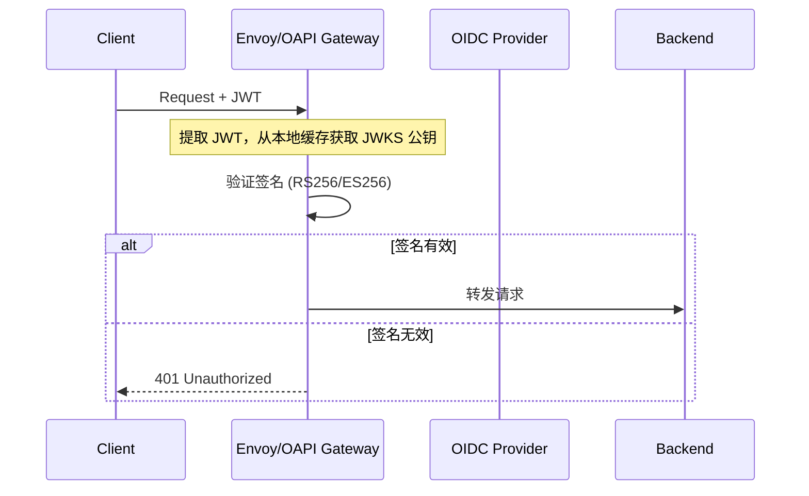
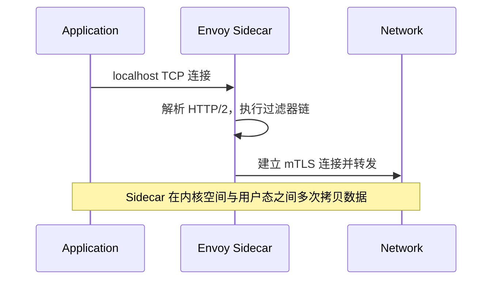
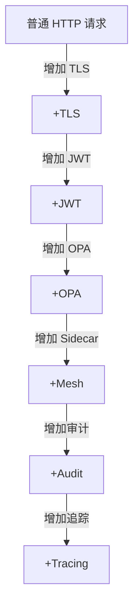

> **本章目标**
>
> 阅读完本章后，应能够理解：
>
> * 为什么“零信任性能差”这一观点并不准确，真正的性能开销来自哪些组件
> * 一次完整零信任请求的性能成本分别来自 TLS、JWT 验证、Policy Engine、Service Mesh、Audit、Tracing 等环节
> * TLS 1.3 握手、Session Resume、mTLS 双向认证分别会增加多少延迟，哪些开销只发生一次，哪些发生在每个请求
> * JWT 本地验签、远程 Introspection、OIDC 登录等不同身份验证方式的性能差异
> * OPA/Rego 策略计算的典型耗时，为什么策略复杂度会直接影响请求延迟
> * Service Mesh Sidecar、Ambient Mesh、Node Proxy 等不同架构的性能差异及其产生原因
> * Audit Log、Distributed Tracing、Metrics 等可观测性组件分别带来的 CPU、内存、网络及存储开销
> * CPU Cache、NUMA、上下文切换、系统调用等底层因素如何影响高并发场景下的零信任性能
> * Connection Pool、HTTP Keep-Alive、HTTP/2、HTTP/3(QUIC)、连接复用等优化技术如何降低认证与加密带来的额外成本
> * 如何区分一次性成本(Handshake、Certificate Validation)与持续性成本(加解密、策略计算、日志记录)
> * 如何对零信任架构进行性能测试、容量规划和性能调优，避免过度优化或错误归因
> * 一个生产级零信任调用链在启用身份认证、mTLS、Policy Engine、Service Mesh、Audit、Tracing 后，整体增加多少延迟、CPU 使用率和资源消耗，以及这些开销在现代硬件上的实际影响

---

## 10.1 引言：零信任的性能误区

“零信任”常被贴上“性能杀手”的标签。批评者认为引入额外加密、认证、授权和审计会不可接受地拖慢应用。这种担忧源自对现代网络协议、硬件加速和软件优化缺乏系统认知。

实际上，**零信任导致的性能开销高度可控**。现代 CPU 的单次 TLS 对称加密仅需微秒级，JWT 本地验签使用 RSA 或 ECDSA 也仅数十至数百微秒；策略引擎经过编译和优化后可实现亚毫秒级决策；服务网格 Sidecar 的转发延迟在合理配置下通常小于一毫秒。真正拖慢系统的是**缺乏连接复用、频繁的 TLS 握手、未优化的策略查询、过量的审计日志同步写入**等反模式。

本章将从操作系统网络栈、密码学计算、策略评估引擎到底层硬件微架构，逐一拆解零信任请求链路上的性能成本，并给出量化参考数据和优化策略。

---

## 10.2 请求路径上的性能开销全景

一个标准的零信任 API 请求，从客户端发出到服务端业务逻辑处理完毕，中间经过多个安全组件：

每个节点都会叠加计算和延迟。可以将开销分类为：

- **一次性开销**：TCP 三次握手、TLS 握手、mTLS 证书验证、策略编译等，仅在连接建立或首次请求时发生。
- **持续性开销**：对称加解密、JWT 验签、策略评估、Sidecar 转发、审计日志记录、追踪采样，通常每个请求都会发生。

理解这两类开销是性能优化的前提——我们应当尽可能将成本转移到一次性阶段，并通过连接复用、会话缓存、HTTP/2 多路复用等手段摊薄持续性开销。

---

## 10.3 TLS 与 mTLS 握手开销

### 10.3.1 TLS 1.3 握手

TLS 1.3 将握手精简为 1-RTT（往返时间），相比 TLS 1.2 的 2-RTT 有显著提升。其流程如下：

1-RTT 握手增加的延迟主要取决于网络往返时间。在局域网(<1ms RTT)中几乎不可感知；跨区域(30ms RTT)约为 30ms；全球范围(200ms RTT)则需约 200ms。CPU 成本集中在非对称密钥交换（ECDHE）和证书签名验证，通常耗时 0.5～2ms（现代服务器 CPU）。

### 10.3.2 会话恢复（Session Resumption）

为减少后续连接的握手成本，TLS 支持两种恢复机制：

- **Session ID**：服务端缓存会话参数，客户端在 `ClientHello` 中携带 ID，命中后可直接跳过证书交换和密钥协商，恢复为 1-RTT（仍需一次往返），但服务端需维护状态。
- **Session Ticket (RFC 5077)**：服务端将会话状态加密为 ticket 发给客户端，客户端下次连接时发送 ticket，服务器解密恢复会话，同样 1-RTT。

更激进的是 **0-RTT**（TLS 1.3 早期数据）：客户端可以在首次 `ClientHello` 中携带“预共享密钥”并直接发送应用数据，达到 0-RTT 恢复。但 0-RTT 数据缺乏前向安全性且可能被重放，需应用层配合。

会话恢复将 TLS 握手的 CPU 和延迟成本从每个连接降为每个会话生命周期的首连接，极大改善高并发短连接场景（如 HTTP/1.1 非 Keep-Alive）。

### 10.3.3 mTLS 双向认证

零信任环境中，服务间通信通常要求双向 TLS（mTLS），即双方均出示证书并验证对方身份。这会在标准 TLS 握手基础上增加以下开销：

- 客户端额外发送 `Certificate` 和 `CertificateVerify` 消息，增加一次网络交互（TLS 1.3 中已融入单次往返，无明显额外 RTT）。
- 服务端必须验证客户端证书链，CPU 成本与验证服务端证书相当。
- 证书吊销检查（OCSP stapling 或 CRL）可能引入额外延迟，但通常异步完成或由 Sidecar 代理。

mTLS 的额外 CPU 开销同样属于一次性成本。对于长连接或连接池复用，其影响被大幅摊薄。

### 10.3.4 加解密持续性开销

TLS 握手完成后，后续数据均使用对称加密（AES-GCM 或 ChaCha20-Poly1305）和消息认证。现代 CPU 普遍支持 AES-NI 指令集，加密 1KB 数据仅需不到 1 微秒。ChaCha20 在无 AES 加速的移动或嵌入式设备上表现更优。因此，**对称加密的持续性 CPU 开销极低**，通常小于请求总延迟的 0.1%。

---

## 10.4 JWT 身份验证性能

### 10.4.1 本地验签

最常见的高性能模式：API Gateway 或 Sidecar 直接使用本地缓存的公钥对 JWT 签名进行验证。

验签耗时取决于算法：
- **RS256 (RSA 2048)**：单次验签约 100～300 微秒（受 CPU 频率、RSA 库优化影响）。
- **ES256 (ECDSA P-256)**：约 50～150 微秒，密钥更短，计算更快，推荐用于高性能场景。
- **EdDSA**：类似或优于 ECDSA。

每次请求均需执行验签，属于持续性开销。可以通过缓存解码后的 JWT Claims 并与验签结果关联，避免重复解析（需注意缓存失效与安全风险）。

### 10.4.2 远程 Introspection

某些场景下，API Gateway 不直接持有 JWT 公钥，而是将令牌发送给授权服务器进行验证（OAuth 2.0 Token Introspection）。这会引入网络往返延迟，通常比本地验签高出一个数量级，并增加授权服务器的负载。仅在令牌为不透明格式或需要实时检查吊销状态时使用，且应开启结果缓存。

### 10.4.3 OIDC 登录

用户初次认证时的 OIDC 流程包括多次浏览器重定向和令牌交换，耗时数百毫秒到数秒，但仅发生在登录阶段，不影响后续 API 调用的稳态性能。

---

## 10.5 策略引擎 (OPA) 性能分析

OPA 决策过程分为策略编译和查询执行两个阶段。策略编译在加载时完成，将 Rego 规则编译为内部中间表示；运行时只需执行查询计划，因此效率较高。

### 10.5.1 Rego 评估成本

典型的 OPA 本地库调用（Go 语言集成）执行一次简单 RBAC 检查（如检查角色是否在白名单）约 20～80 微秒。包含多层嵌套对象遍历、正则匹配或多次 `in` 集合操作的复杂策略，可能需要 200 微秒到 2 毫秒。影响延迟的关键因素有：

- **输入 JSON 大小**：输入体积过大导致序列化和内存拷贝开销。
- **策略复杂度**：迭代、递归、大量 `some` 声明等。
- **内置函数调用**：如 `io.jwt.verify_rs256` 等密码学操作，会显著增加耗时。
- **外部数据引用**：通过 `http.send` 调用外部 PIP 获取属性，网络延迟可能占据主导。

### 10.5.2 OPA 性能优化

- **精简输入**：仅将决策所需字段传递给 OPA，避免全量请求体。
- **简化策略**：避免在 Rego 中进行高成本运算，可将数据预处理后注入。
- **缓存决策**：对于纯基于输入且无时效性要求的决策，可在应用或 PEP 侧缓存结果（需实现失效机制）。
- **部署模式**：使用 OPA 作为 Sidecar 或 DaemonSet，决策通过本地 Unix Socket 或 HTTP `localhost` 通信，避免网络开销。

---

## 10.6 服务网格 Sidecar 性能

零信任架构中，服务网格 Sidecar（如 Envoy）负责透明拦截并转发流量，同时执行 mTLS、鉴权、遥测采集等。其数据路径延迟是重要的持续性开销来源。

### 10.6.1 Sidecar 转发流程

典型延迟增量：**0.2～1 毫秒**（P99 可能达到数毫秒）。开销来源包括：
- 用户态网络栈处理（Envoy 使用用户态 TCP）。
- 请求在 Sidecar 与应用间的上下文切换和 Socket 通信。
- 遥测数据（日志、指标、追踪）的生成和缓冲。

### 10.6.2 Sidecar vs Ambient Mesh vs Node Proxy

三种服务网格数据面架构的性能差异：

| 架构           | 说明                                      | 延迟增量            | 资源开销        |
| -------------- | ----------------------------------------- | ------------------- | --------------- |
| **Sidecar**    | 每个 Pod 一个代理，与应用紧耦合           | 0.2～1ms            | 较高(独立 CPU/内存) |
| **Ambient**    | 节点级零信任代理 + Waypoint 代理（可选）   | 更低（免除额外跳转）| 较低            |
| **Node Proxy** | 每个节点一个代理，所有 Pod 共享            | 0.1～0.5ms          | 低(共享代理)    |

Ambient Mesh 将 L4 安全（mTLS）下沉到节点内核（eBPF 或节点代理），L7 策略交由轻量 Waypoint 处理，理论上延迟和资源消耗均优于 Sidecar 模式，但生态尚在发展中。

---

## 10.7 可观测性开销

零信任要求全面的审计和监控，带来额外计算和 I/O 压力。

### 10.7.1 审计日志

每次请求写入审计事件（谁、什么操作、结果、时间等）。同步写入磁盘或远程采集器会直接增加请求延迟（数毫秒）。生产环境普遍采用异步缓冲写入（如内存环形缓冲区 + 批量刷盘），将延迟增量降低至微秒级，但可能丢失缓冲区未刷盘时的少量日志。网络发送到集中日志系统时，批量压缩传输可降低带宽消耗。

### 10.7.2 分布式追踪

注入 Trace Context 头，并在每层生成 Span 数据。Span 的创建、标记、最终上报通常只增加 **数十微秒** 延迟，且大多采用采样（如 1% 或自适应采样），对整体性能影响极小。若全量采样，Span 序列化和网络上报会消耗额外 CPU 和带宽。

### 10.7.3 指标 (Metrics)

Prometheus 式的指标采集通常基于内存计数器（原子操作），几乎无延迟开销。指标拉取由独立端点异步完成，不影响请求路径。但开启大量详细指标（如每个 URL 独立计数）会导致内存膨胀和抓取耗时。

---

## 10.8 性能预算 (Performance Budget)

性能预算是连接安全需求与系统容量的关键工具。它为每个安全组件分配允许的延迟和资源消耗上限，指导架构选型和优化。

### 10.8.1 组件级开销基准

基于现代 x86 服务器（3GHz+，AES-NI，NUMA 优化）和典型云原生网络环境，各组件的参考成本如下：

| 组件                   | 延迟增加                | CPU 开销   | 内存开销 | 是否每请求发生       |
| ---------------------- | ----------------------- | ---------- | -------- | -------------------- |
| TCP 建连               | 1 RTT                   | 低         | 低       | 否(连接复用后)       |
| TLS 1.3 握手           | 1 RTT (首次)            | 中(1～2ms) | 低       | 否                   |
| mTLS 证书验证          | 数十～数百微秒 (首次)   | 中         | 低       | 否                   |
| JWT RS256 本地验签     | 100～300 微秒           | 中         | 极低     | 是                   |
| JWT ES256 本地验签     | 50～150 微秒            | 中         | 极低     | 是                   |
| OPA 简单策略           | 20～80 微秒             | 低         | 低       | 是                   |
| OPA 复杂策略           | 200～2000 微秒          | 中         | 中       | 是                   |
| Envoy Sidecar 转发     | 200～1000 微秒          | 中         | 中(per pod) | 是                 |
| 审计日志异步           | < 10 微秒 (摊销)        | 低         | 低       | 是                   |
| 审计日志同步           | 1～10 毫秒              | 中         | 低       | 是                   |
| 分布式追踪（采样 1%）  | 摊销 < 1 微秒           | 极低       | 极低     | 采样时发生           |

### 10.8.2 累加性能预算

从最基本的 HTTP 请求开始，逐步叠加安全组件，可以构建出架构演进的性能视图。以下数据以单次请求在典型数据中心内（RTT<1ms）的 P50 延迟增量为参考：

对应的累计延迟和 CPU 成本估算表：

| 架构阶段                      | 累计延迟增加 (参考) | 相对 CPU 增加 | 典型适用场景               |
| ----------------------------- | ------------------- | ------------- | -------------------------- |
| 普通 REST (HTTP/1.1)          | Baseline            | 1x            | 内网单体、非敏感           |
| + TLS (HTTP/2)                | +0.1～0.3 ms        | +5～10%       | 基础传输加密               |
| + JWT 本地验签 (ES256)        | +0.15～0.3 ms       | +5～10%       | API 身份认证                |
| + OPA 简单策略                | +0.05～0.1 ms       | +2～5%        | 统一授权                   |
| + Service Mesh Sidecar        | +0.3～1.0 ms        | +10～20%      | 微服务零信任               |
| + 异步审计日志                | +0.01 ms            | +2～5%        | 合规审计                   |
| + 分布式追踪（1% 采样）       | ~0 ms (摊销)        | <1%           | 可观测性                   |

**综合**：全栈零信任（TLS+mTLS+JWT+OPA+Mesh+审计+追踪）带来的**额外延迟约 0.6～1.8 毫秒**（P50），P99 可能因 GC、网络抖动达到 3～5 毫秒。CPU 总开销通常增加 30%～50%，但大部分被分摊到各个组件，且可通过横向扩展应对。

> **注意**：上述数值高度依赖硬件、网络、策略复杂度和具体实现。务必进行内部基准测试。

---

## 10.9 优化策略与摊销技术

零信任的性能开销并非不可削减。以下优化实践可显著降低持续成本：

- **连接复用与多路复用**：使用 HTTP/2 或 HTTP/3 (QUIC) 的多路复用减少 TLS 握手次数。连接池（如 Istio 的 `connectionPool`）避免频繁建立连接。
- **TLS 会话恢复与 0-RTT**：开启 Session Ticket 或 0-RTT，将握手成本从每条连接降为每个会话。
- **本地决策缓存**：对 JWT 验签结果或 OPA 决策进行短期缓存（TTL 秒级），注意缓存失效和密钥轮换。
- **异步批量日志**：审计日志采用异步缓冲、批量写入，避免阻塞请求线程。
- **协议优化**：HTTP/2 的头部压缩、流优先级可降低延迟；HTTP/3 (QUIC) 在弱网下减少队头阻塞，并集成 0-RTT。
- **内核与硬件调优**：开启网卡多队列、RPS/RFS、调整中断亲和性、使用 DPDK/XDP 加速 Sidecar 数据面（如 Cilium、eBPF-based 代理）。
- **NUMA 绑定**：将 Sidecar 进程与应用程序绑定到同一 NUMA 节点，减少跨节点内存访问和缓存未命中。
- **策略与规则瘦身**：定期审查 OPA 策略，移除冗余规则，减小输入 JSON，利用索引优化 Rego 查询。
- **采样追踪**：生产环境通常 0.1%～1% 采样已足够排查问题，避免全量追踪。

---

## 10.10 性能测试方法与容量规划

对零信任架构进行性能测试时，需注意：

1. **基准环境一致性**：在排除噪声的隔离环境中测试单一组件开销，如单独测试 JWT 验签或 OPA 决策延迟。
2. **模拟真实流量**：使用与生产接近的请求大小、并发数、连接模式（长连接/短连接）。
3. **阶梯叠加测试**：从裸服务开始，逐个添加 TLS、JWT、OPA、Mesh，记录延迟分布和 CPU 使用率的变化，绘制如第 10.8 节所示的累计曲线。
4. **区分冷启动与稳态**：JIT 编译、策略加载、连接池预热会影响前几分钟的延迟，测试需包含预热阶段。
5. **全链路压力测试**：使用工具如 wrk2, vegeta, k6，并结合服务网格的遥测数据，观察 P99 延迟和错误率。
6. **资源监控**：同时监控 CPU 缓存命中率、上下文切换率、网络中断、TCP 重传等底层指标，定位瓶颈。

容量规划时，需为每个安全组件预留合理的 CPU 余量。例如，若每个 Envoy Sidecar 消耗 0.2 核，则 100 个 Pod 需要预留 20 核。策略引擎（OPA）根据预期决策 QPS 和单次耗时计算所需副本数。

---

## 10.11 本章总结

零信任并不必然导致性能灾难。**将一次性成本与持续性成本分离，利用协议特性和系统级优化，可使全栈零信任的额外延迟控制在 1～2 毫秒内**，完全在大多数在线业务的容忍范围之内。通过引入性能预算机制，团队可以量化安全成本，做出有数据支撑的架构决策，而非基于恐惧拒绝安全增强。

在工程实践中，我们建议：
- 优先采用 ES256 等轻量级签名算法和 OPA 本地决策。
- 强制使用 HTTP/2 或 HTTP/3，并开启会话恢复和连接复用。
- 审计和追踪务必异步、采样、批量处理。
- 在服务网格选型上评估 Sidecar 与 Ambient 模式对工作负载的真实影响。
- 建立性能基线，将零信任组件的开销纳入持续集成测试，防止性能退化。

最终，一个正确实施的生产级零信任调用链，不仅能提供强大的安全边界，其性能表现也完全可以支撑高吞吐、低延迟的现代云原生应用。