> **本章目标**
>
> 阅读完本章后, 应能够理解:
>
> * 为什么零信任需要将授权逻辑从业务代码中解耦出来
> * Policy Engine 在整个访问控制体系中的定位与职责
> * PDP、PEP、PIP、PAP 四个核心组件如何协同完成一次授权决策
> * OPA(Open Policy Agent) 的工作原理及其在云原生中的应用方式
> * Rego 的设计思想及如何编写基础授权策略
> * 什么是 Policy as Code, 为什么策略也需要版本管理、代码评审和自动化测试
> * RBAC、ABAC、PBAC 三种授权模型的核心思想、优缺点及适用场景
> * 为什么现代企业通常采用"RBAC + ABAC + PBAC"组合而不是单一授权模型
> * Envoy、API Gateway、Kubernetes、OPA 如何共同完成一次统一授权决策
> * 为什么现代微服务架构推荐采用"业务负责业务, Policy Engine 负责授权"的设计理念
> * 如何构建符合零信任原则的统一策略中心(Policy Decision Plane), 实现集中决策、分布式执行的授权体系

身份认证(Authentication)解决的是:

> 你是谁?

权限控制(Authorization)解决的是:

> 你能做什么?

而 **Policy Engine(策略引擎)** 解决的是:

> 谁来决定“允许”还是“拒绝”?

在传统系统中，权限通常直接硬编码在应用代码中:

```go
if user.Role == "admin" {
    return true
}
if user.Department == "finance" {
    return true
}
if user.ID == order.OwnerID {
    return true
}
```

这种方式随着业务增长会出现明显问题:

* 权限逻辑散落在各个服务、各个模块中
* 难以统一管理和可视化
* 审计时需要人工翻阅代码，易出错
* 修改策略需要重新构建、测试、部署应用，周期长
* 微服务、多语言环境下策略无法复用和统一执行

零信任架构提倡:

> **业务负责处理业务，Policy Engine 负责做授权决策。**

通过将授权决策从业务代码中剥离，应用只需要向策略引擎发起查询：“这个请求是否被允许？”，而无需关心背后的策略逻辑、属性来源和规则组合。这从根本上解决了授权分散、不一致、难以审计的问题。

---

## 9.1 什么是 Policy Engine

Policy Engine 可以理解为一个专门用来计算访问决策的独立组件，其核心流程如下:

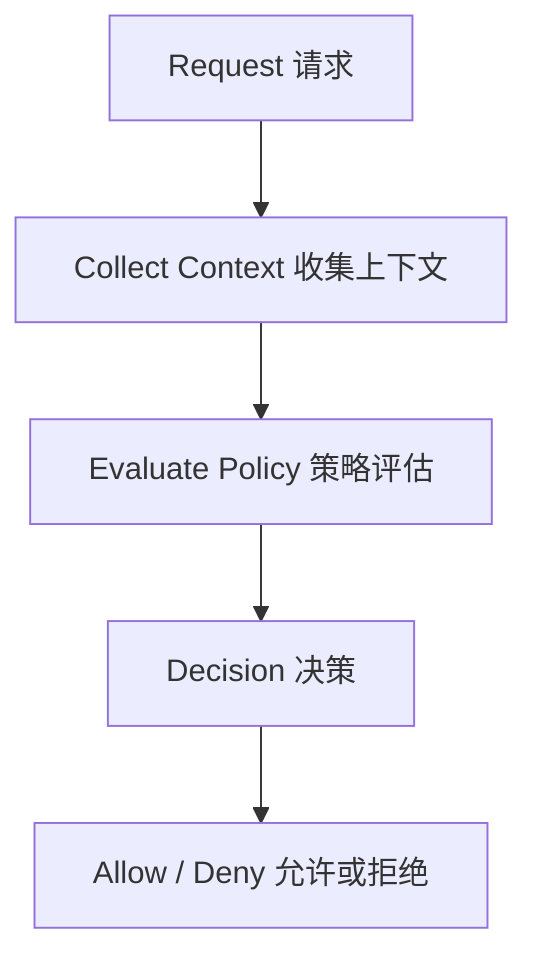

Policy Engine 不关心业务逻辑本身，它只负责回答一个确定的问题:

```
Should this request be allowed?
```

例如，当系统收到一个支付请求:

```
POST /payment
User = Alice
Role = Finance
Amount = 8000
Time = 22:30
IP = 10.0.0.12
```

这些信息将被封装为查询输入，发送给 Policy Engine。引擎根据已加载的策略计算出决策:

```
Allow = false
```

应用无需知道为什么被拒绝——可能因为金额超限、时间不在工作时段或 IP 不在允许范围内，所有这些逻辑都封装在策略内部。

---

## 9.2 为什么需要 Policy Engine

假设一个在线商城系统最初包含三个微服务，每个服务都在代码中自己编写权限判断:

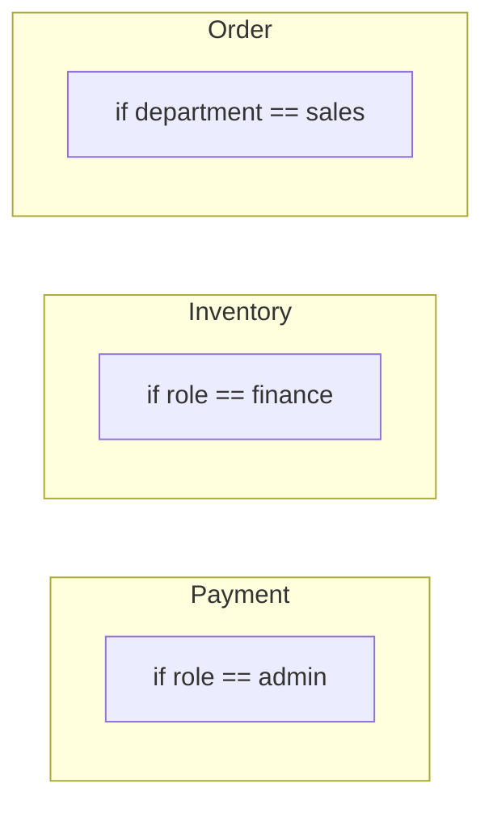

随着业务发展，微服务数量往往迅速膨胀到几十甚至上百个。一年之后，系统内将散布着成百上千处独立的授权逻辑。这会导致:

* **权限不一致**: 同一类用户在不同服务中拥有的权限可能完全不同，甚至互相矛盾。
* **无法统一修改**: 当公司安全策略变更时（如“财务人员不再允许在非工作时间发起付款”），必须逐个服务修改、测试、发布，效率极低。
* **难以审计**: 安全团队无法快速回答“谁在什么条件下可以访问支付接口？”，需要人工检查分散的代码和配置。
* **无法验证合规**: 在零信任环境下，要求所有访问都经过标准化决策点，硬编码方式无法满足。

现代架构通过引入策略引擎，将授权逻辑集中化:

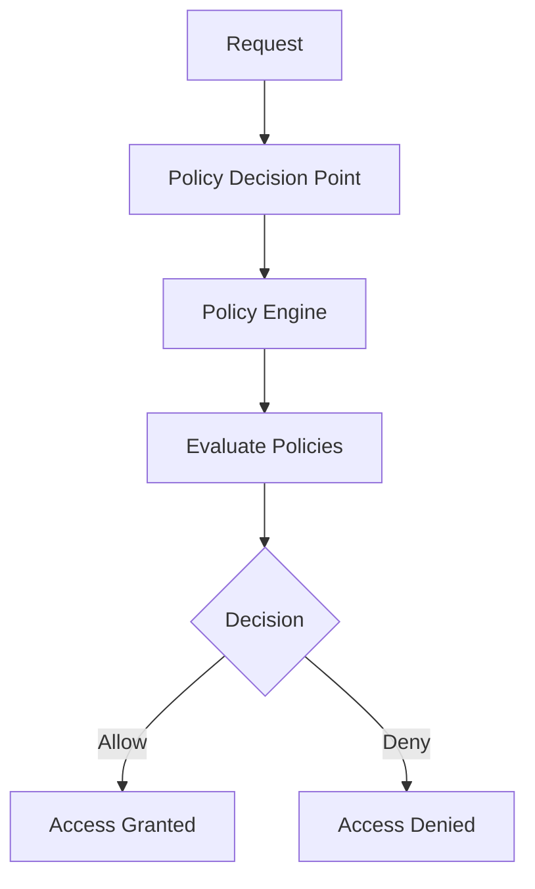

所有服务的授权决策都统一通过策略引擎完成，实现集中管理、统一审计和动态调整。

---

## 9.3 PDP、PEP、PIP、PAP

现代授权体系广泛采用 XACML(可扩展访问控制标记语言)提出的四组件模型。这些组件清晰地划分了策略执行、决策、信息获取和管理的职责。

### Policy Enforcement Point (PEP)

PEP 是策略执行点，负责在请求路径上拦截流量，但它**不做任何决策**。它只负责向 PDP 发起授权查询，并根据返回的决策强制放行或拒绝。

常见的 PEP 实现包括:

* API Gateway (如 Kong、APISIX)
* 服务网格 Sidecar Proxy (如 Envoy)
* Kubernetes Admission Controller
* 应用内拦截器或中间件

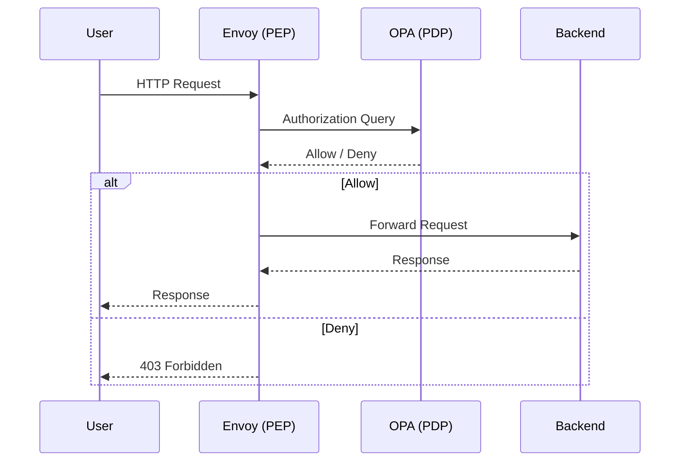

Envoy 作为 PEP，仅仅充当一个“执行者”，所有决策逻辑都在 OPA 中。

### Policy Decision Point (PDP)

PDP 是策略决策点，真正计算是否允许访问。它接收 PEP 发送的授权请求（通常包含主体、资源、操作及上下文属性），并根据已加载的策略给出 Allow/Deny 的决策。

主流 PDP 引擎:

* OPA (Open Policy Agent)
* Cedar (AWS 开源的策略引擎)
* 商业 XACML 引擎

```
Request → OPA → Decision
```

### Policy Information Point (PIP)

PIP 是策略信息点，负责提供决策所需的外部上下文信息。当 PDP 需要某个请求中未携带的属性时（例如用户的部门、项目组成员、设备风险评分等），它会从 PIP 获取。

常见 PIP 数据源:

* LDAP / Active Directory
* HR 系统或用户中心
* Kubernetes API
* CMDB (资产配置库)
* IAM 系统

```
Request → Need User Department → LDAP (PIP)
```

通过 PIP，策略可以基于丰富的、实时变化的上下文做出判断，而无需应用预先将这些信息全部塞入请求。

### Policy Administration Point (PAP)

PAP 是策略管理点，为管理员提供策略的创建、修改、版本化和分发能力。现代实践通常将策略作为代码 (Policy as Code) 存储在 Git 中，并通过 CI/CD 管道自动测试和分发至 PDP。

```
Git Repository → CI → OPA Bundle → Production PDP
```

通过 PAP，策略变更拥有完整的审计记录、代码审查和回滚能力。

---

## 9.4 OPA(Open Policy Agent)

OPA 是目前云原生生态中最流行的通用策略引擎，由 Styra 公司发起并贡献给 CNCF，已毕业成为 Graduated 项目。

OPA 的核心特点:

* **通用策略引擎**: 不绑定任何特定领域，可用于 API 授权、Kubernetes 准入控制、Terraform 策略检查、服务网格授权等。
* **Policy as Code**: 策略使用声明式语言 Rego 编写，可以像代码一样进行版本控制、测试和审查。
* **高性能决策**: OPA 将策略编译为内部查询计划，支持低延迟、高并发的授权决策。
* **与云原生深度集成**: 提供 OPA Gatekeeper (用于 Kubernetes)、Envoy External Authorization 插件、OPA Bundle API 等。
* **去中心化部署**: 可作为 Sidecar、DaemonSet 或独立服务运行，实现就近决策，降低延迟和中心依赖。

OPA 本身对业务领域一无所知，它不知道什么是用户、Pod、服务或 Namespace。它只负责一个纯粹的运算:

```
Input + Policy → Result
```

---

## 9.5 OPA 工作流程

在典型部署中，API Gateway 或 Sidecar 作为 PEP，将请求上下文封装为 JSON 发送给 OPA 进行决策。

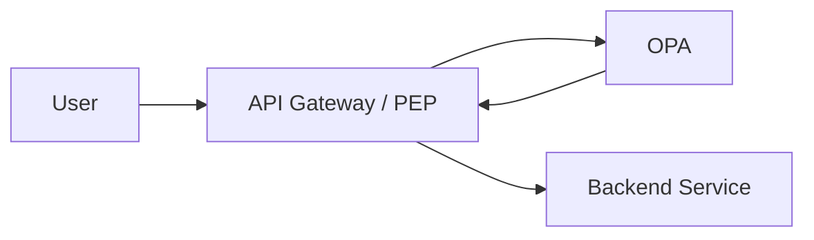

API Gateway 向 OPA 提交的查询:

```json
{
  "user": "alice",
  "role": "finance",
  "method": "POST",
  "path": "/payment",
  "amount": 500
}
```

OPA 根据已加载的 Rego 策略进行计算，返回明确的决策:

```json
{
    "allow": true
}
```

或:

```json
{
    "allow": false,
    "reason": "amount_exceeds_limit"
}
```

应用层无需理解策略细节，只需信任并执行 OPA 的决策。这种松耦合使得安全团队可以独立于业务团队演进安全策略。

---

## 9.6 Rego

Rego 是 OPA 专用的策略语言，其设计哲学是“以数据为中心”，专注于声明 **What** 而非 **How**。可以类比:

```
SQL 之于 Database
=
Rego 之于 OPA
```

Rego 不是一步一步描述如何验证权限，而是声明某个访问在满足什么条件时应该被允许。这种声明式特性使得策略非常简洁、可读，并且能够自动处理冲突和默认值。

---

## 9.7 Rego 基础语法

最简单的允许规则:

```rego
package authz

default allow = false

allow if {
    input.role == "admin"
}
```

当请求输入为:

```json
{
  "role": "admin"
}
```

结果:

```
allow = true
```

Rego 中的 `if` 规则体内部的多个条件以 `AND` 关系组合:

```rego
allow if {
    input.role == "finance"
    input.method == "POST"
}
```

若要实现 `OR` 逻辑，可以编写多条同名规则:

```rego
allow if {
    input.role == "admin"
}

allow if {
    input.role == "finance"
}
```

支持集合成员判断:

```rego
allow if {
    input.role in {"admin", "ops", "security"}
}
```

支持路径前缀匹配等内置函数:

```rego
allow if {
    startswith(input.path, "/api/payment")
}
```

通过组合这些基础元素，可以构建出非常灵活的策略，同时保持清晰的业务语义。

---

## 9.8 一个完整授权策略

基于微服务间访问控制的需求，要求：

* `finance` 服务可以访问 `payment` 接口 → Allow
* `order` 服务访问 `redis` 缓存 → Deny

OPA 接收的输入:

```json
{
  "source": "order",
  "destination": "redis"
}
```

对应的策略:

```rego
package service

default allow = false

allow if {
    input.source == "payment"
    input.destination == "inventory"
}

allow if {
    input.source == "payment"
    input.destination == "database"
}
```

对于请求 `payment → inventory`，策略匹配第一条规则，`allow` 为 `true`；而对于 `order → redis`，没有任何规则匹配，因此 `default allow = false` 生效，结果被拒绝。这直接体现了零信任中的 **Default Deny(默认拒绝)** 原则——凡是未被明确允许的访问，一律禁止。

---

## 9.9 Policy as Code

策略应该像应用代码一样被严格管理。通过 Policy as Code，策略的全生命周期可以纳入 GitOps 工作流:

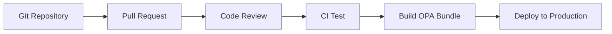

这种模式带来的优势包括:

* **版本控制**: 每一次策略变更都有明确的 commit 记录，可以轻松追溯和回滚。
* **协作审查**: 安全团队可以通过 Pull Request 对策略修改进行同行评审，避免人为错误。
* **自动化测试**: 可以在 CI 中运行 OPA 的单元测试 (`opa test`)，验证策略逻辑是否符合预期，策略变更不会破坏已有规则。
* **审计合规**: 使用 `git blame` 可以快速回答“谁在何时修改了哪条权限”，满足监管和审计要求。
* **一致分发**: 通过 OPA Bundle 机制，可将策略自动推送到所有 PDP 实例，确保环境中策略的一致性。

---

## 9.10 RBAC

RBAC (Role-Based Access Control) 基于角色进行授权。模型简洁明了:

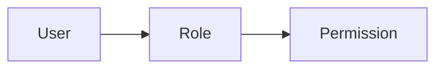

首先为用户分配一个或多个角色，然后为角色赋予相应的权限。例如:

| Role    | Permission   |
| ------- | ------------ |
| Admin   | * (所有操作) |
| Finance | Payment 相关 |
| Dev     | CI/CD 相关   |

优点:

* 概念简单，易于理解和实施
* 性能高，决策仅需查表或匹配角色
* 广泛被现有系统和框架支持

缺点:

当组织变得庞大时，角色数量可能急剧膨胀，形成“角色爆炸”。例如，财务部门可能衍生出:

```
Finance
Finance Manager
Finance Director
Finance Auditor
Finance ReadOnly
...
```

当角色过多，角色的维护、继承关系变得复杂，RBAC 的表达能力开始捉襟见肘。

---

## 9.11 ABAC

ABAC (Attribute-Based Access Control) 根据属性动态计算访问决策，属性可以来源于多个维度:

* **主体 (Subject)**: 部门、角色、职级、安全等级等
* **资源 (Resource)**: 类型、标签、所属项目、机密级别等
* **环境 (Environment)**: 访问时间、来源 IP、地理位置、设备状态等
* **操作 (Action)**: 读写、删除、部署等具体行为

一个 ABAC 策略可能组合多个属性:

```
Department = Finance
AND Time < 18:00
AND Amount < 10000
AND IP in Company_VPN
```

优点:

* 非常灵活，能表达复杂的安全需求
* 无需预先定义大量角色，策略可根据属性动态评估
* 适用于动态、细粒度的访问控制场景

缺点:

* 策略编写和理解成本较高
* 如果属性来源多且分散，需有效整合 PIP
* 策略冲突检测和综合分析难度增加

---

## 9.12 PBAC

PBAC (Policy-Based Access Control) 是一种更为宏观的授权理念:

> 所有访问决策由统一、可管理的策略决定，不限于单一模型。

在 PBAC 框架下，策略引擎可以综合使用角色、属性、环境风险评分、设备状态、身份认证强度、工作负载标识等多种维度进行决策。

```
Request → OPA → Rego Policies → Decision
```

策略中可以同时包含:

* RBAC 风格的角色检查
* ABAC 风格的属性判断
* 基于风险的自适应规则 (如异地登录要求 MFA)
* 基于资源的标签匹配

因此，PBAC 并不是与 RBAC、ABAC 并列的某种新算法，而是一个高层级的思想——由统一的策略引擎承载多种授权模型，实现可扩展、可演进的访问控制体系。大多数现代零信任架构最终都走向 PBAC。

---

## 9.13 RBAC、ABAC、PBAC 对比

| 项目         | RBAC         | ABAC             | PBAC                   |
| ------------ | ------------ | ---------------- | ---------------------- |
| 决策依据     | Role (角色)  | Attribute (属性) | Policy (策略)          |
| 灵活性       | 低           | 高               | 很高                   |
| 策略复杂度   | 低           | 中               | 高 (可组合多种模型)    |
| 可扩展性     | 一般 (角色爆炸) | 高               | 很高                   |
| 云原生适应性 | 一般         | 好               | 最佳                   |
| OPA 支持     | 支持         | 支持             | 原生支持 (Rego 灵活表达) |

在实际落地中，往往从 RBAC 起步，随着需求演进逐渐加入 ABAC 规则，最终过渡到完整的 PBAC 体系，全程可以借助 OPA + Rego 平滑实现。

---

## 9.14 Kubernetes 中的 Policy

Kubernetes 内置了 RBAC 机制，用于控制用户或 ServiceAccount 对集群资源的访问权限。

然而，Kubernetes 原生 RBAC 存在诸多局限，无法表达诸如:

* “只允许在工作时间进行部署操作”
* “仅安全部门可以删除 Namespace”
* “容器镜像必须来自企业私有 Harbor 仓库”
* “Pod 必须设置 Resource Limit 和安全上下文”

为此，需要引入 **Admission Controller (准入控制器)** 结合 OPA Gatekeeper 来执行自定义策略。

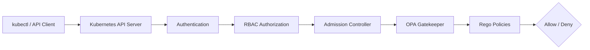

OPA Gatekeeper 基于 Kubernetes 的 Dynamic Admission Control 机制，通过 `ConstraintTemplate` 和 `Constraint` 两类自定义资源，使集群管理员能够使用 Rego 语言声明和执行自定义策略，实现:

* 禁止使用 `latest` 标签的镜像
* 强制要求 Deployment 设置资源限制 (cpu/memory)
* 强制要求 Namespace 包含特定 Label
* 禁止创建特权容器
* 验证 Ingress 域名白名单

所有策略均以代码形式管理，并通过 GitOps 持续同步至集群，实现安全基线自动化。

---

## 9.15 Envoy + OPA

在服务网格架构中，Envoy 通常被用作 Sidecar 代理，实现流量拦截和策略执行。其 External Authorization (ext_authz) 协议允许将授权决策委托给外部服务，OPA 正是理想的决策端。

部署架构:

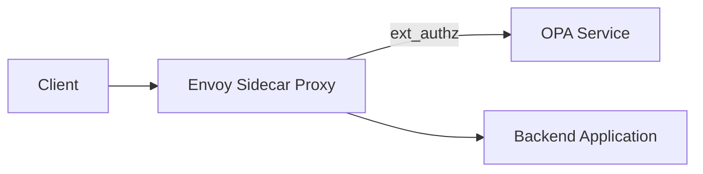

授权流程:

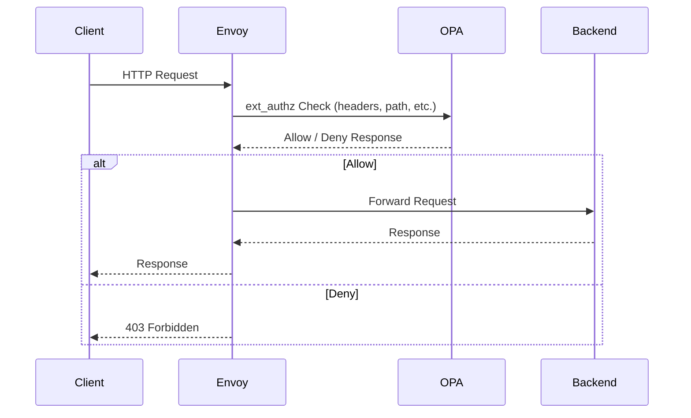

这种模式的优势:

* **后端无侵入**: 后端服务完全无需修改代码或引入授权 SDK，专注业务逻辑。
* **策略集中管理**: 所有服务的授权规则统一在 OPA 中配置，Envoy 仅负责执行。
* **细粒度控制**: 可根据 HTTP header、路径、方法、JWT claims 等丰富信息做出决策。
* **低延迟**: OPA 可部署为 Sidecar，决策在同一 Pod 内完成，极大减少网络开销。

---

## 9.16 云原生授权架构

现代云原生应用的完整授权链路通常如下:

```mermaid
flowchart TD
    User[User / Client] --> Gateway[API Gateway]
    Gateway --> AuthN[Authentication Service\n(OIDC / OAuth2)]
    AuthN --> Token[Identity Token (JWT)]
    Token --> Envoy[Envoy Proxy\n(Policy Enforcement Point)]
    Envoy --> OPA[OPA\n(Policy Decision Point)]
    OPA --> Evaluate[Evaluate Rego Policies]
    Evaluate --> Decision{Decision}
    Decision -- Allow --> Microservice[Microservice]
    Decision -- Deny --> Denied[Access Denied]
```

整个过程中分工清晰:

* **OIDC/OAuth2** 负责确认用户身份，颁发代表身份的 JWT。
* **API Gateway** 做初步的协议转换和路由，可与身份认证插件集成。
* **Envoy (PEP)** 拦截每一个请求，提取身份 Token 及请求参数，向 OPA 发起授权检查。
* **OPA (PDP)** 结合从 PIP 获取的额外属性（如用户部门、设备合规状态等），根据 Rego 策略完成最终决策。
* **微服务** 仅处理纯粹的业务逻辑，不再包含任何授权判断。

这种架构将认证、授权和业务完全解耦，使每一层都能独立演进、独立测试、独立审计，充分符合零信任“永不信任，始终验证”的原则。

---

## 9.17 本章总结

随着系统从单体架构演进到微服务和云原生，授权模型也经历了深刻的变革:

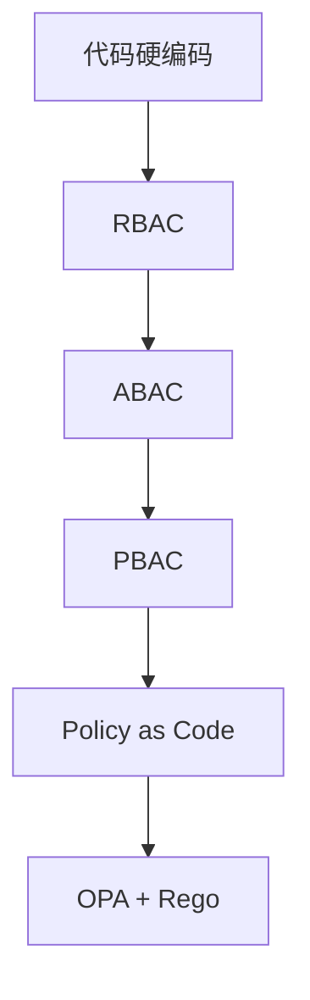

从最原始的在代码中散布 `if-else`，到基于角色的粗粒度控制，再到利用属性进行灵活决策，最终迈向以统一策略引擎为核心的 PBAC 时代。策略即代码 (Policy as Code) 的实践，通过 Git、CI/CD 和自动化测试，将安全策略提升到了与业务代码同等的工程化水平。

现代零信任架构推荐实践如下:

| 能力               | 推荐方案                          |
| ------------------ | --------------------------------- |
| 身份认证 (AuthN)   | OIDC + OAuth2                     |
| 身份载体           | JWT (JSON Web Token)              |
| 授权模型 (AuthZ)   | PBAC (策略驱动访问控制)           |
| 策略引擎           | OPA                               |
| 策略语言           | Rego                              |
| 策略管理           | Git + CI/CD + Policy as Code      |
| 默认原则           | Default Deny + Least Privilege    |

在零信任体系中，**身份 (Authentication)**、**授权 (Authorization)** 与 **策略 (Policy)** 构成了完整的访问控制闭环。身份回答“是谁”，策略回答“是否允许”，执行点负责落实决策。通过策略引擎的统一编排，企业可以构建起统一、可审计、可测试、可持续演进的权限管理体系，真正将安全内建于架构之中。


