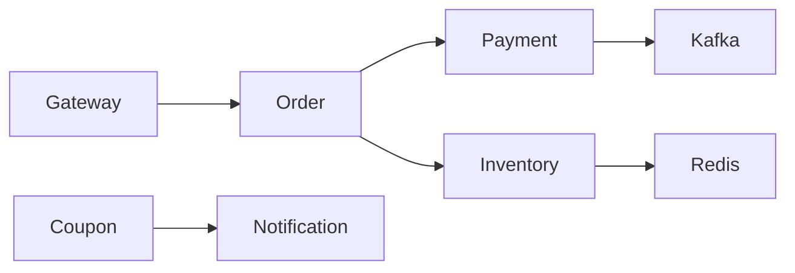
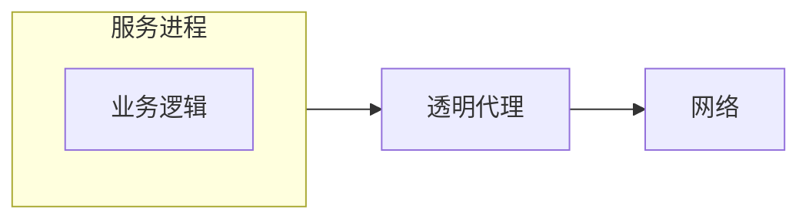
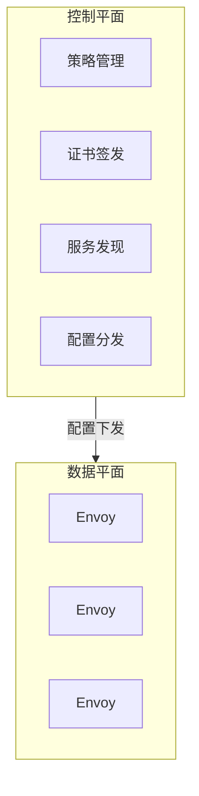
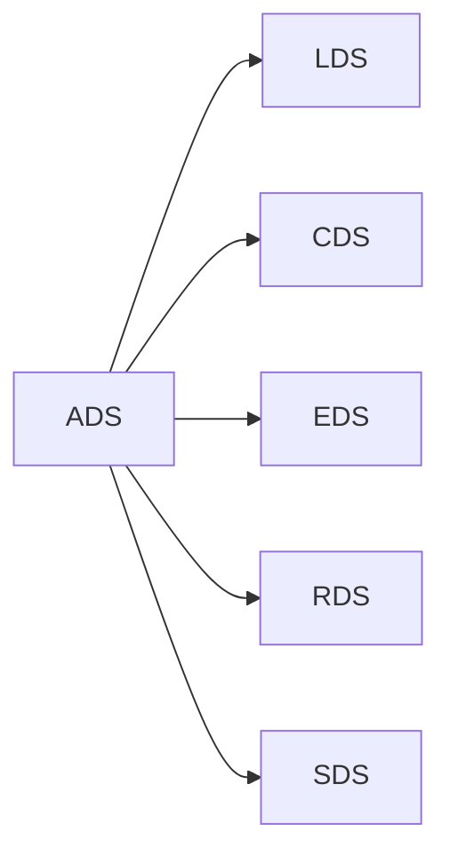
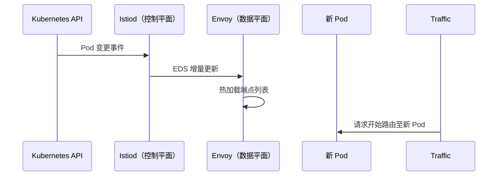
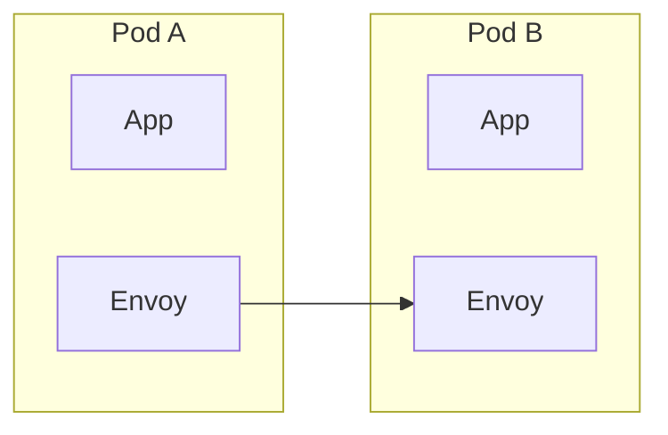
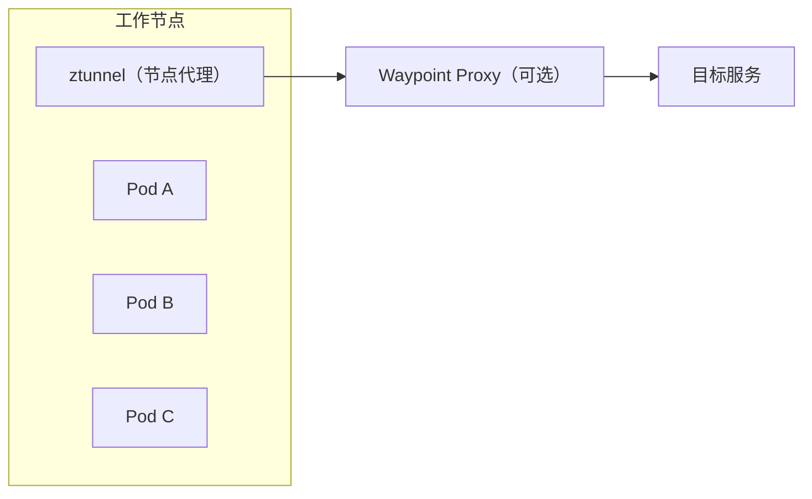

> **本章目标**
>
> 阅读完本章后，应能够理解：
>
> * 为什么微服务最终催生了 Service Mesh。
> * Service Mesh 到底解决了哪些问题。
> * Envoy 为什么成为事实上的数据平面标准。
> * xDS 为什么能够实现动态配置。
> * Sidecar 架构为什么流行，又为什么逐渐暴露瓶颈。
> * Ambient Mesh 如何重新设计 Service Mesh 架构。

---

## 6.1 为什么需要 Service Mesh

最初只有两个服务时，架构非常简单：


业务代码只需一行 `http.Post(...)` 即可完成调用，开发者感受不到任何通信层面的负担。

然而随着业务增长，系统迅速演变为数十个服务交织的网状拓扑：



当服务数量达到几十甚至上百个时，每个服务都不得不重复实现以下横切关注点：服务发现、TLS 加密、重试、超时、熔断、负载均衡、分布式追踪、指标收集、身份认证、mTLS、审计日志。业务代码逐渐变成：

```
Business Logic
  + Retry
  + Circuit Breaker
  + TLS
  + Metrics
  + Trace
  + Auth
```

真正的业务逻辑占比越来越低，通信基础设施的代码却不断膨胀，而且这些能力往往由不同团队以不同方式实现，导致碎片化、不一致和安全盲区。

于是行业开始思考一个根本性问题：**这些与业务无关的通信能力，为什么不能从业务代码中剥离出来，作为独立的基础设施层统一提供？** 这正是 Service Mesh 诞生的原动力。

---

## 6.2 Service Mesh 的本质

很多人把 Service Mesh 等同于网络组件，这是严重的误解。从架构师的角度看，Service Mesh 更准确的定义是：

> **一层独立于业务代码的服务通信基础设施，它接管了所有服务间流量的治理、安全与可观测性。**

架构模型如下：



引入 Mesh 后，开发者只需关注业务调用（如 `CreateOrder()`），而以下能力全部由代理层自动完成：

- 服务发现与负载均衡
- 双向 TLS（mTLS）加密与身份认证
- 重试、超时、熔断
- 请求级指标（Prometheus）
- 分布式追踪（OpenTelemetry）
- 细粒度访问控制（Authorization Policy）
- 审计日志记录

因此，Service Mesh 本质上属于 **基础设施层（Infrastructure Layer）**，而非应用层。它通过将通信横切面下沉，使业务代码与通信细节彻底解耦，让开发团队和平台团队各司其职。

---

## 6.3 Service Mesh 的架构

现代 Service Mesh 采用严格的两层架构：控制平面（Control Plane）与数据平面（Data Plane）。



**控制平面**  
负责全局决策与管理，包括服务发现、路由规则、证书轮换、访问策略和遥测配置。它几乎不参与实时业务请求，但对整个 Mesh 的行为拥有最终裁定权。典型实现有 Istiod、SPIRE、OPA 等。

**数据平面**  
真正承载所有业务流量的代理层，所有入站、出站和东西向请求都流经它。数据平面必须满足高性能、高可靠性，并支持动态热更新，不能因配置变更而重启或中断流量。

这种分层设计是 Service Mesh 最核心的思想：**将策略决策与流量执行分离**，使安全、策略、路由等逻辑独立演进，而不影响数据通路的稳定性。

---

## 6.4 为什么选择 Envoy

早期存在多种代理（如 Linkerd v1、Nginx），但 Envoy 最终成为事实上的数据平面标准，原因如下：

1. **全协议栈支持**  
   原生支持 TCP、HTTP/1、HTTP/2、gRPC、TLS，覆盖了绝大多数服务间通信场景。

2. **内置丰富的可靠性能力**  
   包括 mTLS、重试、熔断、限流、超时、故障注入、镜像路由等，全部开箱即用。

3. **动态配置能力**  
   传统代理需要修改配置文件并执行 reload，期间必然中断已有连接。Envoy 通过 xDS 协议实现全动态配置更新，无需重启，不影响活跃请求。这一点是 Envoy 最根本的差异化优势。

4. **可扩展架构**  
   支持可插拔过滤器链，L3/L4/L7 过滤器可以自由组合，并且通过 xDS API 实现与控制平面的完全解耦。

Envoy 并非“最快”的代理，但它是目前最能满足动态、零信任环境需求的代理。

---

## 6.5 Envoy 为什么可以动态更新配置

假设一个微服务扩容了两个新 Pod，传统代理必须：

```
修改配置文件
  → reload 进程
  → 已建立连接全部中断
```

这种中断在零信任、高并发环境下不可接受。Envoy 通过 xDS 协议彻底解决了这个问题：所有配置都由控制平面通过标准化 gRPC 流推送给 Envoy，Envoy 在内存中重建数据结构，并原子性地切换到新配置，整个过程不丢失任何请求。

---

## 6.6 xDS 到底是什么

xDS 并不是一个单独的协议，而是一套基于 gRPC/proto 的 **动态发现服务（Discovery Service）** 协议族。名字中的 “x” 代表可变的具体资源类型。其工作模型如下：


Envoy 启动后只需最少的引导信息（如控制平面地址），之后所有运行时配置均通过 xDS 实时获取和更新，从不需要静态配置文件。

---

## 6.7 xDS 家族

xDS 由多个独立的资源类型 API 组成，每种 API 管理一个维度的配置。

**LDS（Listener Discovery Service）**  
负责管理监听器，如 `0.0.0.0:8080`。可以动态添加、删除或修改监听端口及其关联的过滤器链，无需重启。

**CDS（Cluster Discovery Service）**  
Cluster 是 Envoy 对上游服务的抽象，如 `payment.default.svc`。新增或删除上游集群时，CDS 会自动推送给 Envoy。

**EDS（Endpoint Discovery Service）**  
一个 Cluster 可能对应多个实例（Endpoint），如 `10.244.1.2`、`10.244.1.5`。EDS 实时同步端点列表，Pod 扩容或故障后立刻生效，无需 reload。

**RDS（Route Discovery Service）**  
管理 HTTP 路由表，例如将 `/api/order` 指向订单服务。新增路由规则即时应用，非常适合灰度发布和流量切割。

**SDS（Secret Discovery Service）**  
这是零信任体系最关键的一环。SDS 负责动态下发 TLS 证书、私钥和信任链，使 Envoy 无需本地存储任何凭据，证书轮换也完全透明，支撑 mTLS 的持续运行。

**ADS（Aggregated Discovery Service）**  
在实际部署中，Envoy 不会为 LDS、CDS、EDS 等分别建立连接，而是通过 ADS 复用单个双向 gRPC 流，统一收发所有 xDS 资源，大幅降低连接数和控制平面压力。

逻辑关系可以概括为：



---

## 6.8 一次配置更新到底发生什么

以 `kubectl scale payment --replicas=5` 为例，整个过程如下：



整个过程业务无感知，没有连接中断，没有请求丢失，没有重启。这正是控制平面与数据平面解耦带来的核心优势。

---

## 6.9 Sidecar 架构

经典 Service Mesh 采用 Sidecar 模式，每个应用 Pod 都注入一个专用代理容器，所有进出 Pod 的流量都被该代理透明拦截：



优点显而易见：隔离性强，单个 Pod 的代理故障不会影响其他 Pod；每个代理可独立升级和配置；安全策略可以与具体工作负载严格绑定。

然而，当集群规模达到数千个 Pod 时，Sidecar 模式的固有开销开始显现。

---

## 6.10 Sidecar 为什么越来越慢

许多文章提到 Sidecar 有额外开销，但作为架构师需要从底层分析真正原因：

1. **请求路径更长**  
   原本一次服务间调用只需穿越一次网络栈，引入 Sidecar 后变成：`App → Envoy → 内核网络栈 → 对端 Envoy → 对端 App`，增加了两次代理处理，延迟相应上升。

2. **CPU 上下文切换加剧**  
   每次请求都会在 App 进程和 Envoy 进程之间发生多次上下文切换，导致 CPU 缓存命中率下降（Cache Miss），影响整体吞吐。

3. **资源浪费**  
   1000 个 Pod 意味着 1000 个 Envoy Sidecar。即使某些 Pod 长期处于空闲状态，每个 Envoy 仍占用固定的 CPU、内存和文件描述符，边际成本并不随负载线性增长。

4. **升级成本高**  
   Mesh 升级（如 Envoy 版本更新）需要滚动重建所有带有 Sidecar 的 Pod，触发大量 Pod 重建，给集群带来较大压力。

这些问题在大规模场景下逐渐成为性能与运维的瓶颈。

---

## 6.11 Ambient Mesh 为什么出现

Istio 社区通过实践发现，真正需要代理抽象的是 **节点层面**，而非必须为每一个 Pod 注入专属代理。于是 Ambient Mesh 应运而生，对数据平面架构进行了根本性重构：



- **ztunnel**  
  部署在每个工作节点上，负责 L4 层的安全与转发，包括 mTLS 加密、工作负载身份认证和简单的 TCP 层授权。它将代理从 Pod 级别提升到节点级别，所有进出该节点的流量都经过 ztunnel，大幅减少代理实例数。

- **Waypoint Proxy**  
  按需（例如按命名空间或服务账户）部署的 L7 代理，处理 HTTP 路由、JWT 验证、细粒度授权等高级策略。只有需要 L7 治理的服务才会触发 Waypoint 创建，其余流量仅经过极轻量的 ztunnel。

这种架构的核心理念是“为信任的安全层支付成本，但仅为需要的七层治理支付额外成本”，实现了资源与功能的精准匹配。

---

## 6.12 Sidecar 与 Ambient 对比

| 对比项       | Sidecar 模式                | Ambient Mesh                          |
| ------------ | --------------------------- | ------------------------------------- |
| Proxy 数量   | 每个 Pod 一个                | 每节点一个 ztunnel，Waypoint 按需部署 |
| CPU 开销     | 高（线性增长）               | 更低（接近按节点分摊）                |
| 内存占用     | 高                          | 更低                                  |
| Mesh 注入    | 必须修改 Pod Spec            | 无需 Sidecar 注入                     |
| 升级成本     | 高（需滚动重建大量 Pod）      | 更低（ztunnel 独立升级）              |
| 请求路径     | 更长（两次代理穿越）         | 更短（节点级一跳）                    |
| 运维复杂度   | 高（管理 Sidecar 生命周期）   | 中等                                  |

需要指出，Ambient Mesh 并非要完全取代 Sidecar。对于需要极致隔离或高度定制化代理的场景，Sidecar 仍然是可靠选择。Ambient 的核心价值在于为大规模集群提供一种降本增效的零信任数据平面实现。

---

## 6.13 Service Mesh 与零信任的关系

一个常见的误解是“部署 Istio 就等于实现了零信任”。事实上，Service Mesh 仅仅是零信任体系中 **通信基础设施** 这一层。它负责：

- 服务身份的传播与验证（基于 SPIFFE）
- 透明的双向 mTLS 加密
- 动态授权策略的执行点
- 遥测数据的采集（日志、指标、追踪）

但要构成完整的零信任架构，还必须依赖其他组件的协同：

- **Identity Provider**：提供用户/设备身份
- **SPIFFE/SPIRE**：提供平台中立的工作负载身份
- **Policy Engine（如 OPA）**：提供细粒度的策略决策
- **PKI/CA**：提供密码学信任基础
- **审计系统**：记录所有访问行为

Service Mesh 是零信任在服务通信层面的执行者，但如果没有身份体系的支撑、没有统一的策略决策，它仍然只是一个功能强大的代理网络，而非真正的零信任。

---

## 本章总结

Service Mesh 的出现并非偶然，而是微服务规模扩大后，对通信横切面进行标准化、自动化治理的必然结果。它将安全、策略、可观测性等能力从业务代码中剥离，形成独立的控制平面与数据平面，实现了决策与执行的彻底解耦。

现代 Service Mesh 的核心可以概括为：

| 层级     | 核心组件                             | 作用                       |
| -------- | ------------------------------------ | -------------------------- |
| 数据平面 | Envoy、ztunnel、Waypoint             | 处理业务流量、mTLS、策略执行 |
| 控制平面 | Istiod                               | 下发配置、证书、服务发现信息 |
| 配置协议 | xDS（LDS/CDS/EDS/RDS/SDS/ADS）       | 动态更新代理配置            |
| 身份体系 | SPIFFE/SPIRE                         | 提供平台中立的工作负载身份  |
| 安全能力 | mTLS、AuthorizationPolicy            | 服务认证与细粒度访问控制    |

从架构演进的角度看，Service Mesh 正从“每个 Pod 一个 Sidecar”的经典模式逐步演进到“节点级代理 + 按需七层代理”的 Ambient Mesh 模式。它并没有改变零信任“永不信任，始终验证”的核心思想，而是在保证身份可信、通信加密和策略可执行的前提下，持续追求更低的资源开销和更简化的运维模型，为大规模云原生系统提供了更加高效且安全的通信基础设施。