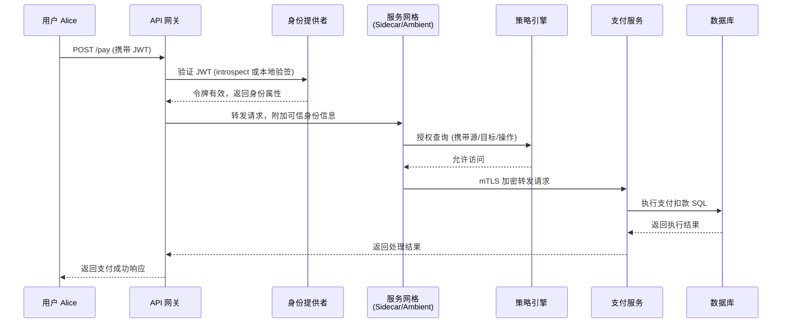
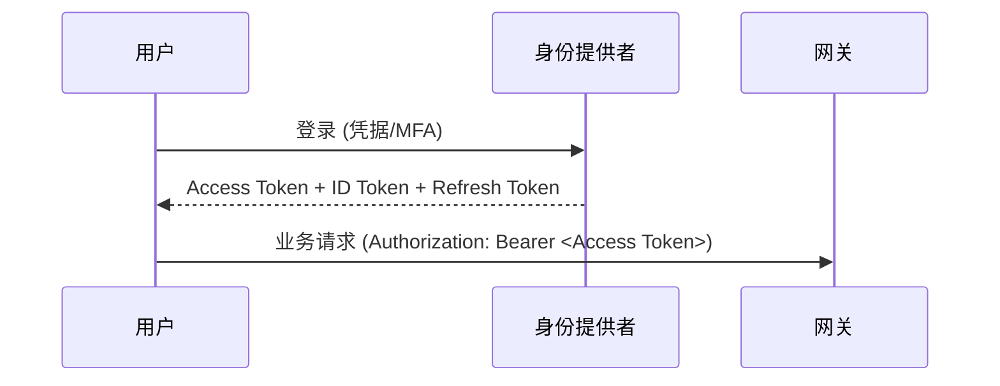
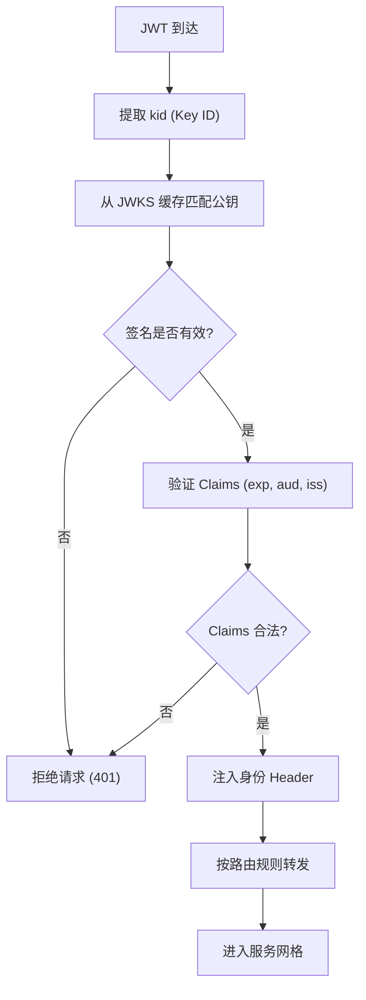
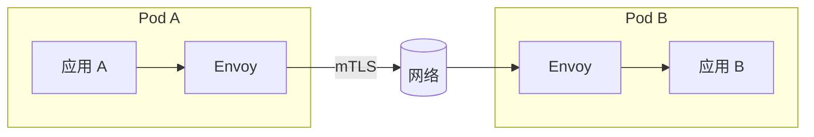
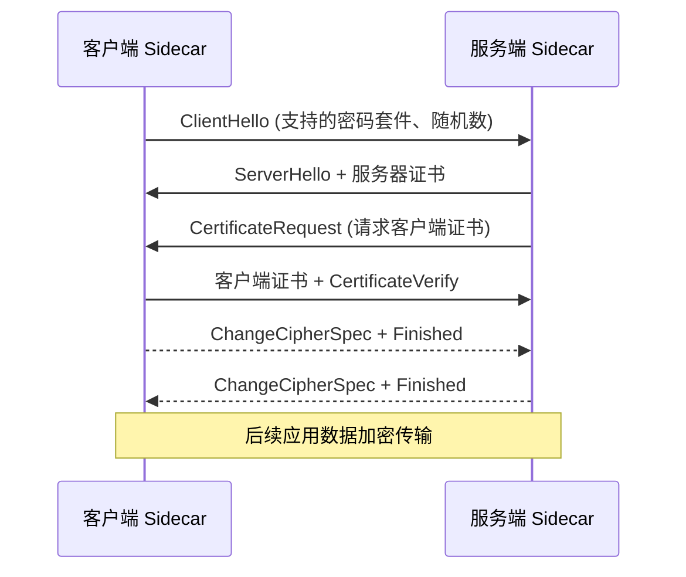
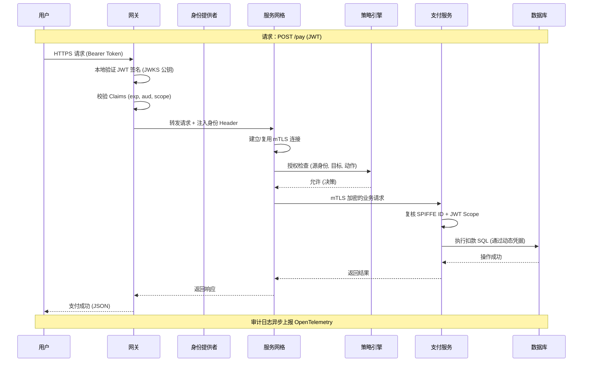
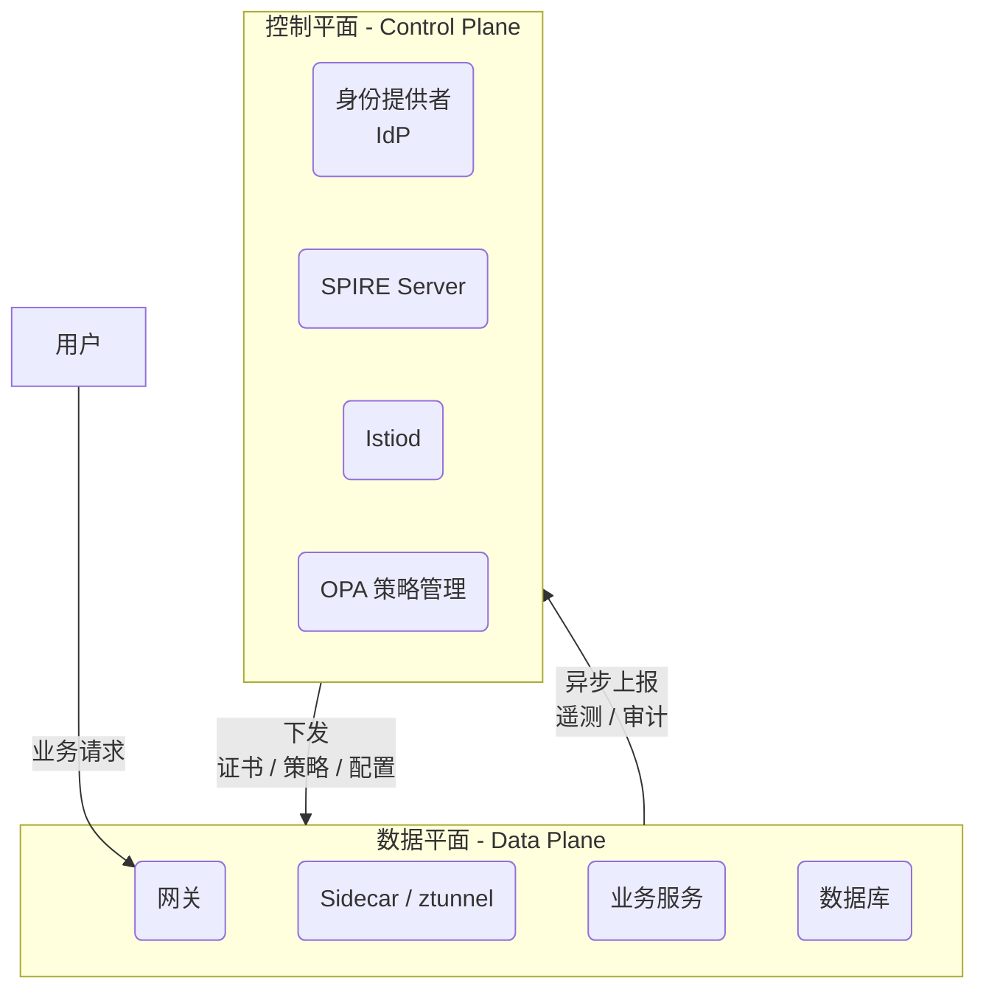

> **本章目标**

>

> 阅读完本章后, 应能够理解:

>

> * 为什么零信任将"身份(Identity)"作为新的安全边界

> * Authentication 与 Authorization 的区别及二者在访问控制中的职责

> * Human Identity、Machine Identity、Service Identity、Device Identity 分别代表什么, 以及它们在云原生环境中的作用

> * OAuth 2.0 解决什么问题, OIDC 为什么建立在 OAuth 2.0 之上

> * JWT 的内部结构、签名机制及其安全特性

> * Access Token 与 Refresh Token 的生命周期设计及 Token Rotation 的意义

> * PKCE 如何防止 Authorization Code 被截获攻击, 为什么移动端和 SPA 必须使用 PKCE

> * Kubernetes、SPIFFE、云 IAM 等平台如何为工作负载建立 Machine Identity 与 Service Identity

> * LDAP、Kerberos、SAML、OAuth 2.0、OIDC 等主流身份体系之间的设计思想、优缺点及适用场景

> * 一个身份是如何在 API Gateway、Service Mesh、微服务之间完成传播与验证的

> * 如何构建符合零信任原则的现代身份认证体系

---

## 4.1 从一个真实案例开始

假设用户 Alice 登录某银行 App，点击了 **“立即支付”**，系统开始处理整个请求。涉及组件及其交互全景如下（这张图建议放在章节最前面，后面所有内容都围绕它展开）：



这条链路涵盖了认证、授权、安全传输、业务处理与数据持久化。接下来我们逐段展开。

---

## 4.2 第一步：用户认证（Authentication）

认证发生在真正访问业务接口之前。银行场景下可能是：

- 用户名 + 密码 + MFA（短信/生物识别）
- Passkey / FaceID / FIDO2 无密码登录

认证完成后，IdP 会返回一套令牌：

- **Access Token**（短生命周期，如 5~15 分钟，用于访问 API）
- **ID Token**（携带用户身份信息，用于客户端展示）
- **Refresh Token**（长生命周期，用于静默刷新 Access Token）

现代系统不再保存服务端 Session，而采用无状态 JWT，主要因为：
- 水平扩展友好，无需共享 Session Store
- 天然适合微服务间传播身份
- 可嵌入丰富的 Claims，实现细粒度授权

Token 生命周期越来越短，是为了降低泄漏风险，并结合 Refresh Token 保持体验。



登录是低频操作，一次登录后可发起大量业务请求。典型耗时：

| 操作     | 延迟        |
| -------- | ----------- |
| 用户输入 | 不计        |
| MFA 验证 | 0.5 ~ 3 秒  |
| JWT 签发 | 5 ~ 20 ms   |

---

## 4.3 网关到底做了什么

现代 API 网关远不止路由转发，它承担的安全与观测职责包括：

- **JWT 校验**（签名、有效期、iss/aud 等）
- **Rate Limiting**（防止滥用）
- **WAF**（Web 应用防火墙）
- **请求体校验**（防止注入）
- **Header 注入**（传播用户 ID、TraceID、SPIFFE ID 等）
- **审计日志**（记录每个请求的基础信息）

JWT 校验可以离线完成，网关无需每次请求都调用 IdP。原理是网关通过 JWKS（JSON Web Key Set）端点提前缓存 IdP 的公钥，用公钥直接验证签名。流程如下：



JWKS 缓存定期刷新（如每 15 分钟），即使 IdP 短暂不可用，网关仍能正常运行。这样既保证了安全，又避免了额外延迟。

网关环节典型耗时：

| 操作         | 延迟        |
| ------------ | ----------- |
| JWT 签名验证 | 50 ~ 300 μs |
| 路由转发     | < 100 μs    |

---

## 4.4 服务网格接管流量

请求离开网关后，便进入服务网格的管辖范围。网格的核心能力包括：

- **mTLS**（自动加密与身份验证）
- **流量策略**（负载均衡、重试、超时、熔断）
- **可观测性**（指标、追踪、日志）
- **授权**（集成 OPA 等策略引擎）

在传统 Sidecar 模式下，每个 Pod 旁路部署一个代理（如 Envoy）：



在 Ambient Mesh 模式下，则分离为节点级 ztunnel（处理 mTLS）和命名空间级 waypoint（处理 L7 策略）：

```mermaid
flowchart LR
    GW[网关] --> ZT[ztunnel<br/>(节点代理)]
    ZT --> WP[Waypoint Proxy<br/>(L7 策略)]
    WP --> SVC[支付服务]
```

两种模式性能对比：

| 模式    | 额外延迟（每跳） |
| ------- | ---------------- |
| Sidecar | 0.5 ~ 2 ms       |
| Ambient | 0.2 ~ 1 ms       |

网格代理对应用完全透明，代码无需任何修改。

---

## 4.5 mTLS 握手到底发生了什么

mTLS 并非每次请求都重新握手。一次完整的 TLS 握手（双向证书校验）大致如下：



但在实际环境中，大量采用了**会话复用**（Session Resumption）或**连接保活**（Keep-Alive），后续请求几乎不再发生完整握手。使用 HTTP/2 多路复用后，一条连接上可以承载成百上千个并发请求。

不同场景下的 TLS 开销：

| 场景               | 延迟          |
| ------------------ | ------------- |
| 完整 TLS 握手      | 1 ~ 5 ms      |
| 会话复用（简握手） | < 1 ms        |
| Keep-Alive 复用    | 几乎可忽略不计 |

在服务网格中，证书由 SPIRE 等系统自动轮换，Sidecar 预热连接池，实际业务请求绝大部分不会遇到完整握手。

---

## 4.6 策略引擎在做什么（授权）

这是**授权**，不是认证。认证确认“你是谁”，授权确认“你能做什么”。例如支付服务要调用订单服务，网格中的 PEP（策略执行点）会请求 OPA（作为 PDP）做出决策。

请求的输入可能为：

```json
{
  "source": {
    "spiffe_id": "spiffe://bank.com/payment",
    "namespace": "prod"
  },
  "destination": {
    "host": "order.prod.svc.cluster.local",
    "path": "/api/orders"
  },
  "action": "POST"
}
```

OPA 中对应的 Rego 策略：

```rego
package bank.authz

default allow := false

allow {
  input.source.spiffe_id == "spiffe://bank.com/payment"
  input.destination.host == "order.prod.svc.cluster.local"
  input.action == "POST"
}
```

OPA 返回 `{"allow": true}`，Sidecar 放行；否则返回 403。

完整授权架构涉及多个概念：

```mermaid
flowchart TD
    PEP[PEP<br/>策略执行点<br/>(Sidecar/网关)] --> PDP[PDP<br/>策略决策点<br/>(OPA)]
    PDP --> PIP[PIP<br/>策略信息点<br/>(用户属性/设备信息)]
    PIP --> PAP[PAP<br/>策略管理点<br/>(Rego 策略仓库)]
    PAP --> PDP
    PDP --> Decision{允许/拒绝}
```

- **PEP**：拦截请求并强制执行决策
- **PDP**：根据策略和上下文计算决策
- **PIP**：提供决策所需的额外属性（如用户部门、设备合规状态）
- **PAP**：管理策略的生命周期

在实际部署中，OPA 通常以 Sidecar 或 DaemonSet 形式运行在本地，决策延迟极低：

| 部署模式       | 延迟        |
| -------------- | ----------- |
| OPA 本地调用   | 50 ~ 300 μs |
| OPA 远程调用   | 1 ~ 5 ms    |

强烈推荐使用本地部署，避免远程调用成为性能瓶颈。

---

## 4.7 业务服务收到请求以后

请求经过网格授权后到达业务服务（如支付服务）。服务并非直接开始业务逻辑，还需要进行额外的**身份与权限复核**：

- 验证调用方的 SPIFFE Identity（从 mTLS 证书中提取）
- 校验 JWT Claims（如 `scope` 中是否包含 `payment:write`）
- 租户隔离（确保请求操作的数据属于当前用户）

```mermaid
flowchart TD
    A[收到请求] --> B[提取 SPIFFE ID]
    B --> C{来源是否可信?}
    C -- 是 --> D[验证 JWT Scope]
    C -- 否 --> E[拒绝 (403)]
    D --> F{Scope 充足?}
    F -- 是 --> G[执行业务逻辑]
    F -- 否 --> E
    G --> H[访问数据库]
```

这种纵深防御确保即使网格层出现策略漏洞，应用层依然能拦截越权操作。

---

## 4.8 数据库为什么通常不是零信任终点

数据库传统上仅依赖静态密码或固定 IP 白名单，这与零信任的动态、基于身份的原则相悖。现代架构一般引入**数据库代理**或**动态凭据**：

```mermaid
flowchart LR
    Pay[支付服务] --> Proxy[DB Proxy<br/>(例如 Vault 动态凭据)]
    Proxy --> DB[(数据库)]
    Vault[HashiCorp Vault] -.-> Proxy
```

- 支付服务运行时向 Vault 申请一次性或短生命周期的数据库凭据
- DB Proxy 验证 SPIFFE ID 或 JWT，代发凭据
- 数据库本身不再直接暴露，所有访问经过代理审计

部分云数据库（如 AWS RDS IAM、GCP Cloud SQL）已支持 IAM 动态鉴权，可直接集成到网格的身份体系中。

---

## 4.9 审计到底记录了什么

一次完整的请求审计至少包含以下字段：

| 字段         | 来源/说明              |
| ------------ | ---------------------- |
| User ID      | JWT 中的 sub           |
| Device       | 客户端指纹/设备 ID     |
| Source IP    | 原始请求 IP（网关注入）|
| SPIFFE ID    | 调用方服务的身份       |
| JWT jti      | JWT 唯一 ID，防重放    |
| Policy Decision | OPA 决策结果及策略 ID |
| Trace ID     | OpenTelemetry 分布式追踪 ID |
| Latency      | 每跳耗时               |

这些数据通过 OpenTelemetry 收集，发送到 SIEM 或 SOC 进行实时监控和事后溯源。审计日志应异步写入，避免阻塞主链路。

---

## 4.10 一次请求的完整生命周期（总图）

结合前面所有环节，最终端到端时序图如下（比开头的图更详细）：



整个请求大致的耗时分析：

| 阶段         | 功能               | 典型延迟            | 备注                     |
| ------------ | ------------------ | ------------------- | ------------------------ |
| Gateway      | JWT 验证           | 0.05 ~ 0.3 ms       | 纯内存计算               |
| Mesh         | 路由 + mTLS        | 0.5 ~ 2 ms          | 含连接复用后的 TLS 开销  |
| OPA          | 策略决策           | 0.05 ~ 0.3 ms       | 本地 Sidecar 调用        |
| Service      | 业务处理           | 1 ~ 20 ms           | 取决于业务复杂度         |
| Database     | SQL 执行           | 1 ~ 50 ms           | 取决于查询和实例规格     |
| 日志/Tracing | 异步记录           | 通常不影响主链路    |                          |

**零信任自身增加的开销**（JWT 验证 + mTLS + OPA）合计通常在 **1 ~ 3 ms**，远低于业务处理与数据库查询的耗时。性能瓶颈几乎不在安全层，而在于业务逻辑和 I/O。

---

## 4.11 控制平面与数据平面（新增）

很多初学者误以为每个请求都要访问 IdP、SPIRE 或策略管理端。实际上并非如此，整个架构严格分为两层：



- **控制平面**：负责身份管理、证书签发、策略管理和配置下发。它**不参与**实时业务请求，仅在后台持续同步数据到数据平面。
- **数据平面**：承载全部业务流量。每个请求在这里完成身份验证、mTLS、授权和业务处理。所有决策所需的材料（证书、策略、路由规则）已提前下发到本地，因此可以实现**亚毫秒级安全决策**。

这种“控制平面离线管理，数据平面本地快速决策”的设计，是高性能零信任架构的核心原则，也是系统能在保障安全的同时达到低延迟的关键。