> **本章目标**
>
> 阅读完本章后, 应能够理解:
>
> * 零信任真正改变的是"信任模型(Trust Model)", 而不是部署更多安全设备.
> * 为什么身份(Identity)取代网络(Network)成为新的安全边界.
> * 为什么零信任强调"持续验证", 而不是"登录一次".
> * 如何理解最小权限原则及其不同授权模型.
> * 为什么现代企业需要动态、持续、自适应的访问控制.

---

# 2.1 零信任不是产品, 而是一种信任模型

很多人在第一次接触零信任时, 都会问类似的问题.

> 零信任是不是部署了 Service Mesh?

或者:

> 是不是上了 mTLS 就算零信任?

再或者:

> 我已经部署了 VPN, 是不是就是零信任?

答案都是:

**不是.**

零信任不是某一种软件.

不是某一种协议.

也不是某一种安全设备.

它首先是一种:

> **Trust Model**
>
> 信任模型.

所谓信任模型.

就是回答一个最根本的问题.

> **系统为什么相信一次访问?**

任何一个系统.

当收到一个请求时.

都会经历一个判断过程.

例如:

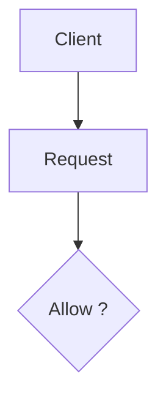

真正不同的是:

不同架构回答"Allow?"的依据完全不同.

---

# 2.2 传统信任模型

传统网络主要依据:

> **Network Identity**

即:

> 你来自哪里?

例如:

```text
IP

VLAN

VPN

Office LAN
```

企业认为:

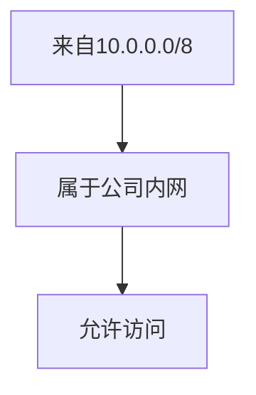

整个判断流程如下:

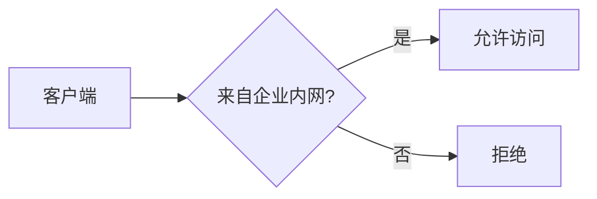

这里真正被验证的是:

**网络位置(Network Location).**

而不是:

* 用户身份
* 设备状态
* 当前风险
* 服务是否合法

也就是说.

传统安全实际上回答的是:

> **你在哪里?**

而不是:

> **你是谁?**

---

# 2.3 零信任的信任模型

零信任将整个判断逻辑彻底改变.

它关注的是:

> **Digital Identity**

即:

> **数字身份.**

判断流程变成:

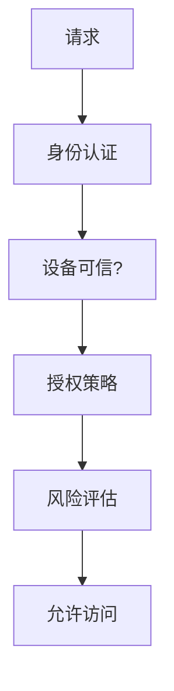

这里验证的是:

* User Identity
* Service Identity
* Device Identity
* Workload Identity

而不是:

IP 地址.

例如:

以前系统相信:

```text
10.1.2.3
```

今天系统相信的是:

```text
User:

alice@company.com

Device:

MacBook-Pro

Service:

spiffe://prod/payment

Certificate:

Valid

Risk:

Low
```

因此.

真正发生变化的是:

> **信任从网络迁移到了身份.**

这也是零信任最核心的思想.

---

# 2.4 为什么身份才是真正的边界

假设有两个员工.

第一个人在办公室.

第二个人在家办公.

传统模型:

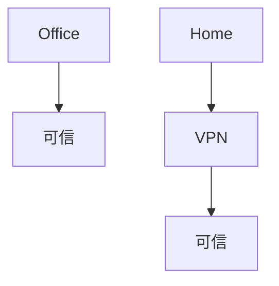

这里真正建立信任的是:

网络.

但是.

请思考一个问题.

如果攻击者盗取了员工 VPN 账号.

那么:

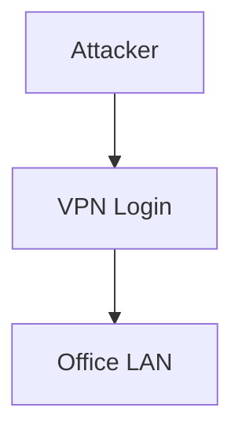

系统还能区分吗?

不能.

因为网络已经无法代表身份.

再举一个 Kubernetes 的例子.

Pod 的 IP:

```text
10.244.5.17
```

明天:

可能变成:

```text
10.244.8.21
```

IP 每次重建都会变化.

因此:

IP 已经不能代表服务.

真正应该代表服务的是:

```text
spiffe://production/payment

spiffe://production/order

spiffe://production/inventory
```

无论 Pod 如何调度.

身份不会改变.

因此.

现代系统真正的边界.

已经不是:

> Network Boundary

而是:

> Identity Boundary

---

# 2.5 Never Trust, Always Verify

这是零信任最著名的一句话.

> **Never Trust, Always Verify.**

很多人把它理解成:

> 什么都不相信.

实际上并不是.

真正的含义是:

> **不要因为某个主体曾经被验证过, 就持续信任它.**

例如传统系统.

登录一次:

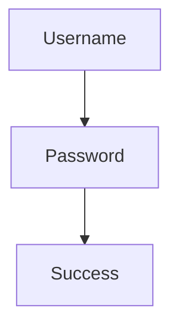

随后:

8 小时内:

所有请求直接放行.

零信任认为.

这是危险的.

因为:

登录之后.

可能发生很多事情.

例如:

* Token 被盗.
* 设备感染恶意软件.
* 用户权限被管理员撤销.
* 风险等级突然升高.
* 服务证书过期.
* API Key 泄露.

因此.

每一次访问.

都应该重新判断.

而不是相信过去.

这里需要注意.

**持续验证并不意味着每个请求都重新登录.**

这是一个常见误区.

真正持续验证的是:

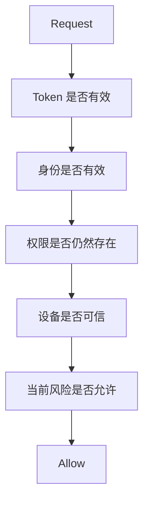

因此.

验证的是:

**访问上下文(Context).**

而不是:

重新输入密码.

---

# 2.6 什么需要持续验证

现代零信任通常验证四类主体.

## 用户(User)

例如:

员工是否仍然登录.

是否启用了 MFA.

权限是否发生变化.

是否处于高风险国家.

---

## 服务(Service)

例如:

Payment 是否真的是 Payment.

证书是否有效.

SPIFFE Identity 是否正确.

---

## 设备(Device)

例如:

电脑是否开启磁盘加密.

是否安装企业 EDR.

是否越狱.

是否 Root.

操作系统是否更新.

这些状态统称为:

> Device Posture.

设备姿态.

如果设备已经不满足企业安全要求.

即使用户身份正确.

也可能拒绝访问.

---

## API

例如:

API 是否来自可信客户端.

调用频率是否异常.

JWT 是否有效.

Scope 是否满足要求.

---

因此.

零信任真正验证的是:

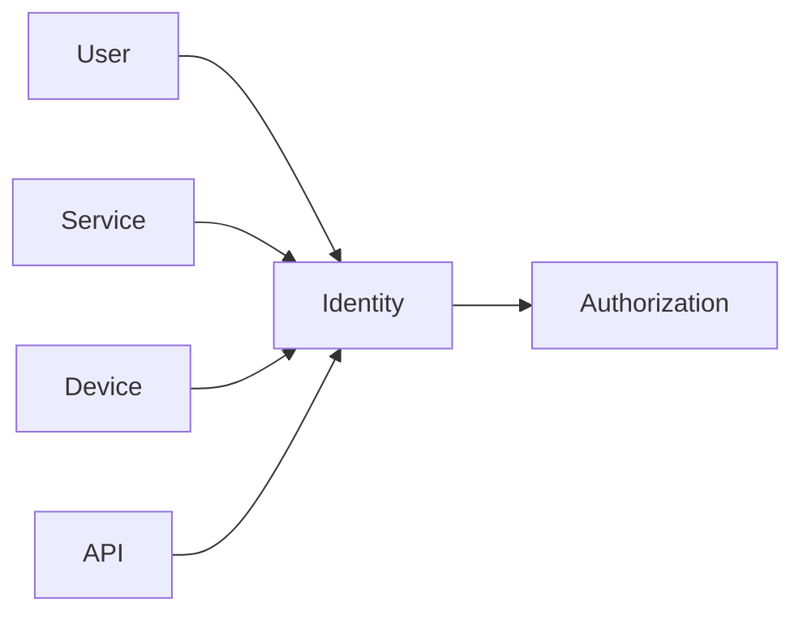

---

# 2.7 最小权限原则

零信任第二个核心思想.

就是:

> Principle of Least Privilege.

最小权限.

它要求:

> **主体只能获得完成当前任务所必需的最小权限.**

例如.

支付服务.

应该能够访问:

```text
Order

Inventory
```

但是:

不应该访问:

```text
HR

Payroll

CRM
```

即使技术上能够连接.

也应该拒绝.

这样做最大的价值就是:

**限制攻击面的扩大.**

攻击者即使控制 Payment.

最多也只能获得 Payment 本身拥有的权限.

无法继续横向移动.

---

# 2.8 常见授权模型

最小权限并不是一种具体算法.

真正决定"谁能访问什么"的是授权模型.

目前最常见有四类.

| 模型    | 全称                                | 判断依据        | 优点        | 缺点     | 适用场景          |
| ----- | --------------------------------- | ----------- | --------- | ------ | ------------- |
| RBAC  | Role-Based Access Control         | 用户角色        | 简单、成熟、易维护 | 粒度较粗   | 企业后台、OA、ERP   |
| ABAC  | Attribute-Based Access Control    | 用户、资源、环境等属性 | 粒度细、灵活    | 策略复杂   | 金融、医疗、政府      |
| PBAC  | Policy-Based Access Control       | 策略引擎统一决策    | 集中管理、动态扩展 | 依赖策略平台 | 微服务、云原生       |
| ReBAC | Relationship-Based Access Control | 主体之间的关系     | 适合复杂协作关系  | 建模复杂   | 社交平台、文档协作、知识库 |

---

## RBAC

最经典.

例如:

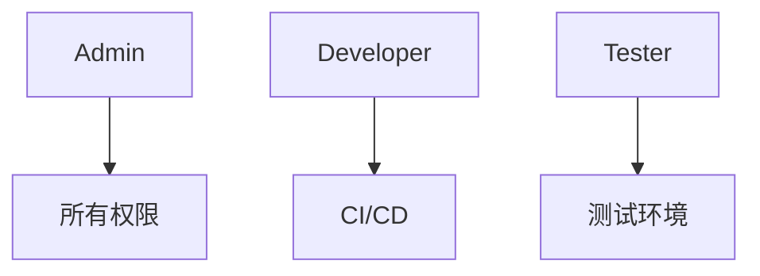

系统只判断:

> 你属于哪个角色?

---

## ABAC

更加灵活.

例如:

```text
Department = Finance

Location = Beijing

Time = Work Hours

Risk = Low
```

满足所有条件.

才允许访问.

---

## PBAC

PBAC 更进一步.

访问权限不直接写死在代码里.

而是交给策略引擎统一管理.

例如:

```text
Allow if:

Department == Finance

AND

Risk < 30

AND

Device == Managed
```

业务系统只负责执行决策.

策略可以独立修改.

无需重新发布应用.

---

## ReBAC

近年来越来越流行.

尤其适用于协作系统.

例如:

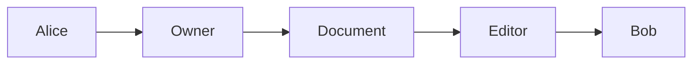

真正决定权限的是:

人与资源之间的关系.

很多现代协作系统都采用这种模型.

---

# 2.9 持续验证

很多人认为.

JWT 登录成功以后.

访问就结束了.

实际上.

JWT 只是一次身份声明.

它不是永久许可.

现代零信任通常采用以下机制.

## Token Rotation

Access Token 生命周期很短.

例如:

15 分钟.

随后.

自动刷新.

这样即使 Token 泄露.

攻击窗口也非常有限.

---

## Continuous Authentication

持续认证.

每一次请求都会检查:

* Token 是否有效.
* 用户是否被禁用.
* 是否满足当前授权策略.

而不是相信第一次登录.

---

## Device Posture

设备状态不断变化.

例如:

上午:

```text
EDR Running

Disk Encryption Enabled

OS Latest

Risk = Low
```

下午:

用户关闭 EDR.

或者感染恶意软件.

则风险立即变化.

企业可以实时降低权限.

甚至直接断开访问.

---

## Risk Score

现代零信任越来越强调风险驱动.

系统会持续计算一个风险分数.

例如:

| 条件        | 风险变化 |
| --------- | ---- |
| 常用办公地点登录  | +0   |
| 新设备登录     | +15  |
| 海外异常 IP   | +30  |
| 短时间多次失败登录 | +20  |
| 检测到恶意软件   | +50  |

根据总分决定访问策略.

例如:

```text
Risk < 30

↓

直接访问

30 ≤ Risk < 60

↓

要求 MFA

Risk ≥ 60

↓

拒绝访问
```

这种方式使授权从"静态规则"演进为"动态风险控制", 也是现代零信任区别于传统访问控制的重要特征.

---

# 本章总结

本章讨论的重点不是零信任使用哪些技术, 而是它如何重新定义"信任".

可以归纳为以下几个核心观点:

1. **零信任首先是一种信任模型**, 它改变的是"为什么允许一次访问发生", 而不是简单增加新的安全组件.

2. **身份取代网络成为新的安全边界**. 网络位置、IP 地址或 VLAN 不再能够代表可信主体, 用户身份、服务身份、设备身份和工作负载身份成为访问决策的核心依据.

3. **"Never Trust, Always Verify"并不意味着反复登录**, 而是要求系统持续验证访问上下文, 包括身份、设备状态、权限和风险等级.

4. **最小权限原则贯穿整个零信任体系**, 并通过 RBAC、ABAC、PBAC、ReBAC 等不同授权模型实现"仅授予完成当前任务所需的最小权限".

5. **现代零信任是一种动态访问控制体系**, 它综合 Token 生命周期、持续认证、设备姿态和风险评分等因素, 在每一次访问时重新评估信任关系.