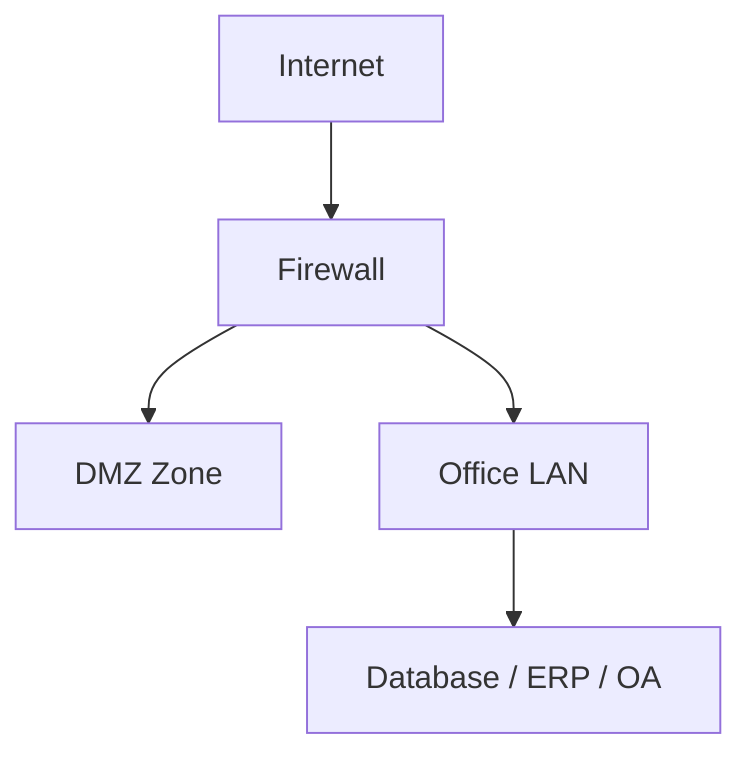
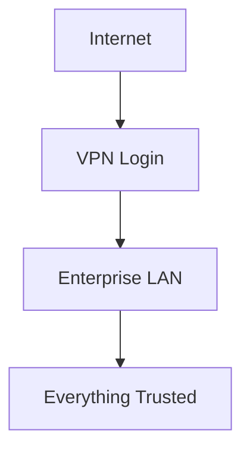
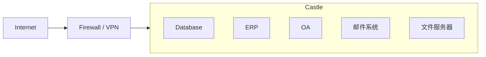
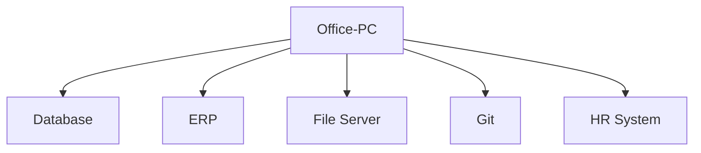
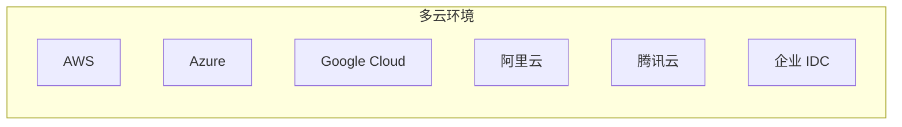
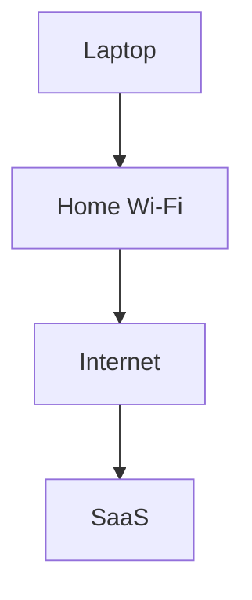
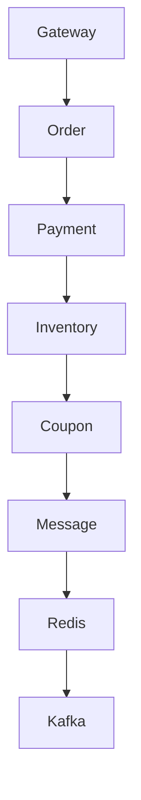
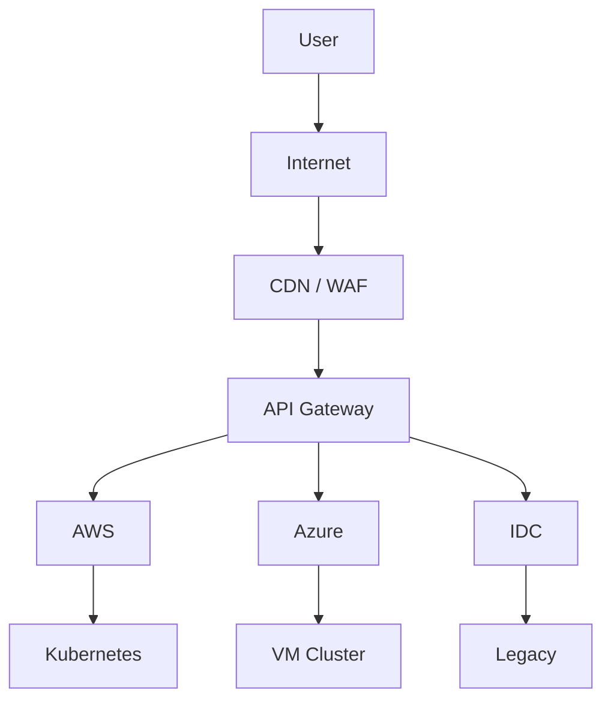
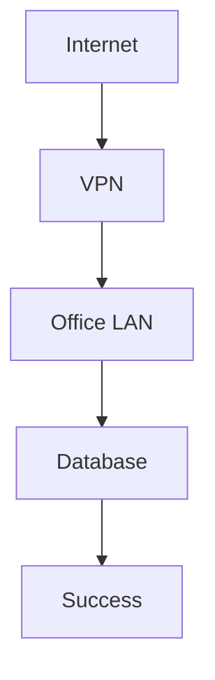
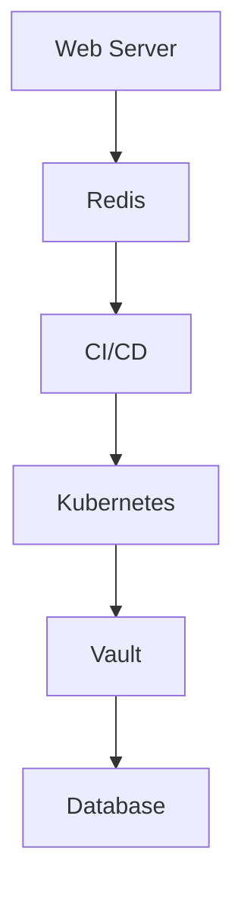

> **本章目标**
>
> 阅读完本章后, 应能够理解:
>
> 为什么传统边界安全模型逐渐失效.
>  云原生时代为什么必须重新定义"信任".
>  零信任出现的历史背景.
>  零信任真正解决的问题是什么.
> 为什么零信任不是一种产品, 而是一种架构思想.

------

# 1.1 安全的本质

在讨论零信任之前, 我们需要先回答一个问题.

**企业到底在保护什么?**

很多人的第一反应是:

- 防火墙
- VPN
- 堡垒机
- 杀毒软件
- IDS/IPS
- WAF

事实上, 这些都不是企业真正需要保护的对象.

企业真正需要保护的是:

- 数据(Data)
- 身份(Identity)
- 业务(Service)
- 计算资源(Compute)
- 知识产权(Intellectual Property)

安全技术存在的目的, 只是为了确保这些资产满足信息安全的三个基本目标:

| 英文        |安全目标    | 含义                   |
| --------------- | ------ | ---------------------- |
| Confidentiality | 机密性 | 数据只能被授权对象访问 |
| Integrity       | 完整性 | 数据不能被非法修改     |
| Availability    | 可用性 | 服务能够持续提供       |

这就是经典的 **CIA Triad**.

传统网络安全的大多数设计, 本质上都是围绕这三个目标展开.

------

# 1.2 传统网络安全模型

互联网刚刚兴起时, 企业 IT 环境十分简单.

典型架构如下:



其特点非常明显:

- 所有服务器位于企业机房.
- 所有员工在办公室办公.
- 所有终端由企业统一管理.
- 企业只有一个互联网出口.
- 网络边界清晰.

因此, 当时形成了一种广泛接受的安全模型.

> **只要进入企业内网, 就默认可信.**

这种思想后来被称为:

> **Perimeter Security**
>
> 边界安全模型.

网络边界成为安全体系的核心.

防火墙负责:

- 阻止外部攻击
- 控制端口开放
- 建立访问控制列表(ACL)

VPN 负责:

- 将远程员工"拉回"企业内网

进入 VPN 后:



企业认为:

> 内网就是安全的.

这是二十多年企业网络安全建设的基础.

------

# 1.3 城堡与护城河模型

传统安全模型还有一个非常经典的名字:

> Castle-and-Moat Model
>
> 城堡与护城河模型.

可以把企业理解成一座城堡.



其中:

护城河(Moat):

- Firewall
- VPN
- IDS
- IPS

城堡内部:

- 数据库
- ERP
- OA
- 邮件系统
- 文件服务器

其核心假设非常简单.

> 城墙外都是敌人.

因此:

所有安全投入都集中在边界.

一旦进入城堡.

内部基本畅通无阻.

例如:



很多企业直到今天仍然保留这种设计.

------

# 1.4 传统模型为什么成功

必须承认.

在当时的技术环境下.

这种设计是合理的.

因为它符合当时 IT 环境的所有特点.

## 网络边界稳定

服务器不会频繁迁移.

IP 地址变化很少.

ACL 容易维护.

------

## 用户固定

员工基本都在办公室.

远程办公极少.

身份与网络位置高度绑定.

例如:

```text
10.10.0.0/16

↓

总部员工
```

网络位置几乎可以代表用户身份.

------

## 应用单体化

大多数业务系统采用单体架构(Monolith).

例如:

```text
ERP

↓

Oracle

↓

NAS
```

服务之间调用极少.

网络拓扑简单.

------

## 数据中心集中

所有业务集中部署.

很少涉及:

- 公有云
- 多云
- SaaS
- 混合云

整个网络可以被一台核心防火墙完整保护.

因此.

边界安全模型在很长时间内运行良好.

------

# 1.5 互联网的发展改变了一切

进入云计算时代以后.

企业 IT 环境发生了根本变化.

首先.

服务器不再属于同一个网络.

例如:



它们共同组成了一套业务系统.

已经不存在统一的网络边界.

------

其次.

办公地点发生变化.

员工可能来自:

- 总部
- 分公司
- 家庭
- 酒店
- 海外
- 手机

例如:



企业已经无法依赖:

> "来自某个 IP 就可信."

------

第三.

业务开始大量 SaaS 化.

例如:

- GitHub
- Slack
- Microsoft 365
- Google Workspace
- Jira
- Confluence

这些关键业务系统.

全部运行在企业网络之外.

网络边界彻底消失.

------

第四.

微服务和 Kubernetes 普及.

以前:

```text
ERP
```

今天:



一次请求可能跨越几十个服务.

传统 ACL 已经无法描述如此复杂的访问关系.

------

# 1.6 网络已经不是安全边界

一个现代企业可能同时拥有:

- 本地数据中心
- Kubernetes 集群
- 多个公有云
- SaaS 平台
- API 网关
- CDN
- 边缘节点
- 移动 App

这些组件之间通过 Internet 相互通信.

如下图所示:



请思考一个问题.

**哪一部分属于企业内网?**

答案是:

几乎没有.

网络边界已经碎片化.

甚至已经不存在.

因此.

依赖网络位置建立信任.

开始失效.

------

# 1.7 新的攻击方式

攻击者也早已改变策略.

过去:

攻击目标是:

```text
Internet

↓

Firewall
```

今天.

攻击目标变成:

- 钓鱼邮件
- OAuth Token
- VPN 凭据
- GitHub Access Token
- 云平台 Access Key
- 容器逃逸
- 软件供应链

因为攻击者已经意识到.

突破防火墙越来越困难.

而获取合法身份.

往往更加容易.

例如:

攻击者通过钓鱼邮件获取员工 VPN 凭据.

传统模型下:



攻击者拥有了"合法身份".

于是.

整个内网默认可信.

这就是近年来大量企业数据泄露事件中的典型攻击路径.

------

# 1.8 横向移动成为最大风险

现代攻击很少依靠一次攻击完成目标.

更多采用:

> Lateral Movement
>
> 横向移动.

即:

攻击者首先控制一台普通服务器.

随后不断寻找更多权限.

最终控制核心数据库.

例如:



如果内部网络默认互信.

攻击者可以快速扩大控制范围.

这也是近年来勒索软件攻击能够迅速扩散的重要原因.

因此.

真正危险的并不是"攻击进入企业".

而是:

> **攻击进入企业以后还能继续移动.**

------

# 1.9 零信任的出现

面对新的 IT 环境和新的攻击方式.

传统边界安全模型已经无法满足需求.

于是.

行业开始重新思考一个问题.

> **为什么一定要相信内网?**

事实上.

网络位置并不能证明:

- 用户身份.
- 设备安全状态.
- 服务是否合法.
- 请求是否符合授权策略.

于是.

一种新的安全思想逐渐形成.

它的核心理念只有一句话.

> **Never Trust, Always Verify.**
>
> 永不默认信任, 持续验证每一次访问.

这就是零信任架构(Zero Trust Architecture, ZTA)的起点.

需要强调的是.

零信任不是一种产品.

不是某个网关.

不是某个 Service Mesh.

也不是某种身份认证协议.

它是一种重新定义企业信任关系的架构思想.

在零信任模型中.

真正决定是否允许访问的.

不再是:

- IP 地址
- VLAN
- 所处网络

而是:

- 身份是否可信.
- 设备是否可信.
- 当前风险是否可接受.
- 是否符合最小权限原则.
- 是否满足授权策略.

------

# 本章总结

本章围绕"为什么需要零信任"展开讨论, 可以归纳出以下几点核心结论:

1. **传统边界安全模型建立在"内网可信"的假设之上**, 在服务器集中、办公地点固定、网络边界清晰的时代具有较高的有效性.
2. **云计算、SaaS、远程办公和 Kubernetes 等技术的发展打破了网络边界**, 企业资源分散在多个云平台和互联网环境中, "内网"这一概念逐渐失去实际意义.
3. **现代攻击更加关注身份获取和横向移动**, 攻击者一旦获得合法凭据, 往往能够绕过边界防护, 在默认互信的内部网络中持续扩展权限.
4. **零信任并不是增加更多安全设备**, 而是重新定义"信任"本身. 信任不再来源于网络位置, 而来源于可验证的身份、动态授权策略和持续风险评估.