# SQL基础01

# 1 学习目标

1. 了解数据库相关的概念
2. 了解并掌握MySQL产品的安装
3. 了解并掌握MySQL服务的使用
4. **重点掌握**MySQL语法规范
5. **重点掌握**数据库的管理语法
6. **重点掌握**数据表的管理语法

# 2 数据库概述

## 2.1 数据库相关概念

### 2.1.1 什么是数据库

数据库的英文为**DataBase**，简称**DB**，是按照数据结构来组织、存储和管理数据的仓库。简而言之，数据库就是存储数据的仓库。

### 2.2.2 什么是数据库管理系统

用于管理DB中数据的系统，我们称为数据库管理系统，又称为数据库**软件**（产品），简称**DBMS**(Database Management System)。

### 2.2.3 什么是结构化查询语言

用于和DBMS通信的语言，叫做结构化查询语言，简称**SQL**。

- SQL92标准(SQL中的普通话)

## 2.2 什么是关系型数据库

- 数据库产品非常多，而目前**最流行**的数据库是MySQL。
- 查看数据库最新排名：https://db-engines.com/en/ranking

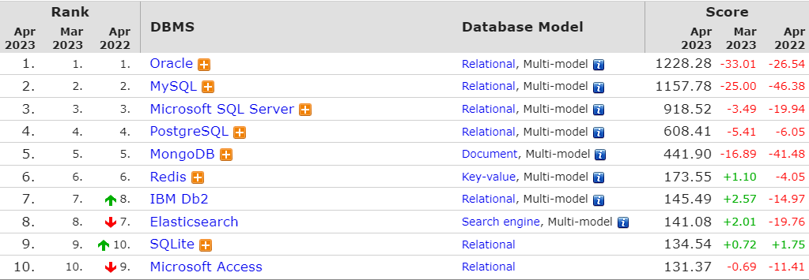

- 而MySQL是**关系型数据库**，关系型数据库的特点是具有特定的组织方式，其以行和列的形式存储数据，以便于用户理解。关系型数据库这一系列的行和列被称为表，一组表组成了数据库。关系模型可以简单理解为二维表格模型，而一个关系型数据库就是由二维表及其之间的关系组成的一个数据集合。

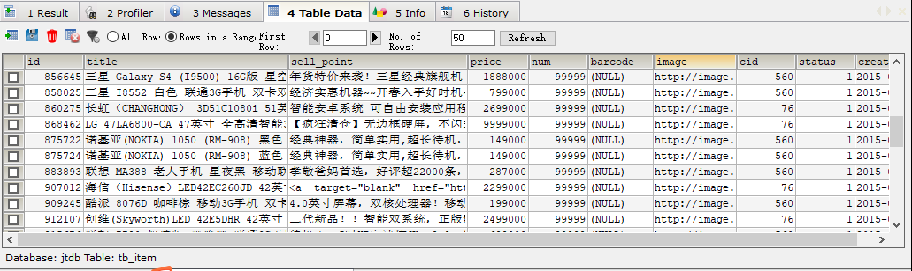

## 2.3 常见的关系型数据库

- MySQL：是一款免费开源、小型、性能优秀、适用于中小型项目、可集群，在WEB应用方面是最好的数据库产品，而其SQL语言是最标准的。
- SQL Server：微软提供的收费数据库产品，Java中使用不多，但是胜在可以兼容微软的所有的平台和系统。
- Oracle：1983年由甲骨文公司开发一款商品化的关系型数据库，是一款收费产品，但是功能强大、性能优异，所以Java中使用者很多，主要是应用于银行、金融、保险等开发大型数据库项目。
- DB2：是一款收费产品，适用于中型/大型、银行/电信等企业、应用于大型应用系统等。
- SQLite：轻量级数据库 ， 安装包只有几十K ， 只有最基础的增删改查功能。

# 3 MySQL的安装

- MySQL安装视频可参考：[http://doc.canglaoshi.orgpic/doc/mysql.html](http://doc.canglaoshi.org/doc/mysql.html) 

- MySQL安装手册可参考：[MySQL安装手册可参考](./MySQL的安装手册.md)

# 4 访问数据库

## 4.1 名称解释

### 4.1.1 数据库（database）

- 在一个MySQL服务器中，可以创建很多的数据库（database）。

- 通常情况下，一个WEB站点对应一个数据库。

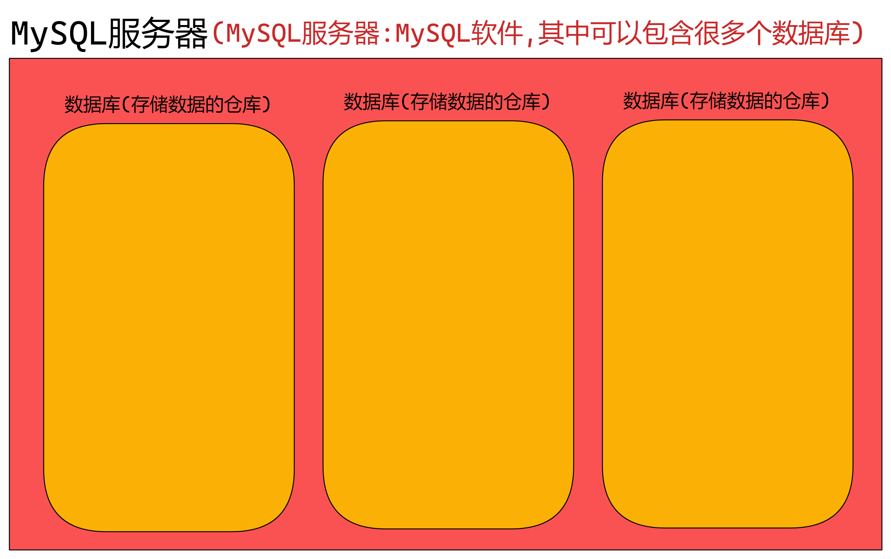

### 4.1.2 数据表（table）

- 在数据库（database）中，可以创建很多张表（table），每个表都有一个表名，用来标识自己，表名具有唯一性。

- 通常情况下，一张表用于保存一类数据，例如网站中的所有用户信息会保存在一张表中，所有商品信息会保存在另一张表中。

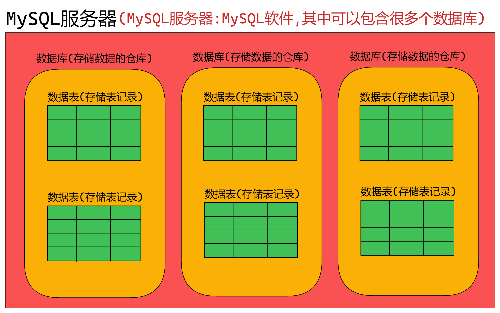

### 4.1.3 表记录（record）

- 在数据表（table）中，可以插入很多条表记录。

- 数据表往往保存一类数据，类似于java中的一个“类”的设计。

- 而一条表记录往往对应java中的一个具体的实例。

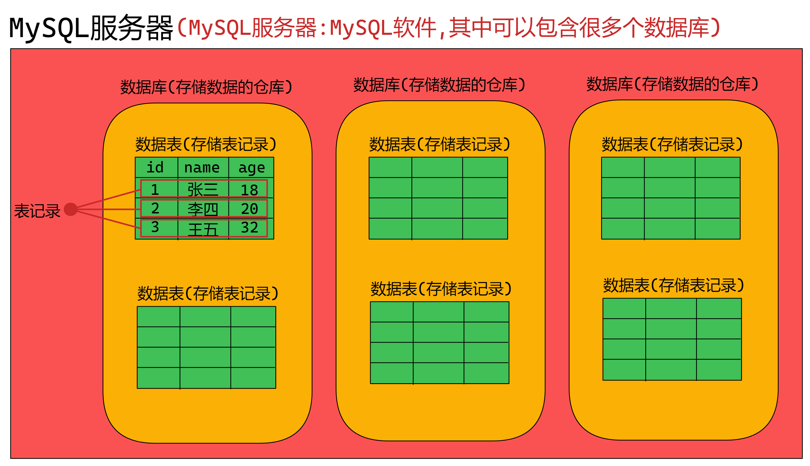

## 4.2 访问MySQL服务器

### 4.2.1 打开服务器

- MySQL安装后,服务器是默认开机自启的

- 选中我的电脑，右键→管理

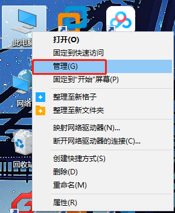

- 服务与应用程序→服务→MySQL→启动

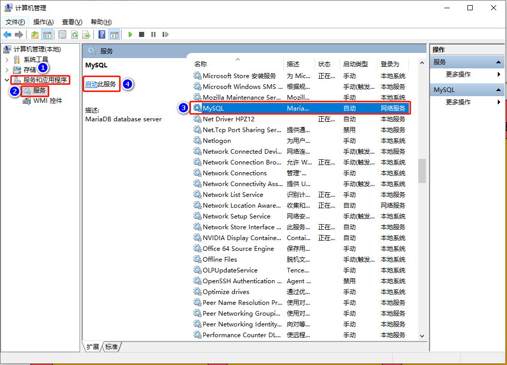

### 4.2.2 连接客户端

- 连接数据库服务器时,都是需要通过客户端连接的
  - 命令行
  - 图形化界面工具
  - JDBC
  - 集成开发环境(IDE)

- 从开始菜单中找到MySQL/MariaDB

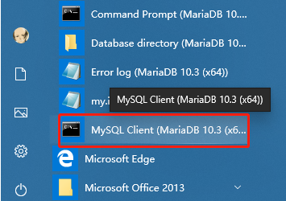

- MySQL Client 打开客户端 ， 输入自己的密码显示Welcome ..... 说明建立好了连接

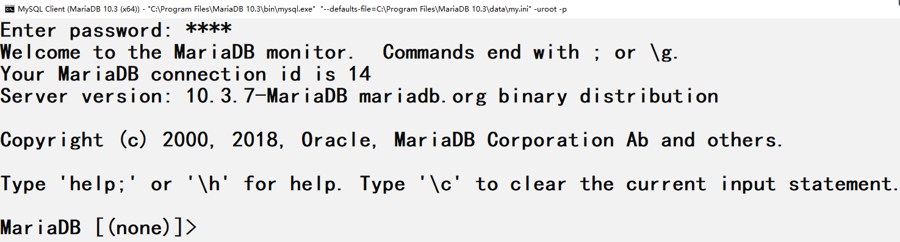

- `mysql -uroot -p密码`也可以登录客户端

### 4.2.3 退出客户端

- 输入“exit”，即可退出客户端

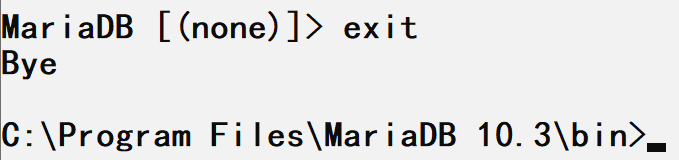

# 5 idea连接数据库

## 5.1 创建java项目

- Project name : JSDSecondStage

## 5.2 准备数据

①下载文件`tedu.sql`,将该文件存储到一个位置(建议:将该文件存储到项目下)

②打开MySQL Client,登录用户后,敲入以下命令,会自动执行该sql文件内容

```mysql
source sql文件的磁盘路径
```

③输入以下指令,查看数据库

```mysql
SHOW DATABASES;
```

## 5.3 idea连接数据库

- maven环境要配置好,否则连接时下载驱动会失败!!!

①打开idea工具，在右边找到“database”选项，点击进入。

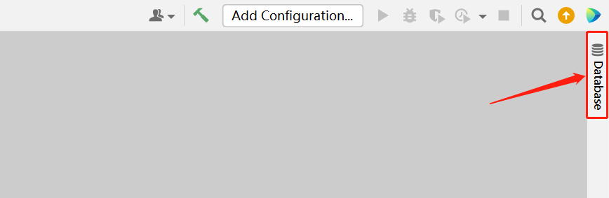

②点击“+”→Data Source→MySQL

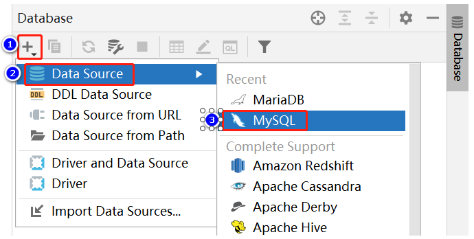

③进入到连接数据库面板，填写对应信息，点击"OK"，设置完成。其中该面板设计的填写内容如下，可参考进行设置。

- Name：设置当前连接的名字，可以自定义名字。
- Comment：设置本次连接的备注，一般根据自身情况填写即可，也可以不填写。
- Host：是填写要连接的数据库服务器主机的ip，而我们学习阶段连接的都是自己的电脑，所以使用本机ip即可连接数据库，但是本机ip书写不便，所以可以使用localhost域名来表示本机ip。
- Port：是填写要连接的数据库服务器主机的端口号，该值一般不需要修改。默认为3306。
- User：是填写登录数据库服务器的用户名，此处我们使用默认root即可，因为root用户是服务器中的超级管理员，具有超级权限，可以控制整个MySQL服务器。
- Password：是填写登录密码，根据实际情况填写，不过一般都是root。

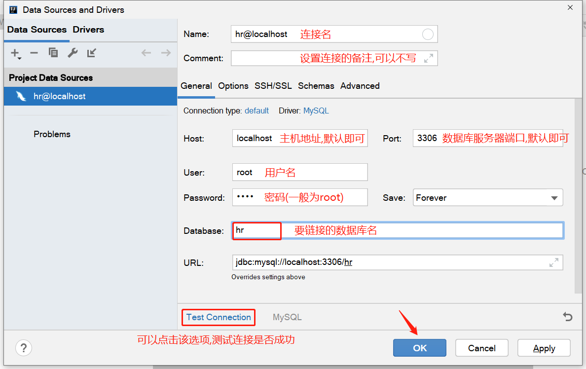

④此时连接成功。

**如果遇到连接失败的情况,请检查Maven环境是否OK**

**如果遇到提示时区问题,则需要配置时区,在`serverTimeZone`处写`Asia/Shanghai`即可**

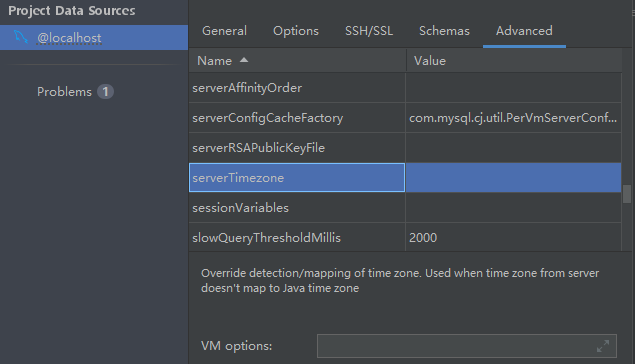

# 6 SQL语言分类

SQL :  结构化查询语言，（Structure Query Language），专门用来操作/访问数据库的通用语言。

- DDL（Data Define Languge）：数据对象定义语言

  ​	CREATE、DROP、ALTER

- DML（Data Manipulate Language）：数据操作语言
  
  ​	INSERT、UPDATE、DELETE、SELECT
  
  - DQL（Data Query Language）：数据查询语言
    
    ​	SELECT
  
- TCL（Transaction Control Language）：事务控制语言
  
  ​	COMMIT、ROLLBACK

# 7 MySQL语法规范

- 不区分大小写，但建议关键字大写，表名、列名小写。
- 多个关键字用空格分隔。
- 使用的符号一定是英文符号。
- 每条命令最好用(;)分号结尾。
- 每条命令根据需要，可以进行缩进或换行。
- 不要使用MySQL关键字作为列名或表名。
- 注释
  - 单行注释：#注释文字 CTRL+/
  - 单行注释：-- 注释文字
  - 多行注释：/* 注释文字 */ CTRL+SHIFT+/

# 8 数据库DDL语言

## 8.1 数据库的管理

### 8.1.1 查看所有数据库

```mysql
#查看所有数据库
SHOW DATABASES;
```

### 8.1.2 建库

#### 8.1.2.1 格式

- 默认字符集格式 。

```mysql
CREATE DATABASE [IF NOT EXISTS] 数据库名;
```

- 指定字符集格式 。

```mysql
CREATE DATABASE [IF NOT EXISTS] 数据库名 CHARSET=utf8;
```

#### 8.1.2.2 例子

①创建默认字符的数据库db1。

```mysql
#创建数据库db1
CREATE DATABASE db1;
```

②创建字符集为GBK的数据库db2。

```mysql
#创建数据库db2，并指定编码为GBK
CREATE DATABASE db2 CHARSET GBK;
```

③查看所有数据库。

```mysql
#查看所有数据库
SHOW DATABASES;
```

④再次创建db2库,但是如果库存在,则不报错

```sql
#创建数据库db2，并指定编码为utf8
CREATE DATABASE IF NOT EXISTS db2 CHARSET GBK;
```

### 8.1.3 查询数据库信息

#### 8.1.3.1 格式

```mysql
SHOW CREATE DATABASE 数据库名;
```

#### 8.1.3.2 例子

- 查询db1数据库信息。

```mysql
#查询db1的数据库信息
SHOW CREATE DATABASE db1;
```

- 查询db2数据库信息。

```mysql
#查询db2的数据库信息
SHOW CREATE DATABASE db2;
```

### 8.1.4 删库

#### 8.1.4.1 格式

```mysql
DROP DATABASE 数据库名;
```

#### 8.1.4.2 例子

- 删除名称是db1的数据库。

```mysql
#删除数据库db1
DROP DATABASE db1;
```

## 8.2 数据表的管理

### 8.2.1 使用数据库

- 执行表相关的SQL之前必须使用了某个数据库.

```mysql
#进入db2数据库
USE db2;
```

### 8.2.2 查看所有表

```mysql
#查看所有表
SHOW TABLES;
```

### 8.2.3 创建表

#### 8.2.3.1 格式

- 如果建库时制定了编码，那么建表时，不指定编码就会使用数据库指定的编码

```mysql
CREATE TABLE 表名(
    字段1名 类型，
    字段2名 类型，
    .....
)[CHARSET=utf8/gbk];
```

#### 8.2.3.2 例子

①创建person表，有name和age字段，编码为gbk

```mysql
CREATE TABLE person(
    name VARCHAR(32),
    age INT
) CHARSET = gbk;
```

②创建student表，有name，chinese，math，english字段，编码为默认编码

```mysql
CREATE TABLE student(
    name VARCHAR(32),
    chinese INT,
    math INT,
    english INT
);
```

③查询所有表

```mysql
#查看所有表
SHOW TABLES;
```

### 8.2.4 查看表结构

#### 8.2.4.1 格式

```mysql
SHOW CREATE TABLE 表名;
```

#### 8.2.4.2 例子

- 查看person表结构

```mysql
#查看person表结构
SHOW CREATE TABLE person;
```

### 8.2.5 查询表字段

#### 8.2.5.1 格式

```mysql
DESC 表名;
```

#### 8.2.5.2 例子

- 查询student表的字段

```mysql
#查询student表的字段
DESC student;
```

### 8.2.6 删除表

#### 8.2.6.1 格式

```mysql
DROP TABLE 表名;
```

#### 8.2.6.2 例子

- 删除名称是student的表

```mysql
#删除student表
DROP TABLE student;
```
