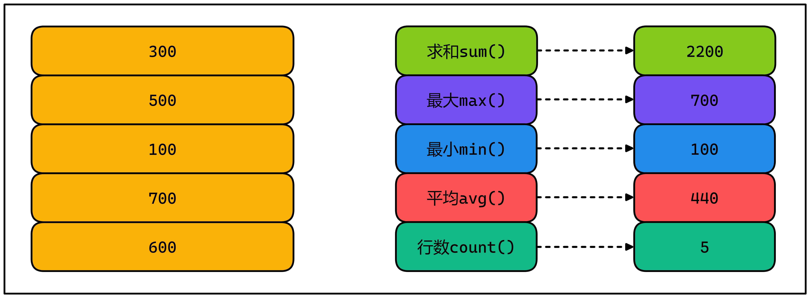
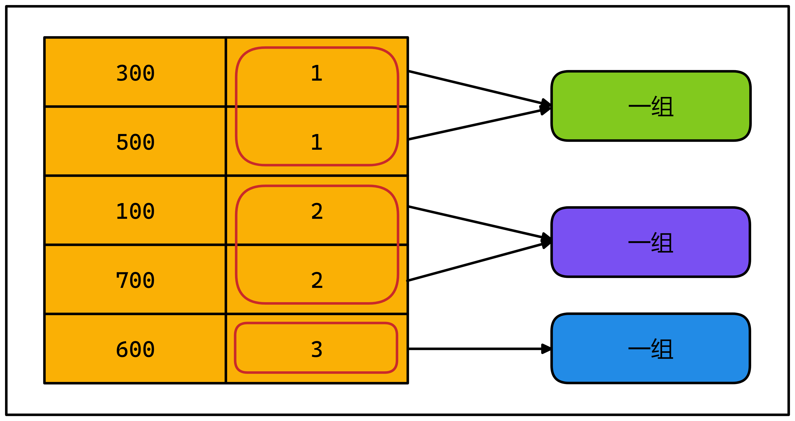

# SQL高级查询02

# 1 学习目标

1. **重点掌握**聚合函数的使用
2. **重点掌握**字段别名
3. **重点掌握**分组查询的语法
4. **重点掌握**having的使用方法
5. 了解子查询的语法
6. **重点掌握**排序查询语法

# 2 排序查询

## 2.1 语法

```mysql
SELECT
	要查询的东西
FROM
	表
WHERE 
	条件
ORDER BY 排序的字段|表达式|函数|别名 [ASC|DESC]
```

- ASC  升序（默认）(从小到大) ascend
- DESC 降序(从大到小) descend

## 2.2 例子

①老师薪水升序排列

```mysql
SELECT id,
       name,
       title,
       salary
FROM teacher
ORDER BY salary;
```

②查询老师信息,并且按所教科目编号升序，相同科目按工资降序

```mysql
SELECT subject_id,
       name,
       title,
       salary
FROM teacher
WHERE subject_id IS NOT NULL
ORDER BY subject_id ASC, salary DESC;
```

③查询所教科目编号为2的老师信息，并按工资降序排列

```mysql
SELECT subject_id,
       name,
       title,
       salary
FROM teacher
WHERE subject_id = 2
ORDER BY salary DESC;
```

④查询所有老师信息,并按主管id排序，相同主管按工资降序

```mysql
SELECT id,
       name,
       manager,
       salary
FROM teacher
ORDER BY manager ASC, salary DESC;
```

# 3 别名

## 3.1 表别名

### 3.1.1 特点

- 使用 MySQL 查询时，当表名很长或者执行一些特殊查询的时候，为了方便操作或者需要多次使用相同的表时，可以为表指定别名，用这个别名代替表原来的名称。

- 在为表取别名时，要保证不能与数据库中的其他表的名称冲突

### 3.1.2 语法格式

```sql
<表名> [AS] <别名>
```

- <表名>：数据中存储的数据表的名称
- <别名>：查询时指定的表的新名称
- AS：关键字为可选参数 ALIAS

### 3.1.3 例子

①查询出老师信息

```sql
SELECT t.id,
       t.name,
       t.age,
       t.title,
       t.manager,
       t.salary,
       t.comm,
       t.gender,
       t.subject_id
FROM teacher AS t;
或者
SELECT t.id,
       t.name,
       t.age,
       t.title,
       t.manager,
       t.salary,
       t.comm,
       t.gender,
       t.subject_id
FROM teacher t;
```

## 3.2 字段别名

### 3.2.1 特点

- 在使用 SELECT 语句显示查询结果时，MySQL 会显示每个 SELECT 后面指定输出的列，在有些情况下，显示的列名称会很长或者名称不够直观，MySQL 可以指定列的别名，替换字段或表达式
- 在where 中不能使用字段别名
- order by 可以使用字段别名

### 3.2.2 语法格式

```sql
<列名> [AS] <列别名>
```

- <列名>：为表中字段定义的名称。
- <列别名>：字段新的名称。
- AS：关键字为可选参数

### 3.2.3 例子

①计算出每个老师的年薪

```mysql
SELECT id 老师id,
       name 姓名,
       age 年龄,
       title 职称,
       manager 领导id,
       salary 薪资,
       comm 奖金,
       salary*12 年薪,
       gender 性别,
       subject_id 所教科目
FROM teacher
WHERE salary*12 >= 120000
ORDER BY 年薪 DESC;
```

# 4 多行函数(聚合函数)

## 4.1 特点

- 多行数据，运算产生一行结果



- 多行函数，不能和其他普通字段一起查询
  - 其他数据库会禁止执行
  - mysql可以执行，只是把第一条数据显示出来

- 多行函数可以一起查询
- 多行函数会忽略null值
- count(a)对指定字段的值计数，重复值会重复计数
- 可以用distinct去除重复
- count(*) 计算行数*
- count(*) 数据量大时（千万），效率低

## 4.2 例子

①查询全体老师的平均薪资

```mysql
SELECT AVG(salary) 平均薪资
FROM teacher;
```

​	**注意**:但是注意，不能和其他字段一起查询

```mysql
SELECT AVG(salary),
       id,
       name
FROM teacher;
```

- mysql可以执行，只是把第一条数据显示出来，容易造成误解

②查询全体老师的薪资总和，平均薪资，最大薪资，最低薪资，人员数量(多行函数可以一起查询)

```mysql
SELECT SUM(salary)   薪资总和,
       AVG(salary)   平均薪资,
       MAX(salary)   最大薪资,
       MIN(salary)   最低薪资,
       COUNT(salary) 人员数量
FROM teacher;
```

③查询comm字段非null值的总数(多行函数会忽略null值)

```mysql
SELECT COUNT(comm),
       COUNT(*)
FROM teacher;
```

④共有多少个职称(可以用distinct去除重复)

```mysql
SELECT COUNT(DISTINCT title)
FROM teacher;
```

⑤职称为一级讲师的人数

```mysql
SELECT COUNT(*)
FROM teacher
WHERE title = '一级讲师';
```

# 5 分组查询

## 5.1 含义

- 按指定字段，相同的值，分组计算

## 5.2 语法

```mysql
SELECT 查询的字段，分组函数
FROM 表
GROUP BY 分组的字段
```

## 5.3 特点

- 可以按单个字段分组
- 和分组函数一同查询的字段最好是分组后的字段
- 可以按多个字段分组，字段之间用逗号隔开
- 可以支持排序



## 5.4 例子

①查询各个职称的老师人数(分组字段，可以和多行函数一起查询)

```mysql
SELECT title,COUNT(*)
FROM teacher
GROUP BY title;
```

②每个职称中的最高工资

```mysql
SELECT title,MAX(salary)
FROM teacher
GROUP BY title;
```

③每个班级中，每个职位的学生人数，按班级编号排序

```mysql
SELECT class_id, job, COUNT(*) c
FROM student
WHERE class_id IS NOT NULL AND job IS NOT NULL
GROUP BY class_id, job
ORDER BY class_id;
```

# 6 HAVING

## 6.1 含义

- having对分组求出的多行函数结果进行过滤

## 6.2 where和having

- where最先执行，只能过滤普通条件
- having分组计算完多行函数之后，执行过滤
- having也可以过滤普通条件，但不应该这样做

|            |    针对的表    |      位置      | 关键字 |
| :--------: | :------------: | :------------: | :----: |
| 分组前筛选 |     原始表     | group by的前面 | where  |
| 分组后筛选 | 分组后的结果集 | group by的后面 | having |

## 6.3 例子

①只有3个人的班级

```mysql
SELECT class_id, COUNT(*) c
FROM student
WHERE class_id IS NOT NULL
GROUP BY class_id
HAVING c = 3;
```

②人数大于60的班级

```mysql
SELECT class_id, COUNT(*) c
FROM student
WHERE class_id IS NOT NULL
GROUP BY class_id
HAVING c > 60;
```

# 7 子查询

## 7.1 含义

- 一条查询语句中又嵌套了另一条完整的select语句，其中被嵌套的select语句，称为子查询或内查询
- 在外面的查询语句，称为主查询或外查询,简单理解,就是**将一个查询的结果，作为另一个查询的过滤条件**

## 7.2 特点

- 子查询都放在小括号内
- 子查询可以放在from后面、select后面、where后面、having后面，但一般放在条件的右侧
- 子查询优先于主查询执行，主查询使用了子查询的执行结果
- 子查询根据查询结果的行数不同分为单行子查询和多行子查询

## 7.3 单行子查询

### 7.3.1 特点

- 结果集只有一行
- 一般搭配单行操作符使用：> < = <> >= <= 
- 非法使用子查询的情况：
- 子查询的结果为一组值
- 子查询的结果为空

### 7.3.2 例子

①拿最低工资的老师

```mysql
SELECT id,
       name,
       salary
FROM teacher
WHERE salary = (
    SELECT MIN(salary)
    FROM teacher
);
```

②工资低于平均工资的老师

```mysql
SELECT id,
       name,
       salary
FROM teacher
WHERE salary < (
    SELECT AVG(salary)
    FROM teacher
)
ORDER BY salary DESC ;
```

## 7.4 多行子查询

### 7.4.1 特点

- 结果集有多行
- in： 属于子查询结果中的任意一个就行

### 7.4.2 例子

①查询只有4个人拥有的职称的老师信息

```mysql
SELECT id,
       name,
       salary,
       title
FROM teacher
WHERE title IN (
    SELECT title
    FROM teacher
    GROUP BY title
    HAVING COUNT(*) = 4
)
ORDER BY salary DESC ;
```

②每个职称中，拿最低工资的老师

```mysql
SELECT id,
       name,
       salary,
       title
FROM teacher
WHERE (title,salary) IN (
    SELECT title,MIN(salary)
    FROM teacher
    GROUP BY title
)
ORDER BY salary DESC ;
```
