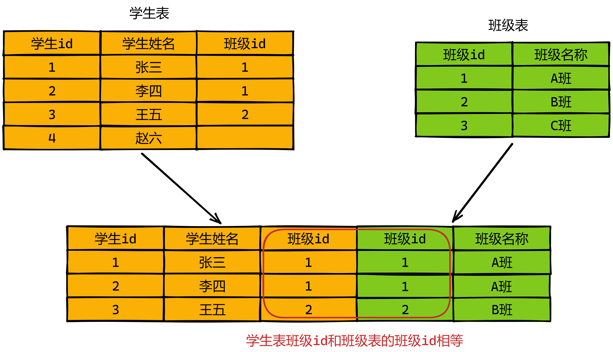
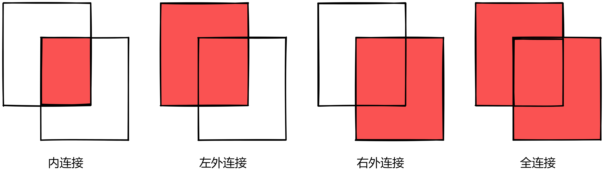

# SQL高级查询

# 1 学习目标

1. **重点掌握**分组查询的语法

2. **重点掌握**分页查询的语法

# 2 分页查询

## 2.1 语法

```mysql
SELECT 字段|表达式,...
FROM 表
[WHERE 条件]
[GROUP BY 分组字段]
[HAVING 条件]
[ORDER BY 排序的字段]
LIMIT [起始的条目索引,]条目数;
```

## 2.2 特点

- 起始条目索引从0开始

- limit子句放在查询语句的最后

- **公式**：
  
  **`SELECT * FROM 表 LIMIT (page-1) *  size , size`**

  - 每页显示条目数:size
  - 要显示的页数:page
  
- 例子:
  - limit 10    前10行
  - limit 0,10   第1行开始的10行
  - limit 10,10  第11行开始的10行
  - limit 100,10  第101行开始的10行
  - 数据量大时(千万)，分页数据越往后越慢

## 2.3 例子

①查询student表中前10行记录

```mysql
SELECT id,
       name,
       job
FROM student
LIMIT 10;
```

②查询student表中第1行记录开始后的10行记录

```mysql
SELECT id,
       name,
       job
FROM student
LIMIT 0,10;
```

③查询student表中第11行记录开始后的10行记录

```mysql
SELECT id,
       name,
       job
FROM student
LIMIT 10,10;
```

# 3 多表连接查询

## 3.1 含义

- 两张表，按指定条件连接，连接成一张表



## 3.2 内连接

### 3.2.1 语法

```mysql
SELECT 字段,...
FROM 表1,表2
WHERE 筛选条件;
```

### 3.2.2 例子

#### 3.2.2.1 查询老师信息，并附带显示所教课程名称

- 我们可以发现teacher有课程id字段，所以是可以关联subject表的

```mysql
SELECT t.name,
       t.subject_id,
       s.id,
       s.name
FROM teacher t,
     subject s
WHERE s.id = t.subject_id;
```

#### 3.2.2.2 查询班级信息以及班级负责老师

- class表中包含teacher_id字段，所以也可以关联teacher表

```mysql
SELECT c.name,
       c.teacher_id,
       t.id,
       t.name
FROM class c,
     teacher t
WHERE c.teacher_id = t.id;
```

#### 3.2.2.3 查询学生信息以及学生所在城市

- 发现student表中还包含location_id字段，该字段是学生所在城市的编号，并且是取自于location表，所以这两个字段也是可以关联的

```mysql
SELECT s.name,
       s.location_id,
       l.id,
       l.name
FROM student s,
     location l
WHERE s.location_id = l.id;
```

#### 3.2.2.4 查询老师信息并包含老师的主管信息

- 此处需要使用**自连接**，就是将一张表看做是两张表

- 经过分析可知,老师的信息在teacher表，而老师的主管是manger字段，该字段的值是取自于teacher表的，所以此时可以将teacher表即当成老师表，也可以当成主管表

```mysql
SELECT t1.name,
       t1.manager,
       t2.id,
       t2.name
FROM teacher t1,
     teacher t2
WHERE t1.manager = t2.id;
```

## 3.3 外连接

### 3.3.1 概念

- 内连接：只查询符合连接条件的数据
- 外连接：连接条件以外的数据，也要查询出来
  - 左外连接：左侧表中连接条件之外的数据
  - 右外连接：右侧表中连接条件之外的数据
  - 全外连接：双侧表中连接条件之外的数据



### 3.3.2 语法

- 内连接

```mysql
SELECT ...
FROM a INNER JOIN b 
ON(连接条件)
```

- 左外连接

```mysql
SELECT ...
FROM a LEFT [OUTER] JOIN b 
ON(连接条件)
```

- 右外连接

```mysql
SELECT ...
FROM a RIGHT [OUTER] JOIN b 
ON(连接条件)
```

- 全外连接(mysql不支持)

```mysql
SELECT ...
FROM a FULL [OUTER] JOIN b 
ON(连接条件)
```

### 3.3.3 例子

①查询老师信息，并附带显示所教课程名称如果没有所教课程,则不显示

```mysql
SELECT t.name,
       t.subject_id,
       s.id,
       s.name
FROM teacher t
         INNER JOIN subject s ON s.id = t.subject_id;
```

②查询班级信息以及班级负责老师，有负责老师显示负责老师，没有负责老师显示NULL

```mysql
SELECT c.name,
       c.teacher_id,
       t.id,
       t.name
FROM class c
         LEFT JOIN teacher t ON c.teacher_id = t.id;
```

③查询学生信息以及学生所在城市,有城市显示城市,没有城市显示NULL

```mysql
SELECT s.name,
       s.location_id,
       l.id,
       l.name
FROM student s LEFT JOIN location l ON s.location_id = l.id;
```

④查询班级的负责老师,以及该老师负责教授的科目

```sql
SELECT c.name,
       t.name,
       s.name
FROM class c
         LEFT JOIN teacher t ON c.teacher_id = t.id
         LEFT JOIN subject s ON t.subject_id = s.id;
```

⑤查询所有学生各科成绩

```sql
SELECT s.name,
       s2.name,
       tsss.score
FROM t_stu_subject_score tsss
         LEFT JOIN student s ON tsss.stu_id = s.id
         LEFT JOIN subject s2 on tsss.subject_id = s2.id;
```

 
