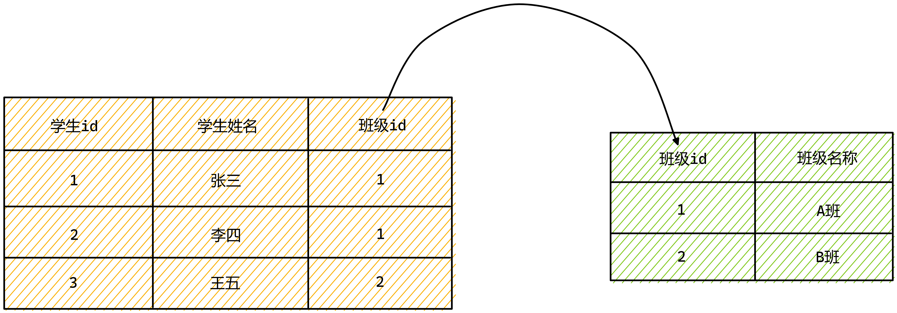

# SQL增删改操作

# 1 学习目标

1. **重点掌握**插入单条记录的语法
2. 了解全表插入记录的语法
3. **重点掌握**修改记录的语法
4. **重点掌握**删除记录的语法
5. **重点掌握**主键约束、外键约束
6. 了解检查约束、非空约束、唯一约束

# 2 数据类型

- MySQL支持多种数据类型，大致可以分类三类：数值、日期和字符串。

## 2.1 数值类型

### 2.1.1 分类

|     类型     |                             特点                             |
| :----------: | :----------------------------------------------------------: |
|   tinyint    |                            1字节                             |
|   smallint   |                            2字节                             |
|     int      |                            4字节                             |
|    bigint    |                            8字节                             |
|    float     |                        4字节，单精度                         |
|    double    |                        8字节，双精度                         |
| decimal(m,n) | 定点数，固定长度的小数位，<br>decimal(6,4)表示整数位2位，小数位4位，一共6位，<br>字节量： m+2 |

### 2.1.2 例子

```mysql
USE db2;
CREATE TABLE tb6(
    a INT(5),
    b DOUBLE(6, 4),
    c DECIMAL(6, 4)
) CHARSET = utf8;
INSERT INTO tb6 VALUES(5, 45.2345, 56.3456);
```

## 2.2 字符串类型

### 2.2.1 分类

|  类型   |                             描述                             |
| :-----: | :----------------------------------------------------------: |
|  char   | 定长字符串，最长不能超过255个字符,char(6)则表示定长6个字符,<br/>超过6位，可能出错，也可能截断，不足6位，在后面添加空格 |
| varchar | 变长字符串，最大65535个字节,varchar(6)如果指定的最大长度，<br/>在255个字节内，在前面会加1个字节，表示字符串的字节长度最大长度大于255，<br/>在前面加2个字节，表示字符串的字节长度<br/>char和varchar区别：char效率高varchar效率低，读取时，先读取长度值，再取字符串 |
|  text   | 65535个字节<br/>latin1  - 字符数量：65535<br/>gbk   - 65535/2 个字符<br/>utf8   - 65535/3 个字符 |

### 2.2.2 例子

```sql
USE db2;
CREATE TABLE tb7(
    a CHAR(6),
    b VARCHAR(6),
    c TEXT
) CHARSET = utf8;
INSERT INTO tb7 VALUES ('abcdef', 'abc', 'asdfasdfasfwewefw');
SELECT * FROM tb7;
```

## 2.3 日期类型

### 2.3.1 分类

|   类型    | 描述                                                         |
| :-------: | :----------------------------------------------------------- |
| datetime  | 年月日时分秒                                                 |
|   date    | 年月日                                                       |
|   time    | 时分秒                                                       |
| timestamp | 时间戳:时间范围，只到2038年第一个timestamp字段，<br>会在修改这行数据时，自动修改成系统当前时间 |

### 2.3.2 例子

```mysql
USE db2;
CREATE TABLE tb8(
    a DATETIME,
    b DATE,
    c TIME,
    d TIMESTAMP
) CHARSET = utf8;
INSERT INTO tb8(a, b, c) VALUES (NOW(), NOW(), NOW());
SELECT * FROM tb8;
```

# 3 插入数据

- 在数据库中的一个表中增添数据并不是随意的，我们之前在创建表的时候规定过表中可以容纳几列数据，每列数据的类型，我们要根据可以容纳几列数据，每列数据的类型来进行新增数据的操作。
- 在创建表的初期所决定的数据类型是决定整张表数据类型的基础 ，新增数据的基础是创建表的时候所决定的数据类型。

## 3.1 前期准备

- 使用db2库

```mysql
USE db2;
```

- 查看库中person表结构

```mysql
DESC person;
```

## 3.2 语法

### 3.2.1 全表插入单条记录

- 单行的输入数据，把表中一行全部填满，全列输入的意思就是把表中所有字段全部填满。

#### 3.2.1.1 格式

- 插入的值的顺序需要和表中的字段顺序一致

```mysql
INSERT INTO 表名 VALUES(值1,值2);
```

#### 3.2.1.2例子

- 向person表中插入一条记录,name为tom,age为18

```mysql
INSERT INTO person VALUES("tom",18);
#查询表中记录
SELECT * FROM person;
```

### 3.2.2 指定字段插入单条记录

#### 3.2.2.1 格式

```mysql
INSERT INTO 表名(字段1名,字段2名) VALUES(值1,值2);
```

#### 3.2.2.2 例子

- 向person表中插入一条记录,name为jerry,age不传值

```mysql
INSERT INTO person (name) VALUES ("jerry");
#查询表中记录
SELECT * FROM person;
```

### 3.2.3 全表插入格式

#### 3.2.3.1 格式

```mysql
INSERT INTO 表名 VALUES(值1,值2),(值1,值2),(值1,值2);
```

#### 3.2.3.2 例子

- 向person表中插入两条记录,分别是name为lucy,age为21的记录和name为lily,age为22的记录

```mysql
INSERT INTO person VALUES("lucy",21),("lily",22);
#查询表中记录
SELECT * FROM person;
```

### 3.2.4 指定字段插入格式

#### 3.2.4.1 格式

```mysql
INSERT INTO 表名 (字段1名,字段2名) VALUES(值1,值2),(值1,值2);
```

#### 3.2.4.2 例子

- 向person表中插入三条记录,分别是name为danny,name为hanmeimei,name为lilei的记录

```mysql
INSERT INTO person (NAME) VALUES("danny"),("hanmeimei"),("lilei");
#查询表中记录
SELECT * FROM person;
```

# 4 修改数据

## 4.1 数据准备

- 为了方便修改内容，我们提前向person表中插入新的记录

```mysql
INSERT INTO person VALUES('刘备',40),('关羽',30),('悟空',20),('八戒',10),('张学友',5);
#查询表中记录
SELECT * FROM person;
```

## 4.2 格式

```mysql
UPDATE 表名 SET 字段名=值,字段名=值 WHERE 条件;
```

## 4.3 例子

①将name为刘备的记录的age属性，修改为88

```mysql
UPDATE person SET age = 88 WHERE name = "刘备";
#查询表中记录
SELECT * FROM person;
```

②将age为5的记录的name属性，修改为黎明

```mysql
UPDATE person SET name = "黎明" WHERE age = 5;
#查询表中记录
SELECT * FROM person;
```

③将name为关羽的记录的name属性修改为张飞，age属性修改为18

```mysql
UPDATE person SET name = "张飞",age = 18 WHERE name = "关羽";
#查询表中记录
SELECT * FROM person;
```

# 5 删除数据

## 5.1 格式

```mysql
DELETE FROM 表名 [WHERE 条件];
```

## 5.2 例子

①删除name为张飞的记录

```mysql
DELETE FROM person WHERE name = "张飞";
#查询表中记录
SELECT * FROM person;
```

②删除age小于30的记录，也就是删除年龄小于30岁的记录

```mysql
DELETE FROM person WHERE age < 30;
#查询表中记录
SELECT * FROM person;
```

③删除整张表的记录

但是由于idea担心我们删除整张表的操作太过于危险，会有提示，点击Execute执行即可


```mysql
DELETE FROM person;
#查询表中记录
SELECT * FROM person;
```

# 6 约束

## 6.1 约束的概念

- 约束是作用于表中列上的规则，用于限制加入表的数据。

- 约束的存在保证了数据库中数据的正确性、有效性和完整性。

## 6.2 约束的分类

| 约束名称 | 描述                                                        | 关键字      |
| -------- | ----------------------------------------------------------- | ----------- |
| 非空约束 | 保证列中所有的数值不能有null值                              | NOT NULL    |
| 唯一约束 | 保证列中所有数据各不相同                                    | UNIQUE      |
| 主键约束 | 主键是一行数据的唯一标识,要求非空且唯一                     | PRIMARY KEY |
| 检查约束 | 保证列中的值满足某一条件                                    | CHECK       |
| 外键约束 | 外键用来让两个表的数据之间建立链接,保证数据的一致性和完整性 | FOREIGN KEY |

## 6.3 主键约束

### 6.3.1 概念

- 主键 : 表示数据唯一性的字段称为主键  
- 约束 : 创建表时,给表字段添加的限制条件  
- 主键约束 : 限制主键的值唯一且非空

### 6.3.2 特点

- 主键字段，尽量不使用业务数据

  比如这张学生表，本身学号就可以具备主键的功能了，但是学号本身也是业务数据，所以我们建议创建新的id作为主键

| id(PK) |     学号     | 姓名 | ...  |
| :----: | :----------: | :--: | ---- |
|   1    | 201319200009 | 张三 |      |
|   2    | 201319200010 | 李四 |      |
|   3    |     ...      |      |      |

- 应使用无意义数据作为主键

  - 随机产生的字符串

    比如这张人员表，主键就是一串随机生成的字符串

  |      id(PK)      |   身份证号   | 姓名 | ...  |
  | :--------------: | :----------: | :--: | ---- |
  | tyhe34y53453453d | 123412341234 | 张三 |      |
  | 46745eh35u65uj54 | 456745674567 | 李四 |      |

  - 自动增加的数字

    比如这张电信计费表，主键就是自动增加的数字

  | id(PK) |    手机号    | 金额 | ...  |
  | :----: | :----------: | :--: | ---- |
  |   1    | 123412341234 |  56  |      |
  |   2    | 567856785678 |  86  |      |

### 6.3.3 添加主键约束语法

- 新建表时，添加主键约束

```mysql
CREATE TABLE 表名(
    列名 数据类型 PRIMARY KEY,
    ......
); 
```

### 6.3.4 例子

```mysql
USE db2;
CREATE TABLE tb1 (
    id INT PRIMARY KEY,
    NAME VARCHAR(50)
) CHARSET=utf8;
DESC tb1;
INSERT INTO tb1 VALUES(1,'a'), (2,'b'),(3,'c');
INSERT INTO tb1 VALUES (1,"d"); 
INSERT INTO tb1 VALUES(NULL, 'd');
```

### 6.4 自增主键

- 整数主键字段，可以设置成自动增加

### 6.4.1 添加自增主键语法

```mysql
CREATE TABLE 表名(
    列名 数据类型 PRIMARY KEY AUTO_INCREMENT,
    ......
); 
```

### 6.4.2 例子

```mysql
USE db2;
CREATE TABLE tb2(
    id   INT PRIMARY KEY AUTO_INCREMENT,
    NAME VARCHAR(20)
) CHARSET = utf8;
INSERT INTO tb2(NAME)VALUES ('张三'),('李四'),('王五');
INSERT INTO tb2 VALUES (NULL, '赵六');
SELECT * FROM tb2;
```

## 6.5 非空约束

### 6.5.1 概念

- 保证列中所有的数值不能有null值

### 6.5.2 添加非空约束语法

```mysql
CREATE TABLE 表名(
    列名 数据类型 NOT NULL,
    ......
);
```

### 6.5.3 例子

```mysql
USE db2;
CREATE TABLE tb3(
    id   INT PRIMARY KEY AUTO_INCREMENT,
    name VARCHAR(20) NOT NULL
) CHARSET = utf8;
INSERT INTO tb3(name) VALUES ('a');
INSERT INTO tb3(name) VALUES (NULL);
```

## 6.6 唯一约束

### 6.6.1 概念

- 唯一:唯一性，可以为空，但是只能有一个

### 6.6.2 添加唯一约束语法

```mysql
CREATE TABLE 表名(
    列名 数据类型 UNIQUE,
    ......
);
```

### 6.6.3 例子

```mysql
USE db2;
CREATE TABLE tb4(
    id   INT PRIMARY KEY AUTO_INCREMENT,
    NAME VARCHAR(20) UNIQUE
) CHARSET = utf8;
INSERT INTO tb4(name)VALUES ('a'),('b');
INSERT INTO tb4(name)VALUES ('a');
```

## 6.7 检查约束

### 6.7.1 概念

- 检查:对该列数据的范围，格式的限制
- 但是MySQL8.0版本以下没有实现检查约束

### 6.7.2 添加检查约束语法

```mysql
CREATE TABLE 表名(
    ......,
    CHECK (字段条件表达式)
); 
```

### 6.7.3 例子

```mysql
USE db2;
CREATE TABLE tb5(
    age INT,
    gender CHAR(1),
    CHECK (age >= 7 AND age <= 60),
    CHECK (gender IN ('M', 'F'))
);
INSERT INTO tb5 VALUES (18,'M');
INSERT INTO tb5 VALUES (1,'A');
```

## 6.8 外键约束

### 6.8.1 概念

- 约束一个字段的取值，只能从指定的主键字段中取值



### 6.8.2 特点

- 取消被引用的主键，必须先取消外键
- 被引用的主键数据，不能删除，必须先删除子数据，或修改子数据
- 删除主表，必须先取消外键引用，或先删除子表
- 外键会降低效率
- 高压力系统中，一般不添加外键约束

### 6.8.3 创建外键约束语法

```mysql
CREATE TABLE 表名(
    ......,
    FOREIGN KEY(外键列名) REFERENCES 表名(主键列名)
); 
```

### 6.8.4 例子

```mysql
USE db2;
CREATE TABLE banji(
    id   INT PRIMARY KEY AUTO_INCREMENT,
    name VARCHAR(20)
) CHARSET = utf8;
CREATE TABLE xuesheng(
    id INT PRIMARY KEY AUTO_INCREMENT,
    name VARCHAR(20),
    ban_id INT,
    FOREIGN KEY (ban_id) REFERENCES banji (id)
) CHARSET = utf8;
INSERT INTO banji(name) VALUES('A'),('B');
INSERT INTO xuesheng(name,ban_id)VALUES('张三',1),('李四',2),('王五',1);
INSERT INTO xuesheng(name,ban_id)VALUES('aaa',99);
```


