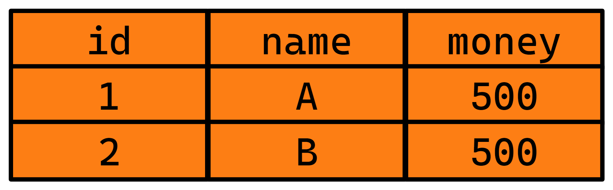
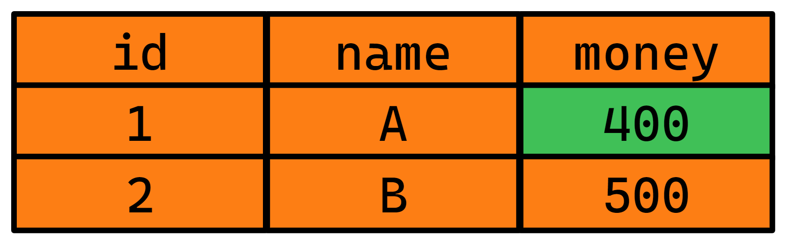
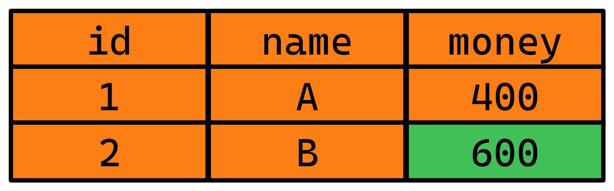

# 数据库事务

# 1 学习目标

1. 了解数据库事务的概念

2. 了解数据库事务的隔离级别

3. **重点掌握**开启事务、提交事务和回滚事务

# 2 数据库事务概述

## 2.1 含义

- 事务由一组sql语句组成，所有sql语句执行成功，事务整体成功，任一条sql语句失败，整体事务失败，数据恢复到事务之前的状态

## 2.2 例子

- 进行A给B转账100元的操作
- 比如有一张user表,有三个字段id,name和money,分别包含两条记录



- 此时我们进行A给B转账100元的操作,就会至少分为两步来操作这张表

  - 首先执行**`UPDATE USER SET money=money-100 WHERE name='A'`**,将A账户的金额减去100

  

  - 然后再执行**`UPDATE USER SET money=money+100 WHERE name='B'`**,将B账户的金额增加100

  

- 那么此时如果两条sql语句都成功，转账成功

- 任意一条sql语句失败，恢复以前的状态

# 3 特点ACID

- **原子性Atomic**：数据操作的最小单元是事务，而不是SQL语句

- **一致性Consistency**：保证数据的状态操作前和操作后保持一致

- **隔离性Isolation**：多个事务同时操作相同数据库的同一个数据时，一个事务的执行不受另外一个事务的干扰

- **持久性Durancy**：指一个事务一旦被提交，它对数据库中数据的改变就是永久性的，接下来即使数据库发生故障也不应该对其有任何影响

# 4 事务操作

## 4.1 开始事务

```mysql
START TRANSACTION;
或者
BEGIN;
```

- 数据增删改操作，不直接修改数据表,而是在日志文件中记录修改

## 4.2 提交事务

```mysql
COMMIT;
```

- 将日志中记录的修改操作，永久保存到数据表,日志文件清空

## 4.3 回滚事务

```mysql
ROLLBACK;
```

- 日志文件清空

# 5 事务测试

## 5.1 准备数据

```mysql
#创建数据库transaction,并指定编码为utf8
CREATE DATABASE transaction CHARSET utf8;
#使用transaction库
USE transaction;
#创建用户表user
CREATE TABLE user(
    id INT PRIMARY KEY AUTO_INCREMENT,
    name VARCHAR(50),
    money DOUBLE
) CHARSET UTF8;
```

## 5.2 测试提交

| 会话1                                                        | 会话2                                        |
| ------------------------------------------------------------ | -------------------------------------------- |
| #会话1插入一条记录 <br />INSERT INTO user VALUES (null,'A',1000); <br />#会话1查询表中记录 <br />SELECT * FROM user; |                                              |
|                                                              | #会话2查询表中记录 <br />SELECT * FROM user; |
| #会话1开启事务 <br />BEGIN; <br />#将name为A的记录的money值在本身的基础上减少100 <br />UPDATE user SET money = money - 100 WHERE name='A'; <br />#会话1查询表中记录 <br />SELECT * FROM user; |                                              |
|                                                              | #会话2查询表中记录 <br />SELECT * FROM user; |
| #会话1提交事务 <br />COMMIT                                  |                                              |
|                                                              | #会话2查询表中记录 <br />SELECT * FROM user; |

## 5.3 测试回滚

| 会话1                                                        | 会话2                                        |
| ------------------------------------------------------------ | -------------------------------------------- |
| #会话1插入一条记录 <br />INSERT INTO user VALUES (null,'B',1000); <br />#会话1查询表中记录 <br />SELECT * FROM user; |                                              |
|                                                              | #会话2查询表中记录 <br />SELECT * FROM user; |
| #会话1开启事务 <br />BEGIN; <br />#将name为B的记录的money值在本身的基础上增加100<br />UPDATE user SET money = money + 100 WHERE name='B';<br />#会话1查询表中记录 <br />SELECT * FROM user; |                                              |
|                                                              | #会话2查询表中记录 <br />SELECT * FROM user; |
| #会话1回滚数据 <br />ROLLBACK; <br />#会话1查询表中记录 <br />SELECT * FROM user; |                                              |

# 6 事务隔离级别

## 6.1 事务并发问题如何发生?

- 当多个事务同时操作同一个数据库的相同数据时

## 6.2 事务的并发问题有哪些?

- 脏读

  一个事务读取到了另外一个事务未提交的数据

> ```sql
> BEGIN;
> UPDATE user SET money = money - 100 WHERE name='A'; #(A通知B账户)
> UPDATE user SET money = money + 100 WHERE name='B'; #(B查询账户金额)
> ROLLBACK;#(B查询账户金额发现数据不一致,就是读取到了脏读数据) 
> ```

- 不可重复读

  一个事务提交的数据，可以被另一个事务立即读取,可能发生与第一次查询数据不一致

- 幻读

  一个事务读取数据时，另外一个事务进行更新，导致第一个事务读取到了没有更新的数据,读取不到新插入的数据

## 6.3 如何避免事务的并发问题?

- 通过设置事务的隔离级别(从低到高)
  - READ UNCOMMITTED **读未提交**
  - READ COMMITTED **读已提交** 可以避免脏读
  - REPEATABLE READ **为可重复读 ** 默认隔离级别,可以避免脏读、不可重复读
  - SERIALIZABLE **序列化** 可以避免脏读、不可重复读和幻读

## 6.4 如何设置隔离级别?

- 查看隔离级别

```mysql
SELECT @@tx_isolation;
```

- 设置隔离级别为读未提交

```mysql
SET tx_isolation='read-uncommitted';
```

- 设置隔离级别为读已提交

```mysql
SET tx_isolation='read-committed';
```

- 设置隔离级别为可重复读

```mysql
SET tx_isolation='repeatable-read';
```

- 设置隔离级别为序列化

```mysql
SET tx_isolation='serializable';
```

