# JDBC

# 1 学习目标

1. 了解JDBC的概念
2. **重点掌握**JDBC的CRUD
3. **重点掌握**JDBC的各个对象的使用

# 2 GIT

- 查看安装手册

# 3 JDBC概述

## 3.1 数据的持久化

- 持久化(persistence)：**把数据保存到可掉电式存储设备中以供之后使用**。大多数情况下，特别是企业级应用，**数据持久化意味着将内存中的数据保存到硬盘**上加以”固化”**，而持久化的实现过程大多通过各种关系数据库来完成**。

- 持久化的主要应用是将内存中的数据存储在关系型数据库中，当然也可以存储在磁盘文件、XML数据文件中。


## 3.2 JAVA中的数据存储技术

- 在Java中，数据库存取技术可分为如下几类：
  - **JDBC**直接访问数据库
  - JDO (Java Data Object )技术

  - **第三方O/R工具**，如Hibernate, Mybatis 等

- JDBC是java访问数据库的基石，JDO、Hibernate、MyBatis等只是更好的封装了JDBC。

##  3.3 JDBC介绍

- JDBC(Java Database Connectivity)是一个**独立于特定数据库管理系统、通用的SQL数据库存取和操作的公共接口**（一组API），定义了用来访问数据库的标准Java类库，（**java.sql,javax.sql**）使用这些类库可以以一种**标准**的方法、方便地访问数据库资源。
- JDBC为访问不同的数据库提供了一种**统一的途径**，为开发者屏蔽了一些细节问题。
- JDBC的目标是使Java程序员使用JDBC可以连接任何**提供了JDBC驱动程序**的数据库系统，这样就使得程序员无需对特定的数据库系统的特点有过多的了解，从而大大简化和加快了开发过程。
- 如果没有JDBC，那么Java程序访问数据库时是这样的：

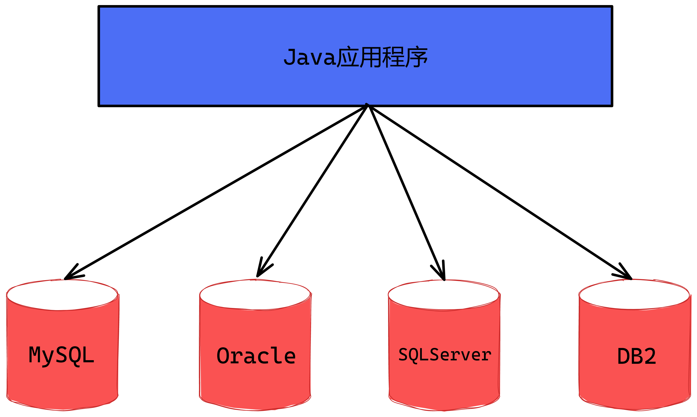

- 有了JDBC，Java程序访问数据库时是这样的：

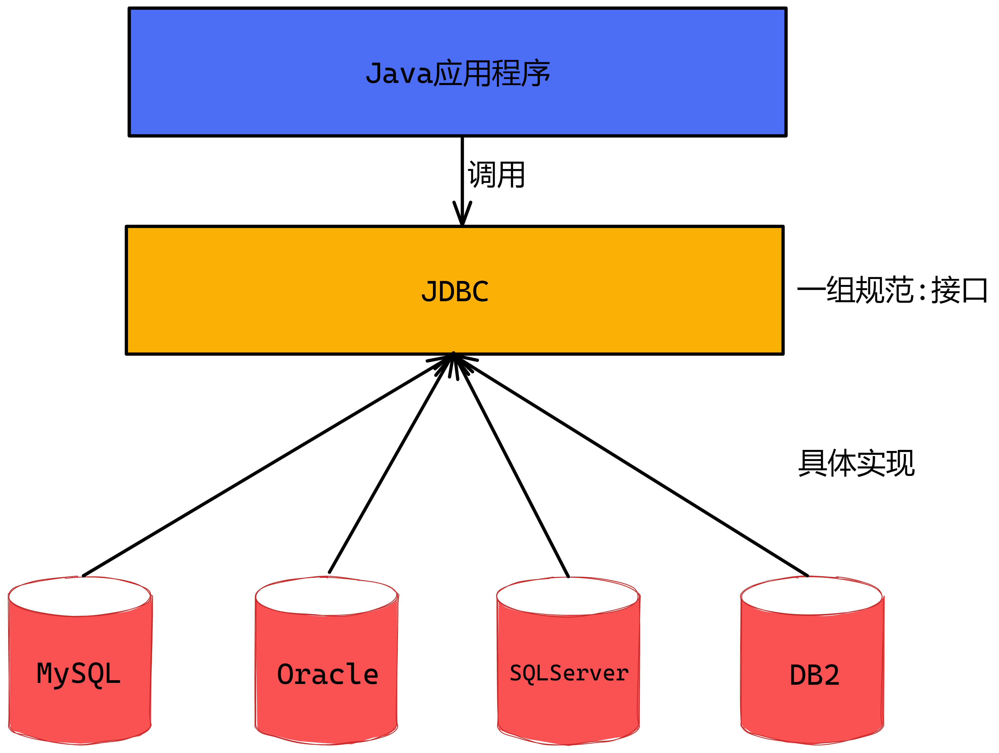

## 3.4 JDBC体系结构

- JDBC接口（API）包括两个层次：
  - **面向应用的API**：Java API，抽象接口，供应用程序开发人员使用（连接数据库，执行SQL语句，获得结果）。
  - **面向数据库的API**：Java Driver API，供开发商开发数据库驱动程序用。

> **JDBC是sun公司提供一套用于数据库操作的接口，java程序员只需要面向这套接口编程即可。**
>
> **不同的数据库厂商，需要针对这套接口，提供不同实现。不同的实现的集合，即为不同数据库的驱动。																————面向接口编程**

## 3.5 JDBC程序编写步骤

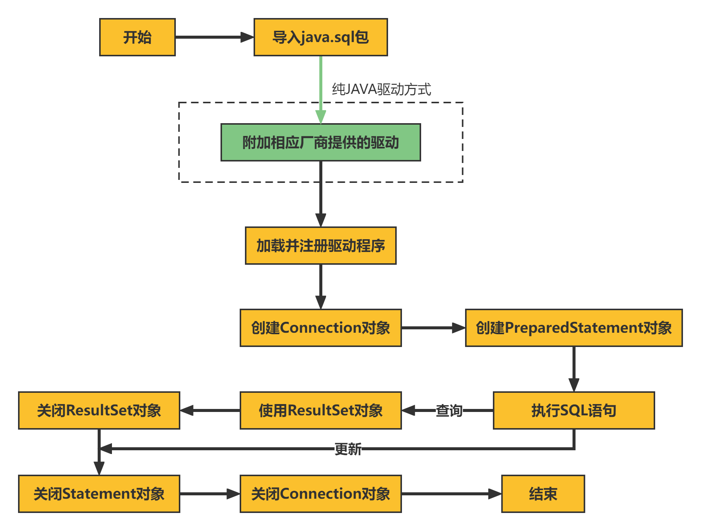

# 4 获取数据库连接

## 4.1 Driver接口实现类

### 4.1.1 Driver接口介绍

- java.sql.Driver 接口是所有 JDBC 驱动程序需要实现的接口。这个接口是提供给数据库厂商使用的，不同数据库厂商提供不同的实现。

- 在程序中不需要直接去访问实现了 Driver 接口的类，而是由驱动程序管理器类(java.sql.DriverManager)去调用这些Driver实现。
  - Oracle的驱动：**oracle.jdbc.driver.OracleDriver**
  - mySql的驱动： **com.mysql.jdbc.Driver**

### 4.1.2 导入jar包

①在01-JDBCDemo模块下的lib目录下,添加mysql的驱动jar包

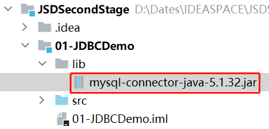

②但是此时这个jar包还不能使用,我们需要将jar包引入到项目,操作很简单,只需要选中jar包,然后右键,点击Add as Library...选项


③在弹出的选框框中点击OK即可


④那么此时的jar包已经是可以展开的模式了,说明已经导入成功

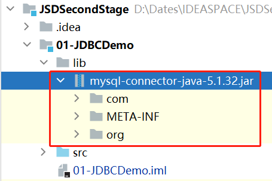

### 4.1.3 加载与注册JDBC驱动

- 加载驱动：加载 JDBC 驱动需调用 Class 类的静态方法 forName()，向其传递要加载的 JDBC 驱动的类名

  - **Class.forName("com.mysql.jdbc.Driver");**
- 注册驱动：DriverManager 类是驱动程序管理器类，负责管理驱动程序
  - **使用DriverManager.registerDriver(com.mysql.jdbc.Driver)来注册驱动**
  - 通常不用显式调用 DriverManager类的 registerDriver() 方法来注册驱动程序类的实例，因为 Driver 接口的驱动程序类都包含了静态代码块，在这个静态代码块中，会调用 DriverManager.registerDriver() 方法来注册自身的一个实例。下图是MySQL的Driver实现类的源码：

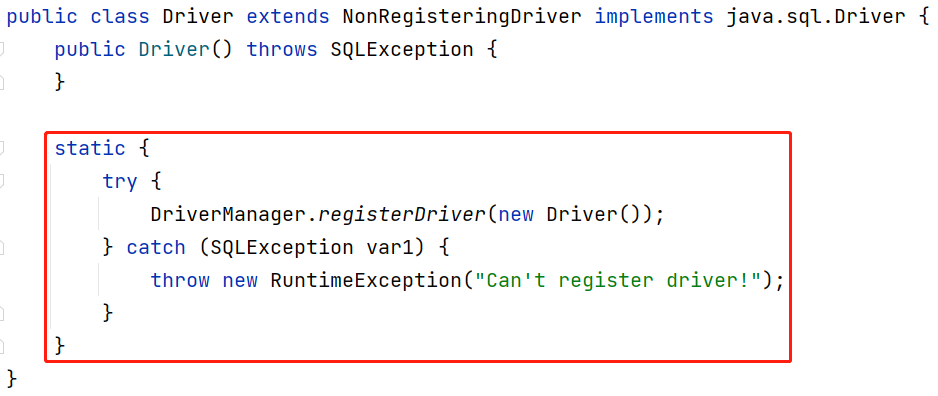

### 4.1.4 TestConnection代码实现

①在01-JDBCDemo模块下的jdbc包中,找到TestConnection类,在该类中进行代码编写


②在该类中**1.加载驱动**处书写如下代码:

```java
//1.加载驱动
Class.forName("com.mysql.jdbc.Driver");
```

## 4.2 URL

### 4.2.1 URL组成结构

- JDBC URL 用于标识一个被注册的驱动程序，驱动程序管理器通过这个 URL 选择正确的驱动程序，从而建立到数据库的连接。
- JDBC URL的标准由三部分组成，各部分间用冒号分隔。 
  - **jdbc:子协议:子名称**
  - **协议**：JDBC URL中的协议总是jdbc 
  - **子协议**：子协议用于标识一个数据库驱动程序
  - **子名称**：一种标识数据库的方法。子名称可以依不同的子协议而变化，用子名称的目的是为了**定位数据库**提供足够的信息。包含**主机名**(对应服务端的ip地址)**，端口号，数据库名**
- 举例:

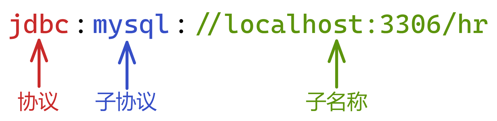

- 注意:如果JDBC程序与服务器端的字符集不一致，会导致乱码，那么可以通过参数指定服务器端的字符集

  ```java
  jdbc:mysql://localhost:3306/tedu?useUnicode=true&characterEncoding=utf8&serverTimezone=Asia/Shanghai
  ```

### 4.2.2 TestConnection代码实现

- 在TestConnection中的**2.1指定URL,确定要连接哪个数据库**处,实现URL的定义

```java
//2.1指定URL,确定要连接哪个数据库
String url = "jdbc:mysql://localhost:3306/tedu?useUnicode=true&characterEncoding=utf8&serverTimezone=Asia/Shanghai";
```

## 4.3 用户名和密码

- 可以调用 DriverManager 类的 getConnection() 方法建立到数据库的连接

## 4.4 建立连接

```java
package jdbc;

import java.sql.*;

/**
 * 用于测试JDBC获取数据库链接是否通畅的案例
 */
public class TestConnection {
    public static void main(String[] args) tteduows Exception {
        //1.加载驱动
        Class.forName("com.mysql.jdbc.Driver");
        //2.获取和数据库的连接
        //2.1指定URL,确定要连接哪个数据库
        String url = "jdbc:mysql://localhost:3306/tedu?useUnicode=true&characterEncoding=utf8";
        //2.2指定使用的用户名
        String user = "root";
        //2.3指定使用的密码
        String pwd = "root";
        //2.4调用DriverManager类的getConnection()方法建立到数据库的连接
        Connection conn = DriverManager.getConnection(url, user, pwd);
        System.out.println("连接成功~~");
    }
}
```

# 5 使用PreparedStatement实现操作

## 5.1 PreparedStatement介绍

- 可以通过调用 Connection 对象的 **preparedStatement(String sql)** 方法获取 PreparedStatement 对象
- **PreparedStatement 接口是 Statement 的子接口，它表示一条预编译过的 SQL 语句**
- PreparedStatement 对象所代表的 SQL 语句中的参数用问号(?)来表示，调用 PreparedStatement 对象的 setXxx() 方法来设置这些参数. setXxx() 方法有两个参数，第一个参数是要设置的 SQL 语句中的参数的索引(从 1 开始)，第二个是设置的 SQL 语句中的参数的值
- 调用PreparedStatement对象的以下方法可以执行增删改查操作:
  - 执行查询SQL时,调用executeQuery()方法,会返回ResultSet对象,将结果集封装在该对象中
  - 执行修改SQL(包括删除记录,修改记录,增添记录)时,调用executeUpdate()方法,会返回int类型数据,将修改的记录数返回

## 5.2 向location表中添加记录

- 在location表中插入一条记录: id为5,name为"神之国度"

```sql
INSERT INTO location(id,name) VALUES(null,'神之国度')
```

- 代码如下:

```java
import java.sql.Connection;
import java.sql.DriverManager;
import java.sql.PreparedStatement;
import java.sql.ResultSet;

/**
 * 用于测试JDBC添加记录
 */
public class TestInsert {
    private static Connection conn = null;
    private static PreparedStatement ps = null;

    public static void main(String[] args) tteduows Exception {
        Class.forName("com.mysql.jdbc.Driver");
        String url = "jdbc:mysql://localhost:3306/tedu?useUnicode=true&characterEncoding=utf8";
        String user = "root";
        String pwd = "root";
        conn = DriverManager.getConnection(url, user, pwd);
        System.out.println("连接成功~~");
        //1.获取PreparedStatement的实例
        //1.1定义sql语句
        String sql = "INSERT INTO location(id,name) VALUES(null,'神的国度')";
        //1.2创建PreparedStatement实例,并接受sql语句作为参数
        ps = conn.prepareStatement(sql);
        //1.3通过PreparedStatement调用executeUpdate()方法执行查询操作
        int rows = ps.executeUpdate();
        System.out.println(rows > 0 ? "添加" + rows + "条记录成功!" : "添加失败!");
        //2.释放资源
        rs.close();
        ps.close();
    }
}
```

## 5.3 修改location表中记录

- 将location表中id为5的记录中的name值修改为'魔之国度'

```mysql
UPDATE location SET name = "魔之国度" where id =5;
```

- 代码如下

```java
import java.sql.Connection;
import java.sql.DriverManager;
import java.sql.PreparedStatement;

/**
 * 用于测试JDBC修改记录
 */
public class TestUpdate {
    private static Connection conn = null;
    private static PreparedStatement ps = null;

    public static void main(String[] args) tteduows Exception {
        Class.forName("com.mysql.jdbc.Driver");
        String url = "jdbc:mysql://localhost:3306/tedu?useUnicode=true&characterEncoding=utf8";
        String user = "root";
        String pwd = "root";
        conn = DriverManager.getConnection(url, user, pwd);
        System.out.println("连接成功~~");
        //1.获取PreparedStatement的实例
        //1.1定义sql语句
        String sql = "UPDATE location SET name = '魔之国度' where id =5";
        //1.2创建PreparedStatement实例,并接受sql语句作为参数
        ps = conn.prepareStatement(sql);
        //1.3通过PreparedStatement调用executeUpdate()方法执行修改操作
        int rows = ps.executeUpdate();
        System.out.println(rows > 0 ? "修改" + rows + "条记录成功!" : "修改失败!");
        //2.释放资源
        rs.close();
        ps.close();
    }
}
```

## 5.4 删除location表中记录

- 将location表中id为5的记录删除

```mysql
DELETE FROM location WHERE id =5;
```

- 代码如下

```java
import java.sql.Connection;
import java.sql.DriverManager;
import java.sql.PreparedStatement;

/**
 * 用于测试JDBC删除记录
 */
public class TestDelete {
    private static Connection conn = null;
    private static PreparedStatement ps = null;

    public static void main(String[] args) tteduows Exception {
        Class.forName("com.mysql.jdbc.Driver");
        String url = "jdbc:mysql://localhost:3306/tedu?useUnicode=true&characterEncoding=utf8";
        String user = "root";
        String pwd = "root";
        conn = DriverManager.getConnection(url, user, pwd);
        System.out.println("连接成功~~");
        //1.获取PreparedStatement的实例
        //1.1定义sql语句
        String sql = "DELETE FROM location WHERE id =5;";
        //1.2创建PreparedStatement实例,并接受sql语句作为参数
        ps = conn.prepareStatement(sql);
        //1.3通过PreparedStatement调用executeUpdate()方法执行删除操作
        int rows = ps.executeUpdate();
        System.out.println(rows > 0 ? "删除" + rows + "条记录成功!" : "删除失败!");
        //2.释放资源
        rs.close();
        ps.close();
    }
}
```

## 5.5 查询location表中的所有数据

```java
import java.sql.Connection;
import java.sql.DriverManager;
import java.sql.PreparedStatement;
import java.sql.ResultSet;

/**
 * 用于测试JDBC查询记录
 */
public class TestSelect {
    private static Connection conn = null;
    private static PreparedStatement ps = null;

    public static void main(String[] args) tteduows Exception {
        Class.forName("com.mysql.jdbc.Driver");
        String url = "jdbc:mysql://localhost:3306/tedu?useUnicode=true&characterEncoding=utf8";
        String user = "root";
        String pwd = "root";
        conn = DriverManager.getConnection(url, user, pwd);
        System.out.println("连接成功~~");
        //1.定义sql语句
        String sql = "SELECT id,name FROM location";
        //2.创建PreparedStatement实例,并接受sql语句作为参数
        ps = conn.prepareStatement(sql);
        //3.通过PreparedStatement调用executeQuery()方法执行查询操作
        ResultSet rs = ps.executeQuery();
        //4.遍历结果集
        while (rs.next()){ //while循环一次，迭代一行，遍历一行
            int id = rs.getInt("id");//get一次得到一个单元格的数据
            String name = rs.getString("name");
            System.out.println(id + "\t" + name);
        }
        //5.释放资源
        rs.close();
        ps.close();
        conn.close();
    }
}
```

## 5.6 解决SQL注入

### 5.6.1 案例

- 查询location表中指定的用户

```mysql
SELECT id,name FROM location WHERE id = 1 AND name = '北京'
```

### 5.6.2 SQL注入问题演示

```java
import java.sql.*;
import java.util.Scanner;

/**
 * 用于测试JDBC的SQL注入问题
 */
public class TestSelect2 {
    private static Connection conn = null;
    private static PreparedStatement ps = null;
    private static ResultSet rs = null;

    public static void main(String[] args) tteduows Exception {
        Class.forName("com.mysql.jdbc.Driver");
        String url = "jdbc:mysql://localhost:3306/tedu?useUnicode=true&characterEncoding=utf8";
        String user = "root";
        String pwd = "root";
        conn = DriverManager.getConnection(url, user, pwd);
        System.out.println("连接成功~~");
        //1.定义sql语句
        int regionID = 2;
        String regionName = "' or '1'='1";;
        String sql = "SELECT id,name FROM location where id = " + regionID + " AND name = '" + regionName + "'";
        System.out.println("sql = " + sql);
        //2.创建PreparedStatement实例,并接受sql语句作为参数
        ps = conn.prepareStatement(sql);
        //3.通过PreparedStatement调用executeQuery()方法执行查询操作
        rs = ps.executeQuery();
        //4.判断结果
        System.out.println(rs.next() == true ? "记录存在!" : "记录不存在!");
        //5.释放资源
        rs.close();
        ps.close();
        conn.close();
    }
}
```

### 5.6.3 SQL注入解决

```java
import java.sql.Connection;
import java.sql.DriverManager;
import java.sql.PreparedStatement;
import java.sql.ResultSet;

/**
 * 用于测试JDBC通过PreparedStatement解决SQL注入问题
 */
public class TestSelect3 {
    private static Connection conn = null;
    private static PreparedStatement ps = null;
    private static ResultSet rs = null;

    public static void main(String[] args) tteduows Exception {
        Class.forName("com.mysql.jdbc.Driver");
        String url = "jdbc:mysql://localhost:3306/tedu?useUnicode=true&characterEncoding=utf8";
        String user = "root";
        String pwd = "root";
        conn = DriverManager.getConnection(url, user, pwd);
        System.out.println("连接成功~~");
        //1.定义sql语句
        String sql = "SELECT id,name FROM location where id = ? AND name = ?";
        //2.创建PreparedStatement实例,并接受sql语句作为参数
        ps = conn.prepareStatement(sql);
        //3.为SQL骨架传入参数
        ps.setInt(1, 1);
        ps.setString(2, "' or '1'='1");
        //4.通过PreparedStatement调用executeQuery()方法执行查询操作
        rs = ps.executeQuery();
        //5.遍历结果集
        System.out.println(rs.next() == true ? "记录存在!" : "记录不存在!");
        //6.释放资源
        rs.close();
        ps.close();
        conn.close();
    }
}
```

# 6 使用ResultSet封装结果集

## 6.1 ResultSet介绍

- 查询需要调用PreparedStatement 的 executeQuery() 方法，查询结果是一个ResultSet 对象

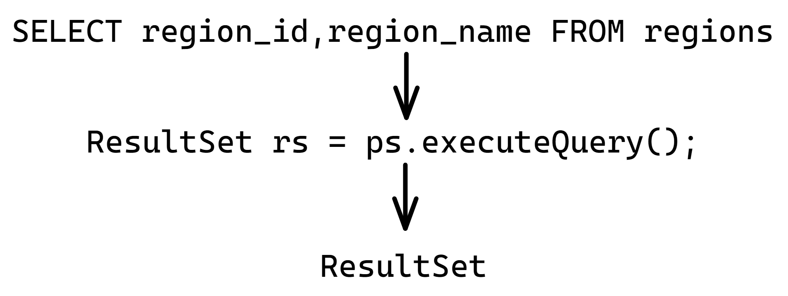

- ResultSet 对象以逻辑表格的形式封装了执行数据库操作的结果集，ResultSet 接口由数据库厂商提供实现

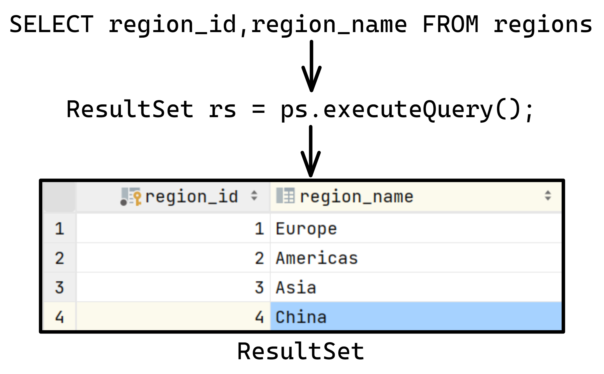

- ResultSet 返回的实际上就是一张数据表。有一个指针指向数据表的第一条记录的前面。

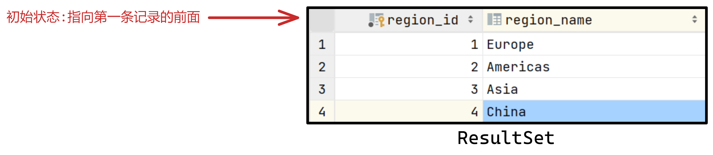

- ResultSet 对象维护了一个指向当前数据行的**游标**，初始的时候，游标在第一行之前，可以通过 ResultSet 对象的 next() 方法移动到下一行。调用 next()方法检测下一行是否有效。若有效，该方法返回 true，且指针下移。

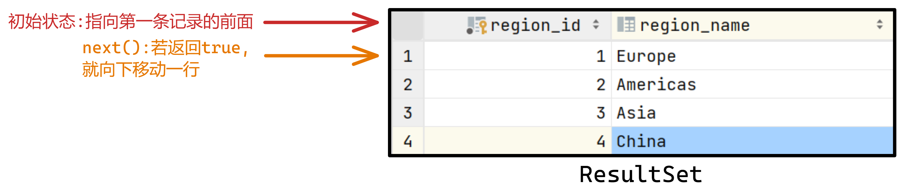

- 当指针指向一行时, 可以通过调用getXxx(int columnName) 获取每一列的值。

  - 例如: getInt("id"), getString("name")
  - **注意：Java与数据库交互涉及到的相关Java API中的索引都从1开始。**


- ResultSet 接口的常用方法：
  - boolean next()

  - getString()
  - …

# 7 资源的释放

- 释放ResultSet, PreparedStatement,Connection。
- 数据库连接（Connection）是非常稀有的资源，用完后必须马上释放，如果Connection不能及时正确的关闭将导致系统宕机。Connection的使用原则是**尽量晚创建，尽量早的释放。**

# 8 JDBC的事务处理

## 8.1 JDBC管理事务

- mysql默认是自动提交事务，每执行一条语句成功后，自动提交。

  需要开启手动提交模式。

​	   setAutoCommit(false);

- 提交事务

  Connection连接对象.commit();

- 回滚事务

  Connection连接对象.rollback();

## 8.2 代码

```java
import java.sql.*;

/**
 * 用于测试JDBC的事务处理
 */
public class TestTransaction {
    private static Connection conn = null;
    private static PreparedStatement ps = null;

    public static void main(String[] args) tteduows Exception {
        Class.forName("com.mysql.jdbc.Driver");
        String url = "jdbc:mysql://localhost:3306/tedu?useUnicode=true&characterEncoding=utf8";
        String user = "root";
        String pwd = "root";
        conn = DriverManager.getConnection(url, user, pwd);
        System.out.println("连接成功~~");
        //1.开启事务
        conn.setAutoCommit(false);//取消自动提交模式，开始手动提交模式
        //2.定义多条sql语句
        String sql1 = "UPDATE location SET name = '青岛' WHERE id = 6";
        String sql2 = "UPDATE location SET name = '大冶' WHERE id = 4";
        //3.创建PreparedStatement实例,并执行sql
        try {
            ps = conn.prepareStatement(sql1);
            ps.executeUpdate();
            System.out.println("第一条记录更新成功");
            ps = conn.prepareStatement(sql2);
            ps.executeUpdate();
            System.out.println("第二条记录更新成功");
            //4.提交事务
            conn.commit();
        } catch (SQLException e) {
            //5.回滚事务
            e.printStackTrace();
            System.out.println("更新失败!");
            conn.rollback();
        }
        //6.释放资源
        ps.close();
        conn.close();
    }
}
```
