# Maven和Spring

# 1 学习目标

1. 了解Spring
2. 了解SpringBoot
3. **重点掌握**创建SpringBoot项目
4. **重点掌握**聚合项目的创建
5. 了解Spring基于XML方法进行IOC和依赖注入
10. 了解Maven的概念
11. **重点掌握**使用Maven构建项目
12. **重点掌握**使用Maven进行依赖引入

# 2 Maven

## 2.1 概述


- Maven是跨平台的项目管理工具。
- 作为Apache组织中的一个颇为成功的开源项目，主要服务于基于java平台的项目构建、依赖管理和项目信息管理。无论是小型的开源类库项目，还是大型的企业级应用；无论是传统的瀑布式开发，还是流行的敏捷模式，Maven都能大显身手。

## 2.2 为何需要Maven?

- Java工程中我们自己去找jar，或者来自官网，或者来自网友的分享，或者来自项目团队的共享，不论何种方式，都需要把jar文件复制到lib目录中，并且Add As Library...

- 而Maven改变这种手动维护jar的方式，设计出一套自动维护jar的体系，已经广泛在软件项目中使用，是软件开发人员必须掌握的技术。

## 2.3 Maven的安装

- Maven是可以自行安装的,但是我们学习阶段使用idea自带的Maven就可以了,在idea的File → Settings → Build, Execution, Deployment → Build Tools → Maven下可以进入Maven面板

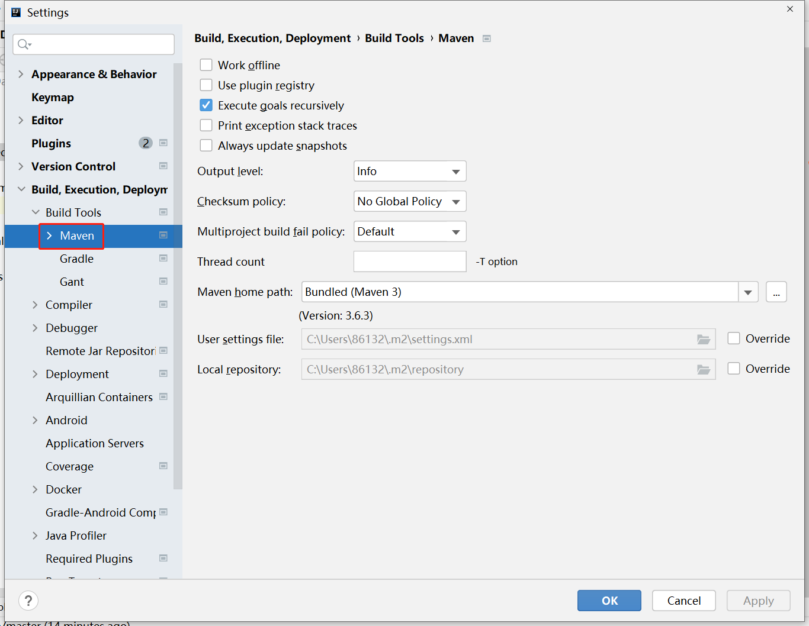

## 2.4 Maven的仓库配置

- Maven默认从Maven官网下载jar包资源，全球都去下载，又是国外网站，因此速度缓慢。
- 所以建议配置为阿里镜像服务器，下载速度快。

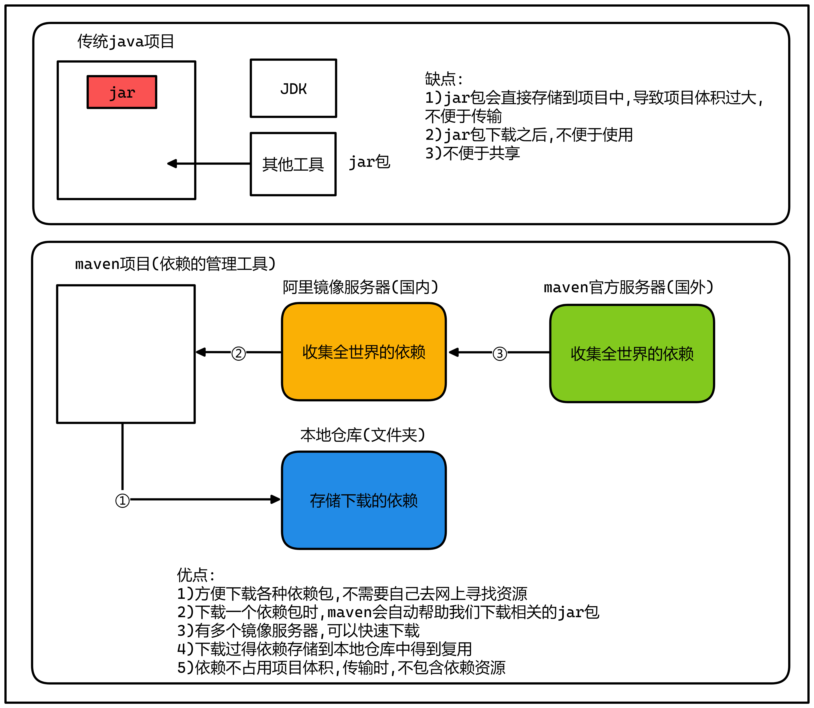

### 2.4.1 步骤设置

①下载老师提供的资料 **settings.xml**文件

②然后将settings.xml文件存储到idea的maven配置面板**User settings file**的相同路径

**注意:**如果在定位目录时,发现没有.m2目录,自己创建即可

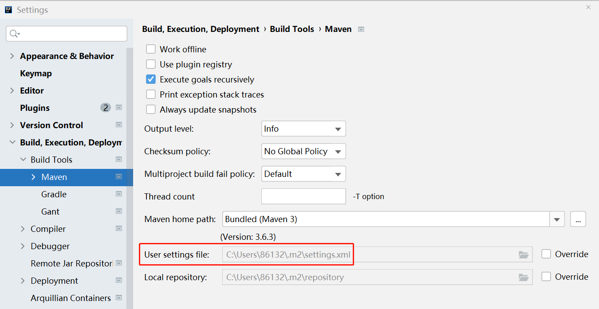

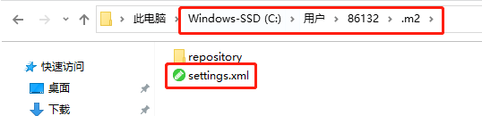

## 2.5 创建Maven项目

- 由于idea版本不同,可能具体步骤会稍有差异,不过大同小异

①依次点击如下路径:**File → New → Project...**,打开创建项目面板

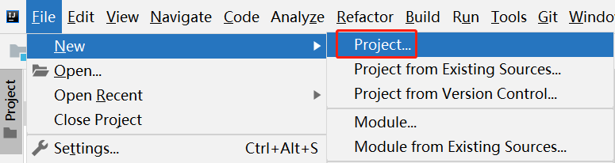

②选中**Maven**选项,点击**Next**即可

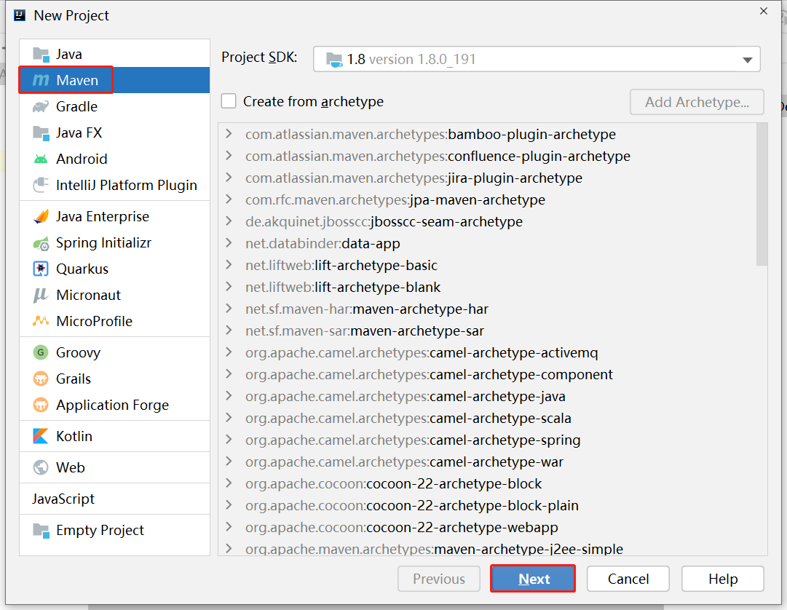

③依照自己实际情况项目相关内容,点击Finish即可创建完成

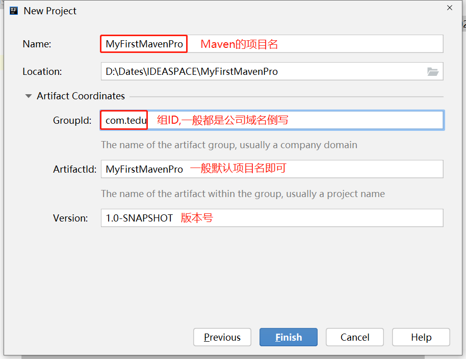

## 2.6 引入依赖

### 2.6.1 创建模块

①选中当前项目,右键,在弹出的面板中,选择New→Module...

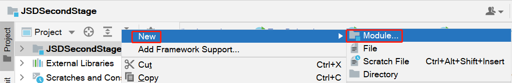

②填写模块信息,此处和创建maven项目是一样的

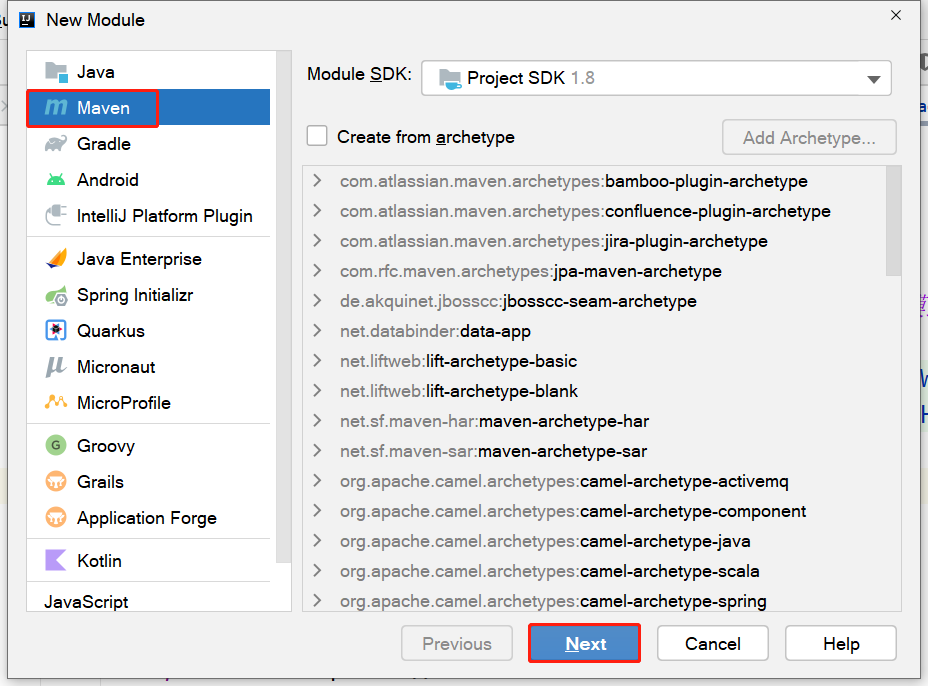

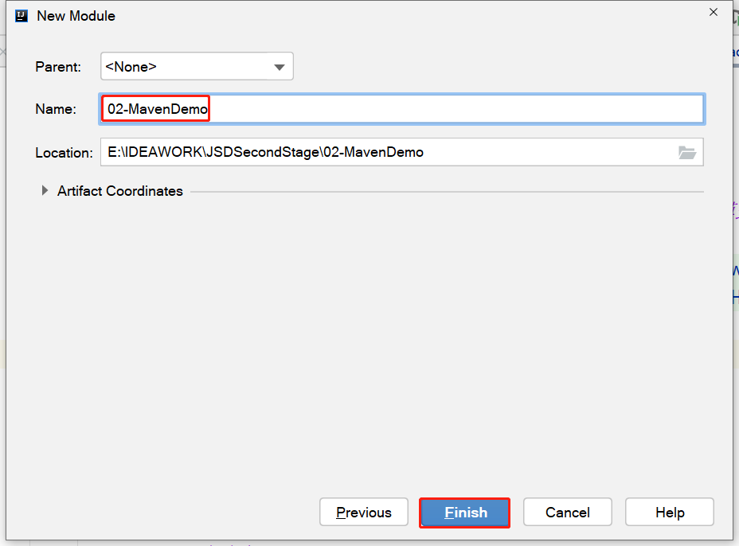

### 2.6.2 项目测试

①在**02-MavenDemo**项目中,添加**TestJDBC**类,该类执行时会报如下错误

- 原因是因为当前项目中是没有jdbc的jar包的,所以就会执行失败

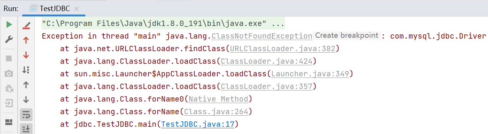

②而Maven项目可以自动从仓库中下载jar包,但是如果要下载jar包,需要通过Maven坐标去下载,所以打开项目中的**pom.xml**文件

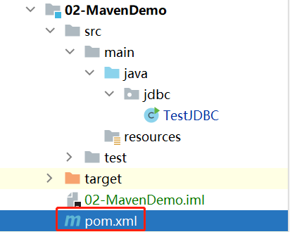

③在pom.xml文件中,添加JDBC的坐标

- `<dependencies></dependencies>`的作用是声明项目的所有依赖库(jar包)
- `<dependency></dependency>`的作用是声明一个特定依赖库的元素(jar包)

```xml
<!--JDBC的坐标-->
<dependencies>
    <dependency>
        <groupId>mysql</groupId>
        <artifactId>mysql-connector-java</artifactId>
        <version>5.1.32</version>
    </dependency>
</dependencies>
```

④但是此时并不会开始下载jar包,而是需要我们手动刷新Maven,所以点击pom.xml文件右上角的刷新按钮,即可下载成功

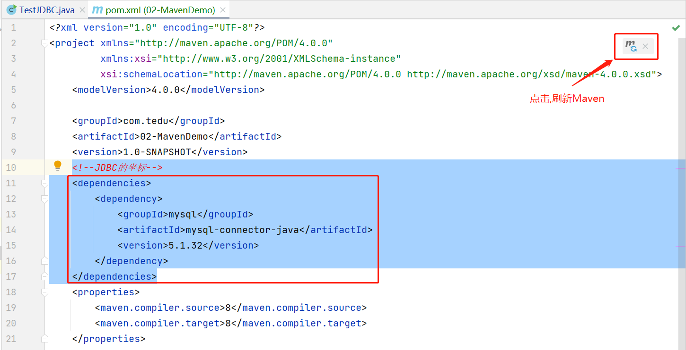

⑥此时执行TestJDBC程序,发现执行成功,说明已经成功通过Maven项目引入jar包

# 3 Spring简介

## 3.1 什么是Spring(了解)

- Spring是分层的 Java SE/EE应用 full-stack 轻量级开源框架，以**<font color=red>IOC</font>**（Inverse Of Control：反转控制）和**<font color=red>AOP</font>**（Aspect Oriented Programming：面向切面编程）为内核。
- 提供了**<font color=red>展现层 SpringMVC</font>**和**<font color=red>持久层 Spring JDBCTemplate</font>** 以及**<font color=red>业务层事务管理</font>**等众多的企业级应用技术，还能整合开源世界众多著名的第三方框架和类库，逐渐成为使用最多的Java EE 企业应用开源框架。

## 3.2 Spring的优势(了解)

- **方便解耦，简化开发**
  通过 Spring 提供的 IoC容器，可以将对象间的依赖关系交由 Spring 进行控制，避免硬编码所造成的过度耦合。
  
  用户也不必再为单例模式类、属性文件解析等这些很底层的需求编写代码，可以更专注于上层的应用。
  
- **AOP 编程的支持**
  通过 Spring的 AOP 功能，方便进行面向切面编程，许多不容易用传统 OOP 实现的功能可以通过 AOP 轻松实现。
  
- **声明式事务的支持**
  可以将我们从单调烦闷的事务管理代码中解脱出来，通过声明式方式灵活的进行事务管理，提高开发效率和质量。
  
- **方便程序的测试**
  可以用非容器依赖的编程方式进行几乎所有的测试工作，测试不再是昂贵的操作，而是随手可做的事情。
  
- **方便集成各种优秀框架**
  Spring对各种优秀框架（Struts、Hibernate、Hessian、Quartz等）的支持。
  
- **降低 JavaEE API 的使用难度**
  Spring对 JavaEE API（如 JDBC、JavaMail、远程调用等）进行了薄薄的封装层，使这些API 的使用难度大为降低。
  
- **Java 源码是经典学习范例**
  Spring的源代码设计精妙、结构清晰、匠心独用，处处体现着大师对Java 设计模式灵活运用以及对 Java技术的高深造诣。它的源代码无意是 Java 技术的最佳实践的范例。

# 4 SpringBoot简介

## 4.1 什么是SpringBoot

- SpringBoot提供了一种快速使用Spring的方式，基于约定优于配置的思想，可以让开发人员不必在配置与逻辑业务之间进行思维的切换，全身心的投入到逻辑业务的代码编写中，从而大大提高了开发的效率，一定程度上缩短了项目周期。2014 年 4 月，Spring Boot 1.0.0 发布。Spring的顶级项目之一(https://spring.io)。


## 4.2 SpringBoot的功能(了解)

- **自动配置**
  Spring Boot的自动配置是一个运行时（更准确地说，是应用程序启动时）的过程，考虑了众多因素，才决定Spring配置应该用哪个，不该用哪个。该过程是SpringBoot自动完成的。
- **起步依赖**
  起步依赖本质上是一个**Maven项目**对象模型，定义了对其他库的**传递依赖**，这些东西加在一起即支持某项功能。
- **辅助功能**
  提供了一些大型项目中常见的非功能性特性，如嵌入式服务器、安全、指标，健康检测、外部配置等。

# 5 SpringBoot项目的创建

①点击File→New→Project...

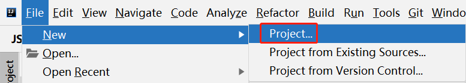

②点击Spring Initializr选项,填写对应的项目信息,之后点击Next

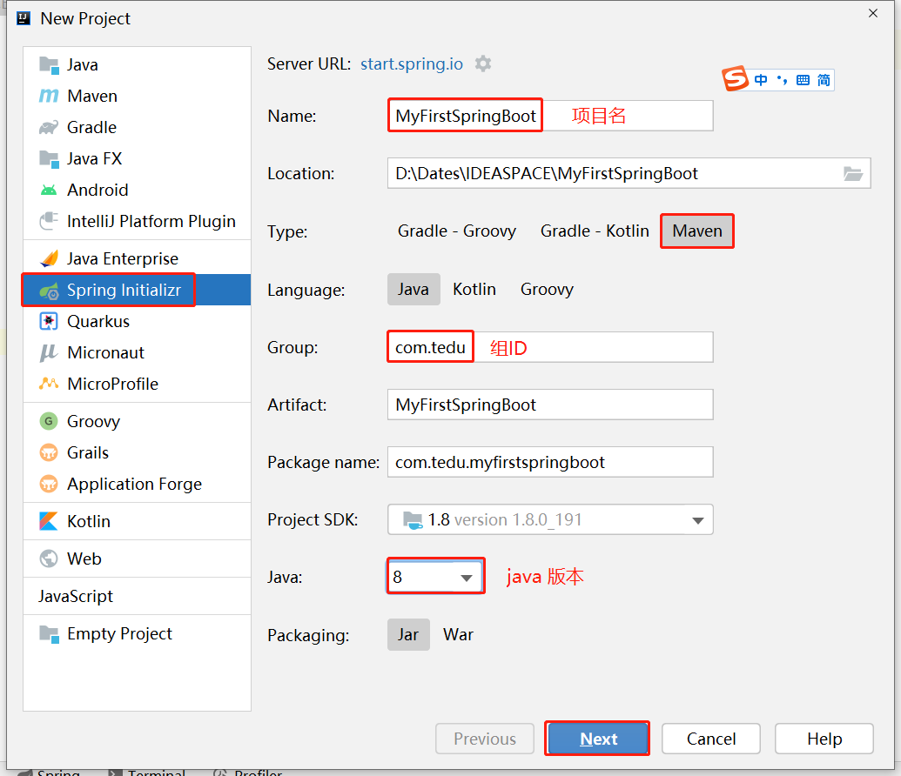

③选择对应的版本和工具,但是目前只是初学阶段,什么工具也不需要,直接点击Finish即可

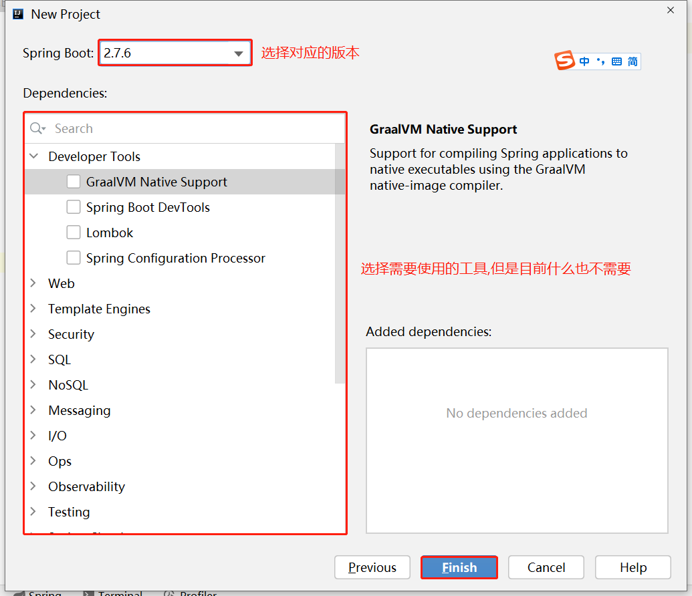

# 6 创建SpringBoot模块

①选中当前项目,右键,点击New→Module...

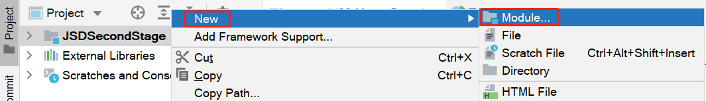

②然后选择想要创建的项目类型,这里我们假设再创建一个SpringBoot项目,操作方式和创建项目完全一样,填写项目信息,然后点击Next

- 如果Server URL默认的start.spring.io一直不能使用,可以替换为start.springboot.io

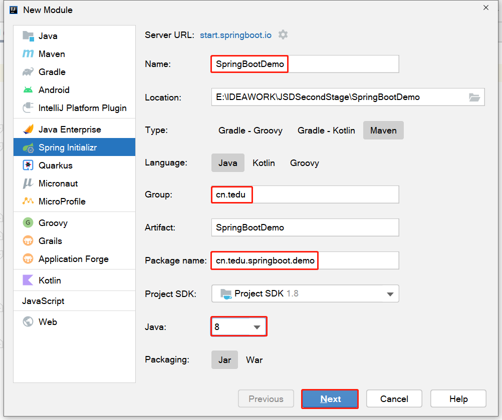

③选择对应的版本和工具,但是目前只是初学阶段,直接点击Finish即可

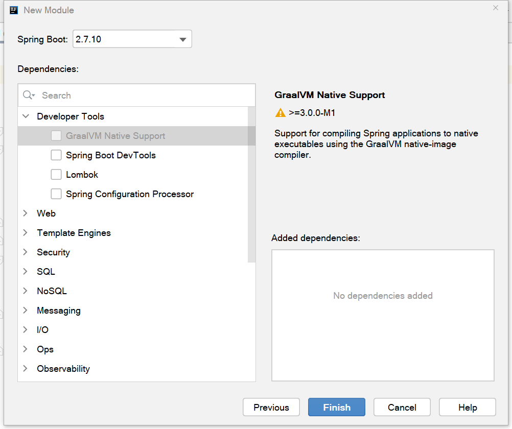

# 7 使用SpringBoot书写JDBC代码

①打开JSDSecondStage项目中SpringBootDemo模块下的pom.xml文件中的`parent`标签中的`version`的版本号更改为**2.5.4**

```xml
<parent>
    <groupId>org.springframework.boot</groupId>
    <artifactId>spring-boot-starter-parent</artifactId>
    <version>2.5.4</version>
    <relativePath/> <!-- lookup parent from repository -->
</parent>
```

②并在pom.xml中引入JDBC的依赖

```xml
<!--JDBC的坐标-->
<dependency>
    <groupId>mysql</groupId>
    <artifactId>mysql-connector-java</artifactId>
    <version>5.1.32</version>
</dependency>
```

③然后刷新pom.xml文件

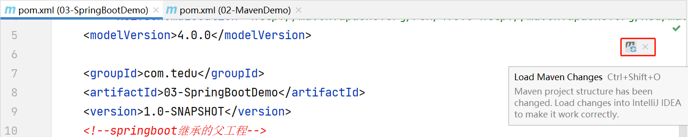

④然后将TestJDBC类放在包下,执行程序,测试成功即可

> 在Spring框架中,有两种开发模式
>
> 一种是XML方式,另一种是注解方式,我们简单了解一下XML方式
>
> 并通过这个方式了解一下Spring中的两个比较重要的特性,后面我们再用注解的方式来学习

# 8 Spring基于XML方式开发

## 8.1 资源准备

- 在JSDSecondStage项目下,创建**SpringXMLDemo模块**,我们在该模块下简单学习Spring基于XML的方式开发

## 8.2 Spring的IOC

### 8.2.1 什么是IOC

- Inversion of Control，控制反转。
- IOC主要是一种设计思想。在应用程序中，原本由程序主动去new依赖对象，变成了由IOC容器来控制对象的创建。
- 所以，所谓的控制反转，控制指的是IOC容器控制了对象的创建，反转指的是程序依赖IOC容器来注入对象。

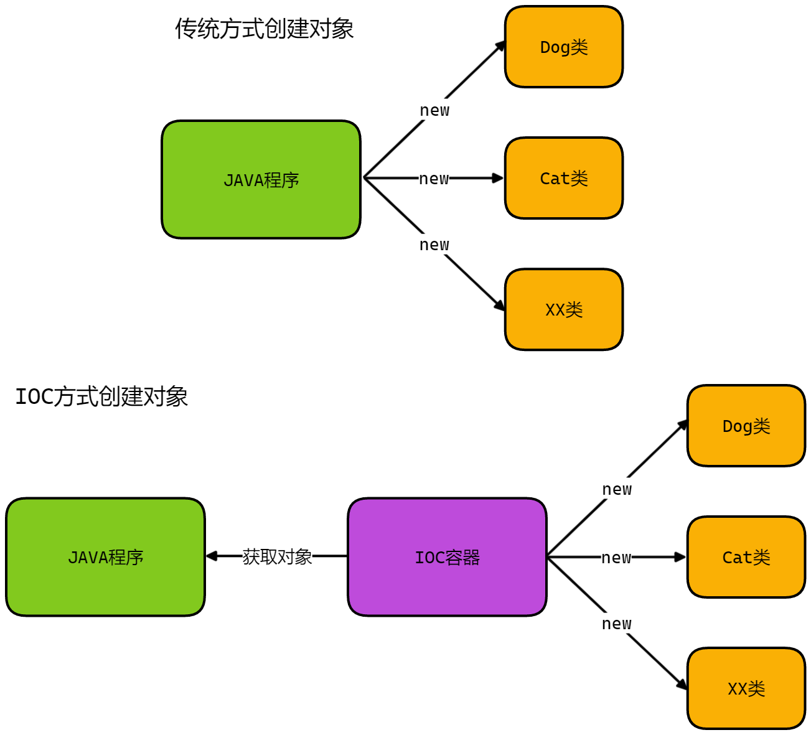

### 8.2.2 bean标签的基本配置

用于配置对象交由**Spring**来创建。

默认情况下它调用的是类中的无参构造函数，如果没有无参构造函数则不能创建成功。

基本属性：

**id**：Bean实例在Spring容器中的唯一标识

**class**：Bean的全限定名称

### 8.2.3 准备User实例

- 将**`pojo/User`**类导入项目中,用于后面的实例化操作

### 8.2.4 添加Spring核心配置

- 将**application.xml**文件直接复制到**resources目录**中即可

```xml
<?xml version="1.0" encoding="UTF-8" ?>
<beans xmlns="http://www.springframework.org/schema/beans"
       xmlns:xsi="http://www.w3.org/2001/XMLSchema-instance"
       xsi:schemaLocation="
http://www.springframework.org/schema/beans
http://www.springframework.org/schema/beans/spring-beans.xsd">
    <!--将User对象的创建交给Spring管理-->
    <!--id:该类在Spring容器的唯一标识-->
    <!--class:该类的全限定名称-->
    <bean id="user" class="cn.tedu.pojo.User"></bean>
</beans>
```

### 8.2.5 编写TestBean

```java
package cn.tedu.test;

import cn.tedu.pojo.User;
import org.springframework.context.ApplicationContext;
import org.springframework.context.support.ClassPathXmlApplicationContext;

/**
 * 使用Spring的API获取Bean实例
 */
public class TestBean {
    public static void main(String[] args) {
        //1.加载配置文件
        ApplicationContext applicationContext = new
                ClassPathXmlApplicationContext("application.xml");
        //2.通过id获取Spring管理的user对象
        User user1 = (User) applicationContext.getBean("user1");
        System.out.println("user1 = " + user1);
    }
}
```

## 8.3 Spring的DI

### 8.3.1 什么是DI

- 依赖注入（**Dependency Injection**）：它是 Spring 框架核心 IOC 的具体实现。组件之间依赖关系由容器在运行期决定，形象的说，即由容器动态的将某个依赖关系注入到组件之中。

### 8.3.2 Bean的依赖注入概念

- 通过property标签配置的属性值会通过setXxx()方法注入 
  - name属性: "setXXX"后面的"XXX"首字母改小写
  - value属性: 该属性具体的值
- 通过constructor-arg标签配置的属性值会通过构造器注入
  - value属性: 该属性具体的值

### 8.3.3 SET方式注入

#### 8.3.3.1 修改Spring核心配置文件

```xml
<?xml version="1.0" encoding="UTF-8" ?>
<beans xmlns="http://www.springframework.org/schema/beans"
       xmlns:xsi="http://www.w3.org/2001/XMLSchema-instance"
       xsi:schemaLocation="
http://www.springframework.org/schema/beans
http://www.springframework.org/schema/beans/spring-beans.xsd">
    <!--将User对象的创建交给Spring管理-->
    <!--id:该类在Spring容器的唯一标识-->
    <!--class:该类的全限定名称-->
    <bean id="user1" class="cn.tedu.pojo.User"></bean>
    <!--通过set方式注入-->
    <bean id="user2" class="cn.tedu.pojo.User">
        <property name="name" value="夏史壬"></property>
        <property name="age" value="66"></property>
    </bean>
</beans>
```

#### 8.3.3.2 编写TestBean

```java
package cn.tedu.test;

import cn.tedu.pojo.User;
import org.springframework.context.ApplicationContext;
import org.springframework.context.support.ClassPathXmlApplicationContext;

/**
 * 使用Spring的API获取Bean实例
 */
public class TestBean {
    public static void main(String[] args) {
        //1.加载配置文件
        ApplicationContext applicationContext = new
                ClassPathXmlApplicationContext("application.xml");
        //2.通过id获取Spring管理的user对象
        User user1 = (User) applicationContext.getBean("user1");
        System.out.println("user1 = " + user1);
        User user2 = (User) applicationContext.getBean("user2");
        System.out.println("user2 = " + user2);
    }
}
```

### 8.3.4 构造器注入

#### 8.3.4.1 修改Spring核心配置文件

```xml
<?xml version="1.0" encoding="UTF-8" ?>
<beans xmlns="http://www.springframework.org/schema/beans"
       xmlns:xsi="http://www.w3.org/2001/XMLSchema-instance"
       xsi:schemaLocation="
http://www.springframework.org/schema/beans
http://www.springframework.org/schema/beans/spring-beans.xsd">
    <!--将User对象的创建交给Spring管理-->
    <!--id:该类在Spring容器的唯一标识-->
    <!--class:该类的全限定名称-->
    <bean id="user1" class="cn.tedu.pojo.User"></bean>
    <!--通过set方式注入-->
    <bean id="user2" class="cn.tedu.pojo.User">
        <property name="name" value="夏史壬"></property>
        <property name="age" value="66"></property>
    </bean>
    <!--构造器注入-->
    <bean id="user3" class="cn.tedu.pojo.User">
        <constructor-arg value="魏朱"/>
        <constructor-arg value="11"/>
    </bean>
</beans>
```

#### 8.3.4.2 编写TestBean

```java
package cn.tedu.test;

import cn.tedu.pojo.User;
import org.springframework.context.ApplicationContext;
import org.springframework.context.support.ClassPathXmlApplicationContext;

/**
 * 使用Spring的API获取Bean实例
 */
public class TestBean {
    public static void main(String[] args) {
        //1.加载配置文件
        ApplicationContext applicationContext = new
                ClassPathXmlApplicationContext("application.xml");
        //2.通过id获取Spring管理的user对象
        User user1 = (User) applicationContext.getBean("user1");
        System.out.println("user1 = " + user1);
        User user2 = (User) applicationContext.getBean("user2");
        System.out.println("user2 = " + user2);
        User user3 = (User) applicationContext.getBean("user3");
        System.out.println("user3 = " + user3);
    }
}
```
