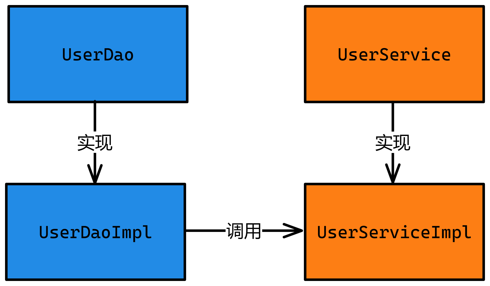
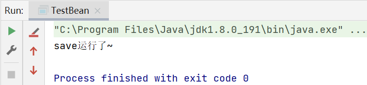
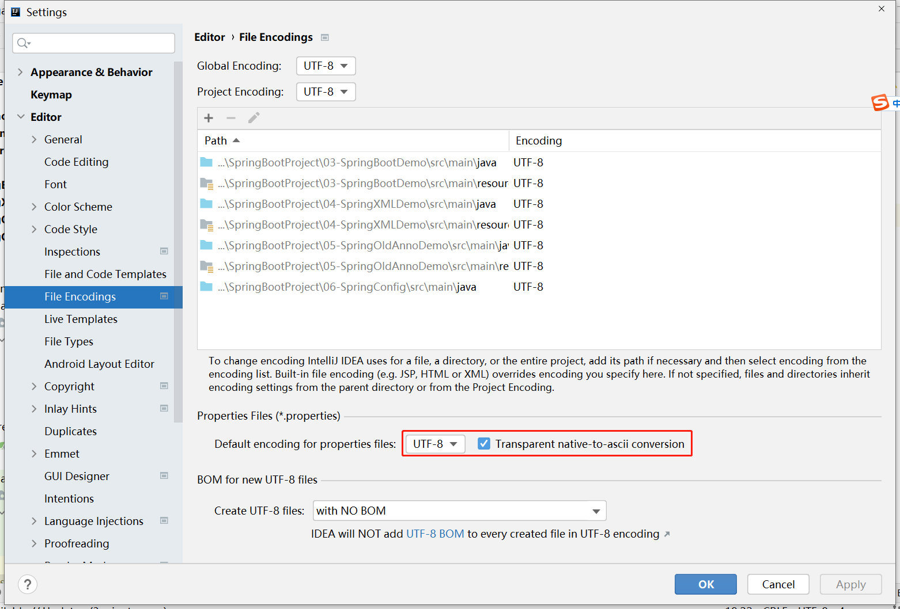

# Spring注解开发和配置文件

# 1 学习目标

1. 了解properties和yml文件的区别
2. **重点掌握**yml的语法
3. **重点掌握**创建SpringBoot项目
4. **重点掌握**@ConfigruationProperties
5. **重点掌握**@Value
6. **重点掌握**@Bean
7. **重点掌握**Spring注解@Component
8. **重点掌握**Spring注解@Autowired
9. **重点掌握**Spring注解@Value
10. **重点掌握**Spring注解@Controller、@Service、@Repository

# 2 Spring的注解开发

- Spring是轻代码而重配置的框架，配置比较繁重，影响开发效率，所以注解开发是一种趋势，注解代替xml配置文件可以简化配置，提高开发效率。
- Spring原始注解主要是替代`<bean>`的配置

|    注解     |                      说明                      |
| :---------: | :--------------------------------------------: |
| @Component  |            使用在类上用于实例化Bean            |
| @Controller |         使用在web层类上用于实例化Bean          |
|  @Service   |       使用在service层类上用于实例化Bean        |
| @Repository |         使用在dao层类上用于实例化Bean          |
| @Autowired  |        使用在字段上用于根据类型依赖注入        |
| @Qualifier  | 结合@Autowired一起使用用于根据名称进行依赖注入 |
|  @Resource  | 相当于@Autowired+@Qualifier，按照名称进行注入  |
|   @Value    |                  注入普通属性                  |

## 2.1 项目准备

①在JSDSecondStage项目下,创建**SpringAnnoDemo**模块,用于学习Spring的原始注解开发,并且修改版本号为2.5.4

②并将提供的`dao和service`包导入到项目中

- 案例结构分析



④执行TestBean类,可以发现正常调用



## 2.2 常用IOC的注解

### 2.2.1 @Component

- @Component  使用在类上用于实例化Bean(一般是除了三层结构)

①**`UserDaoImpl`**

```java
package cn.tedu.dao.impl;


import cn.tedu.dao.UserDao;
import org.springframework.stereotype.Component;
/**
 * 添加@Component注解,相当于xml开发中的如下内容
 * <bean id="userDao" class="com.tedu.springannodemo.dao.impl.UserDaoImpl.java"></bean>
 */
@Component
public class UserDaoImpl implements UserDao {
    @Override
    public void save() {
        System.out.println("save运行了~");
    }
}
```

②**`UserServiceImpl`**

```java
package cn.tedu.service.impl;

import cn.tedu.dao.UserDao;
import cn.tedu.service.UserService;
import org.springframework.beans.factory.annotation.Autowired;
import org.springframework.stereotype.Component;

/**
 * 添加@Component注解,相当于xml开发中的如下内容
 * <bean id="userService" class="com.tedu.springannodemo.service.impl.UserServiceImpl"></bean>
 */
@Component
public class UserServiceImpl implements UserService {
    //将Spring容器管理的id为userDao的实例注入到userDao变量中
    @Autowired //自动注入
    private UserDao userDao;

    @Override
    public void save() {
        //userDao = new UserDaoImpl();
        userDao.save();
    }
}
```

③**`TestAnno`**

```java
package cn.tedu;

import cn.tedu.service.UserService;
import org.junit.jupiter.api.Test;
import org.springframework.beans.factory.annotation.Autowired;
import org.springframework.boot.test.context.SpringBootTest;

/**
 * @SpringBootTest 当加载测试类时,会自动启动SpringBoot项目
 */
@SpringBootTest
public class TestAnno {
    @Autowired//自动去Spring容器中获取UserServiceImpl实例
    private UserService userService;
	/**
     * @Test 是标志当前方法是单元测试方法,表示该方法可以直接运行,不需要依托于main方法
     * 单元测试方法,必须是无参无返回值的公开方法
     */
    @Test
    public void testComponent() {
        userService.save();
    }
}
```

### 2.2.2 使用SpringBoot测试

- <font color=red id=jump3>@SpringBootTest</font>: 目的是加载ApplicationContext，启动spring容器。

- <font color=red id=jump4>@Test</font>: 单元测试方法的注解,可以自动执行一个方法,无须写main方法
  - 单元测试方法规范
    - 方法名: 一般都是testXxx()
    - 参数: 空参
    - 返回值: void

### 2.2.3 @Controller、@Service、@Repository

- @Controller  使用在web层类上用于实例化Bean
- @Service  使用在service层类上用于实例化Bean  
- @Repository  使用在dao层类上用于实例化Bean
- 以上三个注解的功能和`@Component`注解的功能是完全一样的,只不过是为了方便作为区分才有这三个注解,**所以为了严谨的结构,代码的可读性,我们不能随意乱用!!**

①**`UserDaoImpl`**

```java
package cn.tedu.dao.impl;


import cn.tedu.dao.UserDao;
import org.springframework.stereotype.Repository;

/**
 * 添加@Component注解,相当于xml开发中的如下内容
 * <bean id="userDao" class="com.tedu.springannodemo.dao.impl.UserDaoImpl.java"></bean>
 */
@Repository
public class UserDaoImpl implements UserDao {
    @Override
    public void save() {
        System.out.println("save运行了~");
    }
}
```

②**`UserServiceImpl`**

```java
package cn.tedu.service.impl;

import cn.tedu.dao.UserDao;
import cn.tedu.service.UserService;
import org.springframework.beans.factory.annotation.Autowired;
import org.springframework.stereotype.Service;

/**
 * 添加@Component注解,相当于xml开发中的如下内容
 * <bean id="userService" class="com.tedu.springannodemo.service.impl.UserServiceImpl"></bean>
 */
@Service
public class UserServiceImpl implements UserService {
    //将Spring容器管理的id为userDao的实例注入到userDao变量中
    @Autowired //自动注入
    private UserDao userDao;

    @Override
    public void save() {
        //userDao = new UserDaoImpl();
        userDao.save();
    }
}
```

## 2.3 常用DI的注解

### 2.3.1 @Value概述

- 将属性值注入到 Spring 管理的 Bean 中

### 2.3.2 注入普通属性

- @Value  注入普通属性

①**`UserServiceImpl`**

```java
package cn.tedu.service.impl;

import cn.tedu.dao.UserDao;
import cn.tedu.service.UserService;
import org.springframework.beans.factory.annotation.Autowired;
import org.springframework.beans.factory.annotation.Value;
import org.springframework.stereotype.Service;

/**
 * 添加@Component注解,相当于xml开发中的如下内容
 * <bean id="userService" class="com.tedu.springannodemo.service.impl.UserServiceImpl"></bean>
 */
@Service
public class UserServiceImpl implements UserService {
    //将Spring容器管理的id为userDao的实例注入到userDao变量中
    @Autowired //自动注入
    private UserDao userDao;
    @Value("曾桃燕")
    public String name;
    @Value("20")
    public Integer age;

    @Override
    public void save() {
        //userDao = new UserDaoImpl();
        userDao.save();
    }
}
```

②**`TestAnno`**

```java
package cn.tedu;

import cn.tedu.service.UserService;
import cn.tedu.service.impl.UserServiceImpl;
import org.junit.jupiter.api.Test;
import org.springframework.beans.factory.annotation.Autowired;
import org.springframework.beans.factory.annotation.Qualifier;
import org.springframework.boot.test.context.SpringBootTest;

import javax.annotation.Resource;

/**
 * 用于测试Spring中的原始注解
 */
@SpringBootTest
public class TestAnno {
    @Autowired
    private UserService service;

    @Test
    public void testComponent() {
        //service = new UserServiceImpl();
        //调用方法
        service.save();
    }
    @Test
    public void testValue() {
        UserServiceImpl s = (UserServiceImpl)service;
        System.out.println(s.name);
        System.out.println(s.age);
    }
}
```

### 2.3.3 注入配置文件中的属性

- @Value 可以结合${}表达式注入配置文件中的属性

①**`application.properties`**

```properties
user.age = 18
user.username= 帐篷
```

②**`UserServiceImpl`**

```java
package cn.tedu.service.impl;

import cn.tedu.dao.UserDao;
import cn.tedu.service.UserService;
import org.springframework.beans.factory.annotation.Autowired;
import org.springframework.beans.factory.annotation.Value;
import org.springframework.stereotype.Service;

/**
 * 添加@Component注解,相当于xml开发中的如下内容
 * <bean id="userService" class="com.tedu.springannodemo.service.impl.UserServiceImpl"></bean>
 */
@Service
public class UserServiceImpl implements UserService {
    //将Spring容器管理的id为userDao的实例注入到userDao变量中
    @Autowired //自动注入
    private UserDao userDao;
    @Value("${user.username}")
    public String name;
    @Value("${user.age}")
    public Integer age;

    @Override
    public void save() {
        //userDao = new UserDaoImpl();
        userDao.save();
    }
}
```

# 3 Spring的配置文件

- SpringBoot使用一个全局的配置文件，配置文件名是固定的；
  - application.properties
  - application.yml

- 配置文件的作用：修改SpringBoot自动配置的默认值；SpringBoot在底层都给我们自动配置好；

## 3.1 properties和yml的区别

- properties 和 yml 都是 Spring Boot 支持的两种配置文件，它们可以看作是 Spring Boot 在不同时期的两款“产品”。在 Spring Boot 时代已经不需要使用 XML 文件格式来配置项目了，取而代之的是 properties 或 yml 文件。
- properties 配置文件属于早期，也是目前创建 Spring Boot（2.x）项目时默认的配置文件格式，而 yml 可以看做是对 properties 配置文件的升级，属于 Spring Boot 的“新版”配置文件。

## 3.2 properties的语法

- 注释：以 "#" 或 "!" 开头的行被认为是注释，可以在行首或行尾添加注释。
- 键值对：用 "=" 或 ":" 分隔键和值，键和值都可以包含空格。

- 通常情况下，Properties 文件的默认编码是 ISO-8859-1，而在 Java 类中默认使用 UTF-8 编码。

​	   解决方案:File → Settings → Editor → File Encodings → 勾选按钮



## 3.3 yml的语法

- 为了便于学习,在JSDSecond项目下创建模块**SpringConfigDemo**,修改版本号为2.5.4

- 将**`bean/Person`**类放到项目中

### 3.3.1 基本语法

- **`k:(空格)v`**表示一对键值对（空格必须有）；

- 以**空格**的缩进来控制层级关系；只要是左对齐的一列数据，都是同一个层级的

- 属性和值也是大小写敏感；

①**`application.yml`**

```yaml
student:
  username: tom
  age: 18
```

②**`TestYaml`**

```java
package cn.tedu;

import org.junit.jupiter.api.Test;
import org.springframework.beans.factory.annotation.Value;
import org.springframework.boot.test.context.SpringBootTest;

/**
 * 用于测试Spring中的yaml配置
 */
@SpringBootTest
public class TestYaml {
    @Value("${student.username}")
    private String name;
    @Value("${student.age}")
    private Integer age;

    @Test
    public void testStudent() {
        System.out.println(name);
        System.out.println(age);
    }
}
```

### 3.3.2 普通的值的写法

- k: v：字面值直接来写；

①**`application.yml`**

```yaml
student:
  username: tom
  age: 18

#定义一个person
person:
  username: tony
  age: 22
  parent: true
  birth: 2023/1/1
```

②**`Person`**

```java
package cn.tedu.bean;

import org.springframework.beans.factory.annotation.Value;
import org.springframework.boot.context.properties.ConfigurationProperties;
import org.springframework.context.annotation.PropertySource;
import org.springframework.stereotype.Component;

import java.util.Date;
import java.util.List;
import java.util.Map;
@Component
public class Person {
    //用户名
    @Value("${person.username}")
    private String username;
    //年龄
    @Value("${person.age}")
    private Integer age;
    //是否是父母
    @Value("${person.parent}")
    private boolean parent;
    //生日
    @Value("${person.birth}")
    private Date birth;
    private Map<String, Object> maps;
    private List<Object> lists;

    public String getUsername() {
        return username;
    }

    public void setUsername(String username) {
        this.username = username;
    }

    public Integer getAge() {
        return age;
    }

    public void setAge(Integer age) {
        this.age = age;
    }

    public boolean isParent() {
        return parent;
    }

    public void setParent(boolean parent) {
        this.parent = parent;
    }

    public Date getBirth() {
        return birth;
    }

    public void setBirth(Date birth) {
        this.birth = birth;
    }

    public Map<String, Object> getMaps() {
        return maps;
    }

    public void setMaps(Map<String, Object> maps) {
        this.maps = maps;
    }

    public List<Object> getLists() {
        return lists;
    }

    public void setLists(List<Object> lists) {
        this.lists = lists;
    }

    @Override
    public String toString() {
        return "Person{" +
                "username='" + username + '\'' +
                ", age=" + age +
                ", parent=" + parent +
                ", birth=" + birth +
                ", maps=" + maps +
                ", lists=" + lists +
                '}';
    }
}
```

③**`TestYaml`**

```java
package cn.tedu;

import cn.tedu.bean.Person;
import org.junit.jupiter.api.Test;
import org.springframework.beans.factory.annotation.Autowired;
import org.springframework.beans.factory.annotation.Value;
import org.springframework.boot.test.context.SpringBootTest;

/**
 * 用于测试Spring中的yaml配置
 */
@SpringBootTest
public class TestYaml {
    @Value("${student.username}")
    private String name;
    @Value("${student.age}")
    private Integer age;
    @Autowired
    private Person person;
    @Test
    public void testStudent() {
        System.out.println(name);
        System.out.println(age);
    }

    @Test
    public void testPerson() {
        System.out.println(person);
    }
}
```

## 3.4 @ConfigurationProperties

* 自动对类成员变量、方法及构造函数进行标注，完成自动装配的工作。
* 如果使用这种方式注入,底层会自动根据get和set方法进行注入值的操作,所以必须添加get和set方法

①**`Person`**

```java
package cn.tedu.bean;

import org.springframework.boot.context.properties.ConfigurationProperties;
import org.springframework.stereotype.Component;

import java.util.Date;
@ConfigurationProperties(prefix = "person")
@Component
public class Person {
    //用户名
    private String username;
    //年龄
    private Integer age;
    //是否是父母
    private boolean parent;
    //生日
    private Date birth;

    public String getUsername() {
        return username;
    }

    public void setUsername(String username) {
        this.username = username;
    }

    public Integer getAge() {
        return age;
    }

    public void setAge(Integer age) {
        this.age = age;
    }

    public boolean isParent() {
        return parent;
    }

    public void setParent(boolean parent) {
        this.parent = parent;
    }

    public Date getBirth() {
        return birth;
    }

    public void setBirth(Date birth) {
        this.birth = birth;
    }


    @Override
    public String toString() {
        return "Person{" +
                "username='" + username + '\'' +
                ", age=" + age +
                ", parent=" + parent +
                ", birth=" + birth +
                '}';
    }
}
```

②**`导入配置文件处理器`**

```xml
<!--导入配置文件处理器，配置文件进行绑定就会有提示-->
<dependency>
    <groupId>org.springframework.boot</groupId>
    <artifactId>spring-boot-configuration-processor</artifactId>
    <optional>true</optional>
</dependency>
```

## 3.5 @Value和@ConfigurationProperties比较

- 配置文件不论是yml还是properties,使用这两种注解都能获取到值；
- 但是如果我们只是在某个业务逻辑中需要获取一下配置文件中的某项值，使用@Value；
- 如果说，我们专门编写了一个javaBean来和配置文件进行映射，我们就直接使用@ConfigurationProperties；

# 4 Spring的配置类

## 4.1 概述

- 由于开发项目会引入很多的组件,但是配置组件的内容很多情况下,都要使用Spring的xml文件编写代码,而现在SpringBoot都是使用注解的形式进行配置组件的,所以SpringBoot采取了配置类这个方案,也就是使用**@Configuration**和**@Bean**这两个注解
- **@Configuration** 指明当前类是一个配置类；就是来替代之前的Spring配置文件
- **@Bean** 可以标识一个方法,将方法的返回值注入到Spring容器中,并且id为修饰的方法名

## 4.2 测试

- 此处我们就以JDBC为例,将获取连接的操作交给Spring容器去管理

①**`MyConfig`**

```java
package cn.tedu.config;

import org.springframework.context.annotation.Configuration;

import java.sql.Connection;
import java.sql.DriverManager;

/**
 * @author 老安
 * @data 2023-04-12 15:46
 */
@Configuration
public class MyConfig {
    @Bean
    public Connection getConnection() throws Exception {
        Class.forName("com.mysql.jdbc.Driver");
        String url = "jdbc:mysql://localhost:3306/tedu?useUnicode=true&characterEncoding=utf8&serverTimeZone=Asia/Shanghai";
        String username = "root";
        String password = "root";
        Connection conn = DriverManager.getConnection(url, username, password);
        return conn;
    }
}
```

②**`TestYaml`**

```java
package cn.tedu;

import cn.tedu.bean.Person;
import org.junit.jupiter.api.Test;
import org.springframework.beans.factory.annotation.Autowired;
import org.springframework.beans.factory.annotation.Value;
import org.springframework.boot.test.context.SpringBootTest;
import org.springframework.context.ApplicationContext;

import java.sql.Connection;
import java.sql.PreparedStatement;
import java.sql.ResultSet;
import java.sql.SQLException;

/**
 * 用于测试Spring中的yaml配置
 */
@SpringBootTest
public class TestYaml {
    @Value("${student.username}")
    private String name;
    @Value("${student.age}")
    private Integer age;
    @Autowired
    private Person person;
    @Autowired
    private ApplicationContext ioc;

    @Test
    public void testStudent() {
        System.out.println(name);
        System.out.println(age);
    }

    @Test
    public void testPerson() {
        System.out.println(person);
    }

    @Test
    public void testJDBC() throws SQLException {
        Connection conn = (Connection) ioc.getBean("getConnection");
        PreparedStatement pr = conn.prepareStatement("select * from subject");
        ResultSet rs = pr.executeQuery();
        while (rs.next()) {
            Object one = rs.getObject("id");
            Object two = rs.getObject("name");
            System.out.println(one + "\t" + two);
        }
    }
}
```

③**`jdbc依赖`**

```xml
<dependency>
    <groupId>mysql</groupId>
    <artifactId>mysql-connector-java</artifactId>
    <version>5.1.32</version>
</dependency>
```
