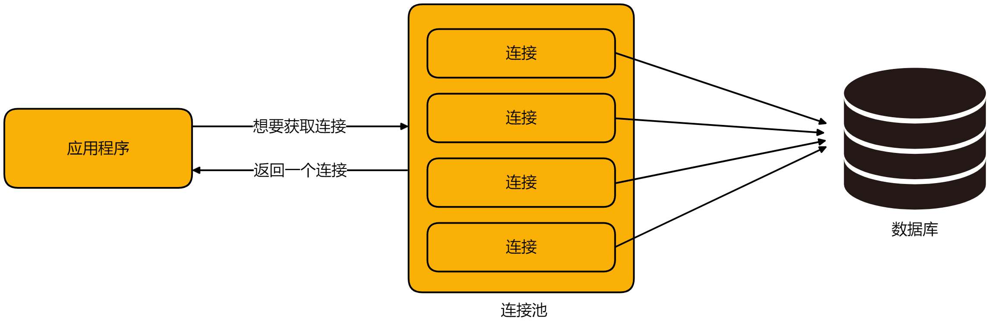

# Spring整合连接池

# 1 学习目标

1. 了解连接池的概念
2. **重点掌握**SpringBoot项目整合HikariCP的过程
3. **重点掌握**连接池的基础配置
4. **重点掌握**通过连接池进行数据库操作

# 2 连接池概述

## 2.1 背景分析

- 项目开发过程中应用程序与数据库交互时，“获得连接”或“释放连接”是非常消耗系统资源的两个过程，频繁地进行数据库连接的建立和关闭会极大影响系统的性能，若多线程并发量很大，这样耗时的数据库连接就可能让系统变得卡顿。因此针对这种场景，数据库连接池应运而生。

## 2.2 连接池原理分析

- 在系统初始化的时候，在内存中开辟一片空间，将一定数量的数据库连接作为对象存储在对象池里，并对外提供数据库连接的获取和归还方法。用户访问数据库时，并不是建立一个新的连接，而是从数据库连接池中取出一个已有的空闲连接对象；使用完毕归还后的连接也不会马上关闭，而是由数据库连接池统一管理回收，为下一次借用做好准备。如果由于高并发请求导致数据库连接池中的连接被借用完毕，其他线程就会等待，直到有连接被归还。整个过程中，连接并不会关闭，而是源源不断地循环使用，有借有还。数据库连接池还可以通过设置其参数来控制连接池中的初始连接数、连接的上下限数，以及每个连接的最大使用次数、最大空闲时间等，也可以通过其自身的管理机制来监视数据库连接的数量、使用情况等。

## 2.3 Java中的连接池

- Java官方，为了在应用程序中更好的应用连接池技术，定义了一套数据源规范，例如**javax.sql.DataSource**接口，基于这个接口，很多团队或个人创建了不同的连接池对象。然后我们的应用程序中通过耦合与**DataSource**接口，便可以方便的切换不同厂商的连接池。
- 用户通过**DataSource**对象的**getConnection()**方法，获取一个连接。假如池中有连接，则直接将连接返回给用户。假如池中没有连接，则会调用Dirver（驱动，由数据库厂商进行实现）对象的connect方法从数据库获取，拿到连接以后，可以将连接在池中放一份，然后将连接返回给调用方。连接需求方再次需要连接时，可以从池中获取，用完以后再还给池对象。



- 当连接对象使用完毕,可以通过连接对象调用**close()**方法,将连接对象归还到连接池,但是这种操作不会将连接关闭。

- 数据库连接池在Java数据库相关中间件产品群中，应该算是底层最基础的一类产品

- 作为企业应用开发必不可少的组件，无数天才们为我们贡献了一个又一个的优秀产品，它们有的随时代发展，功成身退，有的则还在不断迭代，老而弥坚，更有新生代产品，或性能无敌，或功能全面。目前市场上常见的连接池有DBCP、C3P0、DRUID、HikariCP等。

# 3 HikariCP入门实践

## 3.1 前期准备

### 3.1.1 项目准备

- 在JSDSecondStage项目下创建**HikariCPDemo**模块,并设置版本号为2.5.4

### 3.1.2 添加依赖

- 需要在当前模块下的pom.xml中添加如下的依赖

```xml
<!--mysql数据库驱动-->
<dependency>
    <groupId>mysql</groupId>
    <artifactId>mysql-connector-java</artifactId>
    <scope>runtime</scope>
</dependency>
<!--spring对象jdbc支持-->
<dependency>
    <groupId>org.springframework.boot</groupId>
    <artifactId>spring-boot-starter-jdbc</artifactId>
</dependency>
```

## 3.2 HikariCP简单介绍

- HikariCP是由日本程序员开源的一个数据库连接池组件，代码非常轻量，并且速度非常的快。根据官方提供的数据，在i7，开启32个线程32个连接的情况下，进行随机数据库读写操作，HikariCP的速度是现在常用的C3P0数据库连接池的数百倍。

## 3.3 配置HikariCP连接池

### 3.3.1 设置配置文件

- 使用连接池连接数据库,其实和我们最开始使用JDBC连接数据库的思路是一样的,都是需要配置url,username和password的,至于driver可以忽略

```java
Class.forName("com.mysql.jdbc.Driver");
String url = "jdbc:mysql://localhost:3306/hr?useUnicode=true&characterEncoding=utf8";
String user = "root";
String pwd = "root";
conn = DriverManager.getConnection(url, user, pwd);
```

①**`application.yml`**

```yaml
#配置数据源信息
spring:
  datasource:
    url: jdbc:mysql://localhost:3306/tedu?useUnicode=true&characterEncoding=utf8&serverTimeZone=Asia/Shanghai
    username: root
    password: root
```

- **注意**:
  - 配置yml时,格式非常严格,注意格式的缩进
  - 在配置username时,需要填写自己的用户名,目前项目中使用**root**即可
  - 在配置password时,需要填写自己实际数据库的密码,确保无误,否则会连接失败
- 而HikariCP连接池还可以做其余的配置,直接配置到当前配置文件中即可,但这些配置是可选的,根据实际情况再决定是否需要配置(自行参照即可)

```yaml
#配置数据源信息
spring:
  datasource:
    url: jdbc:mysql://localhost:3306/hr?serverTimezone=GMT%2B8&characterEncoding=utf8
    username: root
    password: root
    #hikari可选配置
    #数据源类型
    type: com.zaxxer.hikari.HikariDataSource
    hikari:
      #最小空闲连接，默认值10，小于0或大于maximum-pool-size,都会重置为maximum-pool-size
      minimum-idle: 5
      #最大连接数,小于等于0会被重置为默认值10;大于零小于1会被重置为minimum-idle的值
      maximum-pool-size: 15
      #自动提交从池中返回的连接
      auto-commit: true
      #连接池名称(不设置默认为HikariPool-1)
      pool-name: DatebookHikariCP
      #连接超时时间:毫秒,小于250毫秒,否则被重置为默认值30秒
      connection-timeout: 30000
      #连接测试查询
      connection-test-query: SELECT 1
```

### 3.3.2 测试链接

①**`TestHikariCP`**

```java
package cn.tedu;

import org.junit.jupiter.api.Test;
import org.springframework.beans.factory.annotation.Autowired;
import org.springframework.boot.test.context.SpringBootTest;

import javax.sql.DataSource;
import java.sql.Connection;
import java.sql.SQLException;

/**
 * @author 老安
 * @data 2023-04-12 20:20
 */
@SpringBootTest
public class TestHikariCP {
    /*
     * 创建数据源对象
     * 可以通过该对象从池中获取链接,或者关闭链接
     */
    @Autowired
    private DataSource dataSource;

    //private HikariDataSource dataSource;
    @Test
    public void testConnection() throws SQLException {
        //获取连接
        Connection conn = dataSource.getConnection();
        System.out.println(conn);
        //归还连接,不是关闭连接
        conn.close();
    }
}
```

## 3.4 JDBC基本操作实践

- 基于HikariCP，借助JDBC技术访问`jobs`表中的数据。

### 3.4.1 准备单元测试类

- 将`TestJDBC`放置在项目的`test/cn/tedu`目录下

### 3.4.2 测试添加操作

- 在测试类`TestJDBC`中的单元测试方法**testAdd**中实现向class表中插入一条记录

```java
@Test
public void testAdd() throws Exception {
    //1.获取连接
    Connection conn = dataSource.getConnection();
    //2.创建PreparedStatement对象(基于该对象发送sql)
    String sql = "INSERT INTO class(name, floor, teacher_id) VALUES (?, ?, ?)";
    PreparedStatement prep = conn.prepareStatement(sql);
    //3.为sql骨架插入具体的参数值
    prep.setString(1, "测试高级班");
    prep.setString(2, "0");
    prep.setDouble(3, 99);
    //4.发送sql
    int rows = prep.executeUpdate();
    System.out.println(rows > 0 ? "插入成功!" : "插入失败!!");
    //5.处理结果(一般都是查询操作处理结果)
    //6.释放资源
    prep.close();
    conn.close();
}
```

### 3.4.3 测试查询操作

- 在单元测试方法**testQuery**查询一条记录

```java
@Test
public void testQuery() throws Exception {
    //1.获取连接
    Connection conn = dataSource.getConnection();
    //2.创建Statement(基于此对象发送sql)
    String sql = "SELECT id, name, floor, teacher_id FROM class WHERE name = ?";
    PreparedStatement prep = conn.prepareStatement(sql);
    prep.setString(1, "测试高级班");
    //3.发送sql
    ResultSet rs = prep.executeQuery();
    //4.处理结果
    while (rs.next()) {
        Map<String, Object> map = new HashMap<>();
        map.put("id", rs.getString("id"));
        map.put("name", rs.getString("name"));
        map.put("floor", rs.getDouble("floor"));
        map.put("teacher_id", rs.getDouble("teacher_id"));
        System.out.println(map);
    }
    //5.释放资源
    rs.close();
    prep.close();
    conn.close();
}
```
