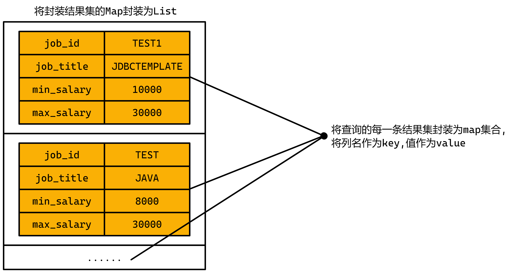

# SpringBoot整合JDBCTemplate

# 1 学习目标

1. 了解JDBCTemplate
2. **重点掌握**JDBCTemplate常用方法
3. **重点掌握**SpringBoot项目整个JDBCTemplate
4. **重点掌握**JDBCTemplate的CRUD操作

# 2 JDBCTemplate介绍

- JDBCTemplate是Spring官方提供的，基于jdbc技术访问数据库的一个API对象。此对象基于模板方法模式，对JDBC操作进行了封装。我们可以基于此对象，以更简单的一个步骤操作数据库中的数据。
- 我们只要在springboot工程中添加了spring-boot-starter-jdbc依赖，服务启动时，就会构建此对象，所以，你用的时候直接从spring容器去获取即可。

# 3 JDBCTemplate常用方法

* update()：执行DML语句。增、删、改语句

* queryForMap() ：查询结果将结果集封装为map集合，将列名作为key，将值作为value 将这条记录封装为一个map集合

  注意：这个方法查询的结果集长度只能是1

- queryForList()：查询结果将结果集封装为list集合

  注意：将每一条记录封装为一个Map集合，再将Map集合装载到List集合中

- query()：查询结果，将结果封装为JavaBean对象

  query的参数：RowMapper

  一般我们使用BeanPropertyRowMapper实现类。可以完成数据到JavaBean的自动封装

  new BeanPropertyRowMapper<类型>(类型.class)

- queryForObject：查询结果，将结果封装为对象

  一般用于聚合函数的查询

# 4 SpringBoot整合JDBCTemplate

## 4.1 创建项目

- 在JSDSecondStage项目下创建**`JDBCTemplateDemo`**模块,修改版本号为2.5.4

## 4.2 导入依赖

①**`pom.xml`**

```xml
<!--mysql数据库驱动依赖-->
<dependency>
    <groupId>mysql</groupId>
    <artifactId>mysql-connector-java</artifactId>
    <scope>runtime</scope>
</dependency>
<!--spring对象jdbc支持（此时会默认帮我们下载HiKariCP连接池,并且也会下载JDBCTemplate相关依赖）-->
<dependency>
    <groupId>org.springframework.boot</groupId>
    <artifactId>spring-boot-starter-jdbc</artifactId>
</dependency>
```

## 4.3 修改配置文件

①`application.yml`

```yaml
#配置数据源信息
spring:
  datasource:
    url: jdbc:mysql://localhost:3306/tedu?serverTimezone=GMT%2B8&characterEncoding=utf8&serverTimeZone=Asia/Shanghai
    username: root
    password: root
```

## 4.4 入门案例

- 将`TestJDBCTemplate`类复制到当前项目中

①**`TestJDBCTemplate`类中的`test01`方法**

```java
@Autowired
private JdbcTemplate jdbcTemplate;

/**
 * JDBCTemplate入门案例
 */
@Test
public void test01() {
    //1.定义SQL
    String sql = "INSERT INTO jobs VALUES('TEST01','DATA01',10000,30000)";
    //2.调用update执行SQL
    int rows = jdbcTemplate.update(sql);
    System.out.println(rows > 0 ? "新增成功!" : "新增失败!!");
}
```

# 5 JDBCTemplate的CRUD操作

## 5.1 查询操作

### 5.1 查询class表中的所有记录

- queryForList():查询结果将结果集封装为list集合

  注意：将每一条记录封装为一个Map集合，再将Map集合装载到List集合中



①**`TestJDBCTemplate`类中的`testQueryForList`方法**

```java
/**
 * 通过JDBCTemplate查询class表中的所有记录,并存储到List集合中
 */
@Test
public void testQueryForList() {
    //1.定义SQL
    String sql = "SELECT id, name, floor, teacher_id FROM class;";
    //2.调用queryForList执行SQL
    List<Map<String, Object>> maps = jdbcTemplate.queryForList(sql);
    //3.遍历记过,输出所有记录
    for (Map<String, Object> map : maps) {
        System.out.println(map);
    }
}
```

### 5.2 查询class表中指定一条记录

- queryForMap():查询结果将结果集封装为map集合，将列名作为key，将值作为value 将这条记录封装为一个map集合

  **注意**：这个方法查询的结果集长度只能是1

①**`TestJDBCTemplate`类中的`testQueryForMap`方法**

```java
/**
 * 通过JDBCTemplate查询class表中指定一条记录
 */
@Test
public void testQueryForMap() {
    //1.定义SQL
    String sql = "SELECT id, name, floor, teacher_id FROM class WHERE name = ?;";
    //2.调用queryForMap执行SQL
    Map<String, Object> map = jdbcTemplate.queryForMap(sql, "无敌班");
    //3.输出结果
    System.out.println(map);
}
```

### 5.3 查询class表中指定多条记录,并将结果封装到指定的对象

- query():查询结果，将结果封装为JavaBean对象

- query的参数：rowMapper

  一般我们使用BeanPropertyRowMapper实现类。

  可以完成数据到JavaBean的自动封装 new BeanPropertyRowMapper<类型>(类型.class)

①**`TestJDBCTemplate`类中的`testQuery`方法**

```java
/**
 * 通过JDBCTemplate查询class表中指定多条记录,并将结果封装到Class中
 */
@Test
public void testQuery() {
    //1.定义SQL
    String sql = "SELECT id, name, floor, teacher_id FROM class WHERE name LIKE ?";
    //2.执行SQL语句,指定将结果集封装到对应的实体类中,并且传入对应的参数
    List<Classes> list = jdbcTemplate.query(sql, new BeanPropertyRowMapper<>(Classes.class),"3%");
    //3.遍历记过,输出所有记录
    for (Classes classes : list) {
        System.out.println(classes);
    }
}
```

②**`Classes`**

```java
public class Classes {
    //属性和表中的字段保持一致
    private String jobId;
    private String jobTitle;
    private Double minSalary;
    private Double maxSalary;

    //set方法和get方法
    public long getId() {
        return id;
    }

    public void setId(long id) {
        this.id = id;
    }


    public String getName() {
        return name;
    }

    public void setName(String name) {
        this.name = name;
    }


    public long getFloor() {
        return floor;
    }

    public void setFloor(long floor) {
        this.floor = floor;
    }


    public long getTeacherId() {
        return teacherId;
    }

    public void setTeacherId(long teacherId) {
        this.teacherId = teacherId;
    }

    //toString方法
    @Override
    public String toString() {
        return "Class{" +
                "id=" + id +
                ", name='" + name + '\'' +
                ", floor=" + floor +
                ", teacherId=" + teacherId +
                '}';
    }
}
```

### 5.4 查询class表的总记录数

- queryForObject：查询结果，将结果封装为对象

  一般用于聚合函数的查询

①**`TestJDBCTemplate`类中的`testQueryForObject`方法**

```java
/**
 * 通过JDBCTemplate查询class表总记录数
 */
@Test
public void testQueryForObject() {
    //1.定义SQL
    String sql = "SELECT COUNT(id) FROM class";
    //2.执行SQL语句,指定将结果集封装到对应的实体类中,并且传入对应的参数
    Long total = jdbcTemplate.queryForObject(sql, Long.class);
    //3.输出查询总记录数
    System.out.println(total);
}
```

## 5.2 增删改操作

- update():执行DML语句。增、删、改语句

### 5.2.1 向class表中插入一条记录

①**`TestJDBCTemplate`类中的`testAdd`方法**

```java
/**
 * 通过JDBCTemplate向class表中插入一条记录
 */
@Test
public void testAdd() {
    //1.定义SQL
    String sql = "INSERT INTO class(name, floor, teacher_id) VALUES (?, ?, ?)";
    //2.将参数以数组的形式封装
    Object[] args = {"帅哥美女班", 11, 99};
    int rows = jdbcTemplate.update(sql, args);
    System.out.println(rows > 0 ? "新增成功!" : "新增失败!");
}
```

### 5.2.2 修改刚才添加的记录的部分数据

①**`TestJDBCTemplate`类中的`testUpdate`方法**

```java
/**
 * 通过JDBCTemplate将class表中的记录进行修改
 */
@Test
void testUpdate() {
    //1.定义SQL
    String sql = "UPDATE class SET name = ?,floor=?,teacher_id=? WHERE id = ?";
    //2.将参数封装为数组
    Object[] args = {20, "高薪就业班", 11, 99};
    int rows = jdbcTemplate.update(sql, args);
    System.out.println(rows > 0 ? "修改成功!" : "修改失败!");
}
```
