# 综合项目

# 1 学习目标

1. 利用二阶段所学知识,进行后台接口的开发
2. **熟练掌握**动态SQL技术

# 2 前期准备

## 2.1 创建SpringBoot工程

①在`JSDSecondStage`项目下创建SpringBoot模块，名为`SmartBlog`

- 项目名: `SmartBlog`
- Group名: `cn.tedu`

②在`pom.xml`中，统一修改项目版本为**2.5.4**

## 2.2 数据表准备

- 执行`sblog.sql`，生成对应sblog数据库

## 2.3 导入相关依赖

- 在pom.xml中的dependencies标签中，添加如下依赖(修改pom.xml文件，需要手动点击刷新按钮，使配置生效)

```xml
<!--添加MySQL数据库驱动依赖-->
<dependency>
    <groupId>mysql</groupId>
    <artifactId>mysql-connector-java</artifactId>
    <scope>runtime</scope>
</dependency>
<!--添加mybatis启动依赖-->
<dependency>
    <groupId>org.mybatis.spring.boot</groupId>
    <artifactId>mybatis-spring-boot-starter</artifactId>
    <version>2.2.0</version>
</dependency>
```

## 2.4 MyBatis框架简易配置

- 打开项目的application.yml文件，进行基础配置

```yaml
#设置连接数据库的url、username、password，这三部分不能省略
spring:
  datasource:
    url: jdbc:mysql://localhost:3306/sblog?serverTimezone=Asia/Shanghai&characterEncoding=utf8
    username: root
    password: root
#MyBatis开启驼峰映射,并且扫描xml文件
mybatis:
  configuration:
    map-underscore-to-camel-case: true
  mapper-locations: classpath:/mapper/*.xml
#日志设置
logging:
  level:
    cn:
      tedu: debug
```

## 2.5 测试代码实现

- 在`src/test/java`目录中添加测试类**MyBatisTest**，对MyBatis框架整合进行基本测试，代码如下：

```java
package cn.tedu;

import org.apache.ibatis.session.SqlSession;
import org.junit.jupiter.api.Test;
import org.springframework.beans.factory.annotation.Autowired;
import org.springframework.boot.test.context.SpringBootTest;

import java.sql.Connection;

/**
 * 对mybatis框架整合进行基本测试
 */
@SpringBootTest
public class MyBatisTests {
    @Autowired
    private SqlSession sqlSession;
    @Test
    public void testGetConnection() {
        Connection conn=sqlSession.getConnection();
        System.out.println("connection="+conn);
    }
}
```

# 3 动态SQL

## 3.1 什么是动态SQL

- 动态 SQL是MyBatis强大特性之一。极大的简化我们拼装SQL的操作。
- SQL的内容是变化的, 可以根据条件获取到不同的sql语句.主要是where部分发生变化。
- 动态sql的实现, 使用的是mybatis提供的标签

## 3.2 常用动态SQL标签

### 3.2.1 where标签

- where和if一般结合使用
- 若where标签中的 if 条件都不满足，则where标签没有任何功能，即不会添加where关键字
- 若where标签中的 if 条件满足，则where标签会自动添加where关键字，并将条件最前方多余的 and去掉
- 注意：where标签不能去掉条件最后多余的and

### 3.2.2 if标签

- if标签通常用于 WHERE 语句、UPDATE 语句、INSERT 语句中

- 语法格式: \<if test="boolean判断结果"> SQL代码 \</if>

- 如果布尔值是真的话，就会将这个SQL代码片段加入到SQL语句中；只有if标签，没有 else。 可以有多个\<if>标签并列。

### 3.2.3 set标签

- set和if一般结合使用
- 使用set标签，相当于update语句中的set字段
- 一般用于修改语句,如果传递的参数为null,那么就不会修改该列的值
- 会智能的去掉最后一个语句后面的逗号

### 3.2.4 foreach标签

- foreach适用于批量添加、删除和查询记录
- 语法格式:

```xml
<foreach collection="集合类型" open="开始的字符" close="结束的字符" item="集合中的成员" separator="集合成员之间的分割符">
    #{item的值}
</foreach>
```

- **collection**:表示循环的对象是数组还是list集合。

  如果dao方法的形参是数组，collection="array";如果dao方法形参是list，collection="list";

  但是如果传入的是多个参数,则需要在collection中写传入的集合的参数名或者数据的参数名

- **open**:循环开始的字符。

- **close**:循环结束的字符。

- **item**:集合成员，自定义的变量。

- **separator**:集合成员之间的分隔符。

- **#{item的值}**:获取集合成员的值。

### 3.2.5 choose(when、otherwise)标签

- choose 主要用于分支判断，类似于 java 中带了 break的 switch...case，**只会满足所有分支中的一个**
- 语法格式:

```xml
<choose>
    <when test="">通过test表达式拼接SQL</when>
    <when test="">通过test表达式拼接SQL</when>
    <otherwise>当when都不符合条件，就会选择otherwise拼接SQL</otherwise> 
</choose>
```

### 3.2.6 sql标签

- sql标签是用于抽取可重用的 SQL 片段，将相同的，使用频繁的 SQL 片段抽取出来，单独定义，方便多次引用。
- sql抽取：经常将要查询的列名，或者插入用的列名抽取出来方便引用。
- include来引用已经抽取的sql。

# 4 整合MyBatis完成标签业务操作

## 4.1 相关设计

### 4.1.1 标签表设计

- `tb_tag`表示标签表,其中设计的字段内容如下

| Field         | Type                | Comment  |
| ------------- | ------------------- | -------- |
| id            | bigint(20) unsigned |          |
| name          | varchar(50)         | 标签名   |
| remark        | varchar(100)        | 评论     |
| created_time  | datetime            | 注册时间 |
| modified_time | datetime            | 修改时间 |

### 4.1.2 POJO对象设计

- 创建`pojo/Tag`类，通过此类封装标签相关信息，对象的具体内容如下：

```java
package cn.tedu.pojo;

import java.util.Date;

public class Tag {
    private Long id;
    private String name;
    private String remark;
    private Date createdTime;
    private Date modifiedTime;

    public Long getId() {
        return id;
    }

    public void setId(Long id) {
        this.id = id;
    }

    public String getName() {
        return name;
    }

    public void setName(String name) {
        this.name = name;
    }

    public String getRemark() {
        return remark;
    }

    public void setRemark(String remark) {
        this.remark = remark;
    }

    public Date getCreatedTime() {
        return createdTime;
    }

    public void setCreatedTime(Date createdTime) {
        this.createdTime = createdTime;
    }

    public Date getModifiedTime() {
        return modifiedTime;
    }

    public void setModifiedTime(Date modifiedTime) {
        this.modifiedTime = modifiedTime;
    }

    @Override
    public String toString() {
        return "Tags{" +
                "id=" + id +
                ", name='" + name + '\'' +
                ", remark='" + remark + '\'' +
                ", createdTime=" + createdTime +
                ", modifiedTime=" + modifiedTime +
                '}';
    }
}
```

### 4.1.3 DAO接口设计

- 在dao包，基于MyBatis规范设计用户数据访问接口TagDao
- 并且在接口上用**@Mapper**注解修饰,该注解由MyBatis框架提供，用于描述数据层接口，告诉系统底层为此接口创建其实现类，在实现类中定义数据访问逻辑，执行与数据库的会话(交互)。

```java
package cn.tedu.dao;

import org.apache.ibatis.annotations.Mapper;

@Mapper
public interface TagDao {
}
```

### 4.1.4 DAO单元测试类

- 在test/java/cn/tedu目录中添加测试类**TagDaoTest **
- 使用Spring注入TagDao实例

```java
package cn.tedu;

import cn.tedu.dao.TagDao;
import org.springframework.beans.factory.annotation.Autowired;
import org.springframework.boot.test.context.SpringBootTest;

@SpringBootTest
public class TagDaoTests {
    @Autowired
    private TagDao tagDao;
}
```

## 4.2 添加新的标签信息

### 4.2.1 DAO接口

- 在TagDao接口中,添加**insert**接口方法
- 参数: Tag Tag -- 新增的标签信息
- 返回值: int -- 返回插入的记录数

```java
@Mapper
public interface TagDao {
    @Insert("INSERT INTO tb_tags(name,remark,created_time,modified_time) VALUES (#{name},#{remark},#{createdTime},#{modifiedTime})")
    int insert(Tag Tag);
}
```

### 4.2.2 DAO单元测试类实现

- 定义**insert**单元测试方法

```java
@Test
void insert() {
    Tag tag = new Tag();
    tag.setName("mysql");
    tag.setRemark("mysql..");
    tag.setCreatedTime(new Date());
    tag.setModifiedTime(new Date());
    tagDao.insert(tag);
}
```

### 4.2.3 执行测试

- 执行**insert**方法,执行成功,查看tb_Tag表中的记录是否发生变化

## 4.3 查询标签信息

### 4.3.1 DAO接口

- 在TagDao接口中,添加**list**接口方法
- 返回值: List\<Tag> -- 返回多条标签信息

```java
@Select("select * from tb_Tag")
List<Tag> list();
```

### 4.3.2 DAO单元测试类实现

- 定义**list**单元测试方法

```java
@Test
public void testList() {
    List<Tag> list = tagDao.list();
    for (Tag tag : list) {
        System.out.println(tag);
    }
}
```

### 4.3.3 执行测试

- 执行**testList**方法,执行成功

## 4.4 更新标签信息

### 4.4.1 DAO接口

- 在TagDao接口中,添加**update**接口方法
- 参数: Tag tag -- 更新的标签信息
- 返回值: int -- 返回更新的记录数

```java
@Update("UPDATE tb_Tag SET name=#{name},remark=#{remark},modified_time=#{modifiedTime} WHERE id=#{id}")
int update(Tag tag);
```

### 4.4.2 DAO单元测试类实现

- 定义**update**单元测试方法

```java
@Test
public void update() {
    Tag tag = new Tag();
    tag.setId(1L);
    tag.setName("Chinese");
    tag.setRemark("这门语言简直牛炸天了");
    tag.setModifiedTime(new Date());
    System.out.println(rows>0 ? "修改成功!" : "修改失败!");
}
```

### 4.4.3 执行测试

- 执行**update**方法,执行成功

## 4.5 删除标签信息

### 4.5.1 Dao接口

- 在TagDao接口中,添加**list**接口方法
- 参数: Long id -- 删除的标签id
- 返回值: int -- 返回删除的记录数

```java
@Delete("DELETE FROM tb_Tag where id=#{id}")
int deleteById(Long id);
```

### 4.5.2 Dao单元测试类实现

- 定义**deleteById**单元测试方法

```java
@Test
public void deleteById() {
    int rows = TagDao.deleteById(1L);
    System.out.println(rows > 0 ? "删除成功!" : "删除失败!");
}
```

### 4.5.3 执行测试

-   执行**deleteById**方法,执行成功

# 5 整合MyBatis完成用户数据操作

## 5.1 相关设计

### 5.1.1 用户表设计

- tb_users表示用户表,其中设计的字段内容如下

| Field         | Type         | Comment                        |
| ------------- | ------------ | ------------------------------ |
| id            | int(11)      |                                |
| username      | varchar(50)  | 用户名                         |
| nickname      | varchar(50)  | 昵称                           |
| password      | varchar(255) | 密码                           |
| mobile        | varchar(20)  | 电话号码                       |
| status        | tinyint(4)   | 账号是否被锁住，0→禁用，1→启用 |
| created_time  | datetime     | 注册时间                       |
| modified_time | datetime     | 修改时间                       |

### 5.1.2 POJO对象设计

- 创建pojo包，设计一个**User**对象，通过此对象封装用户相关信息，对象的具体内容如下：

```java
package cn.tedu.pojo;

import java.util.Date;

public class User {
    private Integer id;
    private String username;
    private String nickname;
    private String password;
    private String mobile;
    private Integer status;
    private Date createdTime;
    private Date modifiedTime;

    public Integer getId() {
        return id;
    }

    public void setId(Integer id) {
        this.id = id;
    }

    public String getUsername() {
        return username;
    }

    public void setUsername(String username) {
        this.username = username;
    }

    public String getNickname() {
        return nickname;
    }

    public void setNickname(String nickname) {
        this.nickname = nickname;
    }

    public String getPassword() {
        return password;
    }

    public void setPassword(String password) {
        this.password = password;
    }

    public String getMobile() {
        return mobile;
    }

    public void setMobile(String mobile) {
        this.mobile = mobile;
    }

    public Integer getStatus() {
        return status;
    }

    public void setStatus(Integer status) {
        this.status = status;
    }

    public Date getCreatedTime() {
        return createdTime;
    }

    public void setCreatedTime(Date createdTime) {
        this.createdTime = createdTime;
    }

    public Date getModifiedTime() {
        return modifiedTime;
    }

    public void setModifiedTime(Date modifiedTime) {
        this.modifiedTime = modifiedTime;
    }

    @Override
    public String toString() {
        return "User{" +
                "id=" + id +
                ", username='" + username + '\'' +
                ", nickname='" + nickname + '\'' +
                ", password='" + password + '\'' +
                ", mobile='" + mobile + '\'' +
                ", status=" + status +
                ", createdTime=" + createdTime +
                ", modifiedTime=" + modifiedTime +
                '}';
    }
}
```

### 5.1.3 DAO接口设计

- 创建dao包，基于MyBatis规范设计用户数据访问接口UserDao
- 并且在接口上用**@Mapper**注解修饰,该注解由MyBatis框架提供，用于描述数据层接口，告诉系统底层为此接口创建其实现类，在实现类中定义数据访问逻辑，执行与数据库的会话(交互)。

```java
package cn.tedu.dao;

import org.apache.ibatis.annotations.Mapper;

@Mapper
public interface UserDao {
}
```

### 5.1.4 DAO接口映射文件

- 在项目的resources目录下创建mapper目录，并在目录下创建UserMapper.xml文件
- 并且在指定要映射的**UserDao**接口的全路径

```xml
<?xml version="1.0" encoding="UTF-8" ?>
<!DOCTYPE mapper
        PUBLIC "-//mybatis.org//DTD Mapper 3.0//EN"
        "http://mybatis.org/dtd/mybatis-3-mapper.dtd">
<mapper namespace="cn.tedu.dao.UserDao">

</mapper>
```

### 5.1.5 Dao单元测试类

- 在src/test/java目录中添加测试类**UserDaoTests **
- 使用Spring注入UserDao实例

```java
package cn.tedu;

import cn.tedu.dao.UserDao;
import org.springframework.beans.factory.annotation.Autowired;
import org.springframework.boot.test.context.SpringBootTest;

@SpringBootTest
public class UserDaoTests {
    @Autowired
    private UserDao userDao;
}
```

## 5.2 添加新的User信息

### 5.2.1 Dao接口

- 在UserDao接口中,添加**insert**接口方法
- 参数: User user -- 包含新增用户信息
- 返回值: int -- 添加的用户记录数

```java
@Mapper
public interface UserDao {
    /**添加新的User信息*/
    int insert(User user);
}
```

### 5.2.2 Dao接口映射文件

- 在UserMapper.xml中添加新增User信息的SQL

```xml
<?xml version="1.0" encoding="UTF-8" ?>
<!DOCTYPE mapper
        PUBLIC "-//mybatis.org//DTD Mapper 3.0//EN"
        "http://mybatis.org/dtd/mybatis-3-mapper.dtd">
<mapper namespace="cn.tedu.dao.UserDao">
    <insert id="insert">
        INSERT INTO tb_users
        (username, nickname, password, mobile, STATUS, created_time, modified_time)
        VALUES (#{username}, #{nickname}, #{password}, #{mobile}, #{status}, #{createdTime}, #{modifiedTime})
    </insert>
</mapper>
```

### 5.2.3 Dao单元测试类实现

- 定义insert单元测试方法,插入一条新的用户记录

```java
@SpringBootTest
public class UserDaoTests {
    @Autowired
    private UserDao userDao;
    @Test
    public void insert(){
        User user=new User();
        user.setUsername("Jack");
        user.setPassword("123456");
        user.setNickname("Jack");
        user.setMobile("1391112121");
        user.setStatus(1);
        user.setCreatedTime(new Date());
        user.setModifiedTime(new Date());
        userDao.insert(user);
    }
}
```

### 5.2.4 执行测试

- 执行insert方法,执行成功,查看tb_users表中是否出现一条记录

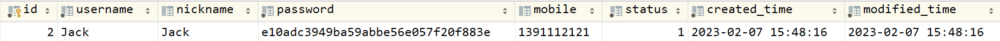

## 5.3 查询指定时间范围注册的用户信息

### 5.3.1 DAO接口

- 在UserDao接口中,添加**list**接口方法
- 参数: String beginTime -- 起始时间
- 参数: String endTime -- 终止时间
- 返回值: List\<User> -- 返回多条用户信息

```java
List<User> list(String beginTime,String endTime);
```

### 5.3.2 DAO接口映射文件

- 在application.yml中指定扫描的包路径

```yaml
#MyBatis开启驼峰映射,并且扫描xml文件
mybatis:
  #指定entity扫描包类让mybatis自定扫描到自定义的包路径,这样在mapper.xml中就直接写类名即可
  type-aliases-package: cn.tedu.pojo
```

- UserMapper.xml中定义list的SQL语句

```xml
<select id="list" resultType="User">
    SELECT id, username, nickname, password, mobile, status, created_time, modified_time
    FROM tb_users 
    WHERE created_time > #{createdTime}
</select>
```

### 5.3.3 DAO单元测试类实现

- 定义**list**单元测试方法

```java
@Test
public void list(){
    List<User> list = userDao.list("2023-04-16 12:00:00","2023-04-17 23:59:59");
    for(User user:list){
        System.out.println(user);
    }
}
```

### 5.3.4 执行测试

- 执行**testList**方法,执行成功,将查询结果打印在控制台

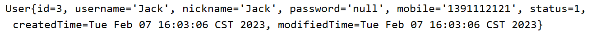

### 5.3.5 分析问题

- 类似界面


- 查询情况:
  - 只输入起始时间,查询起始时间之后所有的注册信息
  - 只输入终止时间,查询终止时间之前的所有注册信息
  - 输入起始时间和终止时间,查询起始之间之后并且终止时间之前的所有注册信息
  - 起始时间和终止时间都不输入,则查询所有信息

### 5.3.6 使用动态SQL修改案例

- 将UserMapper.xml中id为list的SQL,修改如下:

```xml
<select id="list" resultType="User">
    SELECT id, username, nickname, mobile, STATUS, created_time, modified_time
    FROM tb_users
    <where>
        <if test="beginTime!=null">
            AND created_time >= #{beginTime}
        </if>
        <if test="endTime!=null">
            AND created_time &lt;= #{endTime}
        </if>
    </where>
</select>
```

### 5.3.7 进行测试

- 执行list方法测试方法,并且输入起始时间和终止时间,查看测试结果

```java
@Test
public void list(){
    List<User> list = userDao.list("2023-04-16 12:00:00","2023-04-16 23:59:59");
    for(User user:list){
        System.out.println(user);
    }
}
```

- 执行list方法测试方法,并且只输入起始时间,测试结果

```java
@Test
public void list(){
    List<User> list = userDao.list("2023-04-16 12:00:00",null);
    for(User user:list){
        System.out.println(user);
    }
}
```

- 执行list方法测试方法,并且只输入终止时间,测试结果

```java
@Test
public void list(){
    List<User> list = userDao.list(null,"2023-04-16 23:59:59");
    for(User user:list){
        System.out.println(user);
    }
}
```

- 执行list方法测试方法,什么也不输入,测试结果

```java
@Test
public void list(){
    List<User> list = userDao.list(null,null);
    for(User user:list){
        System.out.println(user);
    }
}
```

## 5.4 更新用户信息

### 5.4.1 Dao接口

- 在UserDao接口中,添加**update**接口方法
- 参数: User user -- 包含修改用户信息
- 返回值: int -- 返回修改的记录数

```java
/**更新用户信息*/
int update(User user);
```

### 5.4.2 Dao接口映射文件

- 在UserMapper.xml中添加SQL

```xml
<update id="update">
    UPDATE tb_users SET
    username=#{username},
    nickname=#{nickname},
    mobile=#{mobile},
    modified_time=#{modifiedTime}
    WHERE id=#{id}
</update>
```

### 5.4.3 Dao单元测试类实现

- 定义**update**单元测试方法

```java
@Test
public void update(){
    User user=new User();
    user.setId(3);
    user.setUsername("Tom");
    user.setNickname("Pony-001");
    user.setMobile("1234569098");
    user.setStatus(2);
    user.setModifiedTime(new Date());
    userDao.update(user);
}
```

### 5.4.4 执行测试

- 执行**testUpdate**方法,执行成功,查看tb_users表中的记录是否发生变化


### 5.4.5 分析问题

- 在上述的更新操作中,我们需要填写要更新的用户信息,如下图所示

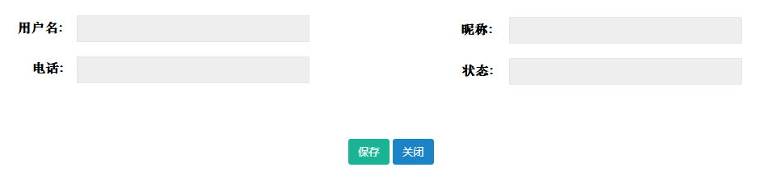

- 但是我们正常的使用时,如果不输入要修改的某一个或某几个信息,那么就应该不会修改该字段的值

- 所以我们此处为了能实现只修改填写的字段的内容,我们可以继续通过动态SQL技术,来使这类问题得到更为简单的实现

### 5.4.6 使用动态SQL修改案例

- 将UserMapper.xml中id为update的SQL,修改如下:

```xml
<update id="update">
    UPDATE tb_users
    <set>
        <if test="username!=null and username!=''">username=#{username},</if>
        <if test="nickname!=null and nickname!=''">nickname=#{nickname},</if>
        <if test="mobile!=null and mobile!=''">mobile=#{mobile},</if>
        <if test="modifiedTime!=null">modified_time=#{modifiedTime}</if>
    </set>
    WHERE id=#{id}
</update>
```

##  5.5 批量修改用户状态

### 5.5.1 Dao接口

- 在UserDao接口中,添加**validById**接口方法
- 参数: Integer[] ids -- 需要修改的多个用户id
- 参数: Integer status -- 修改为该状态值
- 返回值: int -- 返回修改的记录数

```java
/**修改用户状态*/
int validById(Integer[] ids, Integer status);
```

### 5.5.2 Dao接口映射文件

- 在UserMapper.xml中添加SQL,但是目前我们SQL怎么写呢?此处我们传入了多个id值,所以可以使用动态SQL中的foreach标签

```xml
<update id="validById">
    UPDATE tb_users
    SET status=#{status}
    WHERE
    id IN
    <foreach collection="ids" open="(" close=")" separator="," item="id">
        #{id}
    </foreach>
</update>
```

### 5.5.3 Dao单元测试类实现

- 定义**validById**单元测试方法

```java
@Test
public void validById() {
    Integer[] ids = new Integer[]{3, 4};
    int rows = userDao.validById(ids, 0);
    System.out.println(rows > 0 ? "修改成功" + rows + "条!" : "修改失败!");
}
```

### 5.5.4 执行测试

- 执行**testValidById**方法,执行成功,查看tb_users表中的记录是否发生变化

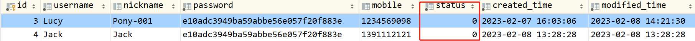

### 5.5.6 分析问题

- 在上述的修改操作中,我们也可以选择不填写修改的id,那么就会报错,那这种是我们不希望看到的所以我们希望用户如果不填写id,那么就不会修改任何用户的记录

### 5.5.7 使用动态SQL修改案例

- 将UserMapper.xml中id为validById的SQL,修改如下:

```xml
<update id="validById">
    UPDATE tb_users
    set status=#{status}
    <where>
        <choose>
            <when test="ids!=null and ids.length>0">
                id in <!--(1,2,3,4,5)-->
                <foreach collection="ids" open="(" close=")" separator="," item="id">
                    #{id}
                </foreach>
            </when>
            <otherwise>
                1=2
            </otherwise>
        </choose>
    </where>
</update>
```

# 6 整合MyBatis完成文章业务操作

## 6.1 相关设计

### 6.1.1 文章表设计

- `tb_articles`表示`文章表`,其中设计的字段内容如下

| Field         | Type                | Comment                     |
| ------------- | ------------------- | --------------------------- |
| id            | bigint(20)          | ID                          |
| title         | varchar(50)         | 标题                        |
| type          | char(1)             | 类型（1 原创 2 转载 3翻译） |
| content       | varchar(500)        | 文章内容                    |
| status        | char(1)             | 状态（1审核 2通过 3关闭）   |
| user_id       | bigint(20) unsigned | 用户id                      |
| created_time  | datetime            | 创建时间                    |
| modified_time | datetime            | 更新时间                    |

###  6.1.2 文章标签表

- `tb_articles_tags`表表示`文章标签表`,基于业务创建文章、标签关系表（文章和标签是一种多对多的关系，这种关系需要一张关系表）,其中设计的字段内容如下

| Field         | Type       | Comment  |
| ------------- | ---------- | -------- |
| id            | bigint(20) | ID       |
| article_id    | bigint(20) | 文章 ID  |
| tag_id        | bigint(20) | 标签 ID  |
| created_time  | datetime   | 创建时间 |
| modified_time | datetime   | 更新时间 |

### 6.1.3 POJO对象设计

```java
package cn.tedu.pojo;

import java.util.Arrays;
import java.util.Date;
import java.util.List;

public class Article {
    private Long id;
    private String title;
    private String type;
    private String status;
    private String content;
    private Long userId;
    private Date createdTime;
    private Date modifiedTime;

    public Long getId() {
        return id;
    }

    public void setId(Long id) {
        this.id = id;
    }

    public String getTitle() {
        return title;
    }

    public void setTitle(String title) {
        this.title = title;
    }

    public String getType() {
        return type;
    }

    public void setType(String type) {
        this.type = type;
    }

    public String getStatus() {
        return status;
    }

    public void setStatus(String status) {
        this.status = status;
    }

    public String getContent() {
        return content;
    }

    public void setContent(String content) {
        this.content = content;
    }

    public Long getUserId() {
        return userId;
    }

    public void setUserId(Long userId) {
        this.userId = userId;
    }

    public Date getCreatedTime() {
        return createdTime;
    }

    public void setCreatedTime(Date createdTime) {
        this.createdTime = createdTime;
    }

    public Date getModifiedTime() {
        return modifiedTime;
    }

    public void setModifiedTime(Date modifiedTime) {
        this.modifiedTime = modifiedTime;
    }

    @Override
    public String toString() {//alt+insert
        return "Article{" +
                "id=" + id +
                ", title='" + title + '\'' +
                ", type='" + type + '\'' +
                ", status='" + status + '\'' +
                ", content='" + content + '\'' +
                ", userId=" + userId +
                ", createdTime=" + createdTime +
                ", modifiedTime=" + modifiedTime +
                '}';
    }
}
```

### 6.1.4 DAO接口设计

①**`ArticleDao`**

```java
package cn.tedu.dao;

import org.apache.ibatis.annotations.Mapper;

@Mapper
public interface ArticleDao {
    
}
```

②**`ArticleTagDao`**

```java
package cn.tedu.dao;

import org.apache.ibatis.annotations.Mapper;

@Mapper
public interface ArticleTagDao {
}
```

### 6.1.5 Dao接口映射文件

①**`ArticleMapper.xml`**

```xml
<?xml version="1.0" encoding="UTF-8" ?>
<!DOCTYPE mapper
        PUBLIC "-//mybatis.org//DTD Mapper 3.0//EN"
        "http://mybatis.org/dtd/mybatis-3-mapper.dtd">
<mapper namespace="cn.tedu.dao.ArticleDao">

</mapper>
```

②**`ArticleTagMapper.xml`**

```xml
<?xml version="1.0" encoding="UTF-8" ?>
<!DOCTYPE mapper
        PUBLIC "-//mybatis.org//DTD Mapper 3.0//EN"
        "http://mybatis.org/dtd/mybatis-3-mapper.dtd">
<mapper namespace="cn.tedu.dao.ArticleTagDao">

</mapper>
```

### 6.1.6 Dao单元测试类

①**`ArticleDaoTest`**

```java
package cn.tedu;

import org.springframework.boot.test.context.SpringBootTest;

@SpringBootTest
public class ArticleDaoTest {
    @Autowired
    private ArticleDao articleDao;
}
```

## 6.2 添加新的文章信息

### 6.2.1 Dao接口

- 在ArticleDao接口中,添加**insert**接口方法
- 参数: Article article -- 包含新增文章信息
- 返回值: int -- 添加的文章记录数

```java
int insert(Article article);
```

### 6.2.2 Dao接口映射文件

- **`ArticleMapper.xml`**

```xml
<?xml version="1.0" encoding="UTF-8" ?>
<!DOCTYPE mapper
        PUBLIC "-//mybatis.org//DTD Mapper 3.0//EN"
        "http://mybatis.org/dtd/mybatis-3-mapper.dtd">
<mapper namespace="cn.tedu.dao.ArticleDao">
    <insert id="insert">
        INSERT INTO tb_articles
            (title, type, content, status, user_id, created_time, modified_time)
        VALUES (#{title}, #{type}, #{content}, #{status}, #{userId}, now(), now())
    </insert>
</mapper>
```

### 6.2.3 Dao单元测试类实现

①**`ArticleDaoTest`**

```java
@SpringBootTest
public class ArticleDaoTest {
    @Autowired
    private ArticleDao articleDao;

    @Test
    public void insert() {
        Article article = new Article();
        article.setTitle("Spring Boot");
        article.setContent("Very Good");
        article.setType("1");
        article.setStatus("1");
        article.setUserId(1L);
        article.setCreatedTime(new Date());
        article.setModifiedTime(new Date());
        articleDao.insert(article);
        System.out.println(rows > 0 ? "新增成功!" : "新增失败!");
    }
}
```

### 6.2.4 执行测试

- 执行insert方法,执行成功,查看tb_articles表中是否出现一条记录

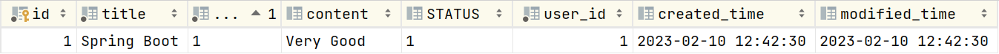

## 6.3 添加新的文章信息(改)

### 6.3.1 分析问题

- 现在我们插入一条文章记录是没有问题的,但是文章表和文章标签表是关联的,所以我们应该在插入文章时,也要将文章和标签的相关信息一同插入到文章标签表中,所以也需要在当前测试方法中,执行插入文章标签表记录的功能

### 6.3.2 DAO接口

- 在ArticleTagDao中定义插入文章和标签关系数据的接口方法
- 参数: Long articleId -- 对应的是新增的文章id
- 参数: Long[] tagIds -- 由于文章和标签是一对多的关系,文章可能有多个标签,所以使用数组
- 返回值: int -- 返回插入的记录数

```java
/**将文章和标签关系数据写入数据库*/
int insert(Long articleId,Long[]tagIds);
```

### 6.3.3 DAO接口映射文件

①**`ArticleTagMapper.xml`**

```xml
<?xml version="1.0" encoding="UTF-8" ?>
<!DOCTYPE mapper
        PUBLIC "-//mybatis.org//DTD Mapper 3.0//EN"
        "http://mybatis.org/dtd/mybatis-3-mapper.dtd">
<mapper namespace="cn.tedu.dao.ArticleTagDao">
    <insert id="insert">
        INSERT INTO tb_article_tags
        (article_id,tag_id,modified_time,created_time)
        VALUES
        <foreach collection="tagIds" separator="," item="tagId">
            (#{articleId},#{tagId},NOW(),NOW())
        </foreach>
    </insert>
</mapper>
```

### 6.3.4 DAO单元测试类实现

①**`ArticleDaoTests`**

```java
package cn.tedu;

import cn.tedu.dao.ArticleDao;
import cn.tedu.dao.ArticleTagDao;
import cn.tedu.pojo.Article;
import org.junit.jupiter.api.Test;
import org.springframework.beans.factory.annotation.Autowired;
import org.springframework.boot.test.context.SpringBootTest;
import org.springframework.transaction.annotation.Transactional;

import java.util.Date;

@SpringBootTest
public class ArticleDaoTest {
    @Autowired
    private ArticleDao articleDao;
    @Autowired
    private ArticleTagDao articleTagDao;

    @Test
    public void insert() {
        Article article = new Article();
        article.setTitle("Spring Boot");
        article.setContent("Very Good");
        article.setType("1");
        article.setStatus("1");
        article.setUserId(1L);
        article.setCreatedTime(new Date());
        article.setModifiedTime(new Date());
        //将文章自身信息写入到数据库
        int rows = articleDao.insert(article);
        System.out.println(rows > 0 ? "新增文章成功!" : "新增文章失败!");
        //将文章和标签关系数据写入到数据
        rows = articleTagDao.insert(article.getId(), new Long[]{1L, 3L});
        System.out.println(rows > 0 ? "新增文章标签关系成功!" : "新增文章标签失败!");
    }
}
```

### 6.3.5 执行测试

- 执行insert方法,执行成功,查看tb_articles表中是否出现一条记录

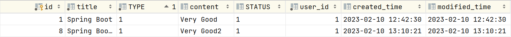

- 查看tb_articles_tag表中是否出现两条记录

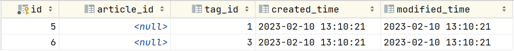

### 6.3.6 分析问题

- id不能获取

### 6.3.7 解决问题

- 在MyBatis的XML中的CRUD的标签中,两个属性:
  - useGeneratedKeys="true"表示使用自增主键值
  - keyProperty="id" 这里表示将主键值赋值给参数中的id属性

①**`ArticleMapper.xml`**

```xml
<mapper namespace="cn.tedu.dao.ArticleDao">
    <insert id="insert"  useGeneratedKeys="true" keyProperty="id">
        INSERT INTO tb_articles
            (title, type, content, status, user_id, created_time, modified_time)
        VALUES (#{title}, #{type}, #{content}, #{status}, #{userId}, now(), now())
    </insert>
</mapper>
```

## 6.4 基于文章id查询文章信息(包括文章内容、文章作者和文章标签信息)

### 6.4.1 ER图

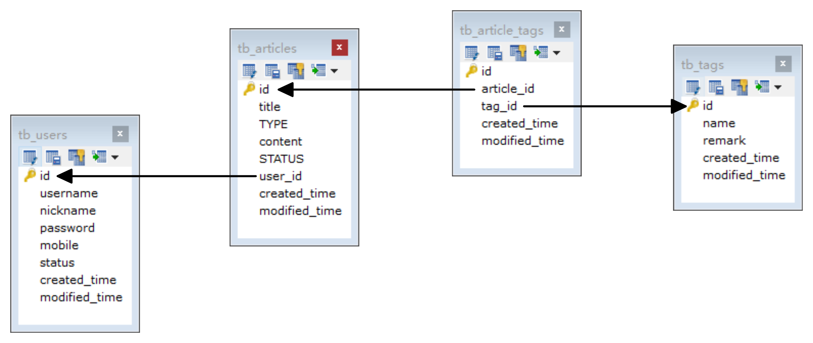

- 用户表和文章表是一对多的关系
- 文章表和标签表是多对多的关系

- 一个用户和一个文章的关系是一对一的关系
- 一个文章和多个标签的关系是一对多的关系

### 6.4.2 POJO对象设计

#### ①`Article`

```java
package cn.tedu.pojo;

import java.util.Date;
import java.util.List;

public class Article {
    private Long id;
    private String title;
    private String type;
    private String status;
    private String content;
    private Long userId;
    private Date createdTime;
    private Date modifiedTime;
    private List<Tag> Tag;
    private User author;

    public Long getId() {
        return id;
    }

    public void setId(Long id) {
        this.id = id;
    }

    public String getTitle() {
        return title;
    }

    public void setTitle(String title) {
        this.title = title;
    }

    public String getType() {
        return type;
    }

    public void setType(String type) {
        this.type = type;
    }

    public String getStatus() {
        return status;
    }

    public void setStatus(String status) {
        this.status = status;
    }

    public String getContent() {
        return content;
    }

    public void setContent(String content) {
        this.content = content;
    }

    public Long getUserId() {
        return userId;
    }

    public void setUserId(Long userId) {
        this.userId = userId;
    }

    public Date getCreatedTime() {
        return createdTime;
    }

    public void setCreatedTime(Date createdTime) {
        this.createdTime = createdTime;
    }

    public Date getModifiedTime() {
        return modifiedTime;
    }

    public void setModifiedTime(Date modifiedTime) {
        this.modifiedTime = modifiedTime;
    }
    public List<Tag> getTag() {
        return Tag;
    }

    public void setTag(List<Tag> Tag) {
        this.Tag = Tag;
    }
    public User getAuthor() {
        return author;
    }

    public void setAuthor(User author) {
        this.author = author;
    }
    @Override
    public String toString() {//alt+insert
        return "Article{" +
                "id=" + id +
                ", title='" + title + '\'' +
                ", type='" + type + '\'' +
                ", status='" + status + '\'' +
                ", content='" + content + '\'' +
                ", userId=" + userId +
                ", author=" + author +
                ", createdTime=" + createdTime +
                ", modifiedTime=" + modifiedTime +
                ", Tag=" + Tag +
                '}';
    }
}
```

### 6.4.3 DAO接口

- 在ArticleDao中定义基于文章id查询文章内容以及文章对应的标签信息的接口方法
- 参数: Long id -- 对应的是查询的文章id
- 返回值: Article -- 返回文章信息

```java
Article selectById(Long id);
```

### 6.4.4 DAO接口映射文件

#### ①`ArticleMapper.xml`

```xml
<?xml version="1.0" encoding="UTF-8" ?>
<!DOCTYPE mapper
        PUBLIC "-//mybatis.org//DTD Mapper 3.0//EN"
        "http://mybatis.org/dtd/mybatis-3-mapper.dtd">
<mapper namespace="cn.tedu.dao.ArticleDao">
    <insert id="insert"  useGeneratedKeys="true" keyProperty="id">
        INSERT INTO tb_articles
            (title, type, content, status, user_id, created_time, modified_time)
        VALUES (#{title}, #{type}, #{content}, #{status}, #{userId}, now(), now())
    </insert>
    <!--基于文章id查询文章信息以及文章对应的tag信息-->
    <select id="selectById" resultMap="articleTag">
        SELECT ar.id,ar.title,ar.type,ar.content,ar.status,ar.user_id,
               tag.id tagId,tag.name tagName,u.username,u.nickname
        FROM tb_articles  ar
                 JOIN tb_users u ON ar.user_id=u.id
                 LEFT JOIN tb_article_tags art ON ar.id=art.article_id
                 LEFT JOIN tb_tags tag ON art.tag_id =tag.id
        where ar.id=#{id}
    </select>
    <!--ResultMap是mybatis中用于实现高级映射的元素-->
    <resultMap id="articleTag" type="cn.tedu.pojo.Article">
        <id property="id" column="id"></id>
        <result property="title" column="title"></result>
        <result property="type" column="type"></result>
        <result property="content" column="content"></result>
        <result property="status" column="status"></result>
        <result property="userId" column="user_id"></result>
        <result property="createdTime" column="created_time"></result>
        <result property="modifiedTime" column="modified_time"></result>
        <association property="author" javaType="cn.tedu.pojo.User">
            <id property="id" column="user_id"></id>
            <result property="username" column="username"></result>
            <result property="nickname" column="nickname"></result>
        </association>
        <!--Collection对应one2many关系映射-->
        <collection property="Tag" ofType="cn.tedu.pojo.Tag">
            <id property="id" column="tagId"></id>
            <result property="name" column="tagName"></result>
        </collection>
    </resultMap>
</mapper>
```

### 6.4.5 Dao单元测试类实现

#### ①`ArticleDaoTest`

```java
package cn.tedu;

import cn.tedu.dao.ArticleDao;
import cn.tedu.dao.ArticleTagDao;
import cn.tedu.pojo.Article;
import cn.tedu.pojo.Tag;
import org.junit.jupiter.api.Test;
import org.springframework.beans.factory.annotation.Autowired;
import org.springframework.boot.test.context.SpringBootTest;
import org.springframework.transaction.annotation.Transactional;

import java.util.Date;
import java.util.List;

/**
 * @author 老安
 * @data 2023-04-17 19:20
 */
@SpringBootTest
public class ArticleDaoTest {
    @Autowired
    private ArticleDao articleDao;
    @Autowired
    private ArticleTagDao articleTagDao;

    @Test
    public void insert() {
        Article article = new Article();
        article.setTitle("Spring Boot");
        article.setContent("Very Good");
        article.setType("1");
        article.setStatus("1");
        article.setUserId(1L);
        article.setCreatedTime(new Date());
        article.setModifiedTime(new Date());
        //将文章自身信息写入到数据库
        System.out.println("插入文章前的id:" + article.getId());
        int rows = articleDao.insert(article);
        System.out.println("插入文章后的id:" + article.getId());
        System.out.println(rows > 0 ? "新增文章成功!" : "新增文章失败!");
        //将文章和标签关系数据写入到数据
        rows = articleTagDao.insert(article.getId(), new Long[]{1L, 3L});
        System.out.println(rows > 0 ? "新增文章标签关系成功!" : "新增文章标签失败!");
    }

    @Test
    public void selectById() {
        Article article = articleDao.selectById(3L);
        System.out.println("文章信息:" + article);
        System.out.println("文章所属用户信息:" + article.getAuthor());
        List<Tag> tags = article.getTag();
        for (Tag tag : tags) {
            System.out.println("文章所属标签:" + tag);
        }
    }
}
```

### 6.4.6 执行测试

- 执行**selectById**方法,执行成功,将查询结果打印在控制台

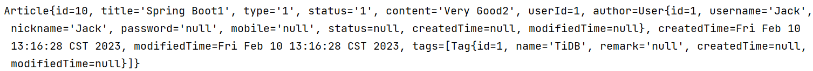

## 6.5 查询所有文章

### 6.5.1 DAO接口

- 在ArticleDao中定义查询所有文章的接口方法
- 返回值: List\<Article> -- 返回多条文章信息

```java
List<Article> list();
```

### 6.5.2 DAO接口映射文件

#### ①`ArticleMapper.xml`

```xml
<?xml version="1.0" encoding="UTF-8" ?>
<!DOCTYPE mapper
        PUBLIC "-//mybatis.org//DTD Mapper 3.0//EN"
        "http://mybatis.org/dtd/mybatis-3-mapper.dtd">
<mapper namespace="cn.tedu.dao.ArticleDao">
    <insert id="insert"  useGeneratedKeys="true" keyProperty="id">
        INSERT INTO tb_articles
            (title, type, content, status, user_id, created_time, modified_time)
        VALUES (#{title}, #{type}, #{content}, #{status}, #{userId}, now(), now())
    </insert>
    <!--基于文章id查询文章信息以及文章对应的tag信息-->
    <select id="selectById" resultMap="articleTag">
        SELECT ar.id,ar.title,ar.type,ar.content,ar.status,ar.user_id,
               tag.id tagId,tag.name tagName,u.username,u.nickname
        FROM tb_articles  ar
                 JOIN tb_users u ON ar.user_id=u.id
                 LEFT JOIN tb_article_tags art ON ar.id=art.article_id
                 LEFT JOIN tb_tags tag ON art.tag_id =tag.id
        where ar.id=#{id}
    </select>
    <!--基于文章id查询文章信息以及文章对应的tag信息-->
    <select id="list" resultMap="articleTag">
        SELECT ar.id,ar.title,ar.type,ar.content,ar.status,ar.user_id,
               tag.id tagId,tag.name tagName,u.username,u.nickname
        FROM tb_articles  ar
                 JOIN tb_users u ON ar.user_id=u.id
                 LEFT JOIN tb_article_tags art ON ar.id=art.article_id
                 LEFT JOIN tb_tags tag ON art.tag_id =tag.id
    </select>
    <!--ResultMap是mybatis中用于实现高级映射的元素-->
    <resultMap id="articleTag" type="cn.tedu.pojo.Article">
        <id property="id" column="id"></id>
        <result property="title" column="title"></result>
        <result property="type" column="type"></result>
        <result property="content" column="content"></result>
        <result property="status" column="status"></result>
        <result property="userId" column="user_id"></result>
        <result property="createdTime" column="created_time"></result>
        <result property="modifiedTime" column="modified_time"></result>
        <association property="author" javaType="cn.tedu.pojo.User">
            <id property="id" column="user_id"></id>
            <result property="username" column="username"></result>
            <result property="nickname" column="nickname"></result>
        </association>
        <!--Collection对应one2many关系映射-->
        <collection property="Tag" ofType="cn.tedu.pojo.Tag">
            <id property="id" column="tagId"></id>
            <result property="name" column="tagName"></result>
        </collection>
    </resultMap>
</mapper>
```

### 6.5.3 DAO单元测试类实现

#### ①`ArticleDaoTest`

```java
package cn.tedu;

import cn.tedu.dao.ArticleDao;
import cn.tedu.dao.ArticleTagDao;
import cn.tedu.pojo.Article;
import cn.tedu.pojo.Tag;
import org.junit.jupiter.api.Test;
import org.springframework.beans.factory.annotation.Autowired;
import org.springframework.boot.test.context.SpringBootTest;
import org.springframework.transaction.annotation.Transactional;

import java.util.Date;
import java.util.List;

/**
 * @author 老安
 * @data 2023-04-17 19:20
 */
@SpringBootTest
public class ArticleDaoTest {
    @Autowired
    private ArticleDao articleDao;
    @Autowired
    private ArticleTagDao articleTagDao;

    @Test
    public void insert() {
        Article article = new Article();
        article.setTitle("Spring Boot");
        article.setContent("Very Good");
        article.setType("1");
        article.setStatus("1");
        article.setUserId(1L);
        article.setCreatedTime(new Date());
        article.setModifiedTime(new Date());
        //将文章自身信息写入到数据库
        System.out.println("插入文章前的id:" + article.getId());
        int rows = articleDao.insert(article);
        System.out.println("插入文章后的id:" + article.getId());
        System.out.println(rows > 0 ? "新增文章成功!" : "新增文章失败!");
        //将文章和标签关系数据写入到数据
        rows = articleTagDao.insert(article.getId(), new Long[]{1L, 3L});
        System.out.println(rows > 0 ? "新增文章标签关系成功!" : "新增文章标签失败!");
    }

    @Test
    public void selectById() {
        Article article = articleDao.selectById(3L);
        System.out.println("文章信息:" + article);
        System.out.println("文章所属用户信息:" + article.getAuthor());
        List<Tag> tags = article.getTag();
        for (Tag tag : tags) {
            System.out.println("文章所属标签:" + tag);
        }
    }
    @Test
    public void list(){
        List<Article> list = articleDao.list();
        for (Article article : list) {
            System.out.println(article);
        }
    }
}
```

### 6.5.4 执行测试

- 执行**list**方法,执行成功,查看控制台查询的结果

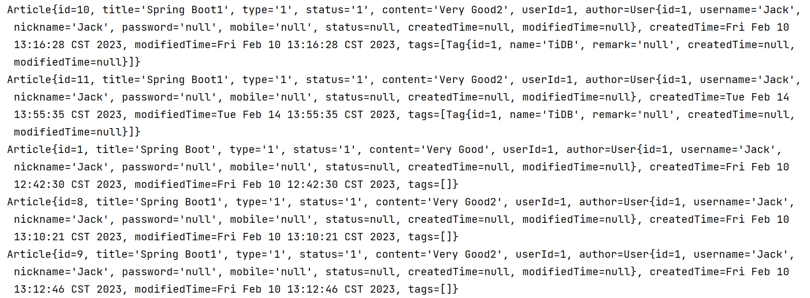

### 6.5.5 分析问题

- 在上述的两个案例中,查询的SQL是比较复杂的,并且两条SQL是有相同的部分的,所以我们可以使用动态SQL将重复部分提取为SQL片段,这样在后面使用时,就会轻松很多,并且结构也更清晰

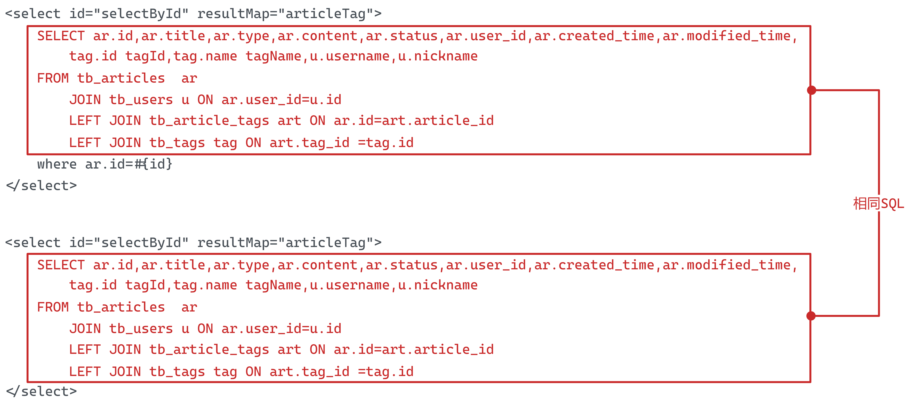

### 6.5.6 使用动态SQL修改案例

#### ①`ArticleMapper.xml`

```xml
<?xml version="1.0" encoding="UTF-8" ?>
<!DOCTYPE mapper
        PUBLIC "-//mybatis.org//DTD Mapper 3.0//EN"
        "http://mybatis.org/dtd/mybatis-3-mapper.dtd">
<mapper namespace="cn.tedu.dao.ArticleDao">
    <insert id="insert"  useGeneratedKeys="true" keyProperty="id">
        INSERT INTO tb_articles
            (title, type, content, status, user_id, created_time, modified_time)
        VALUES (#{title}, #{type}, #{content}, #{status}, #{userId}, now(), now())
    </insert>
    <!--基于文章id查询文章信息以及文章对应的tag信息-->
    <select id="selectById" resultMap="articleTag">
        <include refid="selectArt"/>
        where ar.id=#{id}
    </select>
    <!--基于文章id查询文章信息以及文章对应的tag信息-->
    <select id="list" resultMap="articleTag">
        <include refid="selectArt"/>
    </select>
    <!--ResultMap是mybatis中用于实现高级映射的元素-->
    <resultMap id="articleTag" type="cn.tedu.pojo.Article">
        <id property="id" column="id"></id>
        <result property="title" column="title"></result>
        <result property="type" column="type"></result>
        <result property="content" column="content"></result>
        <result property="status" column="status"></result>
        <result property="userId" column="user_id"></result>
        <result property="createdTime" column="created_time"></result>
        <result property="modifiedTime" column="modified_time"></result>
        <association property="author" javaType="cn.tedu.pojo.User">
            <id property="id" column="user_id"></id>
            <result property="username" column="username"></result>
            <result property="nickname" column="nickname"></result>
        </association>
        <!--Collection对应one2many关系映射-->
        <collection property="Tag" ofType="cn.tedu.pojo.Tag">
            <id property="id" column="tagId"></id>
            <result property="name" column="tagName"></result>
        </collection>
    </resultMap>
    <sql id="selectArt">
        SELECT ar.id,ar.title,ar.type,ar.content,ar.status,ar.user_id,
               tag.id tagId,tag.name tagName,u.username,u.nickname
        FROM tb_articles  ar
                 JOIN tb_users u ON ar.user_id=u.id
                 LEFT JOIN tb_article_tags art ON ar.id=art.article_id
                 LEFT JOIN tb_tags tag ON art.tag_id =tag.id
    </sql>
</mapper>
```

### 6.5.7 进行测试

- 重新执行**selectById**方法和**list**方法,查看查询结果是否和之前一致

# 7 表关系

## 6.1 一对一关系

- 一张表的记录对应另外一张表的一条记录

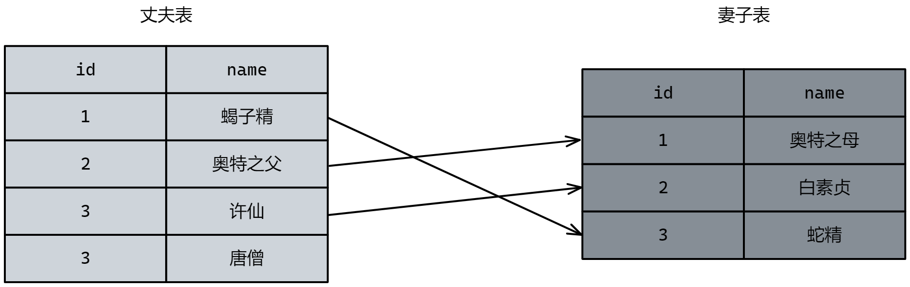

- 在实际的开发中应用不多.因为一对一可以创建成一张表

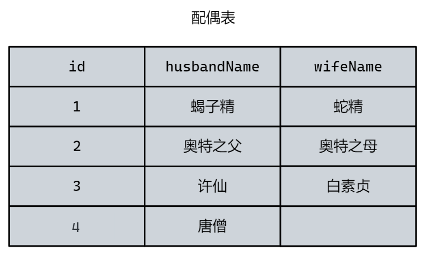


## 6.2 一对多（多对一）

- 记录一关系数据的表称为主表,而记录多关系数据的表称为从表


## 6.3 多对多关系

- 一张关联表记录两张表的关联关系

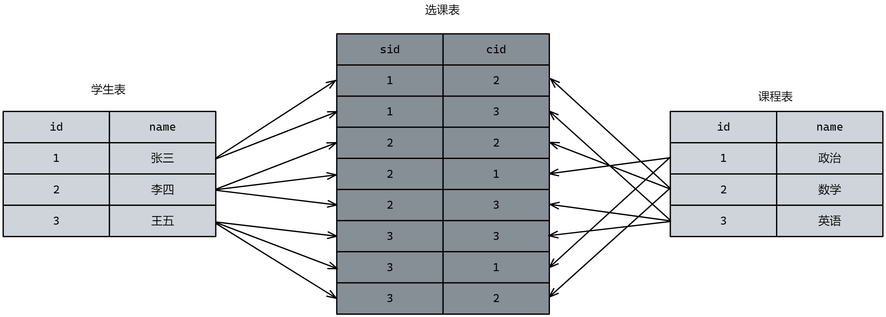
