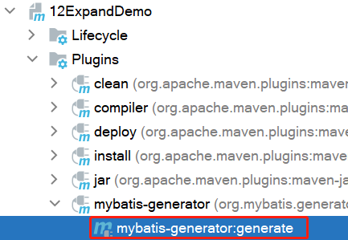
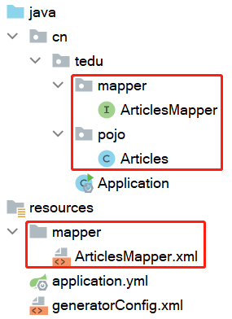

# 1 SQL加强

- 基于sblog库

- **技巧:** 一定要熟悉数据表之间的关系!!!!

①查询所有用户参与的文章及文章状态,结果按照用户id升序排序

```sql
SELECT u.id,
       u.username,
       u.nickname,
       u.password,
       a.title,
       a.status
FROM tb_users u
         INNER JOIN tb_articles a
                    ON u.id = a.user_id
ORDER BY u.id;
```

②查询拥有标签id为2的文章及其作者

```sql
SELECT a.title,
       u.username,
       t.name
FROM tb_tags t
         LEFT JOIN tb_article_tags at ON at.tag_id = t.id
         LEFT JOIN tb_articles a ON a.id = at.article_id
         LEFT JOIN tb_users u ON u.id = a.user_id
WHERE at.tag_id = 2;
```

③查询所有文章及其作者,结果按照文章创建时间降序排序

```sql
SELECT a.title,
       u.username,
       a.created_time
FROM tb_articles a
         LEFT JOIN tb_users u
                   ON a.user_id = u.id
ORDER BY a.created_time DESC;
```

④查询数据库中最近创建的5篇文章及其作者

```sql
SELECT a.title, u.username, a.created_time
FROM tb_articles a
         LEFT JOIN tb_users u ON a.user_id = u.id
ORDER BY a.created_time DESC
LIMIT 5;
```

⑤查询标签名叫做"java"的文章数量以及其占所有文章数量的比例

```sql
SELECT t.name 标签名,
       COUNT(a.id) 文章数量,
       CONCAT(ROUND((COUNT(a.id) / (SELECT COUNT(*) FROM tb_articles)) * 100, 2), '%') 比例
FROM tb_articles a
         LEFT JOIN tb_article_tags at ON a.id = at.article_id
         LEFT JOIN tb_tags t ON at.tag_id = t.id
WHERE t.name = 'java';
```

# 2 MyBatis加强

## 2.1 逆向工程

### 2.1.1 概念

- 正向工程: 先创建JAVA实体类,由框架负责根据实体类生成数据表,比如[2.2 Spring Data JPA](#3.2 Spring Data JPA)就是典型代表
- 逆向工程: 先创建数据库表,由框架负责根据数据库表,反向生成如下资源:
  - JAVA实体类
  - Mapper接口
  - Mapper配置文件

### 2.1.2 POM依赖

- MyBatis基础依赖

```xml
<!--添加MySQL数据库驱动依赖-->
<dependency>
    <groupId>mysql</groupId>
    <artifactId>mysql-connector-java</artifactId>
    <scope>runtime</scope>
</dependency>
<!--添加mybatis启动依赖-->
<dependency>
    <groupId>org.mybatis.spring.boot</groupId>
    <artifactId>mybatis-spring-boot-starter</artifactId>
    <version>2.2.0</version>
</dependency>
```

- 逆向工程插件依赖

```xml
<!-- 逆向工程的操作的相关插件 -->
<plugin>
    <groupId>org.mybatis.generator</groupId>
    <artifactId>mybatis-generator-maven-plugin</artifactId>
    <version>1.3.0</version>
    <!-- 插件的依赖 -->
    <dependencies>
        <!-- 逆向工程的核心依赖 -->
        <dependency>
            <groupId>org.mybatis.generator</groupId>
            <artifactId>mybatis-generator-core</artifactId>
            <version>1.3.2</version>
        </dependency>
        <!-- 逆向工程运行时,需要MySQL的驱动 -->
        <dependency>
            <groupId>mysql</groupId>
            <artifactId>mysql-connector-java</artifactId>
            <version>8.0.19</version>
        </dependency>
    </dependencies>
</plugin>
```

### 2.1.3 配置文件

①在项目的`resources`目录下,创建配置文件: generatorConfig.xml (文件名必须是这个,否则不生效!!!)

②在配置文件中,定义如下内容:

```xml
<?xml version="1.0" encoding="UTF-8"?>
<!DOCTYPE generatorConfiguration
        PUBLIC "-//mybatis.org//DTD MyBatis Generator Configuration 1.0//EN"
        "http://mybatis.org/dtd/mybatis-generator-config_1_0.dtd">
<generatorConfiguration>
    <!--
        targetRuntime: 表示进行逆向工程时的版本是什么
        MyBatis3Simple: 生成最基本的增删改查的SQL语句
        MyBatis3: 会根据实体表的情况,动态的生成带条件的增删改查的SQL语句
    -->
    <context id="DB2Tables" targetRuntime="MyBatis3Simple">
        <!-- 数据库的连接信息 -->
        <jdbcConnection driverClass="com.mysql.cj.jdbc.Driver"
                        connectionURL="jdbc:mysql://localhost:3306/sblog?characterEncoding=utf8&amp;serverTimezone=Asia/Shanghai"
                        userId="root"
                        password="root">
        </jdbcConnection>
        <!--
            JAVA实体类的生成策略
            targetPackage: 表示实体类存在的包路径是哪里
            targetProject: 表示实体类所在的包存储到哪个主目录中(基本不会改动)
        -->
        <javaModelGenerator targetPackage="cn.tedu.pojo" targetProject=".\src\main\java">
            <property name="enableSubPackages" value="true"/>
            <property name="trimStrings" value="true"/>
        </javaModelGenerator>
        <!--
            SQL映射文件的生成策略
            targetPackage: 表示SQL映射文件存在的路径是哪里
            targetProject: 表示SQL映射文件所在的包存储到哪个主目录中(基本不会改动)
        -->
        <sqlMapGenerator targetPackage="mapper" targetProject=".\src\main\resources">
            <property name="enableSubPackages" value="true"/>
        </sqlMapGenerator>
        <!--
            MAPPER接口的生成策略
            targetPackage: 表示MAPPER接口存在的路径是哪里
            targetProject: 表示MAPPER接口所在的包存储到哪个主目录中(基本不会改动)
        -->
        <javaClientGenerator type="XMLMAPPER" targetPackage="cn.tedu.mapper" targetProject=".\src\main\java">
            <property name="enableSubPackages" value="true"/>
        </javaClientGenerator>

        <!--
            逆向分析的表
            tableName: 表示要读取的数据库中的表名
            domainObjectName: 表示根据对应的表生成的基础的名字
            比如: 基础名为Users
            实体类名: Users
            SQL文件名: UsersMapper
            MAPPER接口: UsersMapper
        -->
        <table tableName="tb_articles" domainObjectName="Articles"/>
    </context>
</generatorConfiguration>
```

### 2.1.4 执行逆向工程插件

①在右侧的`maven`选框中,找到当前项目,依照如下顺序找到启动工具,双击即可

Plugins→mybatis-generator→mybatis-generator:generate



②此时项目中会根据配置文件生产如下的内容:



## 2.2 Spring Data JPA

### 2.2.1 介绍

是Spring框架中提供的一个子项目,提供了一种便捷的方式和关系型数据库进行开发

### 2.2.2 依赖

```xml
<!--SpringBoot中的JPA的起步依赖-->
<dependency>
    <groupId>org.springframework.boot</groupId>
    <artifactId>spring-boot-starter-data-jpa</artifactId>
</dependency>
```

### 2.2.3 添加配置

①在`application.yml`中添加如下配置

- spring.jpa.database 表示支持的数据库类型
- spring.jpa.generate-ddl 表示自动建表
- spring.jpa.hibernate 表示数据库框架hibernate框架的支持策略

```yml
spring:
  datasource:
    url: jdbc:mysql://localhost:3306/sblog?useUnicode=true&characterEncoding=utf8&serverTimeZone=Asia/Shanghai
    username: root
    password: root
  jpa:
    database: mysql
    generate-ddl: true
    show-sql: true
    hibernate:
      ddl-auto: update
```

②为了方便后面的测试,添加如下的建表语句

```sql
DROP TABLE IF EXISTS user;
CREATE TABLE user(
    id int(11) NOT NULL PRIMARY KEY AUTO_INCREMENT,
    username varchar(50) DEFAULT NULL,
    password varchar(50) DEFAULT NULL,
    name varchar(50) DEFAULT NULL
);
INSERT INTO user VALUES (1,'zhangsan','123','张三');
INSERT INTO user VALUES (2,'lisi','123','李四');
```

### 2.2.4 添加实体类

①基于表,我们创建`User`实体类

```java
package cn.tedu.pojo;

public class User {
    private Integer id;
    private String username;
    private String password;
    private String name;

    public Integer getId() {
        return id;
    }

    public void setId(Integer id) {
        this.id = id;
    }

    public String getUsername() {
        return username;
    }

    public void setUsername(String username) {
        this.username = username;
    }

    public String getPassword() {
        return password;
    }

    public void setPassword(String password) {
        this.password = password;
    }

    public String getName() {
        return name;
    }

    public void setName(String name) {
        this.name = name;
    }

    @Override
    public String toString() {
        return "User{" +
                "id=" + id +
                ", username='" + username + '\'' +
                ", password='" + password + '\'' +
                ", name='" + name + '\'' +
                '}';
    }
}
```

②在类上添加如下注解

- `@Entity` 表示当前类是一个实体类
- `@Table(name = "xx")` 表示这个实体类映射的数据库的表是什么

```java
@Entity
@Table(name = "user")
public class User {
    ...
}
```

③在属性添加如下的注解

- `@Id` 表示标识的属性是主键
- `@GeneratedValue(strategy = GenerationType.IDENTITY)` 标识主键的约束规则
- `@Column(name = "id")` 表示id属性映射表中的id列

```java
@Id
@GeneratedValue(strategy = GenerationType.IDENTITY)
@Column(name = "id")
private Integer id;
@Column(name = "username")
private String username;
@Column(name = "password")
private String password;
@Column(name = "name")
private String name;
```

### 2.2.5 创建Dao层

①创建`mapper.UserMapper`接口

```java
public interface UserMapper {
}
```

②接口实现JpaRepository,并指定泛型

- 第一个泛型表示要映射的实体类
- 第二个泛型表示当前接口要操作的实体中的主键的类型

```java
public interface UserMapper extends JpaRepository<User,Integer> {
}
```

### 2.2.6 测试JPA

①创建`test.java.cn.tedu.JPATests`测试类

```java
@SpringBootTest
class JpaTests {
    @Test
    public void test01() {

    }
}
```

②测试查询操作

```java
@SpringBootTest
class JpaTests {
    @Autowired
    private UserMapper userMapper;

    @Test
    public void test01() {
        List<User> list = userMapper.findAll();
        for (User user : list) {
            System.out.println(user);
        }
    }
}
```

③测试新增操作

```java
@Test
public void test02() {
    User user = new User();
    user.setUsername("王五");
    user.setPassword("123");
    user.setName("wangwu");
    userMapper.save(user);
}
```

④测试删除操作

```java
@Test
public void test03() {
    User user = new User();
    user.setId(3);
    userMapper.delete(user);
}
```

⑤测试根据id查询实例

```java
@Test
public void test04() {
    User user = userMapper.findById(1).get();
    System.out.println(user);
}
```

⑥并且如果user表不存在,执行`test02`向user表插入记录时,会自动在数据库中创建该表

## 2.3 pageHelper插件

### 2.3.1 认识pageHelper

pageHelper是MyBatis中的一个常用插件,可以更加方便的进行分页查询

- 分页查询用的多吗?

用的非常多,只要是查询,基本上都可能需要分页

- 分页查询正常开发的话,需要做那些事情?

```sql
SELECT * FROM tb_user LIMIT offset,rows
```

- offset 表示从第几条数据显示,rows表示一页显示多少条数据

### 2.3.2 分页入门案例

①使用逆向工程,生成tb_users的相关文件

```xml
<table tableName="tb_users" domainObjectName="Users"/>
```

②在UsersMapper.xml中定义分页查询的SQL语句

```xml
<!--offset 表示显示页中第一条记录的编号-->
<!--size 表示一页显示的记录数-->
<select id="selectAllByPage" resultMap="BaseResultMap">
    select id,
           username,
           nickname,
           password,
           mobile,
           status,
           created_time,
           modified_time
    from tb_users
    limit #{offset},#{size}
</select>
```

③在UsersMapper接口中,声明绑定的方法

- 在接口上添加@Mapper注解

```java
/**
 * 分页查询tb_users表中记录
 *
 * @param offset 当前页的第一条记录的编号
 * @param size   每页显示的记录数
 * @return
 */
List<Users> selectAllByPage(Integer offset, Integer size);
```

④在PageHelperTests中,定义测试方法

```java
@SpringBootTest
public class PageHelperTests {
    @Autowired
    private UsersMapper usersMapper;

    @Test
    public void test01() {
        //查询第一页的记录,一页显示10条
        List<Users> users = usersMapper.selectAllByPage(0, 10);
        for (Users user : users) {
            System.out.println(user);
        }
    }
}
```

### 2.3.3 插件

①加入依赖

```xml
<!--PageHelper插件依赖-->
<dependency>
    <groupId>com.github.pagehelper</groupId>
    <artifactId>pagehelper-spring-boot-starter</artifactId>
    <version>1.3.0</version>
</dependency>
```

②在application.yml中进行设置

- pagehelper.helper-dialect 表示指定的数据库类型,不指定会自动检测默认数据库
- pagehelper.support-methods-arguments 默认是false,分页插件会从查询的方法的参数值中,自动根据参数匹配分页的字段

```yml
#PageHelper插件的配置
pagehelper:
  helper-dialect: mysql
  support-methods-arguments: true
```

③在测试类中,添加测试方法

- 会自动在调用的查询的SQL后面添加对应的分页语句

```java
@Test
public void test02() {
    /**
     * 第一个表示查询的页数
     * 第二个参数表示每页显示的记录数
     */
    PageHelper.startPage(3, 10);
    List<Users> users = usersMapper.selectAll();
    for (Users user : users) {
        System.out.println(user);
    }
}
```

## 2.4 延迟加载

### 2.4.1 项目中的问题

- 查询指定文章id的文章信息以及文章所属用户信息

```sql
SELECT a.title, u.username
FROM tb_articles a
         LEFT JOIN tb_users u ON a.user_id = u.id
WHERE a.id = 1;
```

- 假设查询的id是100,而文章id为100的记录是不存在的,所以再查询用户表是没有必要的,但是此时的SQL语句,势必一定会查询用户表,这就是浪费资源的表现

- 所以希望避免这个问题,分布查询就可以解决

  - 首先查询文章信息,如果查询不到结果,就不执行第二条SQL语句

  ```sql
  SELECT * FROM tb_articles WHERE id = 1;
  ```

  - 如果第一条SQL语句查询到了记录,则根据查询的结果中的user_id,去tb_users表中查询用户记录

  ```sql
  SELECT * FROM tb_users WHERE id = user_id的值;
  ```

### 2.4.2 延迟加载

延迟加载就是对于实体类的关联的属性,需要的时候,再查询

### 2.4.3 一对一分布查询,

①在ArticlesMapper中定义根据id查询文章信息的接口

```java
Articles selectByPrimaryKey(Long id);
```

②在ArticlesMapper.xml中定义SQL

```xml
<select id="selectByPrimaryKey" resultMap="BaseResultMap" parameterType="java.lang.Long" >
  select id, title, TYPE, content, STATUS, user_id, created_time, modified_time
  from tb_articles
  where id = #{id,jdbcType=BIGINT}
</select>
```

③在UsersMapper中定义根据id查询用户信息的接口

```java
Users selectByPrimaryKey(Integer id);
```

④在UsersMapper.xml中定义SQL

```xml
<select id="selectByPrimaryKey" resultMap="BaseResultMap" parameterType="java.lang.Integer">
    select id,username,nickname,password,mobile,status,created_time,modified_time
    from tb_users
    where id = #{id,jdbcType=INTEGER}
</select>
```

⑤在测试类中定义测试方法

```java
@Test
public void test01() {
    Articles articles = articlesMapper.selectByPrimaryKey(100L);
    System.out.println("文章信息:" + articles);
    try {
        Long userId = articles.getUserId();
        int i = userId.intValue();
        if (userId != null) {
            Users users = usersMapper.selectByPrimaryKey(i);
            System.out.println("用户信息:" + users);
        }
    } catch (NullPointerException e) {
        System.out.println("文章信息不存在!");
    }
}
```

⑥但是很明显这种方式,不优秀,不灵活,所以MyBatis框架提供了一个更加适用灵活的功能,在Articles实体类中添加属性,用于封装用户信息

```java
public Users users;

public Users getUsers() {
    return users;
}

public void setUsers(Users users) {
    this.users = users;
}
```

⑦在ArticleMapper中定义结果集映射

```java
<!--select属性: 指定要延迟调用哪个mapper文件中的哪个SQL语句-->
<!--column属性: 指定要传递第一条SQL语句的中值到第二条SQL语句-->
<resultMap id="a" type="cn.tedu.pojo.Articles" autoMapping="true">
    <association select="cn.tedu.mapper.UsersMapper.selectByPrimaryKey"
                 column="user_id"
                 property="users"
                 javaType="Users">
    
    </association>
</resultMap>
```

⑧测试

```java
@Test
public void test02() {
    Articles articles = articlesMapper.selectByPrimaryKey(1L);
    System.out.println("文章信息:" + articles);
    System.out.println("用户信息:" + articles.getUsers());
}
```

### 2.4.4 一对多分布查询

# 3 SpringBoot加强

## 3.1 SpringBoot原理

## 3.2 多环境切换

## 3.3 SpringBoot整合定时任务

### 3.3.1 使用场景

### 3.3.2 示例

### 3.3.3 corn表达式

| 名称 | 是否必须 | 允许值          |
| ---- | -------- | --------------- |
| 秒   | 是       | 0-59            |
| 分   | 是       | 0-59            |
| 时   | 是       | 0-23            |
| 日   | 是       | 1-31            |
| 月   | 是       | 1-12 或 JAN-DEC |
| 周   | 是       | 1-7 或 SUN-SAT  |
| 年   | 否       | 空 或 1970-2099 |

cron表达式分为七个域，之间使用空格分隔。其中最后一个域（年）可以为空。

并且每个域可以使用一些特殊字符,下面是对这些特殊字符的介绍

### 3.3.4 常用表达式实例 

