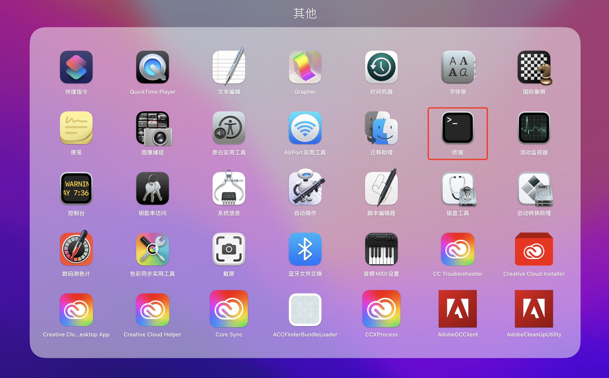
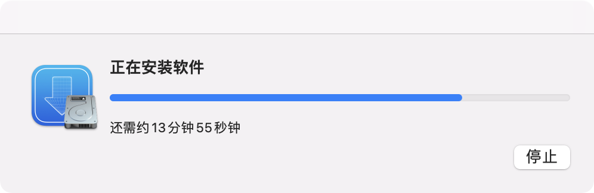

# MacOS 安装 Homebrew

Homebrew：The missing package manager for macOS。

Homebrew 是苹果系统的扩展包安装工具，可以以非常优雅的方式安装 MariaDB，Redis、等工具。下面就是安装Homebrew的教程，本教程使用国内的清华镜像作为Homebrew镜像源，这样可以改善软件下载速度，提升使用体验。

## 1 首先需要安装Command Line Tools (CLT) for Xcode

安装Command Line Tools (CLT) for Xcode的目的是为MacOS添加命令工具：git 和 curl

打开Mac的终端



在终端中输入命令，安装Command Line Tools (CLT) for Xcode

```
xcode-select --install
```



## 2 安装Homebrew

在终端输入以下几行命令设置环境变量，设定使用清华Homebrew镜像源：

```shell
export HOMEBREW_BREW_GIT_REMOTE="https://mirrors.tuna.tsinghua.edu.cn/git/homebrew/brew.git"
export HOMEBREW_CORE_GIT_REMOTE="https://mirrors.tuna.tsinghua.edu.cn/git/homebrew/homebrew-core.git"
export HOMEBREW_BOTTLE_DOMAIN="https://mirrors.tuna.tsinghua.edu.cn/homebrew-bottles"
```

然后，在终端运行以下命令以安装 Homebrew：

```shell
git clone --depth=1 https://mirrors.tuna.tsinghua.edu.cn/git/homebrew/install.git brew-install
/bin/bash brew-install/install.sh
rm -rf brew-install
```

## 3 Apple Silicon CPU 设备上的 macOS 系统

> 如果您设备是**Apple Silicon CPU 设备上的 macOS 系统**，则需要设置进行如下设置，如果是Intel CPU 系统则跳过这步。

在终端输入命令检查处理器类型：

```shell
uname -m
```

如果得到：

```shell
arm64
```

则说明您使用的是 *Apple Silicon CPU 设备上的 macOS 系统（ARM 处理器）*需要进行如下设置：

```shell
touch ~/.bash_profile
echo 'eval "$(/opt/homebrew/bin/brew shellenv)"' >> ~/.bash_profile
touch ~/.zprofile 
echo 'eval "$(/opt/homebrew/bin/brew shellenv)"' >> ~/.zprofile
```

> 对基于 Intel CPU 设备上的 macOS 系统（命令行运行 `uname -m` 应输出 `x86_64`）的用户可跳过本步。

## 4 替换现有仓库

Homebrew默认仓库在境外，访问非常慢，替换为国内镜像仓库可以大大加快访问速度，这里设置是是清华镜像仓库，可以替换 brew 程序本身的源：

```shell
export HOMEBREW_CORE_GIT_REMOTE="https://mirrors.tuna.tsinghua.edu.cn/git/homebrew/homebrew-core.git"
for tap in core cask{,-fonts,-drivers,-versions} command-not-found; do
    brew tap --custom-remote --force-auto-update "homebrew/${tap}" "https://mirrors.tuna.tsinghua.edu.cn/git/homebrew/homebrew-${tap}.git"
done
brew update
```

然后设置系统环境变量，如果用户设置了环境变量 `HOMEBREW_BREW_GIT_REMOTE` 和 `HOMEBREW_CORE_GIT_REMOTE`，则每次执行 `brew update` 时，`brew` 程序本身和 Core Tap (`homebrew-core`) 的远程将被自动设置。推荐用户将这两个环境变量设置加入 shell 的 profile 设置中，并且也需要设置`HOMEBREW_BOTTLE_DOMAIN` 支持bottle库：

```shell
touch ~/.bash_profile
echo 'export HOMEBREW_BREW_GIT_REMOTE="https://mirrors.tuna.tsinghua.edu.cn/git/homebrew/brew.git"' >> ~/.bash_profile 
echo 'export HOMEBREW_CORE_GIT_REMOTE="https://mirrors.tuna.tsinghua.edu.cn/git/homebrew/homebrew-core.git"' >> ~/.bash_profile
echo 'export HOMEBREW_BOTTLE_DOMAIN="https://mirrors.tuna.tsinghua.edu.cn/homebrew-bottles"' >> ~/.bash_profile
touch ~/.zprofile
echo 'export HOMEBREW_BREW_GIT_REMOTE="https://mirrors.tuna.tsinghua.edu.cn/git/homebrew/brew.git"' >> ~/.zprofile
echo 'export HOMEBREW_CORE_GIT_REMOTE="https://mirrors.tuna.tsinghua.edu.cn/git/homebrew/homebrew-core.git"' >> ~/.zprofile
echo 'export HOMEBREW_BOTTLE_DOMAIN="https://mirrors.tuna.tsinghua.edu.cn/homebrew-bottles"' >> ~/.zprofile
```

> 如果您熟悉 vim 等编辑器，您可以手动编辑 .zprofile 或者 .bash_profile文件。
>
> 如果您使用的是 bash 编辑.bash_profile即可
>
> 如果您使用的是 zsh 编辑.zprofile即可

 