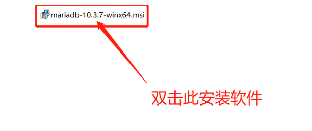
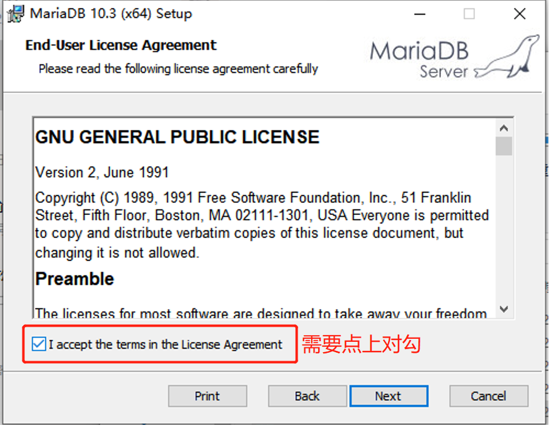
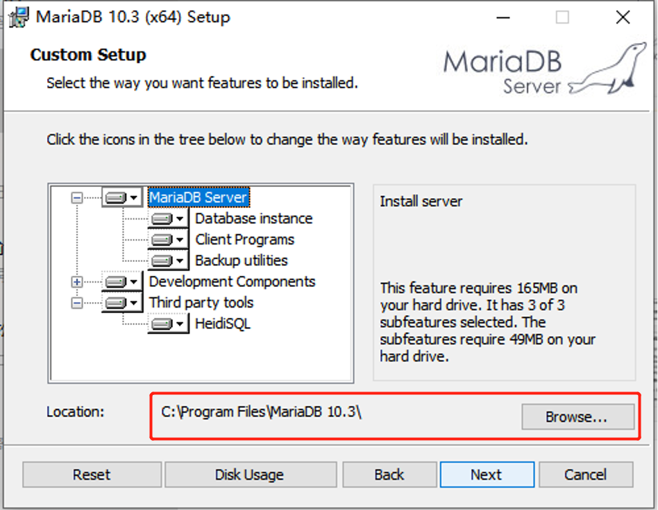
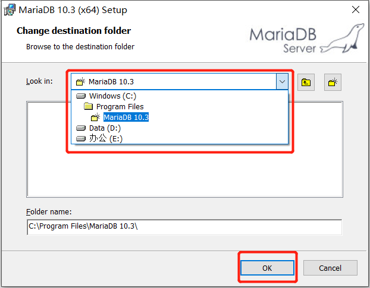
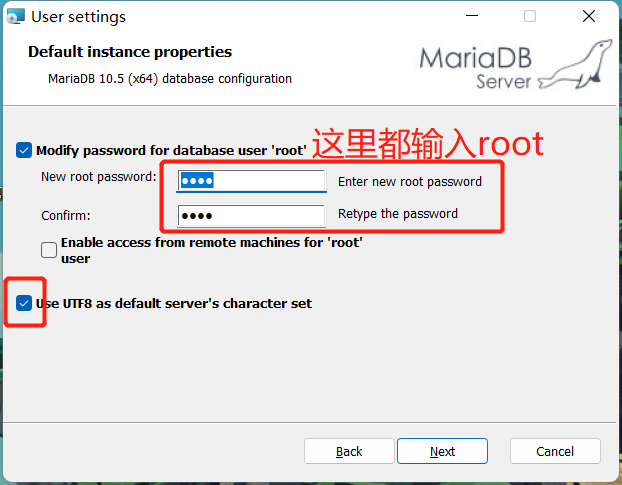
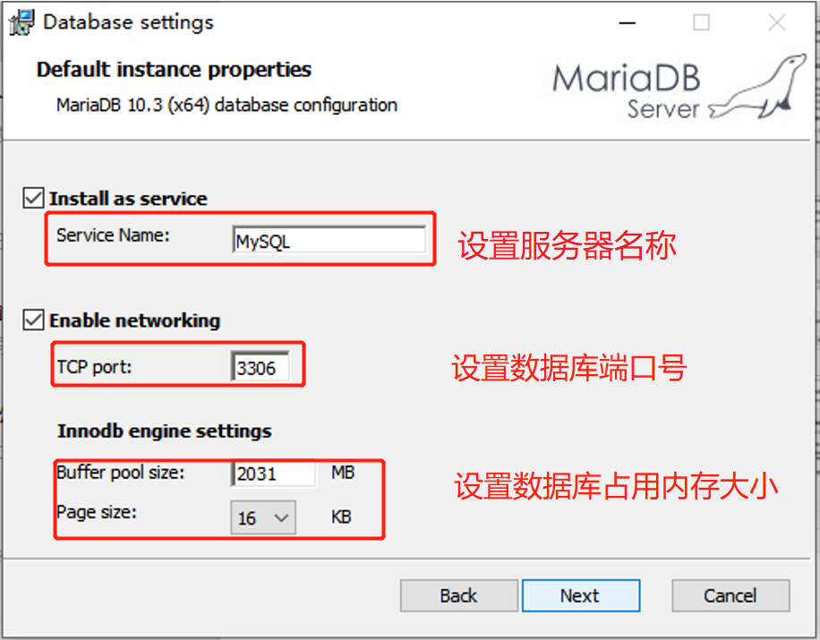
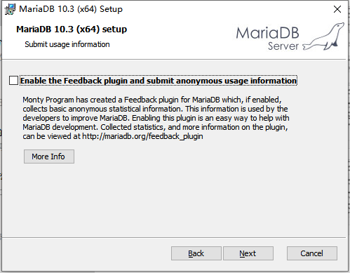
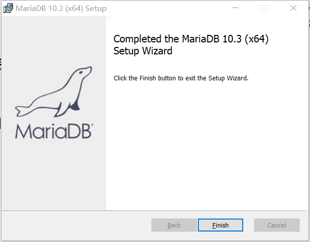

# MySQL的安装

- MySQL安装视频可参考：[http://doc.canglaoshi.orgpic/doc/mysql.html](http://doc.canglaoshi.org/doc/mysql.html) 

## 1 双击打开安装软件

- 本次安装的是mariaDB，双击打开mariaDB安装文件，会弹出安装界面，如图1所示。

图1 MariaDB安装示意图-1

## 2 勾选按钮

- 双击安装软件后会进入安装安装协议页面，在下方的**正方形单选框处打上对勾**，然后点击“Next”按钮，如图2。

图2 MariaDB安装示意图-2

- 进入如图3所示的安装路径选择页面，在当前页面我们可以指定软件安装的位置，如果不需要改变直接点击“Next”按钮进行下一步即可，如果想要自定义安装路径，点击“Browse”按钮，跳转如图4所示的自定义安装路径界面，选择自定义安装路径，点击“OK”按钮即可。

图3 MariaDB安装示意图-3

图4 MariaDB安装示意图-4

## 3 输入密码

- 接下来进入如图5的界面，需要根据需要输入属于自己的密码，默认用户名为root，同学们刚开始学习数据库，**建议密码也使用root**，以后有需求或者进公司再设置其他密码，并且将UTF8选项勾选,设置完成后点击“Next”按钮。 

图5 MariaDB安装示意图-5

## 4 设置数据库参数

- 进入如图6的界面，需要设置如下**数据库参数**，**服务器名称**、**端口号**及**占用内存大小**等。**（建议不要改动，使用默认值即可）**

图6 MariaDB安装示意图-6

## 5 设置提交使用信息的插件

- 进入如图7所示页面，设置提交使用信息的插件，帮助MariaDB找到不足，并且改善用户提现，不用勾选直接点击“Next”按钮即可。

图7 MariaDB安装示意图-7

## 6 点击安装

- 前面的配置都已完成后，进入如图8所示界面，点击“Install”按钮开始安装软件即可。

图8 MariaDB安装示意图-8

## 7 安装成功

- 显示如图9所示界面，即安装成功。

图9 MariaDB安装示意图-9

